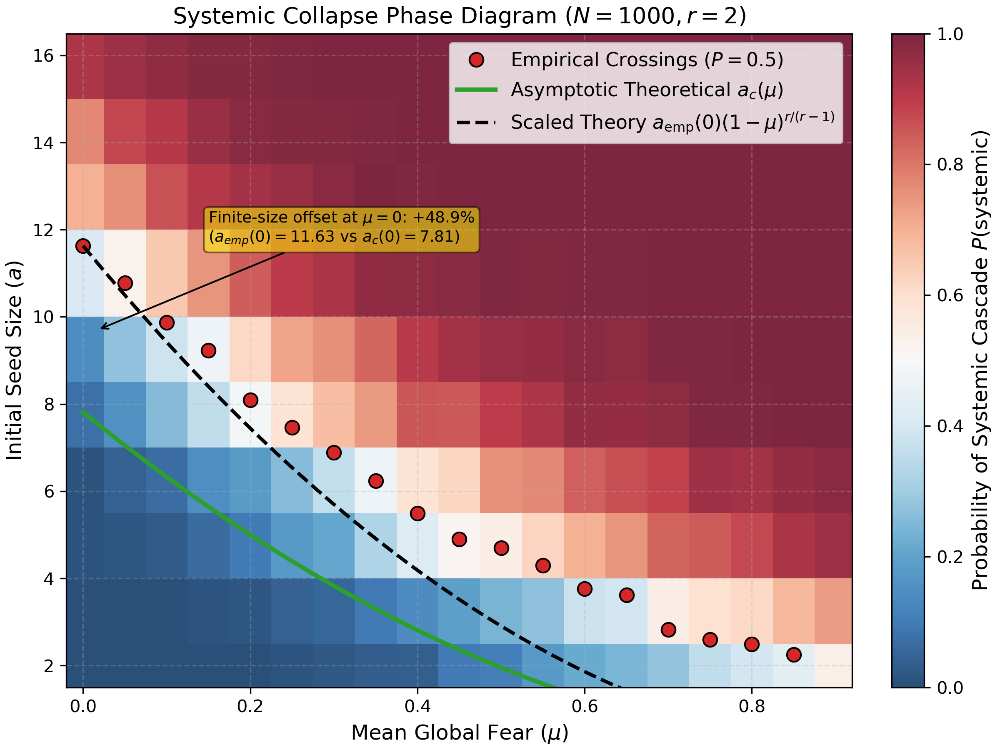
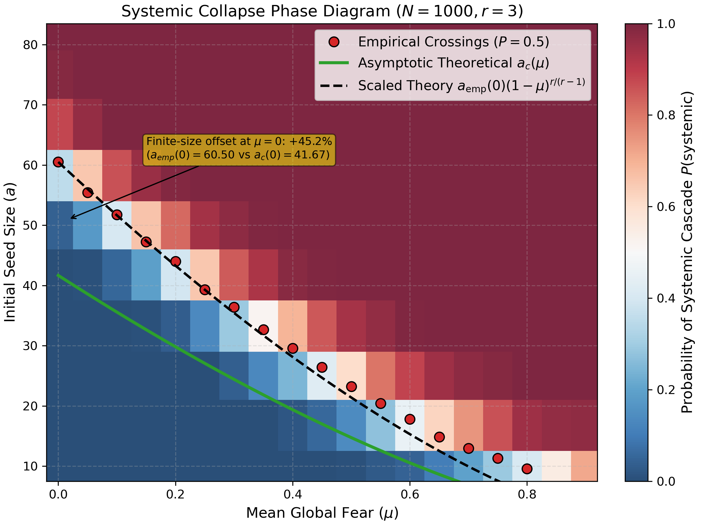
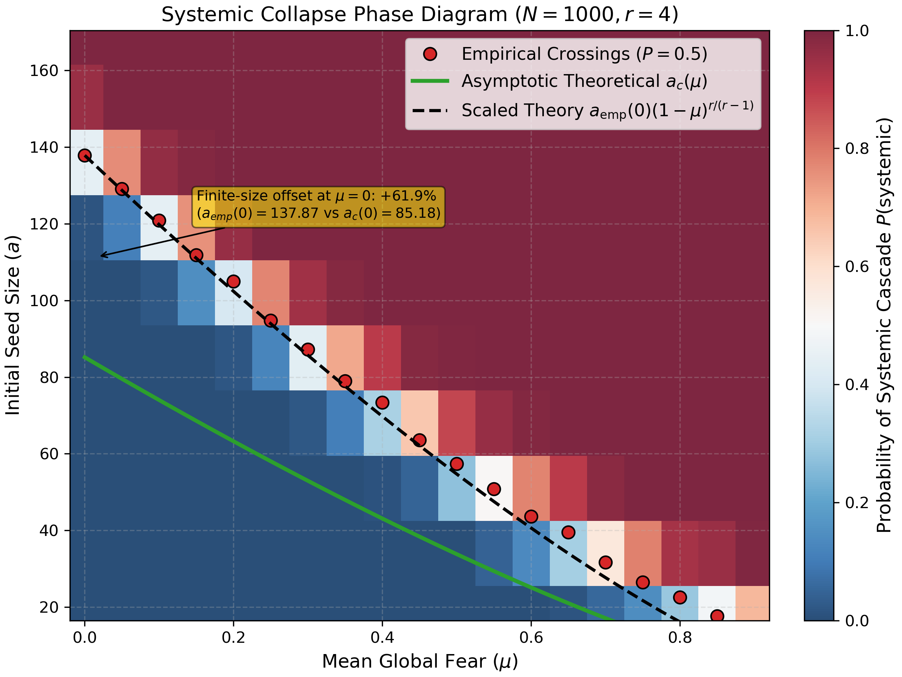
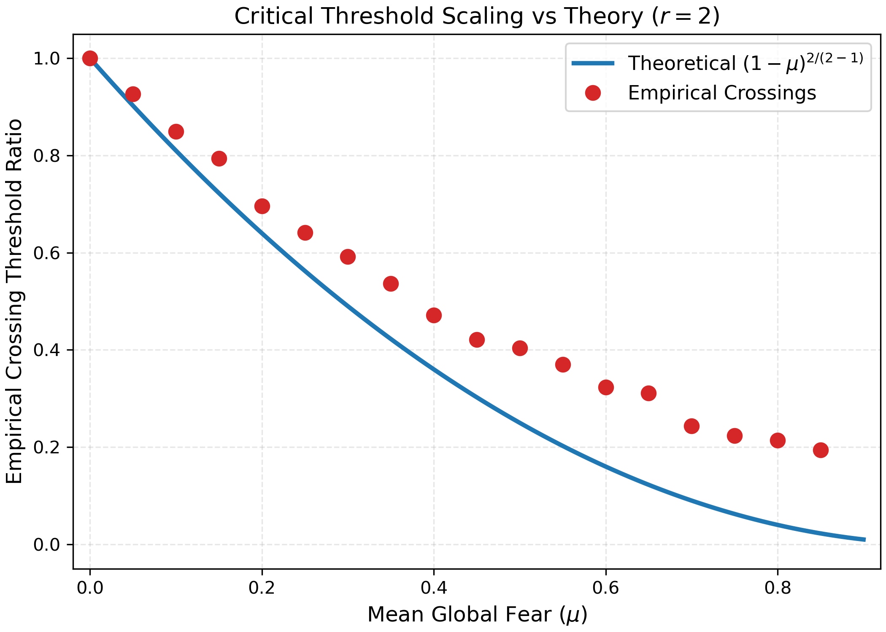
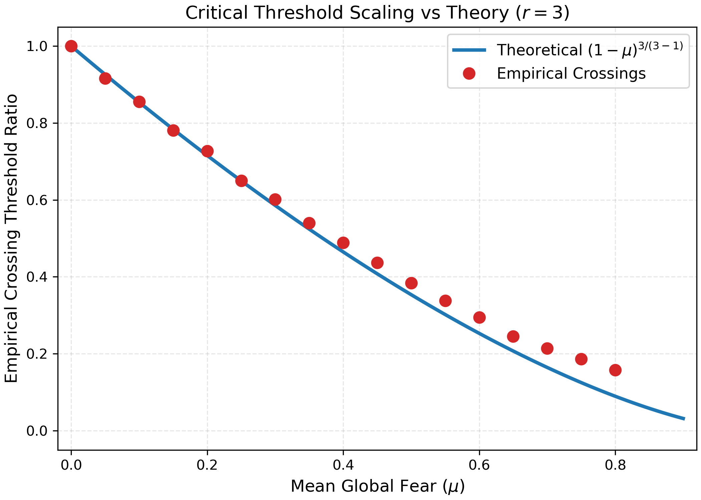
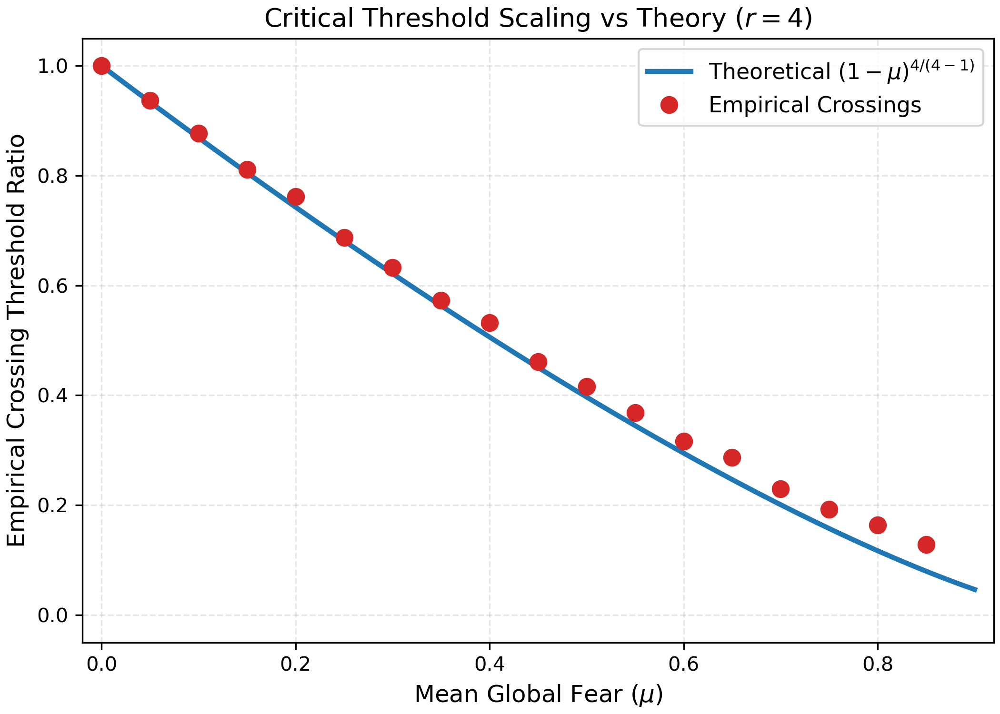

# Advisor Briefing: Two-Channel Bootstrap Percolation
**Date:** June 16, 2026  
**Author:** Gary Mei  
**Advisor:** Prof. Souvik Dhara  

---

## 1. Status Summary (Roadmap §6)

We have completed the core MVP milestones (Weeks 1–4) ahead of schedule and are currently in the **Week 5 (Overlay & Analysis)** phase:
1. **Simulation Engine:** Built a pure-Python reference implementation (`reference.py`) and a high-performance C++ simulator (`cpp/`). The C++ core has been fully validated against the Python reference via same-graph deterministic checks at $\mu=0$ and statistical Kolmogorov-Smirnov/z-tests for $\mu > 0$ (cross-validation protocol §5.4).
2. **Milestone Sweeps:** Completed full parameter sweeps for system size $N=1000$, solvency thresholds $r \in \{2, 3, 4\}$, mean fear $\mu \in [0.0, 0.9]$, and seed multiples $m \in [0.2, 2.0]$ (500 realizations/cell).
3. **Phase Diagrams:** Generated the $P(\text{systemic})$ phase-diagram heatmaps with overlaid analytical mean-field thresholds.

---

## 2. Latest Results and Theoretical Scaling Validation

### 2.1 Theoretical Scaling Conjectures
Under the self-consistent Poisson-combined map, the critical seed size $a_c(\mu)$ in the thermodynamic limit ($N \to \infty$) is conjectured to scale as:
$$a_c(\mu) = a_c(0)(1-\mu)^{r/(r-1)}$$
where $a_c(0)$ is the standard Janson et al. (2012) bootstrap percolation threshold:
$$a_c(0) = \left(1-\frac{1}{r}\right) \left(\frac{(r-1)!}{n p^{r}}\right)^{1/(r-1)}$$
We evaluate the empirical threshold scaling ratio $\text{ratio}_{\text{emp}} = a_{\text{emp}}(\mu)/a_{\text{emp}}(0)$ against the theoretical ratio $\text{ratio}_{\text{theory}} = (1-\mu)^{r/(r-1)}$.

### 2.2 Validation Summary
The C++ simulation results for $N=1000$, $np = 8.0$, and Beta concentration $\kappa = 50$ show excellent agreement with the theoretical scaling profiles for $r \ge 3$:
* **$r=3$ Compliance:** Mean absolute error (MAE) of **$2.6\%$** against the $(1-\mu)^{1.5}$ profile, with a maximum absolute deviation of $0.069$ at $\mu=0.80$.
* **$r=4$ Compliance:** MAE of **$2.0\%$** against the $(1-\mu)^{1.33}$ profile, with a maximum absolute deviation of $0.048$ at $\mu=0.85$.
* **$r=2$ Exception (Systematic Bias):** MAE of **$11.4\%$** against the $(1-\mu)^2$ profile, with a maximum absolute deviation of $0.189$ at $\mu = 0.65$. The empirical ratio decays slower than predicted, showing a systematic positive bias.

### 2.3 Finite-Size Interpretation and Analysis
1. **Finite-Size Offset:** At $N=1000$, we observe a substantial baseline offset ($45\%$ to $62\%$) where the empirical threshold $a_{\text{emp}}(0)$ is systematically higher than the asymptotic Janson threshold $a_c(0)$. This is a known finite-size effect: as the scale of $a_c(0)$ increases, the transition sharpens and $a_{\text{emp}}(0)/a_c(0) \to 1$.
2. **Cancellation of the Finite-Size Factor $K$:** Modeling the empirical threshold as $a_{\text{emp}}(\mu) \approx K(\mu, n) a_c(\mu)$, the ratio validates because the finite-size inflation factor $K(\mu, n)$ is approximately independent of $\mu$, meaning $K(\mu,n)/K(0,n) \approx 1$. 
3. **Origin of the $r=2$ Positive Bias (Quantization Error):** Because $a_c(0)$ is very small for $r=2$ ($a_c(0) = 7.81$ at $N=1000$), the system operates near the absolute physical seed size floor $a \ge r = 2$. At high $\mu$, the physical empirical threshold $a_{\text{emp}}(\mu)$ is physically incapable of dropping below $2$, while the theoretical curve $(1-\mu)^2$ continues smoothly toward $0$. This rigid quantization floor artificially inflates the relative ratio, causing the observed systematic positive bias.

### 2.4 Referenced Figures
* **Phase Diagram Heatmaps:**
  
  
  
  show the $P(\text{systemic})$ sweeps with overlaid scaling curves.
* **Scaling Ratio Curves:**
  
  
  
  show the empirical ratios $\text{ratio}_{\text{emp}}$ plotted against the $(1-\mu)^{r/(r-1)}$ theoretical curves.

---

## 3. Discussion Questions and Recommendations for the Advisor

We would like to seek your guidance on two main modeling and theoretical directions as we move into the second half of the project:

### Q2: Network Structure Pivot — $G(n,p)$ vs. Configuration Model
* **Context:** The current results are established on Erdős–Rényi graphs $G(n,p)$ inside the Janson scaling regime ($np \to \infty, np^r \to 0$). Moving to a configuration model with power-law degree exponent $\tau$ would make degree heterogeneity and targeted seeding meaningful, but it shifts the theoretical benchmark away from Janson's sharp-threshold theory.
* **Our Recommendation:** We recommend completing the Wk 6–7 critical-window analysis on $G(n,p)$ first to verify the $r=2$ finite-size convergence and confirm the transition-width scaling exponents. We can then introduce the configuration model as an extension (stretch goal in Week 8) to investigate how infinite-variance degree distributions ($\tau \in (2,3)$) alter the first-order cascade transition. This pivot would naturally build upon your work in *Multiscale Genesis of a Tiny Giant...* (2024) and *Global Lower Mass-Bound...* (2022).

### Q3: Critical-Window Scaling and Exponents
* **Context:** In our connectivity-scaled Janson setup ($p_n = \beta n^{-\alpha}$ with $\alpha = 0.7$ for $r=2$), the early critical stages are locally tree-like. Under our rescaled Janson mapping, the transition width is set by the fluctuations of the active set size at the bottleneck step $t_c \sim n^{\frac{r\alpha-1}{r-1}}$, which yields the following scaling predictions for the transition width:
  * **Absolute seed fraction width:** $\Delta (a/n) \sim n^{-\frac{2r-1-r\alpha}{2(r-1)}}$ (giving an absolute exponent $\nu_{\mathrm{abs}} = 1.25$ for $r=2$)
  * **Relative seed width:** $\Delta(a)/a_c \sim n^{-\frac{r\alpha-1}{2(r-1)}}$ (giving a relative exponent $\nu_{\mathrm{rel}} = 5.0$ for $r=2$)
  * **$\mu$-Invariance:** Because the rescaled Janson mapping is isomorphic to the baseline model, these exponents should be invariant to the fear level $\mu$, provided we stay away from the crossover boundary ($1-\mu \gg n^{1 - r\alpha}$).
* **Action/Decision Needed:** Does this critical-window framing and transition-width scaling analysis align with your interests for the final write-up? Furthermore, should we also investigate the critical cascade size profile at the boundary to check for $n^{2/3}$-type scaling or heavy-tailed distributions?

---

## 4. Compute Logistics and Blockers

To confirm whether the $r=2$ systematic bias is a finite-size convergence artifact, we need to run larger simulations. However, running at $N=10000$ with connectivity scaling $p_n = \beta n^{-0.7}$ will only scale $a_c(0)$ to $19.62$. While this resolves the low/mid-$\mu$ offset, it fails to escape the physical floor constraint at high fear: at $\mu=0.65$, the theoretical seed is $a_c(0.65) \approx 2.4$, which is still fundamentally clamped by the $a \ge r = 2$ physical requirement. Avoiding the floor constraint entirely at high $\mu$ would require massive simulations ($N \approx 360,000$).

* **Blocker:** Running multi-trial sweeps at $N \ge 10000$ exceeds laptop compute capacity and requires PACE cluster access.
* **Request:** We would appreciate your sponsorship/input to request PACE access for the critical-window sweeps. Should we constrain our sweeps to $N=10000$ and explicitly bound our high-$\mu$ claims, or pursue a massive PACE allocation to achieve true convergence?
