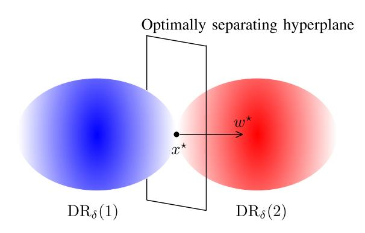

# The Power of Two Matrices in Spectral Algorithms for Community Recovery

Souvik Dhar[a](https://orcid.org/0000-0001-8426-4529) , Julia Gaudio [,](https://orcid.org/0000-0002-3078-1536) Elchanan Mossel, and Colin Sandon

*Abstract*— Spectral algorithms are some of the main tools in optimization and inference problems on graphs. Typically, the graph is encoded as a matrix and eigenvectors and eigenvalues of the matrix are then used to solve the given graph problem. Spectral algorithms have been successfully used for graph partitioning, hidden clique recovery and graph coloring. In this paper, we study the power of spectral algorithms using *two matrices* in a graph partitioning problem. We use two different matrices resulting from two different encodings of the same graph and then combine the spectral information coming from these two matrices. We analyze a two-matrix spectral algorithm for the problem of identifying latent community structure in large random graphs. In particular, we consider the problem of recovering community assignments *exactly* in the censored stochastic block model, where each edge status is revealed independently with some probability. We show that spectral algorithms based on two matrices are optimal and succeed in recovering communities up to the information theoretic threshold. Further, we show that for most choices of the parameters, any spectral algorithm based on one matrix is suboptimal. The latter observation is in contrast to our prior works (2022a, 2022b) which showed that for the *symmetric* Stochastic Block Model and the Planted Dense Subgraph problem, a spectral algorithm based on one matrix achieves the information theoretic threshold. We additionally provide more general geometric conditions for the (sub)-optimality of spectral algorithms.

*Index Terms*— Stochastic block model, spectral algorithms, information-theoretic boundary.

Manuscript received 7 March 2023; revised 10 November 2023; accepted 7 December 2023. Date of publication 25 December 2023; date of current version 23 April 2024. The work of Souvik Dhara, Elchanan Mossel, and Colin Sandon was supported in part by the Vannevar Bush Faculty Fellowship under Grant ONR-N00014-20-1-2826. The work of Souvik Dhara was supported by the Simons-Berkeley Research Fellowship and in part by the Vannevar Bush Faculty Fellowship under Grant ONR-N0014-21-1-2887. The work of Elchanan Mossel and Colin Sandon was supported in part by NSF under Award DMS-1737944. The work of Elchanan Mossel was supported in part by the Simons Investigator Award under Grant 622132 and in part by Army Research Office (ARO) Multidisciplinary University Research Initiative (MURI) under Grant W911NF1910217. The work of Julia Gaudio was supported in part by NSF under Award CCF-2154100. *(Corresponding author: Julia Gaudio.)*

Souvik Dhara is with the School of Industrial Engineering, Purdue University, West Lafayette, IN 47907 USA (e-mail: sdhara@purdue.edu).

Julia Gaudio is with the Department of Industrial Engineering and Management Sciences, Northwestern University, Evanston, IL 60208 USA (e-mail: julia.gaudio@northwestern.edu).

Elchanan Mossel is with the Department of Mathematics, Massachussetts Institute of Technology, Cambridge, MA 02139 USA (e-mail: elmos@mit.edu). Colin Sandon is with the Chair of Mathematical Data Science, École Polytechnique Fédérale de Lausanne, 1015 Lausanne, Switzerland (e-mail:

Communicated by C. Suh, Associate Editor for Machine Learning and Statistics.

Color versions of one or more figures in this article are available at https://doi.org/10.1109/TIT.2023.3346909.

Digital Object Identifier 10.1109/TIT.2023.3346909

colin.sandon@epfl.ch).

# I. INTRODUCTION

S PECTRAL algorithms are some of the main tools in graph algorithms and combinatorial optimization. Some famous and classical examples include spectral algorithms for the hidden clique problem [\[1\], gr](#page-21-0)aph bisection [\[2\], an](#page-21-1)d graph coloring [\[3\],](#page-21-2) [\[4\]. Th](#page-21-3)ese algorithms encode the graph into a matrix by recording the status of each present/absent edge of the graph as an entry of the matrix. The most natural encoding is the adjacency matrix representation, where edges are encoded by the value 1 and non-edges are encoded by the value 0. Given the encoding matrix, a small number of eigenvectors for this matrix are used to solve the given graph problem.

Our interest in this work lies in graph problems for which using multiple matrix representations gives an advantage over using a single matrix.

In particular, we are interested in the power of spectral algorithms in such a scenario in the context of finding clusters in a planted partition model called the *Censored Stochastic Block Model (CSBM)*. In this model, there are two clusters of approximate sizes nρ and n(1 − ρ), and the edges inside each of the clusters appear independently with probabilities p1, p2 respectively, while edges between the two clusters appear with probability q. Moreover, each edge status is revealed with probability tlog n/n for some fixed t > 0. Thus the statuses of most edges are unknown. The censored model was introduced to model the fact that in many social networks, not all of the connections between individual nodes are known.

Given an instance of a censored graph with no vertex labels, the problem is to recover the partitions *exactly* with high probability. This is often referred to as the *exact recovery problem*. We note that some applications of spectral algorithms to the exact recovery problem use an additional combinatorial clean-up stage (see e.g. [\[5\],](#page-21-4) [\[6\],](#page-21-5) [\[7\]\), b](#page-21-6)ut we follow [\[8\],](#page-21-7) [\[9\],](#page-21-8) and [\[10\]](#page-21-9) in studying spectral algorithms that do not look at the graph after the top eigenvectors have been found. This is partially motivated by the fact that most real applications of spectral algorithms do not include a combinatorial clean-up stage.

The classical case in the literature considers exact recovery in the Stochastic Block Model where there is no censoring and p1, p2, q = Θ(log n/n). In order to achieve exact recovery up to the information theoretic boundary, prior works used some trimming and post-processing steps together with the spectral

0018-9448 © 2023 IEEE. Personal use is permitted, but republication/redistribution requires IEEE permission. See https://www.ieee.org/publications/rights/index.html for more information.

algorithm [5], [6], [7]. However, the question of whether a direct spectral algorithm based on the top two eigenvectors of the of the adjacency matrix would be optimal remained open until the recent resolution by Abbe et al. [8] for  $p_1 = p_2$ . In the *censored* SBM, there are three possible observations (present, absent, or censored), so spectral recovery using a binary-valued adjacency matrix is suboptimal. Instead, one can use a ternary-valued encoding matrix. It was recently shown in [9] and [10] that, for some special cases of the planted partition model such as the planted dense subgraph problem  $(p_2 = q)$  and the symmetric stochastic block model  $(p_1 = p_2, \rho = 1/2)$ , a spectral algorithm based on the top two eigenvectors of a signed adjacency matrix is optimal. This raises the question:

Are spectral algorithms based on the top eigenvectors of a signed adjacency matrix optimal for all censored stochastic block models?

The main contributions of this article are as follows:

- 1) In contrast with the success stories in [9] and [10], whenever  $p_1, p_2, q$  are distinct, a spectral algorithm based on the top two eigenvectors of a signed adjacency matrix is always suboptimal (Theorem 7 Part (2)).
- 2) We propose spectral algorithms with two encoding matrices, where we take an appropriate linear combination of the corresponding top eigenvectors. We show that these algorithms are always optimal (Theorem 10). The optimality of spectral algorithms with two matrices is also shown in the more general setting with  $k \geq 2$  communities (Theorem 12).

Thus, these results exhibit a strict separation between spectral algorithm classes with one versus multiple encoding matrices, and this separation can be realized for even elementary planted partition models. To our knowledge, this general phenomenon was not observed in the substantial prior literature for recovery problems in the planted partition problems.

#### A. Model and Objective

We start by defining the Censored Stochastic Block Model. Definition 1 (Censored Stochastic Block Model (CSBM)): Let  $\rho \in (0,1)^k$  be such that  $\sum_{i=1}^k \rho_i = 1$  and let  $P \in (0,1)^{k \times k}$  be a symmetric matrix. Suppose we have n vertices and each vertex  $v \in [n]$  is assigned a community assignment  $\sigma_0(v) \in [k]$  according to the distribution  $\rho$  independently, i.e.,  $\mathbb{P}(\sigma_0(v) = i) = \rho_i$  for  $i \in [k]$ .

- $\rightharpoonup$  For  $u,v\in [n]$  and  $u\neq v$ , the edge  $\{u,v\}$  exists independently with probability  $P_{\sigma_0(u)\sigma_0(v)}$ . Self-loops do not occur.
- $\triangleright$  For every pair of vertices  $\{u,v\}$ , its connectivity status is *revealed* independently with probability  $\frac{t \log n}{n}$ , and is *censored* otherwise for some fixed t > 0.

The output is a random graph with edge statuses given by  $\{present, absent, censored\}$ . The distribution of this random graph is called the Censored Stochastic Block Model. We write  $G \sim \text{CSBM}_n^k(\rho, P, t)$  to denote a graph generated from the above model, with vertex labels removed (i.e.,  $\sigma_0$  is unknown).

Definition 2 (Exact Recovery): Consider the  $n \times k$  membership matrix  $S_0$ , where  $(S_0)_{ui} = \mathbb{1}\{\sigma_0(u) = i\}$ , i.e., the u-th row indicates the community membership of u. Given an estimator  $\hat{\sigma}$ , construct  $\hat{S}$  similarly as  $\hat{S}_{ui} = \mathbb{1}\{\hat{\sigma}(u) = i\}$ . We say that an estimator achieves exact recovery if there exists a  $k \times k$  permutation matrix J such that  $\hat{S}J = S_0$ .

#### B. Information Theoretic Boundary

We start by discussing the information theoretic threshold. The result will be stated in terms of a Chernoff-Hellinger divergence, introduced by Abbe and Sandon [11].

Definition 3 (Chernoff–Hellinger Divergence): Given two vectors  $\mu, \nu \in (\mathbb{R}_+ \setminus \{0\})^l$ , define

$$CH_{\xi}(\mu, \nu) = \sum_{i \in [l]} \left[ \xi \mu_i + (1 - \xi)\nu_i - \mu_i^{\xi} \nu_i^{1 - \xi} \right]$$

for  $\xi \in [0,1].$  The Chernoff–Hellinger divergence of  $\mu$  and  $\nu$  is defined as

$$\Delta_{+}(\mu,\nu) = \max_{\xi \in [0,1]} \mathrm{CH}_{\xi}(\mu,\nu). \tag{I.1}$$

Define

$$t_c := \left(\min_{i \neq j} \Delta_+(\theta_i, \theta_j)\right)^{-1}$$
 where  $\theta_i = (\rho_r P_{ri}, \rho_r (1 - P_{ri}))_{r \in [k]} \in \mathbb{R}^{2k}$ . (I.2)

Theorem 4 (Information Theoretic Threshold): Let  $G \sim \text{CSBM}_n^k(\rho, P, t)$ . If  $t < t_c$ , then for any estimator  $\hat{\sigma}$ ,

$$\lim_{n\to\infty} \mathbb{P}(\hat{\sigma} \text{ achieves exact recovery}) = 0.$$

#### C. Spectral Algorithms

For comparing the performance of spectral algorithms with one matrix versus spectral algorithms with more than one matrix, we first specialize to the case of two communities.

To define spectral algorithms formally, we first define the threshold procedures we allow to apply on vectors. These are the procedures that will be applied to the leading eigenvectors of the encoding matrices.

## Algorithm 1 CLASSIFY

**Input:** Censored graph G on n vertices, vectors  $(u_i)_{i=1}^m \subset \mathbb{R}^n$ , and scalars,  $a_1, \ldots, a_m, T \in \mathbb{R}$ .

Output: Community classification.

1: Compute possible score vectors

$$U = \left\{ \sum_{i=1}^{m} s_i a_i u_i \text{ for all } s_1, \dots, s_m \in \{\pm 1\} \right\}.$$

2: Compute possible assignments  $\hat{S}(U) = \{\hat{\sigma} = \text{sign}(u - T) : u \in U\}$  and output a community assignment  $1 + (1 + \hat{\sigma})/2$  that maximizes the posterior probability  $\mathbb{P}(G \mid \hat{\sigma})$  over  $\hat{\sigma} \in \hat{S}(U)$ .

Since eigenvectors are determined up to a sign flip, Step 2 above is required in order to resolve this sign ambiguity. This will be explained in more detail in Remark 13.

Definition 5 (Signed Adjacency Matrix): Given y>0 and a graph G with edge statuses {present, absent, censored}, define the signed adjacency matrix A(G,y) as the  $n\times n$  matrix with

$$A_{ij} = \begin{cases} 1 & \text{if } \{i, j\} \text{ is present} \\ -y & \text{if } \{i, j\} \text{ is absent} \\ 0 & \text{if } \{i, j\} \text{ is censored.} \end{cases}$$

Let us define the class of algorithms SPECTRAL-ONE that use a single encoding matrix.

Definition 6 (SPECTRAL-ONE): An algorithm  $\mathcal{A}(G,y,a_1,a_2,T)$  in the SPECTRAL-ONE class takes a censored graph G as input, an encoding parameter  $y\in\mathbb{R}_+$ , and scalars  $a_1,a_2,T\in\mathbb{R}$ . The algorithm then computes the top two eigenvectors  $u_1,u_2$  of A=A(G,y), and gives the output of CLASSIFY $((u_i)_{i=1}^2,(a_i)_{i=1}^2,T)$ . We denote the output of algorithm  $\mathcal A$  in this class as  $\hat{\sigma}_A$ .

For the two community case, we will always consider the parameters:

$$P\!=\!\begin{pmatrix}p_1 & q\\ q & p_2\end{pmatrix}, \bar{\rho}\!=\!(\rho,1\!-\!\rho), \text{ and } \rho,p_1,p_2,q\in(0,1). \ \ (\text{I}.3)$$

Theorem 7 (Failure of Spectral-One in Most Cases): Let  $G \sim \text{CSBM}_n^2(\bar{\rho}, P, t)$  with  $\bar{\rho}, P$  given by (I.3).

(1) Suppose that  $p_1, p_2, q$  are not distinct. If  $p_1 = p_2 = p$ , then assume  $p+q \neq 1$ .\(^1\) There exist explicitly computable constants  $y \in \mathbb{R}_+$  and  $\gamma_1, \gamma_2 \in \mathbb{R}$  such that the algorithm  $\mathcal{A} = \mathcal{A}(G, y, \gamma_1, \gamma_2, 0)$  from the class Spectral-One satisfies

$$\lim_{n\to\infty}\mathbb{P}(\hat{\sigma}_{\mathcal{A}} \text{ achieves exact recovery})=1,$$

for any  $t > t_c$ . In particular, Algorithm 3 produces such an estimator.

(2) Suppose that  $p_1, p_2, q$  are distinct. There exists  $\delta_0 > 0$  such that, if  $t < t_c + \delta_0$ , then for any  $\mathcal{A} \in \text{SPECTRAL-ONE}$ ,

$$\lim_{n\to\infty}\mathbb{P}(\hat{\sigma}_{\mathcal{A}} \text{ achieves exact recovery})=0.$$

For the case  $p_1=p_2$ , Theorem 7 Part (1) generalizes the result of [9, Theorem 2.2] to the case  $\rho \neq 1/2$ . Part (2) of the result is in sharp contrast with the results in [9] and [10]; together, these results essentially say that the censored planted dense subgraph problem  $(p_2=q)$  and the symmetric censored stochastic block models  $(p_1=p_2)$  are remarkably the only cases where an algorithm from SPECTRAL-ONE is successful2. The possible limitation of SPECTRAL-ONE was shown in [10, Theorem 2.6] for the special case of q=1/2,  $p_1=1-p_2$  and  $\rho=1/2$ .

Remark 8: It is worthwhile to note that the choice of encoding parameters  $\{1, -y, 0\}$  is completely general and one does not get a more powerful class of algorithms by allowing an arbitrary ternary encoding. In fact, as our proof

shows, if  $p_1, p_2, q$  are distinct, then even if one allows arbitrary encodings, the SPECTRAL-ONE algorithms still fail sufficiently near the threshold (see Remark 42).

Next, we will show that spectral algorithms with two matrices are always optimal for the recovery of two communities. Let us define the class of algorithms SPECTRAL-TWO that uses two encoding matrices instead of one.

Definition 9 (SPECTRAL-TWO): An algorithm  $\mathcal{A}(G,y_1,y_2,(a_i)_{i=1}^4,T)$  in the SPECTRAL-TWO class takes as input a censored graph G, two encoding parameter  $y_1,y_2\in\mathbb{R}_+$  with  $y_1\neq y_2$  and  $(a_i)_{i=1}^4\subset\mathbb{R},T\in\mathbb{R}$ . The algorithm considers two signed adjacency matrices  $A_1=A(G,y_1)$  and  $A_2=A(G,y_2)$ , and computes their top two eigenvectors  $u_1^r,u_2^r$ , for r=1,2. Then the algorithm outputs CLASSIFY $((u_i^r)_{i,r=1,2},(a_i)_{i=1}^4,T)$ . As before, we denote the output of algorithm  $\mathcal A$  from this class as  $\hat{\sigma}_{\mathcal A}$ .

Theorem 10: (SPECTRAL-TWO Always Succeeds in Recovering Two Communities): Let  $G \sim \text{CSBM}_n^2(\bar{\rho}, P, t)$  with  $\bar{\rho}, P$  given by (I.3). There exists a set  $\mathcal{Y} \subset \mathbb{R}_+$  with  $|\mathcal{Y}| \leq 3$  such that for any  $y_1 \neq y_2$  and  $y_1, y_2 \notin \mathcal{Y}$ , there exist explicit  $(a_i)_{i=1}^4 \subset \mathbb{R}^4$  such that the algorithm  $\mathcal{A}(G, y_1, y_2, (a_i)_{i=1}^4, 0)$  from the class SPECTRAL-TWO satisfies

$$\lim_{n\to\infty}\mathbb{P}(\hat{\sigma}_{\mathcal{A}} \text{ achieves exact recovery})=1,$$

for any  $t > t_c$ . In particular, Algorithm 5 produces such an estimator.

Theorem 10 not only shows that SPECTRAL-TWO algorithms are always successful, but also shows that the choice of the encoding parameters  $y_1, y_2$  does not matter too much as long as  $y_1 \neq y_2$  and they both lie outside a finite exception set. For example, we can choose  $y_1, y_2 \sim \text{Uniform}[0,1]$  independently. Avoiding the finite exception set helps us ensure that  $A_1$  and  $A_2$  both have two eigenvectors with large, distinct eigenvalues. In contrast, the choice of the encoding is quite important for SPECTRAL-ONE algorithms in Theorem 7 (1). In fact, for  $p_1 = p_2 = p$  or  $p_1 = p$  and  $p_2 = q$ , the only choice of y that yields an optimal algorithm is  $\log(\frac{1-q}{1-p})/\log\frac{p}{q}$ . Thus, SPECTRAL-TWO algorithms leads to a much broader and flexible class of algorithms as compared to SPECTRAL-ONE.

Finally, we show that SPECTRAL-TWO succeeds for the recovery of  $k \geq 3$  communities, as long as the parameters  $P, \rho$  satisfy certain conditions. To this end, let us define SPECTRAL-TWO for general k.

# Algorithm 2 CLASSIFY-MULTIPLE

**Input:** Censored graph G on n vertices, vectors  $(u_i)_{i=1}^m \subset \mathbb{R}^n$ , and weight vectors  $(a_i)_{i=1}^k \subset \mathbb{R}^m$ .

Output: Community classification.

- 1: Let U be the  $n \times m$  matrix whose i-th column is  $u_i$ .
- 2: For  $s \in \{\pm 1\}^m$ , let  $D^{(s)} := \operatorname{diag}(s)$ . Compute the set of possible assignments  $\hat{S}$  consisting of  $\hat{\sigma}(\cdot;s)$  with  $s \in \{\pm 1\}^m$  such that

$$\hat{\sigma}(v;s) = \operatorname*{argmax}_{i \in [k]} \left\{ \left( UD^{(s)}a_i \right)_v \right\} \text{ for each } v \in [n].$$

3: Output  $\hat{\sigma}(\cdot; s)$  that maximizes the posterior probability over  $\mathbb{P}(G \mid \hat{\sigma})$  over  $\hat{\sigma} \in \hat{S}$ .

&lt;sup>1The case  $p_1 = p_2 = p$ ,  $\rho = \frac{1}{2}$  is covered in [9] without the assumption  $p + q \neq 1$ . In this case, spectral algorithms succeed for  $t > t_c$ .

&lt;sup>2For the edge-case  $p_1 = p_2 = p$  and p + q = 1, the rank of  $\mathbb{E}[A]$  is 1 for the value of y that we would want to use. This is why it is ruled out in Theorem 7 Part (1).

We will use this algorithm with m=2k, and the top k eigenvectors from each of two signed adjacency matrices.

Definition 11 (SPECTRAL-TWO for  $k \geq 3$  communities): An algorithm  $\mathcal{A}(G,y_1,y_2,(a_i)_{i=1}^k,T)$  in this class takes as input a censored graph G, two encoding parameters  $y_1,y_2\in\mathbb{R}_+$  with  $y_1\neq y_2$  and  $(a_i)_{i=1}^k\subset\mathbb{R}^{2k}$ . The algorithm considers two signed adjacency matrices  $A_1=A(G,y_1)$  and  $A_2=A(G,y_2)$ , and computes their top k eigenvectors  $(u_i^1)_{i\in[k]},(u_i^2)_{i\in[k]}$ . Then the algorithm outputs CLASSIFY-MULTIPLE $((u_i^r)_{i\in[k],r=1,2},(a_i)_{i=1}^k)$ . As before, we denote the output of algorithm  $\mathcal A$  from this class as  $\hat{\sigma}_A$ .

Theorem 12: (Success of Spectral-Two for  $k \geq 3$  Communities): Let  $G \sim \mathrm{CSBM}_n^k(\rho,P,t)$  where  $\rho \in (0,1)^k$  is such that  $\sum_i \rho_i = 1$ , and  $P \in (0,1)^{k \times k}$  is a symmetric matrix. Further, suppose that  $P \cdot \mathrm{diag}(\rho)$  has exactly k distinct non-zero eigenvalues. Then there exists a finite set  $\mathcal{Y} \subset \mathbb{R}_+$  such that for any  $y_1 \neq y_2$  and  $y_1, y_2 \notin \mathcal{Y}$ , the following holds: there exist explicit vectors  $(a_i)_{i=1}^k \subset \mathbb{R}^{2k}$  such that the algorithm  $\mathcal{A}(G, y_1, y_2, (a_i)_{i=1}^k)$  from the class Spectral-Two satisfies

$$\lim_{n\to\infty} \mathbb{P}(\hat{\sigma}_{\mathcal{A}} \text{ achieves exact recovery}) = 1,$$

for any  $t>t_c$ . In particular, Algorithm 7 produces such an estimator.

Remark 13: The fact that the encoding parameters  $y_1, y_2$  lie outside a finite set in Theorems 10 and 12 is required to ensure that  $\mathbb{E}[A(G,y_1)]$ ,  $\mathbb{E}[A(G,y_2)]$  have k distinct and non-zero eigenvalues. The requirement of having k non-zero eigenvalues is intuitive as we seek to recover an underlying rank k structure. Moreover, the eigenvectors of A(G,y) can only be approximated up to an unknown orthogonal transformation. This causes an ambiguity for defining the final estimator. When the eigenvalues are distinct, this ambiguity can be resolved by going over all possible sign flips s and choosing the best among them, as in Algorithm 1 Step 2, or Algorithm 2 Step 2.

Remark 14: The condition in Theorem 12 that  $P \cdot \operatorname{diag}(\rho)$  has distinct and non-zero values can be relaxed. In fact, if  $P^{(y)}$  is the matrix such that  $P_{ij}^{(y)} := \rho_j(P_{ij} - y(1 - P_{ij}))$ , then by Lemma 43, the same conclusions as Theorem 12 hold as long as there exists a y such that  $P^{(y)}$  has k distinct and non-zero eigenvalues. In fact, we can simply choose  $y \sim \operatorname{Uniform}((0,1))$ .

#### D. Proof Ideas

We now give a brief outline of the proofs. For a vertex v, we call  $d(v)=(d_{+j},d_{-j})_{j\in[k]}\in\mathbb{Z}_+^{2k}$  the degree profile of the vertex, where  $d_{+j}=d_{+j}(v), d_{-j}=d_{-j}(v)$  respectively denote the number of present and absent edges from v to community j for  $j\in[k]$ . Let us re-scale  $\bar{d}(v)=d(v)/t\log n$ . The proof consists mainly of two steps:

Step 1: Characterization of spectral algorithms using degree profiles. Given any signed adjacency matrix A = A(G, y), the starting point of our analysis is to find a good  $\ell_{\infty}$ -approximation for the eigenvectors. Using a recent general framework by Abbe et al. [8], we can show that the top k

Fig. 1. Visualizing dissonance ranges of two communities near  $t_c$ .

eigenvalues  $(u_i)_{i \in [k]}$  of A satisfy (see Corollary 35):

$$\min_{s \in \{\pm 1\}} \left\| s u_i - \frac{A u_i^{\star}}{\lambda_i^{\star}} \right\|_{\infty} = o\left(\frac{1}{\sqrt{n}}\right), \quad \text{ for } i \in [k],$$

with probability 1-o(1), where  $(\lambda_i^\star, u_i^\star)$  is the i-th largest eigenvalue/eigenvector pair of  $\mathbb{E}[A]$ . Note that  $\mathbb{E}[A]$  is a rank-two matrix with  $u_i^\star$ 's taking the same constant value corresponding to all vertices in the same community. The low rank of  $\mathbb{E}[A]$  allows us to express  $Au_i^\star$  as a linear combination of the degree profiles and thus drastically reduce the dimension of the problem. Using this representation, any linear combination of the  $u_i's$  is also an expressible linear combination of degree profiles. Hence, we show that spectral algorithms essentially are asymptotically equivalent to classifying vertices depending on whether  $\langle w_{\mathrm{Spec}}, \bar{d}(v) \rangle > (T+o(1))$  or  $\langle w_{\mathrm{Spec}}, \bar{d}(v) \rangle < (T-o(1))$  for some  $w_{\mathrm{Spec}} \in \mathbb{R}^{2k}, T \in \mathbb{R}$ .

Step 2: Geometry of degree profiles. At this point, the problem reduces to understanding whether, for a given vector w, a hyperplane orthogonal to w can separate re-scaled degree profiles. To this end, for each community i, we define a measure of dissonance  $\eta_i$  for rescaled degree profiles, and define the  $\delta$ -dissonance range as  $\mathrm{DR}_{\delta}(i) := \{\bar{d}: \eta_i(\bar{d}) \leq \delta\}$ . We show that the  $\mathrm{DR}_{\delta}(i)$ 's are closed and convex sets. Moreover, (1) if  $1/t < \delta$ , then all the re-scaled degree profiles from community i lie in  $\mathrm{DR}_{\delta}(i)$  and (2) if  $\delta < 1/t$ , then the re-scaled degree profiles from community i are asymptotically dense in  $\mathrm{DR}_{\delta}(i)$  (see Lemma 22). In a sense, one can think of  $\mathrm{DR}_{1/t}(i)$  as the cloud of re-scaled degree profiles arising from community i.

Next, consider the "hardest" scenario when  $t=t_c$ . In that case, we show that the clouds  $\mathrm{DR}_{1/t_c}(i)$  and  $\mathrm{DR}_{1/t_c}(j)$  corresponding to communities i and j intersect only at a single point  $x^\star$  (see Lemma 25), and as t increases away from  $t_c$ , the two clouds gradually separate. Due to convexity,  $\mathrm{DR}_{1/t_c}(i)$  and  $\mathrm{DR}_{1/t_c}(j)$  lie on two opposite sides of the tangent hyperplane at  $x^\star$ . Let  $w^\star$  be such that this tangent hyperplane is given by  $H^\star = \{x: \langle w^\star, x - x^\star \rangle = 0\}$ . Then  $H^\star$  is the only hyperplane that separates the clouds of degree profiles near  $t_c$ ; see Figure 1. Thus, as long as we are trying to separate clouds of degree profiles using this  $H^\star$ , we will succeed for any  $t > t_c$ . However, if we try to separate the clouds with a different hyperplane  $\{x: \langle w, x - x^\star \rangle = 0\}$  for some  $w \notin \mathrm{Span}(w^\star)$ , then we will fail sufficiently close to  $t_c$ .

Combining this with the asymptotic characterization of spectral algorithms, it thus remains to be seen whether we can choose the parameters of the spectral algorithm in such a way that  $w_{\mathrm{Spec}} \in \mathrm{Span}(w^\star)$ . For SPECTRAL-ONE algorithms in the two community case, we show that  $w_{\mathrm{Spec}}$  takes values in a restricted set  $\{w \in \mathbb{R}^4 : \frac{w_1}{w_2} = \frac{w_3}{w_4} = y\}$ , no matter the choice of the parameters. For SPECTRAL-ONE algorithms, generally  $w_{\mathrm{Spec}} \notin \mathrm{Span}(w^\star)$  except for the specific cases in Theorem 7 (1). However, for SPECTRAL-TWO algorithms, there always exists a way to choose the linear combinations in such a way that  $w_{\mathrm{Spec}} \in \mathrm{Span}(w^\star)$ , which ensures their optimality.

Information Theoretic Threshold. There is an alternate way of characterizing the information theoretic boundary by observing that even the "best" estimator will separate communities using the hyperplane  $H^*$  above. Consider the problem of classifying a single vertex v given G and  $(\sigma_0(u))_{u \in [n] \setminus \{v\}}$ . The MAP estimator for the community assignment of v is called the genie-based estimator. This is an optimal estimator (even though it is not computable given G). Now, a direct computation shows that the genie-based estimator classifies a vertex in one of the two communities based on whether  $\langle w^{\star}, \bar{d}(v) \rangle > 0$  or  $\langle w^{\star}, \bar{d}(v) \rangle < 0$ , with the same  $w^{\star}$  as above (see [9, Proposition 6.1]). Thus, in a sense, separating degree profiles based on hyperplanes orthogonal to  $w^*$  is the optimal decision rule. When  $t < t_c$ , the degree profile clouds of the two communities overlap significantly, and therefore even the optimal estimator misclassifies a growing number of vertices. This gives rise to the information theoretic impossibility region for exact recovery when  $t < t_c$ .

#### E. Discussion

Theorems 10 and 12 prove optimality of spectral algorithms using two matrices. The use of two matrices hinges on the fact that there are three types of edge information: present, absent, and censored, and the information about a vertex's community coming from present and absent edges are of the same order. We believe that our results generalize in a straightforward manner to the scenario of labeled edges, where the possible edge statuses {present,absent} are replaced by *L* different types. Indeed, this is the setting considered by [12], [13], and [14]. In particular, [14] determined the information-theoretic threshold for exact recovery and proposed an efficient, iterative spectral method. We believe that optimal (vanilla) spectral algorithms in the general *L*-labeled edge scenario must use *L* different encoding matrices.

We also believe that the framework of this paper can be extended beyond graphs to other important machine learning problems with censoring on top of an underlying low-rank structure. This may include non-square matrices (e.g. items vs features matrix in recommender systems). We leave these as interesting future research questions.

#### F. Notation

Let  $[n] = \{1, 2, ..., n\}$ . We often use the Bachmann–Landau asymptotic notation o(1), O(1) etc. For two sequences  $(a_n)_{n\geq 1}$  and  $(b_n)_{n\geq 1}$ , we write  $a_n \approx b_n$  as a shorthand for  $\lim_{n\to\infty}\frac{a_n}{b_n}=1$ . Given a sequence of probability measures

 $(\mathbb{P}_n)_{n\geq 1}$ , a sequence of events  $(\mathcal{E}_n)_{n\geq 1}$  is said to hold with high probability if  $\lim_{n\to\infty}\mathbb{P}_n(\mathcal{E}_n)=1$ 

For a vector  $x \in \mathbb{R}^d$ , we define  $\|x\|_2 = (\sum_i x_i^2)^{1/2}$  and  $\|x\|_{\infty} = \max_i |x_i|$ . For  $x \in \mathbb{R}^d$  and r > 0, we denote the open  $\ell_2$ -ball of radius r around x by  $B_2(x,r)$ . Similarly, for  $X \subset \mathbb{R}^d$  and r > 0, we denote the open  $\ell_2$ -ball of radius r around X by  $B_2(X,r)$ . For a collection of vectors  $(x_i)_i \subset \mathbb{R}^d$ , we denote their linear span by  $\mathrm{Span}((x_i)_i)$ . Also, given a subspace  $\mathcal{Z} \subset \mathbb{R}^d$ , the projection of x onto  $\mathcal{Z}$  will be denoted by  $\mathrm{Proj}_{\mathcal{Z}}(x)$ .

For a matrix  $M \in \mathbb{R}^{n \times d}$ , we use  $M_i$  to refer to its i-th row, represented as a row vector. Given a matrix M,  $\|M\|_2 = \max_{\|x\|_2=1} \|Mx\|_2$  is the spectral norm,  $\|M\|_{2\to\infty} = \max_i \|M_i\|_2$  is the matrix  $2\to\infty$  norm, and  $\|M\|_F = (\sum_{i,j} M_{ij}^2)^{1/2}$  is the Frobenius norm. Whenever we apply a real-value function to a vector, it should be interpreted as a coordinatewise operation.

Throughout, we condition on the event that the random community assignments given by  $\sigma_0$  are close to their expected sizes. Specifically, note that, since  $n_j := \{v : \sigma_0(v) = j\}$  are marginally distributed as  $\text{Bin}(n, \rho_j)$ , and therefore, for all  $\varepsilon \in (0, 1)$ ,

$$|n_j - n\rho_j| \le \varepsilon n \tag{I.4}$$

with probability at least  $1 - 2\exp(-\varepsilon^2 n/2)$  by applying the McDiarmid inequality. Throughout, the notation  $\mathbb{P}(\cdot), \mathbb{E}[\cdot]$  conditions on a fixed value of  $\sigma_0$  satisfying (I.4) with  $\varepsilon = n^{-1/3}$ .

#### G. Organization

We start analyzing the geometric properties of the degree profile clouds in Section II, which lies in the heart of all the proofs. Subsequently, in Section III, we prove the impossibility result and also prove that the Maximum a Posteriori (MAP) Estimator always succeeds up to the information theoretic threshold. The entrywise bounds for the top eigenvectors are provided in Section IV. Finally, we complete the proofs of Theorems 7, 10 in Section V.

#### II. GEOMETRY OF DEGREE PROFILES

In this section, we develop the technical tools for Step 2 in Section I-D. We will develop these tools for general k-community CSBMs. Throughout, we fix  $\rho \in (0,1)^k$  such that  $\sum_{i=1}^k \rho_i = 1$  and let  $P \in (0,1)^{k \times k}$  be a symmetric matrix. Let us define degree profiles, which will be the main object of analysis in this section.

Definition 15 (Degree Profile): Suppose that  $G \sim \text{CSBM}_n^k$   $(P, \rho, t)$ . For a vertex v, we define  $d(v) = (d_{+r}, d_{-r})_{r \in [k]} \in \mathbb{Z}_+^{2k}$  to be the degree profile of v, where  $d_{+r} = d_{+r}(v)$  and  $d_{-r} = d_{-r}(v)$  respectively denote the number of present and absent edges from v to community r for  $r \in [k]$ .

As discussed in Section I-D, the  $\ell_\infty$  approximation guarantee for the eigenvectors gives us an alternative characterization of spectral algorithms in terms of separating degree profiles of different communities using certain hyperplanes. The next proposition allows us to determine when separation using hyperplanes is impossible. Before the statement we

need a couple of definitions. Let  $V_i$  denote the vertices in community i.

Definition 16 (Separates Communities): We say that  $w \in \mathbb{R}^{2k}$  separates communities (i,j) with margin  $\beta > 0$  if

$$\min_{v \in V_i} w^T d(v) \geq \beta/2 \quad \text{and} \quad \max_{v \in V_j} w^T d(v) \leq -\beta/2.$$

or vice versa.

If w separates communities (i,j) with margin  $\beta>0$ , then computing the weighted degree profile  $w^Td(v)$  for each  $v\in V_i\cup V_j$  allows us to distinguish these two communities. Note that if w separates communities (i,j) with margin  $\beta$ , then -w also separates communities (i,j) with margin  $\beta$ . Next we define the scenario where a finite number of hyperplanes cannot separate the two communities.

Definition 17 (Confuses Communities): Let  $(w_r)_{r=1}^m \subset \mathbb{R}^{2k}$  and let  $(\gamma_r)_{r=1}^m \subset \mathbb{R}$ . We say that  $[(w_r)_{r=1}^m, (\gamma_r)_{r=1}^m]$  confuses communities (i,j) at level  $\beta$  if there exist  $u \in V_i$ ,  $v \in V_j$ , and  $s \in \{-1,1\}^m$  such that  $s_r(w_r^T d(u) - \gamma_r) > \beta$  and  $s_r(w_r^T d(v) - \gamma_r) > \beta$  for all  $1 \le r \le m$ .

In other words, there are representatives from communities i and j, such that both of their degree profiles appear on the same sides of all the hyperplanes  $\{x: w_r^T x = \gamma_r\}$ . A larger value of  $\beta$  means that the pair of degree profiles is farther from the hyperplanes. Note that the notion of confusion also rules out the possibility of separation with multiple hyperplanes. We claim that there is a unique best vector for separating community i and community j in the following sense.

Proposition 18: Let  $G \sim \text{CSBM}_n^k(\rho, P, t)$ ,  $1 \le i < j \le k$ , and let  $w^*$  be the 2k-dimensional vector such that

$$w^* = \left(\log \frac{P_{ri}}{P_{rj}}, \log \frac{1 - P_{ri}}{1 - P_{rj}}\right)_{r \in [k]}.$$
 (II.1)

- (1) If  $t > 1/\Delta_+(\theta_i, \theta_j)$ , then there exists  $\varepsilon > 0$  such that  $w^*$  separates communities i and j with margin  $\varepsilon \log(n)$  with probability 1 - o(1).
- (2) Let  $\mathcal{Z} \subset \mathbb{R}^{2k}$  be a linear subspace and  $w^* \notin \mathcal{Z}$ . There exists  $\mu > 0$  such that if  $t\Delta_+(\theta_i, \theta_j) < 1 + \mu$ , then for every m > 0 there exists  $\varepsilon > 0$  such that the following holds with probability 1 - o(1): For every  $z_1, \ldots, z_m \in \mathcal{Z}$  and  $\gamma_1, \ldots, \gamma_m \in \mathbb{R}$ ,  $[(z_r)_{r=1}^m, (\gamma_r)_{r=1}^m]$  confuses communities i and j at level  $\varepsilon \log(n)$ .

The above result yields the following corollary which is useful in designing our classification algorithm for  $k \geq 3$  communities (Algorithm 7).

Corollary 19: If  $t>1/\Delta_+(\theta_i,\theta_j)$ , then there exists  $\varepsilon>0$  such that with probability 1-o(1)

$$\left(\log(P_{ri}), \log(1 - P_{ri})\right)_{r \in [k]} \cdot d(v)$$
  
> 
$$\max_{j \neq i} \left(\log(P_{rj}), \log(1 - P_{rj})\right)_{r \in [k]} \cdot d(v) + \varepsilon \log(n)$$

for all  $i \in [k]$  and  $v \in V_i$ .

*Proof:* Proposition 18 implies that with probability 1 - o(1),

$$\left( \log(P_{ri}), \log(1 - P_{ri}) \right)_{r \in [k]} \cdot d(v)$$

$$> \left( \log(P_{rj}), \log(1 - P_{rj}) \right)_{r \in [k]} \cdot d(v) + \varepsilon \log(n)$$

for every  $i, j \in [k], i \neq j$  and  $v \in V_i$ . The claim follows.  $\square$ 

The rest of this section is devoted to the proof of Proposition 18. In Section II-A, we define the dissonance range relative to a community as the set of 2k-tuples that are sufficiently close to the average normalized degree profile for that community, and prove some of their analytic properties. In Section II-B, we prove that, with high probability, the normalized degree profile of every vertex is within o(1) of the dissonance range corresponding to its community. Moreover, we also show that the dissonance ranges are asymptotically dense in the sense that for every point in a dissonance range there is a vertex in the corresponding community whose normalized degree profile is within o(1) of that point. Next, in Section II-C, we prove that if the projections of two dissonance ranges onto the space spanned by a set of vectors overlap, then any set of hyperplanes perpendicular to those vectors confuses the corresponding communities. We prove this by showing that there are points in the interiors of the two dissonance ranges that are on the same sides of all such hyperplanes. In Section II-D, we show that for any two communities and the appropriate choice of t, their dissonance ranges intersect at a single point, the hyperplane perpendicular to  $w^*$  through that point separates the rest of the dissonance ranges, and the boundaries are also smooth in the vicinity of that point. Finally, in Section II-E, we prove Proposition 18 by observing that the hyperplane through the origin perpendicular to  $w^*$ separates the dissonance ranges corresponding to the underlying communities whenever t is greater than the critical value, while the projections of the dissonance ranges onto any subspace of  $\mathbb{R}^k$  not containing  $w^*$  will overlap for any value of t sufficiently close to the critical value.

#### A. Dissonance Range and Its Properties

Let us start by defining the dissonance range and obtaining some basic analytic properties.

Definition 20 (Dissonance Range): Given  $i \in [k]$  and  $x \in \mathbb{R}^{2k}_+$ , the dissonance of x relative to community i is given by

$$\eta_{i}(x) = \sum_{r=1}^{k} \left[ x_{1,r} \log \left( \frac{x_{1,r}}{e \rho_{r} P_{ri}} \right) + x_{2,r} \log \left( \frac{x_{2,r}}{e \rho_{r} (1 - P_{ri})} \right) \right] + 1, \quad (\text{II}.2)$$

where we regard the terms in these expressions as being 0 if the corresponding entry of x is 0. We also define the  $\delta$ -dissonance range relative to community i by  $\mathrm{DR}_{\delta}(i) := \{x : \eta_i(x) \leq \delta\}.$ 

Lemma 21: Fix  $i \in [k]$  and  $\delta > 0$ . Then  $\mathrm{DR}_{\delta}(i)$  is a bounded, closed and convex subset of  $\mathbb{R}^{2k}_+$ . In addition, for any  $\delta' > \delta$ , there exists  $\varepsilon > 0$  such that

$$B_2(\mathrm{DR}_\delta(i),\varepsilon) \cap \mathbb{R}^{2k}_+ \subset \mathrm{DR}_{\delta'}(i).$$

*Proof:* We first show that  $\mathrm{DR}_\delta(i)$  is bounded. Note that  $z\log(z)\to\infty$  if and only if  $z\to\infty$ . Thus, if  $\mathrm{DR}_\delta(i)$  were unbounded, then we could find a subsequence  $(x_k)_{k\geq 1}\subset\mathrm{DR}_\delta(i)$  such that  $\eta_i(x_k)\to\infty$ . However,  $\eta_i(x_k)\le\delta$  by definition of  $\mathrm{DR}_\delta(i)$ . This leads to a contradiction and hence  $\mathrm{DR}_\delta(i)$  is bounded.

Next, since  $\eta_i$  is continuous, we have that  $DR_{\delta}(i)$  is closed. Further,  $\eta_i$  is a sum of convex function and hence it is convex. Therefore, its sublevel set  $DR_{\delta}(i)$  is convex.

To show the last claim, note that  $\eta_i$  is uniformly continuous on  $[0,b]^{2k}$  for any b>0. Thus, there exists  $\varepsilon>0$  such that for any  $x,x'\in[0,b]^{2k}$  with  $\|x-x'\|_2\leq\varepsilon$ , we have  $|\eta_i(x)-\eta_i(x')|\leq\delta'-\delta$ . This proves  $B_2(\mathrm{DR}_\delta(i),\varepsilon)\cap\mathbb{R}^{2k}_+\subset\mathrm{DR}_{\delta'}(i)$ , and completes the proof of the lemma.  $\square$ 

#### B. Relating Dissonance Range With Degree Profiles of CSBMs

Our next goal will be to identify which degree profiles are likely to occur in CSBMs.

Lemma 22: Fix  $0 < \delta < \delta'$ . Let  $t \in (1/\delta', 1/\delta)$  and  $G \sim \text{CSBM}_n^k(P, \rho, t)$ . The following holds with probability 1 - o(1):

- 1) There exists c > 0 such that for every  $i \in [k]$  and  $d \in \mathbb{Z}_+^{2k}$  satisfying  $d/(t \log(n)) \in \mathrm{DR}_{\delta}(i)$ , there are at least  $n^c$  vertices in community i with degree profile d.
- 2) For each  $i \in [k]$  and for every vertex  $v \in G$  in community i, the degree profile of v is of the form  $xt \log(n)$  for some  $x \in \mathrm{DR}_{\delta'}(i)$ .

In order to prove this lemma, we need the Poisson approximation result stated below. The proof of this follows from a straightforward application of Stirling's approximation and will therefore be provided in Appendix A.

Lemma 23: Let  $(S_r)_{r\in[k]}$  be a partition of [n] such that  $|S_r|=n\rho_r(1+O(\log^{-2}n))$  for all  $r\in[k]$ , where  $\rho\in(0,1)^k$ . Suppose that  $\{W_v\}_{v=1}^n$  is i.i.d. from a distribution taking values in  $\{a,b,c\}$  and, if  $v\in S_r$ ,  $\mathbb{P}(W_v=a)=\alpha\psi_r$ ,  $\mathbb{P}(W_v=b)=\alpha(1-\psi_r)$ , and  $\mathbb{P}(W_v=c)=1-\alpha$ . Fix  $i\in[k]$ . Also, let  $V\subset S_i$  be such that  $|V|=O(n/\log^2n)$ .

For  $x \in \{a,b\}$ , let  $D_{x,r} := \#\{v \in S_r : W_v = x\}$  for  $r \in [k] \setminus \{i\}$  and  $D_{x,i} := \#\{v \in S_i \cap V^c : W_v = x\}$ . Let  $D = (D_{a,r}, D_{b,r})_{r \in [k]}$  and also let  $d = (d_{1,r}, d_{2,r})_{r \in [k]} \in \mathbb{Z}_+^{2k}$  be such that  $\|d\|_1 = o(\log^{3/2} n)$  and  $\alpha = t \log n/n$ . Then

$$\mathbb{P}(D=d) \asymp \prod_{r=1}^{k} P(\rho_r \psi_r t \log n; d_{1,r})$$
$$P(\rho_r (1-\psi_r) t \log n; d_{2,r}),$$

where  $P(\lambda; m)$  is the probability that a  $Poisson(\lambda)$  random variable takes value m.

Proof of Lemma 22: To prove the first part, fix  $i \in [k]$  and let  $d \in \mathbb{Z}_+^{2k}$  be such that  $d/(t\log(n)) \in \mathrm{DR}_\delta(i)$ . Recall that  $n_j$  is the number of vertices in community j for every  $j \in [k]$ . By (I.4),  $|n_j - n\rho_j| \leq n^{\frac{2}{3}}$  for all  $j \in [k]$ , with probability 1 - o(1). In the subsequent proof, we always condition on this event, even if it is not mentioned explicitly.

In order to prove bounds on how many vertices have a given degree profile, we will want a large set of vertices whose degree profiles are independent. As such, let  $S_i$  be a random set of  $2n/\log^2(n)$  vertices in community i, chosen independently from  $G, \sigma_0$ . Next, let  $S_i'$  be the subset of  $S_i$  consisting of all vertices v such that all the connections between v and  $S_i$  are censored. Note that the degree profiles of the vertices in  $S_i'$  are independent conditioned on the number of vertices in each community. To lower-bound the size of  $S_i'$ ,

let X be the number of revealed connections among vertices in S. By a counting argument,  $|S_i'| \geq |S_i| - 2X$ . Observe that  $\mathbb{E}[X] = \binom{2n/\log^2 n}{2} \frac{t \log n}{n} = O(n/\log^3(n))$ . The Markov inequality then implies that  $X = o(|S_i|)$  with high probability, which implies  $|S_i'| \geq \frac{1}{2}|S_i| = \frac{n}{\log^2(n)}$ .

Let  $\mathscr{F}'$  denote the sigma-algebra with respect to which  $S_i$  and  $(n_j)_{j \in [k]}$  are measurable, and let

$$\mathscr{F} := \mathscr{F}' \cap \left\{ |n_j - n\rho_j| \le n^{\frac{2}{3}}, \forall j \in [k] \right\}$$
$$\cap \left\{ |S_i'| \ge \frac{n}{\log^2(n)} \right\}.$$

Fix  $v \in [n]$ . Since  $DR_{\delta}(i)$  is bounded, we have that  $||d||_1 = O(\log n)$ . Thus, by Lemma 23,

$$\mathbb{P}(d(v) = d \mid \mathscr{F} \cap \{v \in S_i'\}) 
\approx e^{-t \log n} \prod_{j=1}^{k} \frac{\left[\rho_{j} P_{i,j} t \log(n)\right]^{d+j}}{d_{+j}!} \frac{\left[\rho_{j} (1 - P_{i,j}) t \log(n)\right]^{d-j}}{d_{-j}!} 
\approx n^{-t} \prod_{j=1}^{k} \frac{(\rho_{j} P_{i,j} t \log(n))^{d+j}}{\sqrt{2\pi d_{+j}}} \frac{(\rho_{j} (1 - P_{i,j}) t \log(n))^{d-j}}{\sqrt{2\pi d_{-j}}} 
= n^{-t} \prod_{j=1}^{k} \frac{1}{2\pi \sqrt{d_{+j} d_{-j}}} \left(\frac{e\rho_{j} P_{i,j} t \log(n)}{d_{+j}}\right)^{d+j} 
\left(\frac{e\rho_{j} (1 - P_{i,j}) t \log(n)}{d_{-j}}\right)^{d-j} 
= \left(\prod_{j=1}^{k} \frac{1}{2\pi \sqrt{d_{+j} d_{-j}}}\right) n^{-t\eta_{i}(d/t \log n)}, \tag{II.3}$$

where in the final step, we have used the definition of  $\eta_i$  from (II.2). Next, since  $d/(t\log(n)) \in \mathrm{DR}_{\delta}(i)$ , we have that  $\eta_i(d/t\log(n)) \leq \delta$ , and thus (II.3) yields, for all sufficiently large n,

$$p_n := \mathbb{P}(d(v) = d \mid \mathscr{F} \cap \{v \in S_i'\})$$

$$\geq C \frac{n^{-t\delta}}{\log^k n} + o(n^{-1})$$

$$> n^{-t\delta(1+o(1))}.$$

for some C>0. Next, if d'(v) denotes the degree profile of vertex v discarding all the present and absent edges in  $S_i$ , then d(v)=d'(v) for all  $v\in S_i'$ . Moreover, conditionally on  $\mathscr{F}'$ ,  $\{d'(v)\}_{v\in S_i'}$  are independent. Thus, conditionally on  $\mathscr{F}$ ,  $|\{v\in S_i':d(v)=d\}|$  is distributed as a  $\mathrm{Bin}(|S_i'|,p_n)$  random variable. Note also that, conditionally on  $\mathscr{F}$ ,  $|S_i'|p_n\geq 2n^c$  for some c>0. Thus, using concentration of binomial random variables, we conclude that

$$|\{v \in S_i' : d(v) = d\}| \ge \frac{1}{2} |S_i'| p_n \ge n^c$$

with probability at least  $1-\exp(-c'n^c)$  for some c'>0. Observing that  $|\{d\in\mathbb{Z}_+^{2k}:d/(\log n)\in\mathrm{DR}_\delta(i)\}|=O\left(\mathrm{polylog}(n)\right)=o(\exp(c'n^c)),$  the claim follows by a union bound.

In order to prove the second part, we again use (II.3). By the union bound and [15, Corollary 2.4], there exists a sufficiently

large constant C > 0 such that

$$\mathbb{P}(\exists v \in [n] : ||d(v)||_1 > C \log n) = o(n^{-1}). \tag{II.4}$$

Now, for any d such that  $d/(t \log n) \notin DR_{\delta'}(i)$  and  $||d||_1 \le C \log n$ , we can use (II.3) to show that, for all sufficiently large n, and fixed  $v \in [n]$ 

$$\mathbb{P}(d(v) = d)$$

$$\leq (1 + o(1)) \left( \prod_{j=1}^{k} \frac{1}{2\pi \sqrt{d_{+,j} d_{-,j}}} \right) n^{-t\eta_i (d/t \log n)}$$

$$< n^{-t\delta'}.$$

Now,

$$\mathbb{P}(\exists v \text{ with } \sigma_0(v) = i : d(v)/(t\log n) \notin \mathrm{DR}_{\delta'}(i))$$

$$\leq n\mathbb{P}(d(v) = d \text{ for some } d/(t\log n) \notin \mathrm{DR}_{\delta'}(i)$$
and  $\|d\|_1 \leq C\log n) + o(1)$ 

$$\leq n(C\log n)^{2k} n^{-t\delta'} + o(1) = o(1),$$

where in the last step we have used that  $t\delta' > 1$ . Hence the proof is complete.

#### C. Separating Degree Profiles Using Hyperplanes

Now that we have connected the degree profiles that occur in a community with dissonance ranges relative to that community, we can start showing that the behavior of the dissonance ranges implies results on our ability to separate the communities with hyperplanes, starting with the following proposition:

Proposition 24: Let  $G \sim \mathrm{CSBM}_n^k(\rho, P, t)$ ,  $\mathcal{Z} \subset \mathbb{R}^{2k}$  be a linear subspace, and let  $\delta > 0$  be such that  $t\delta < 1$ . Suppose further that there are communities i and j such that the projections of  $\mathrm{DR}_{\delta}(i)$  and  $\mathrm{DR}_{\delta}(j)$  onto  $\mathcal{Z}$  overlap. Then, for any  $m \in \mathbb{N}$ , there exists  $\varepsilon > 0$  such that for any unit vectors  $w_1, \ldots, w_m \in \mathcal{Z}$  and  $\gamma_1, \ldots, \gamma_m \in \mathbb{R}$ , with probability 1 - o(1),  $[(w_r)_{r=1}^m, (\gamma_r \log n)_{r=1}^m]$  confuses communities i and j at level  $\varepsilon \log(n)$ .

Proof: Let  $z_0 \in \operatorname{Proj}_{\mathcal{Z}}(\operatorname{DR}_{\delta}(i)) \cap \operatorname{Proj}_{\mathcal{Z}}(\operatorname{DR}_{\delta}(j))$ . There must exist  $z_i \in \operatorname{DR}_{\delta}(i)$  and  $z_j \in \operatorname{DR}_{\delta}(j)$  such that  $\operatorname{Proj}_{\mathcal{Z}}(z_i) = \operatorname{Proj}_{\mathcal{Z}}(z_j) = z_0$ . Now, let  $\delta' = \frac{1}{2} \left(\delta + \frac{1}{t}\right)$ , so that  $\delta < \delta' < \frac{1}{t}$ . By Lemma 21, there exists  $\mu > 0$  such that  $B_2(\operatorname{DR}_{\delta}(i), \mu) \cap \mathbb{R}^{2k}_+ \subseteq \operatorname{DR}_{\delta'}(i)$  and  $B_2(\operatorname{DR}_{\delta}(j), \mu) \cap \mathbb{R}^{2k}_+ \subseteq \operatorname{DR}_{\delta'}(j)$ . So, if we let  $\mu_0 = \mu/3k$  and  $z'_0 = z_0 + \operatorname{Proj}_{\mathcal{Z}}(\mu_0, \mu_0, \dots, \mu_0)$  then

$$B_{2}(z'_{0}, \mu_{0}) \cap \mathcal{Z} = \operatorname{Proj}_{\mathcal{Z}}(B_{2}(z_{i} + (\mu_{0}, \dots, \mu_{0}), \mu_{0}))$$

$$\subseteq \operatorname{Proj}_{\mathcal{Z}}(B_{2}(z_{i}, \mu) \cap \mathbb{R}^{2k}_{+})$$

$$\subseteq \operatorname{Proj}_{\mathcal{Z}}(\operatorname{DR}_{\delta'}(i))$$

By the same logic,  $B_2(z'_0, \mu_0) \cap \mathcal{Z} \subseteq \operatorname{Proj}_{\mathcal{Z}}(\operatorname{DR}_{\delta'}(j))$ .

Now, let  $S_{\overline{d}}$  be the volume of a unit ball in  $\overline{d}$  dimensions, and d be the dimensionality of  $\mathcal{Z}$ . Note that  $B_2(z_0',\mu_0)\cap\mathcal{Z}$  is a ball of radius  $\mu_0$  in dimension d, and therefore it has volume  $S_d\mu_0^d$ . For any hyperplane and any  $\varepsilon_0>0$ , the region of  $B_2(z_0',\mu_0)\cap\mathcal{Z}$  that is within  $\varepsilon_0$  of the hyperplane has a volume strictly less than  $2\varepsilon_0S_{d-1}\mu_0^{d-1}$ . Fix  $m\in\mathbb{N}$  and set  $\varepsilon_0=\mu_0S_d/(2mS_{d-1})$ . It follows that for any unit

vectors  $w_1,\ldots,w_m\in\mathcal{Z}$ , and any  $\gamma_1,\ldots,\gamma_m\in\mathbb{R}$ , the region of  $B_2(z_0',\mu_0)\cap\mathcal{Z}$  that is within  $\varepsilon_0$  of any hyperplane of the form  $\{x:w_r^Tx=\frac{\gamma_r}{t}\}$  has volume that is strictly less than  $m\cdot 2\varepsilon_0S_{d-1}\mu_0^{d-1}=\operatorname{Vol}\left(B_2(z_0',\mu_0)\cap\mathcal{Z}\right)$ . Therefore, there exists a point  $x_0\in B_2(z_0',\mu_0)\cap\mathcal{Z}$  such that

$$\left| w_r^T x_0 - \frac{\gamma_r}{t} \right| > \varepsilon_0$$

for all  $1 \le r \le m$ . So, there exists an open ball  $B \subseteq B_2(z_0', \mu_0) \cap \mathcal{Z}$ , and  $s \in \{-1, 1\}^m$  such that for all  $x \in B$ ,

$$s_r\left(w_r^T x - \frac{\gamma_r}{t}\right) > \frac{\varepsilon_0}{2}$$

for all  $1 \le r \le m$ . In other words, the open ball B is separated from all hyperplanes defined by  $(w_r, \frac{\gamma_r}{t})_{r=1}^m$ .

Now, observe that for all sufficiently large n there exist  $x_i \in \mathrm{DR}_{\delta'}(i) \cap \mathrm{Proj}_{\mathcal{Z}}^{-1}(B)$  and  $x_j \in \mathrm{DR}_{\delta'}(j) \cap \mathrm{Proj}_{\mathcal{Z}}^{-1}(B)$  such that  $x_i t \log(n), x_j t \log(n) \subseteq \mathcal{Z}_+^{2k}$ . Since  $t\delta' < 1$ , by Lemma 22, with probability 1 - o(1), there exist vertices  $u \in V_i$  and  $v \in V_j$  such that  $d(u)/(t \log(n)) = x_i$  and  $d(v)/(t \log(n)) = x_j$ . By the above, we have

$$s_r \left( w_r^T \frac{d(u)}{t \log n} - \frac{\gamma_r}{t} \right) = s_r \left( w_r^T \frac{d(v)}{t \log n} - \frac{\gamma_r}{t} \right) > \frac{\varepsilon_0}{2}$$

for all  $1 \le r \le m$ . Multiplying through by  $t \log n$  and taking  $\varepsilon = \frac{t\varepsilon_0}{2}$ , we conclude that  $[(w_r)_{r=1}^m, (\gamma_r \log n)_{r=1}^m]$  confuses communities i and j at level  $\varepsilon \log n$ .

#### D. When Dissonance Ranges Barely Overlap

At this point, the key question is what hyperplanes can separate the rescaled degree profiles from different communities. In order to answer that, we consider the "hardest" case where  $t=t_0=1/\Delta_+(\theta_i,\theta_j)$ , with  $\theta_i$  defined by (I.2). Recall that  $w^\star$  is defined so that

$$w^* = \left(\log \frac{P_{ri}}{P_{rj}}, \log \frac{1 - P_{ri}}{1 - P_{rj}}\right)_{r \in [k]}.$$
 (II.5)

Below, we show that the hyperplane orthogonal to  $w^*$  almost separates the dissonance ranges even for  $t=t_0$ . We also set up additional properties that will help us to show that a hyperplane orthogonal to  $w \neq w^*$  cannot separate the dissonance ranges just above  $t_0$ , and also to establish the impossibility of exact recovery (Theorem 4) below  $t_0$ .

Lemma 25: Suppose that  $1 \leq i < j \leq k$  and let  $t_0 = 1/\Delta_+(\theta_i,\theta_j)$ , where  $\theta_i$  is defined by (I.2). Then  $\mathrm{DR}_{1/t_0}(i)$  and  $\mathrm{DR}_{1/t_0}(j)$  intersect at a single point. Let  $x^*$  be this intersection point of  $\mathrm{DR}_{1/t_0}(i)$  and  $\mathrm{DR}_{1/t_0}(j)$ . Let  $H := \{x : \langle w^*, x - x^* \rangle \geq 0\}$  be the half-space created by the hyperplane through  $x^*$  perpendicular to  $w^*$ . Then  $\mathrm{DR}_{1/t_0}(i) \cap H = \mathrm{DR}_{1/t_0}(i)$  and  $\mathrm{DR}_{1/t_0}(j) \cap H = \{x^*\}$ , i.e., the hyperplane  $\{x : \langle w^*, x - x^* \rangle = 0\}$  separates  $\mathrm{DR}_{1/t_0}(i) \setminus \{x^*\}$  and  $\mathrm{DR}_{1/t_0}(j) \setminus \{x^*\}$ . Also, there exists r > 0 such that  $B_2(x^* + rw^*, r \|w^*\|_2) \subset \mathrm{DR}_{1/t_0}(i)$  and  $B_2(x^* - rw^*, r \|w^*\|_2) \subset \mathrm{DR}_{1/t_0}(j)$ . For  $t < t_0$ , the intersection  $\mathrm{DR}_{1/t}(i) \cap \mathrm{DR}_{1/t}(j)$  has a non-empty interior.

*Proof:* Recall the definition of  $\Delta_+$  and  $CH_\xi$  from Definition 3. Let  $\xi^*$  be the maximizer of (I.1). We claim

that  $0 < \xi^* < 1$ . Indeed,

$$\Delta_{+}(\theta_{i}, \theta_{j}) = 1 - \min_{\xi \in [0,1]} \sum_{r \in [k]} \rho_{r} \Big( P_{ri}^{\xi} P_{rj}^{1-\xi} + (1 - P_{ri})^{\xi} (1 - P_{rj})^{1-\xi} \Big)$$
$$=: 1 - \min_{\xi \in [0,1]} f(\xi).$$

Now, f(0) = f(1) = 1, and f(1/2) < 1 by the inequality of arithmetic and geometric means. Therefore, the minimum of f is not attained at  $\{0,1\}$ , which proves  $0 < \xi^* < 1$ .

Next, define the 2k-dimensional vector

$$x^* = \left(\rho_r P_{ri}^{\xi^*} P_{rj}^{1-\xi^*}, \rho_r (1 - P_{ri})^{\xi^*} (1 - P_{rj})^{1-\xi^*}\right)_{r \in [k]}.$$

Setting  $\frac{d}{d\xi} CH_{\xi}(\theta_i, \theta_j) \big|_{\xi = \xi^{\star}} = 0$  yields

$$\sum_{r \in [k]} \left[ \rho_r P_{ri}^{\xi^*} P_{rj}^{1-\xi^*} \log \frac{P_{ri}}{P_{rj}} + \rho_r (1 - P_{ri})^{\xi^*} (1 - P_{rj})^{1-\xi^*} \log \frac{1 - P_{ri}}{1 - P_{rj}} \right]$$

$$= \langle w^*, x^* \rangle = 0. \tag{II.6}$$

Also recall  $\eta_i$  from (II.2). Then,

$$\eta_{i}(x^{*}) - \eta_{j}(x^{*}) \\
= \sum_{r=1}^{k} \left[ x_{1,r}^{*} \log \left( \frac{x_{1,r}^{*}}{e \rho_{r} P_{ri}} \right) + x_{2,r}^{*} \log \left( \frac{x_{2,r}^{*}}{e \rho_{r} (1 - P_{ri})} \right) \right] \\
- \sum_{r=1}^{k} \left[ x_{1,r}^{*} \log \left( \frac{x_{1,r}^{*}}{e \rho_{r} P_{rj}} \right) + x_{2,r}^{*} \log \left( \frac{x_{2,r}^{*}}{e \rho_{r} (1 - P_{rj})} \right) \right] \\
= \sum_{r=1}^{k} \left[ x_{1,r}^{*} \log \left( \frac{P_{rj}}{P_{ri}} \right) + x_{2,r}^{*} \log \left( \frac{1 - P_{ri}}{1 - P_{rj}} \right) \right] \\
= \langle w^{*}, x^{*} \rangle = 0.$$

Therefore.

$$\begin{split} \eta_{i}(x^{\star}) &= \eta_{j}(x^{\star}) = \xi^{\star} \eta_{i}(x^{\star}) + (1 - \xi^{\star}) \eta_{j}(x^{\star}) \\ &= \sum_{r=1}^{k} \left[ x_{1,r}^{\star} \log \left( \frac{x_{1,r}^{\star}}{\mathrm{e} \rho_{r} P_{ri}^{\xi^{\star}} P_{rj}^{1-\xi^{\star}}} \right) \right. \\ &+ x_{2,r}^{\star} \log \left( \frac{x_{2,r}^{\star}}{\mathrm{e} \rho_{r} (1 - P_{ri})^{\xi^{\star}} (1 - P_{rj})^{1-\xi^{\star}}} \right) \right] + 1 \\ &= \sum_{r=1}^{k} \left[ x_{1,r}^{\star} \log(1/\mathrm{e}) + x_{2,r}^{\star} \log(1/\mathrm{e}) \right] + 1 \\ &= 1 - \sum_{r=1}^{k} \left[ x_{1,r}^{\star} + x_{2,r}^{\star} \right] \\ &= \sum_{r=1}^{k} \left[ \rho_{r} - \rho_{r} P_{ri}^{\xi^{\star}} P_{rj}^{1-\xi^{\star}} - \rho_{r} (1 - P_{ri})^{\xi^{\star}} (1 - P_{rj})^{1-\xi^{\star}} \right] \\ &= \Delta_{+}(\theta_{i}, \theta_{j}). \end{split}$$

Therefore,  $x^* \in \mathrm{DR}_{1/t_0}(i) \cap \mathrm{DR}_{1/t_0}(j)$ . Next, observe that

$$\nabla \eta_i(x^*) = \left(\log\left(\frac{x_{1,r}^*}{e\rho_r P_{ri}}\right) + 1, \log\left(\frac{x_{2,r}^*}{e\rho_r (1 - P_{ri})}\right) + 1\right)_{r \in [k]}$$

$$= \left(\log\left(\frac{P_{ri}}{P_{rj}}\right)^{\xi^{\star}-1}, \log\left(\frac{1-P_{ri}}{1-P_{rj}}\right)^{\xi^{\star}-1}\right)_{r \in [k]}$$
$$= (\xi^{\star} - 1)w^{\star}.$$

Similarly, we also have that

$$\nabla \eta_j(x^*) = \left(\log\left(\frac{x_{1,r}^*}{e\rho_r P_{rj}}\right) + 1, \log\left(\frac{x_{2,r}^*}{e\rho_r (1 - P_{rj})}\right) + 1\right)_{r \in [k]}$$
$$= \left(\log\left(\frac{P_{ri}}{P_{rj}}\right)^{\xi^*}, \log\left(\frac{1 - P_{ri}}{1 - P_{rj}}\right)^{\xi^*}\right)_{r \in [k]} = \xi^* w^*.$$

By convexity of  $\eta_i$  and  $\eta_j$ , for any  $x \in [0, \infty)^{2k}$ , we have that

$$\eta_i(x) \ge \eta_i(x^*) + \langle x - x^*, \nabla \eta_i(x^*) \rangle 
= \frac{1}{t_0} + \langle x - x^*, (\xi^* - 1)w^* \rangle$$
(II.7)

and

$$\eta_{j}(x) \geq \eta_{j}(x^{*}) + \langle x - x^{*}, \nabla \eta_{j}(x^{*}) \rangle 
= \frac{1}{t_{0}} + \langle x - x^{*}, \xi^{*}w^{*} \rangle.$$
(II.8)

In (II.7) and (II.8), equality can hold only at  $x=x^\star$  since  $\eta_i$  and  $\eta_j$  are strictly convex. Now, for any  $x\in \mathrm{DR}_{1/t_0}(i)$ , we have  $\eta_i(x)\leq 1/t_0$ . Thus, (II.7) implies that  $(\xi^\star-1)\langle x-x^\star,w^\star\rangle\leq 0$ , in which case, we must have  $\langle x-x^\star,w^\star\rangle\geq 0$  for all  $x\in \mathrm{DR}_{1/t_0}(i)$ , and therefore  $\mathrm{DR}_{1/t_0}(i)\subset H$ . Moreover, (II.8) implies that  $\xi^\star\langle x-x^\star,w^\star\rangle\leq 0$ , and since  $0<\xi^\star<1$ , the equality holds if and only if  $x=x^\star$ . Therefore,  $\mathrm{DR}_{1/t_0}(j)\cap H=\{x^\star\}$ , which proves the first part of the claim.

Next, observe that by continuity of the second derivatives of  $\eta_i$  and  $\eta_j$ , there must exist  $r_0, c > 0$  such that for all x with  $||x - x^*||_2 \le r_0$ ,

$$\eta_{i}(x) \leq \eta_{i}(x^{*}) + \langle x - x^{*}, \nabla \eta_{i}(x^{*}) \rangle + c \|x - x^{*}\|_{2}^{2} \\
= \frac{1}{t_{0}} + \langle x - x^{*}, (\xi^{*} - 1)w^{*} \rangle + c \|x - x^{*}\|_{2}^{2} \\
= \frac{1}{t_{0}} + c \|x - x^{*} + (\xi^{*} - 1)w^{*}/2c\|_{2}^{2} \\
- \|(\xi^{*} - 1)w^{*}\|_{2}^{2}/4c \\
\leq \frac{1}{t_{0}},$$

for  $||x - x^* + (\xi^* - 1)w^*/2c||_2 \le ||(\xi^* - 1)w^*||_2/2c$ , and  $\eta_j(x) \le \eta_j(x^*) + \langle x - x^*, \nabla \eta_j(x^*) \rangle + c||x - x^*||_2^2$ 

$$\begin{aligned} |j(x)| &\leq \eta_{j}(x^{\hat{}}) + \langle x - x^{\hat{}}, \nabla \eta_{j}(x^{\hat{}}) \rangle + c||x - x^{\hat{}}||_{2}^{2} \\ &= \frac{1}{t_{0}} + \langle x - x^{\star}, \xi^{\star} w^{\star} \rangle + c||x - x^{\star}||_{2}^{2} \\ &= \frac{1}{t_{0}} + c||x - x^{\star} + \xi^{\star} w^{\star} / 2c||_{2}^{2} - ||\xi^{\star} w^{\star}||_{2}^{2} / 4c \\ &\leq \frac{1}{t_{0}}, \end{aligned}$$

for  $\|x-x^\star+\xi^\star w^\star/2c\|_2 \leq \|\xi^\star w^\star\|_2/2c$ . In order to ensure that  $\eta_i(x), \eta_j(x) \leq 1/t_0$ , set  $r = \min(r_0/\|w^\star\|_2, \xi^\star/c, (1-\xi^\star)/c)/2$ . The ball of radius  $r||w^\star||_2$  centered on  $x^\star-rw^\star$  is completely contained in  $\mathrm{DR}_{1/t_0}(j)$  and the ball of radius

 $r||w^{\star}||_2$  centered on  $x^{\star} + rw^{\star}$  is completely contained in  $DR_{1/t_0}(i)$ , as desired.

Finally, for  $t < t_0$ , observe that  $B_2(\mathrm{DR}_{1/t_0}(i), \tilde{\varepsilon}) \subset \mathrm{DR}_{1/t}(i)$  for some  $\tilde{\varepsilon} > 0$ , and thus  $x^*$  is in the interior of  $\mathrm{DR}_{1/t}(i)$ . Similarly,  $x^*$  is in the interior of  $\mathrm{DR}_{1/t}(j)$ . Therefore, the intersection  $\mathrm{DR}_{1/t}(i) \cap \mathrm{DR}_{1/t}(j)$  has a nonempty interior.  $\square$ 

# E. A Necessary and Sufficient Condition for Optimal Recovery

Finally, we combine the results of the above sections to prove Proposition 18. Recall the notions of separating communities and confusing communities from Definitions 16 and 17.

Proof of Proposition 18: To prove the first part, define  $t_0 = 1/\Delta_+(\theta_i,\theta_j)$ , so that  $t_0 < t$ . By Lemma 25, there exists  $x^\star$  such that  $\mathrm{DR}_{1/t_0}(i) \cap \mathrm{DR}_{1/t_0}(j) = \{x^\star\}$ . Additionally, the hyperplane  $\{x: \langle w^\star, x - x^\star \rangle = 0\}$  separates  $\mathrm{DR}_{1/t_0}(i)$  and  $\mathrm{DR}_{1/t_0}(j)$ . Note that by (II.6), the hyperplane is equivalently written as  $\{x: \langle w^\star, x \rangle = 0\}$ . Thus, for all  $x \in \mathrm{DR}_{1/t_0}(i)$ , we have  $\langle w^\star, x \rangle \geq 0$ , while for all  $x \in \mathrm{DR}_{1/t_0}(j)$ , we have  $\langle w^\star, x \rangle \leq 0$ .

Since  $\mathrm{DR}_{1/t_0}(i)$  and  $\mathrm{DR}_{1/t_0}(j)$  are both closed, convex sets,  $x^\star$  is neither in the interior of  $\mathrm{DR}_{1/t_0}(i)$  nor in the interior of  $\mathrm{DR}_{1/t_0}(j)$ . Fix some  $\delta \in (\frac{1}{t},\frac{1}{t_0})$ . By Lemma 21, there exists  $\varepsilon' > 0$  such that  $B_2(\mathrm{DR}_\delta(i),\varepsilon') \subset \mathrm{DR}_{1/t_0}(i)$ . Therefore, we can conclude that  $x^\star \notin \mathrm{DR}_\delta(i)$ . Similarly  $x^\star \notin \mathrm{DR}_\delta(j)$ . Hence,  $\mathrm{DR}_\delta(i) \cap \mathrm{DR}_\delta(j) = \varnothing$ . Also, since  $\mathrm{DR}_{1/t_0}(i) \setminus \{x^\star\} \subset \{x : \langle w^\star, x \rangle > 0\}$ , and  $\mathrm{DR}_{1/t_0}(j) \setminus \{x^\star\} \subset \{x : \langle w^\star, x \rangle < 0\}$ , we can conclude that the hyperplane  $\{x : \langle w^\star, x \rangle = 0\}$  separates  $\mathrm{DR}_\delta(i)$  and  $\mathrm{DR}_\delta(j)$ . Since dissonance ranges are closed by Lemma 21, there exists  $\varepsilon > 0$  such that for any  $x^{(i)} \in \mathrm{DR}_\delta(i)$  and  $x^{(j)} \in \mathrm{DR}_\delta(j)$ , we have

$$\langle w^{\star}, x^{(i)} \rangle > \frac{\varepsilon}{2t} \quad \text{and} \quad \langle w^{\star}, x^{(j)} \rangle < -\frac{\varepsilon}{2t}.$$

By Lemma 22,  $d(u)/(t\log(n)) \in \mathrm{DR}_{\delta}(i)$  for every  $u \in V_i$  with probability 1-o(1). Similarly,  $d(v)/(t\log(n)) \in \mathrm{DR}_{\delta}(j)$  for every  $v \in V_j$  with probability 1-o(1). Therefore, with probability 1-o(1), we have that for all  $u \in V_i$  and  $v \in V_j$ ,

$$\langle w^\star, d(u) \rangle > \frac{\varepsilon}{2} \log(n) \quad \text{and} \quad \langle w^\star, d(v) \rangle < -\frac{\varepsilon}{2} \log(n).$$

We conclude that  $w^*$  separates communities i and j with margin  $\varepsilon \log n$  with high probability.

Next, suppose that  $w^* \not\in \mathcal{Z}$ . By Lemma 25, there exists r > 0 such that  $B_2(x^* + rw^*, r \| w^* \|_2) \subset \mathrm{DR}_{1/t_0}(i)$  and  $B_2(x^* - rw^*, r \| w^* \|_2) \subset \mathrm{DR}_{1/t_0}(j)$ . Next, let w' be the projection of  $w^*$  onto  $\mathcal{Z}$ . The fact that  $w^* \not\in \mathcal{Z}$  implies that  $w^* - w' \not= 0$  and  $\|w'\|_2 < \|w^*\|_2$ . Let  $x^{(i)} = x^* + r(w^* - w')$  and  $x^{(j)} = x^* - r(w^* - w')$ . We claim that there exists a sufficiently small x' > 0 such that

$$B_2(x^{(i)},r') \subset \mathrm{DR}_{1/t_0}(i)$$
 and  $B_2(x^{(j)},r') \subset \mathrm{DR}_{1/t_0}(j)$ . (II.9)

Indeed, take  $y \in B_2(x^{(i)}, r')$ . Then,

$$||y - (x^* + rw^*)||_2 \le r' + r||w'||_2.$$

Since  $\|w'\|_2 < \|w^\star\|_2$ , we can pick r' such that  $\|y - (x^\star + rw^\star)\|_2 \le r\|w^\star\|_2$ , and therefore  $B_2(x^{(i)}, r') \subset B_2(x^\star + rw^\star, r\|w^\star\|_2) \subset \mathrm{DR}_{1/t_0}(i)$ . The second conclusion of (II.9) follows similarly.

By (II.9), since  $x^{(i)}$  and  $x^{(j)}$  lie in interiors of  $\mathrm{DR}_{1/t_0}(i)$  and  $\mathrm{DR}_{1/t_0}(j)$  respectively, there exists  $\mu>0$  such that, for any  $t< t_0+\mu, \ x^{(i)}$  and  $x^{(j)}$  also lie in interiors of  $\mathrm{DR}_{1/t}(i)$  and  $\mathrm{DR}_{1/t}(j)$  respectively. Note that  $\mathrm{Proj}_{\mathcal{Z}}(x^{(i)})=\mathrm{Proj}_{\mathcal{Z}}(x^{(j)})$ , therefore the projections  $\mathrm{DR}_{1/t}(i)$  and  $\mathrm{DR}_{1/t}(j)$  onto  $\mathcal{Z}$  overlap. The desired conclusion follows by Proposition 24.  $\square$ 

#### III. ACHIEVABILITY AND IMPOSSIBILITY

Let us define the Maximum A Posteriori (MAP) estimator, which is the optimal estimator of  $\sigma_0$ . Given a realization G of the censored graph, the MAP estimator outputs  $\hat{\sigma}_{\text{MAP}} \in \operatorname{argmax}_{\sigma} \mathbb{P}(\sigma_0 = \sigma \mid G)$ , choosing uniformly at random from the argmax set. In this section, we start by proving Theorem 4, which is essentially equivalent to showing that  $\hat{\sigma}_{\text{MAP}}$  does not succeed in exact recovery for  $t < t_c$ . Next we prove that, in the two community case, the estimator  $\hat{\sigma}_{\text{MAP}}$  always succeeds for  $t > t_c$ . This shows the statistical achievability for the exact recovery problem.

Remark 26: Following the original posting of this paper to arXiv, we came to know of an earlier work of Yun and Proutiere [14], which establishes the information-theoretic threshold for a general class of labeled stochastic block models. Theorems 4 and 27 can be obtained by verifying the conditions of [14, Theorem 3]. In more detail, the positive direction of [14, Theorem 3] shows that an iterative spectral algorithm recovers the communities with high probability above the threshold. The negative direction rules out the existence of an algorithm that succeeds with high probability, which is weaker than Theorem 4. However, the negative result can be strengthened, using some intermediate results found in the proof of [14, Theorem 3], to say that below the threshold, any algorithm fails to recover the communities with high probability. The results of Yun and Proutiere are stated in terms of another divergence quantity, which is asymptotically related to the CH divergence as per [14, Claim 4].

We include our original proofs for completeness. Theorem 4 is a straightforward consequence of the machinery developed in Section II, and the proof of Theorem 27 is non-algorithmic, instead directly analyzing the MLE.

#### A. Impossibility

Proof of Theorem 4: Recall that we have  $t < t_c$  in this case where  $t_c$  is given by (I.2). Fix i < j such that  $t < t_0 = 1/\Delta_+(\theta_i,\theta_j)$ . Using the final conclusion of Lemma 25, we have that  $\mathrm{DR}_{1/t}(i) \cap \mathrm{DR}_{1/t}(j)$  contains an open ball. By Lemma 22 (1), there exists  $d \in \mathbb{Z}_+^{2k}$  such that  $d/(t\log n) \in \mathrm{DR}_{1/t}(i) \cap \mathrm{DR}_{1/t}(j)$  and there are  $L_n$  pairs of vertices  $\{(u_l,v_l): l \in [L_n]\}$  with  $u_l$ 's from community 1,  $v_l$ 's from community 2, and  $L_n \to \infty$  such that  $d(u_l) = d(v_l) = d$  for all  $l \in [L_n]$ . Let  $\Sigma := \mathrm{argmax}_\sigma \, \mathbb{P}(\sigma_0 = \sigma \mid G)$ . The above shows that  $|\Sigma| \geq L_n$  with probability 1 - o(1), since swapping the labels of  $u_l$  and  $v_l$  leads to an equiprobable assignment

&lt;sup>3Here, the MAP estimator is optimal because it minimizes the 0-1 loss; that is, it minimizes  $\mathbb{P}(\hat{\sigma} \neq \sigma_0)$  over all estimators  $\hat{\sigma}$ .

as they have the same degree profile. Now,  $\hat{\sigma}_{\text{MAP}}$  makes a uniform selection from  $\Sigma$ . Thus, conditionally on  $|\Sigma| \geq L_n$ ,  $\hat{\sigma}_{\text{MAP}}$  fails to recover community labels of all the vertices in  $\{(u_l,v_l): l \in [L_n]\}$  with probability at least  $1-1/L_n$ . Since  $L_n \to \infty$  and  $|\Sigma| \geq L_n$  with probability 1-o(1), we have shown that  $\hat{\sigma}_{\text{MAP}}$  fails to achieve exact recovery with probability 1-o(1). Since  $\hat{\sigma}_{\text{MAP}}$  fails, any other estimator also fails in exact recovery, completing the proof.

#### B. Statistical Achievability

Theorem 27: Let  $G \sim \text{CSBM}_n^k(\rho, P, t)$ . If  $t > t_c$ , then

$$\lim_{n\to\infty}\mathbb{P}(\hat{\sigma}_{\scriptscriptstyle{\mathrm{MAP}}} \text{ achieves exact recovery})=1.$$

In order to prove Theorem 27, we require two concentration results. Given a graph  $\mathcal{G} = (V, E)$  and  $W \subseteq V$ , let e(W) be the number of edges with both endpoints in W.

Lemma 28 ( [16, Corollary 2.3]): Let  $0 \le p_n \le 0.99$  and let  $\mathcal{G}$  be a sample from an Erdős-Rényi random graph on vertex set [n] and with edge probability  $p_n$ . Then, with probability 1 - o(1),

$$\left| e(W) - \binom{|W|}{2} p_n \right| \le O(\sqrt{np_n})|W| \quad \text{for all } W \subseteq [n].$$

Lemma 29: Let  $X_1, X_2, \ldots, X_n$  be a sequence of independent discrete random variables, whose support is a finite set S. Let  $X = \sum_{i=1}^n X_i$  and  $Y = \sum_{i=1}^n |X_i|$ . Let  $L = \max\{|x| : x \in S\}$ . Then for any  $\delta \in (0,1)$ ,

$$\mathbb{P}\left(\left|X - \mathbb{E}\left[X\right]\right| \ge \delta |\mathbb{E}\left[X\right]|\right) \le \exp\left(2 - C\delta^2 \frac{\left(\mathbb{E}\left[X\right]\right)^2}{L\mathbb{E}\left[Y\right]}\right),$$

where C > 0 is a universal constant.

The proof of Lemma 29 follows directly from [17, Theorem 1.3]. See Appendix B for details. We will also need the following definitions in the proof of Theorem 27.

Definition 30 (Permissible Relabeling): A permutation  $\pi$ :  $[k] \to [k]$  is called a permissible relabeling if  $\rho(i) = \rho(\pi(i))$  for all  $i \in [k]$  and  $P_{ij} = P_{\pi(i),\pi(j)}$  for all  $i,j \in [k]$ . Let  $\mathcal{P}(\rho,P)$  denote the set of permissible relabelings.

Definition 31 (Discrepancy): Given two assignments  $\sigma, \sigma'$ :  $[n] \rightarrow [k]$ , their discrepancy DISC $(\sigma, \sigma')$  is defined as

$$\min_{\pi \in \mathcal{P}(\rho, P)} \left\{ d_{\scriptscriptstyle{H}}((\pi \circ \sigma), \sigma') \right\},\,$$

where  $d_H(\cdot, \cdot)$  denotes the Hamming distance.

Note that, if an estimator  $\hat{\sigma}$  satisfies  $\mathrm{DISC}(\hat{\sigma},\sigma_0)=0$  with high probability, then  $\hat{\sigma}$  achieves exact recovery. Next, let  $E_+$  and  $E_-$  respectively denote the sets of present and absent edges of G. For a community assignment  $\sigma$ , communities  $i,j\in[k]$  and  $\square\in\{+,-\}$ , define

$$\begin{split} S_{\square}^{ij}(G,\sigma) &= \{e = \{u,v\} \in E_{\square} : \{\sigma(u),\sigma(v)\} = \{i,j\} \\ \text{and} \quad s_{\square}^{ij}(G,\sigma) &= |S_{\square}^{ij}(G,\sigma)|. \end{split}$$

For example,  $s^{11}_{-}(G, \sigma)$  is the number of absent edges with both endpoints in community 1 according to  $\sigma$ . Define

$$z(G,\sigma) = 2\sum_{i,j\in[k]:j\geq i} \left[ s_+^{ij}(G,\sigma) \log P_{ij} + s_-^{ij}(G,\sigma) \log(1 - P_{ij}) \right]. \tag{III.1}$$

Note that  $z(G,\sigma)$  is twice the log-likelihood of G under  $\sigma$ . The idea is to show that the maximizer of  $z(G,\sigma)$  yields a configuration  $\sigma$  with zero discrepancy. We state this in the following two lemmas which deal with low and high values of discrepancies separately.

Lemma 32: There exists  $c \in (0,1)$  such that with high probability

$$z(G, \sigma) < z(G, \sigma_0)$$
 for all  $\sigma$  such that  $0 < \mathrm{DISC}(\sigma, \sigma_0) \le cn$ . (III.2)

For the high discrepancy case, we need to restrict the range of  $\sigma$ . To that end, for any  $\eta > 0$ , define

$$\Sigma_0(\eta) := \left\{ \sigma : [n] \mapsto [k] : |\{v : \sigma(v) = i\}| \right.$$

$$\in ((\rho_i - \eta)n, (\rho_i + \eta)n), \ \forall i \in [k] \right\}. \quad \text{(III.3)}$$

Lemma 33: Fix any  $c \in (0,1]$ . There exists an  $\eta > 0$  such that with high probability

$$z(G,\sigma) < z(G,\sigma_0)$$
 for all  $\sigma \in \Sigma_0(\eta)$  such that  $\mathrm{DISC}(\sigma,\sigma_0) \geq cn$ . (III.4)

*Proof of Theorem 27:* Fix c such that both the conclusions of Lemmas 32 and 33 hold. Let  $\eta$  be picked according to Lemma 33. Rather than analyzing the MAP estimator, we will analyze the estimator

$$\overline{\sigma} = \underset{\sigma \in \Sigma_0(\eta)}{\operatorname{argmax}} \{ z(G, \sigma) \}.$$

Lemmas 32 and 33 yield  $DISC(\overline{\sigma}, \sigma_0) = 0$ , and therefore  $\overline{\sigma}$  succeeds in exact recovery, with high probability. Since the MAP estimator is optimal, this also implies that the MAP estimator succeeds in exact recovery with high probability.  $\square$ 

Proof of Lemma 32: Let  $\mathrm{DISC}(\sigma,\sigma_0)=\delta n$  for some  $\delta>0$  (to be chosen later). Let  $\pi\in\mathcal{P}(\rho,P)$  be such that  $\mathrm{d}_H(\sigma\circ\pi,\sigma_0)=\delta n$ . However, since  $z(G,\sigma)=z(G,\sigma\circ\pi)$  for any  $\pi\in\mathcal{P}(\rho,P)$ , we can without loss of generality assume that  $\mathrm{d}_H(\sigma,\sigma_0)=\delta n$ . Let us fix  $\square\in\{+,-\}$ . To prove (III.2), we start by analyzing  $s_\square^{rj}(G,\sigma)-s_\square^{rj}(G,\sigma_0)$  with  $r,j\in[k]$ . Fix  $r\neq j$ . We decompose

$$\begin{split} s_{\square}^{rj}(G,\sigma) - s_{\square}^{rj}(G,\sigma_{0}) \\ &= \sum_{\{u,v\} \in E_{\square}} \mathbbm{1}_{\{\{\sigma(u),\sigma(v)\} = \{r,j\}, \{\sigma_{0}(u),\sigma_{0}(v)\} = \{r,i\}, i \neq j\}} \\ &+ \sum_{\{u,v\} \in E_{\square}} \mathbbm{1}_{\{\{\sigma(u),\sigma(v)\} = \{r,j\}, \{\sigma_{0}(u),\sigma_{0}(v)\} = \{i,j\}, i \neq r\}} \\ &+ \sum_{\{u,v\} \in E_{\square}} \mathbbm{1}_{\{\{\sigma(u),\sigma(v)\} = \{r,j\}, \{\sigma(u),\sigma(v)\} \cap \{\sigma_{0}(u),\sigma_{0}(v)\} = \emptyset\}} \\ &- \sum_{\{u,v\} \in E_{\square}} \mathbbm{1}_{\{\{\sigma(u),\sigma(v)\} = \{r,i\}, i \neq j, \{\sigma_{0}(u),\sigma_{0}(v)\} = \{r,j\}\}} \\ &- \sum_{\{u,v\} \in E_{\square}} \mathbbm{1}_{\{\{\sigma(u),\sigma(v)\} = \{i,j\}, i \neq r, \{\sigma_{0}(u),\sigma_{0}(v)\} = \{r,j\}\}} \\ &- \sum_{\{u,v\} \in E_{\square}} \mathbbm{1}_{\{\{\sigma_{0}(u),\sigma_{0}(v)\} = \{r,j\}, \{\sigma(u),\sigma(v)\} \cap \{\sigma_{0}(u),\sigma_{0}(v)\} = \emptyset\}}. \end{split}$$
(III.5)

To analyze (III.5), denote the six terms above by (I), (II), ..., (VI) respectively.

Let  $H_\square(\sigma)$  be the graph on  $\{v:\sigma(v)\neq\sigma_0(v)\}$  where  $\{u,v\}$  is an edge of  $H_\square(\sigma)$  if and only if  $\{u,v\}\in E_\square$ . Let  $e(H_\square(\sigma))$  denote the number of edges in  $H_\square(\sigma)$ . We will show that

$$\left| (\mathrm{I}) - \sum_{i \in [k] \setminus \{j\}} \sum_{v: \sigma(v) = j, \sigma_0(v) = i} d_{\square r}(v) \right| \le 3k \cdot e(H_{\square}(\sigma)).$$
(III.6)

To compute (I), fix  $i,r,j,r \neq j \ i \neq j$ , and consider two cases: **Case I:** i,j,r **are distinct.** Denote this contribution as (Ia). There are two subcases. Suppose that the r-labeled vertex under  $\sigma,\sigma_0$  is the same vertex. Think of u being such that  $\sigma(u) = \sigma_0(u) = r$ . The number of such edges is  $\sum_{v:\sigma(v)=j,\sigma_0(v)=i} d_{\square}r(v) - \operatorname{Err}_{(0)}$ , where  $\operatorname{Err}_{(0)}$  is the number of  $\{u,v\} \in E_{\square}$  such that  $\sigma(u) \neq r,\sigma_0(u) = r,\sigma(v) = j,\sigma_0(v) = i$ . To see this, note that the summation  $\sum_{v:\sigma(v)=j,\sigma_0(v)=i} d_{\square}r(v)$  counts all edges (present or absent depending on  $\square = +$  or  $\square = -$ ) from  $\{v:\sigma(v)=j,\sigma_0(v)=i\}$  to  $\{u:\sigma_0(u)=r\}$ . However, this causes an over-counting because these edges may be incident to u's with  $\sigma(u) \neq r$ , resulting in the substraction of  $\operatorname{Err}_{(0)}$ . Note that  $\operatorname{Err}_{(0)}$  is at most  $e(H_{\square}(\sigma))$ . Next, consider the second subcase, where the r-labeled vertex under  $\sigma,\sigma_0$  are different. Since i,j,r are distinct, such edges will have both endpoints in  $\{v:\sigma(v)\neq\sigma_0(v)\}$ . Therefore,

$$\left| (\mathrm{Ia}) - \sum_{v: \sigma(v) = i \ \sigma_0(v) = i} d_{\Box r}(v) \right| \le 2 \ e(H_{\Box}(\sigma)). \tag{III.7}$$

**Case II:** i = r. Denote this contribution as (Ib). Since  $r \neq j$ , we only need to consider the case where one of the endpoints is labeled r by both  $\sigma$ ,  $\sigma_0$ . An argument identical to the first part of Case I shows

$$\left| (\text{Ia}) - \sum_{v: \sigma(v) = j, \sigma_0(v) = i} d_{\Box r}(v) \right| \le e(H_{\Box}(\sigma)).$$
 (III.8)

Combining (III.7) and (III.8), (III.6) follows immediately. Bounds similar to (III.6) also hold for Terms (II), (IV), and (V). Term (III) is easily bounded by  $e(H_{\square}(\sigma))$ . Finally, we simply drop Term (VI) for upper bounding (III.6).

For r = j, we get a similar decomposition as (III.5), except that the second and fifth terms would be omitted. For each of the terms, we can also prove (III.6). In particular,

$$\left| (\mathbf{I}) - \sum_{i \in [k] \setminus \{j\}} \sum_{v: \sigma(v) = j, \sigma_0(v) = i} d_{\Box r}(v) \right|$$

$$\leq (k-1) \cdot e(H_{\Box}(\sigma)) \leq 3k \cdot e(H_{\Box}(\sigma)).$$

Next, we need to bound  $e(H_{\square}(\sigma))$ . Note that the number of vertices in  $H_{\square}(\sigma)$  is  $\mathrm{d}_H(\sigma,\sigma_0)$ , where  $\mathrm{d}_H(\cdot,\cdot)$  denotes the Hamming distance. Letting  $\tau=\max_{a,b\in[k]}\max\{P_{ab},1-P_{ab}\}$ , we see that there is a coupling such that, with probability 1,  $H_{\square}(\sigma)$  is a subgraph of an Erdős-Rényi random graph on vertex set [n] and edge probability  $\frac{\tau t \log n}{n}$ . Applying Lemma 28,

we obtain that with probability 1 - o(1)

$$e(H_{\square}(\sigma)) \leq \frac{\tau t \log n}{2n} d_H(\sigma, \sigma_0)^2 + O(\sqrt{\log n}) d_H(\sigma, \sigma_0)$$
 for all  $\sigma \in [k]^n$ . (III.9)

Combining (III.6) and (III.9), we get an estimate for (I) in (III.5). Similar estimates for (II), (IV), (V) can be deduced using an identical argument. The term (III) can be directly bounded by  $e(H_{\square}(\sigma))$  as well and (VI) can be dropped. Therefore, (III.5) that with probability 1 - o(1)

$$s_{\square}^{rj}(G,\sigma) - s_{\square}^{rj}(G,\sigma_{0})$$

$$\leq \sum_{i:i\neq j} \sum_{v:\sigma(v)=j,\sigma_{0}(v)=i} d_{\square r}(v)$$

$$+ \sum_{i:i\neq r} \sum_{u:\sigma(u)=r,\sigma_{0}(u)=i} d_{\square j}(u)$$

$$- \sum_{i:i\neq j} \sum_{v:\sigma(v)=i,\sigma_{0}(v)=j} d_{\square r}(v)$$

$$- \sum_{i:i\neq r} \sum_{u:\sigma(u)=i,\sigma_{0}(u)=r} d_{\square j}(u)$$

$$+ \frac{8k\tau t \log n}{n} d_{H}(\sigma,\sigma_{0})^{2} + O(\sqrt{\log n}) d_{H}(\sigma,\sigma_{0}). \text{ (III.10)}$$

For r=j, a bound identical to (III.10) holds after omitting the second and the fourth terms. Next, by Proposition 18 (1), there exists  $\varepsilon>0$  such that for all  $i,j\in[k]$  and i>j, with high probability,

$$\begin{split} \langle w_{ij}^{\star}, d(v) \rangle &= \sum_{r \in [k]} d_{+r}(v) \log \frac{P_{ri}}{P_{rj}} + d_{-r}(v) \log \frac{1 - P_{ri}}{1 - P_{rj}} \\ \begin{cases} \geq \varepsilon \log n, & \forall v : \sigma_0(v) = j \\ \leq -\varepsilon \log n, & \forall v : \sigma_0(v) = i \end{cases} \end{split}$$
 (III.11)

Let  $L = \sum_{i,j \in [k]} \sum_{r \in [k]} \left| \log \frac{P_{ri}}{P_{rj}} \right| + \left| \log \frac{1 - P_{ri}}{1 - P_{rj}} \right|$ . Thus, (III.10) yields

$$\begin{split} &z(G,\sigma)-z(G,\sigma_0)\\ &\leq 4\sum_{i,j\in[k]}\sum_{r\in[k]}\left[\left(\sum_{v:\sigma(v)=j,\atop\sigma_0(v)=i}d_{+r}(v)-\sum_{v:\sigma(v)=i,\atop\sigma_0(v)=j}d_{+r}(v)\right)\log\frac{P_{ri}}{P_{rj}}\right.\\ &\left.+\left(\sum_{v:\sigma(v)=j,\atop\sigma_0(v)=i}d_{-r}(v)-\sum_{v:\sigma(v)=i,\atop\sigma_0(v)=j}d_{-r}(v)\right)\log\frac{1-P_{ri}}{1-P_{rj}}\right]\\ &\left.+\frac{8k^3L\tau t\log n}{n}\mathrm{d}_H(\sigma,\sigma_0)^2+O(\sqrt{\log n})\mathrm{d}_H(\sigma,\sigma_0)\right.\\ &=4\sum_{i,j\in[k]:}\left[\sum_{v:\sigma(v)=j,\atop\sigma_0(v)=i}\langle w_{ij}^\star,d(v)\rangle-\sum_{v:\sigma(v)=i,\atop\sigma_0(v)=j}\langle w_{ij}^\star,d(v)\rangle\right]\\ &\left.+\frac{8k^3L\tau t\log n}{n}\mathrm{d}_H(\sigma,\sigma_0)^2+O(\sqrt{\log n})\mathrm{d}_H(\sigma,\sigma_0)\right.\\ &\leq -4\mathrm{d}_H(\sigma,\sigma_0)\varepsilon\log n+\frac{8k^3L\tau t\log n}{n}\mathrm{d}_H(\sigma,\sigma_0)^2\\ &\left.+O(\sqrt{\log n})\mathrm{d}_H(\sigma,\sigma_0). \end{split}$$

Thus, for any  $\delta \leq \frac{\varepsilon}{3k^3L\tau t}$ , we can ensure that  $z(G,\sigma) - z(G,\sigma_0) < 0$  for all  $\sigma$  with  $\mathrm{d}_{\scriptscriptstyle H}(\sigma,\sigma_0) = \delta n$ 

with high probability. Thus the proof follows by taking  $c=\frac{\varepsilon}{2k^3L\tau t}$ .

*Proof of Lemma 33:* Fix  $c \in (0,1]$ . Define

$$\eta = \frac{1}{6} \left( \min\{ |\rho_i - \rho_j| : \rho_i \neq \rho_j, i, j \in [k] \} \right)$$

$$\wedge \min\{ \rho_i : i \in [k] \} \wedge \frac{c}{4k}. \tag{III.12}$$

Throughout, we condition on the event that  $\sigma_0 \in \Sigma_0(\eta)$ , where  $\Sigma_0(\eta)$  is defined in (III.3). Due to (I.4), this conditioning event holds with high probability. Fix an assignment  $\sigma \in \Sigma_0(\eta)$  satisfying  $\mathrm{DISC}(\sigma,\sigma_0) \geq cn$ . The idea is to show that  $\mathbb{E}\left[z(G,\sigma)-z(G,\sigma_0)\right] \leq -Cn\log n$ , and use the concentration bound in Lemma 29 to conclude that (III.2) holds.

We first compute the expected difference  $\mathbb{E}[z(G,\sigma)-z(G,\sigma_0)]$ . Let  $V_{ij}:=\{v:\sigma_0(v)=i,\sigma(v)=j\}$  and  $\nu_{ij}=|V_{ij}|$ . Fix i,j,a,b such that  $a\geq i,j\geq b$ , and also,  $i\neq j$  or  $a\neq b$ . Thus,  $V_{ij}\cap V_{ab}=\varnothing$ . The expected number of present edges between  $V_{ij}$  and  $V_{ab}$  is  $\nu_{ij}\nu_{ab}\times\alpha P_{ia}$ , where  $\alpha=\frac{t\log n}{n}$ . The contribution of these edges to  $\mathbb{E}[z(G,\sigma)-z(G,\sigma_0)]$  is

$$2\nu_{ij}\nu_{ab} \times \alpha P_{ia} \times (\log(P_{jb}) - \log(P_{ia}))$$
$$= 2\nu_{ij}\nu_{ab} \times \alpha \times P_{ia} \log \frac{P_{jb}}{P_{ia}}.$$

Similarly, the contribution from absent edges is

$$2\nu_{ij}\nu_{ab} \times \alpha \times (1 - P_{ia}) \log \frac{1 - P_{jb}}{1 - P_{ia}}.$$

Summing over all contributions, and noting that the contribution for the terms with i=j and a=b is zero due to the presence of log terms, we obtain

$$\begin{split} \mathbb{E}\left[z(G,\sigma)-z(G,\sigma_0)\right] \\ &= 2\alpha \sum_{\substack{i,j,a,b \in [k]\\ a \geq i,b \geq j}} \nu_{ij}\nu_{ab} \bigg(P_{ia}\log \frac{P_{jb}}{P_{ia}} \\ &\qquad \qquad + (1-P_{ia})\log \frac{1-P_{jb}}{1-P_{ia}}\bigg) \\ &= -2\alpha \sum_{\substack{i,j,a,b \in [k]\\ a \geq i,b \geq j}} \nu_{ij}\nu_{ab}D_{\mathrm{KL}}\left(P_{ia},P_{jb}\right), \end{split}$$

where  $D_{\mathrm{KL}}(\cdot,\cdot)$  denotes the Kullback-Leibler divergence. Our goal is to upper-bound the expectation. Note that all terms are nonpositive, so it suffices to bound a subset of the terms. We treat two disjoint cases separately.

**Case 1:** For all i, there is at most one  $j \in [k]$  such that  $\nu_{ij} \geq \frac{\eta n}{k}$ . Fixing i, the pigeonhole principle then implies that there is exactly one such j. But since  $\sum_{l} \nu_{il} \geq (\rho_i - \eta)n$ , we know that

$$\nu_{ij} \ge \rho_i n - (k-1) \frac{\eta n}{k} - \eta n > (\rho_i - 2\eta) n.$$

Next we claim that we cannot have  $\nu_{ij} > (\rho_i - 2\eta)n$  and  $\nu_{i'j} > (\rho_i - 2\eta)n$  with  $i \neq i'$ . Supposing otherwise, we would have

$$2(\rho_l - 2\eta)n \le \sum_i \nu_{il} \le (\rho_l + \eta)n,$$

which implies  $\rho_l \leq 5\eta$ . However,  $\eta \leq \frac{\rho_l}{6}$  by definition (III.12), and we have arrived at a contradiction. Hence, there exists a unique permutation  $\pi:[k]\to[k]$  such that  $\nu_{i,\pi(i)}>(\rho_i-2\eta)\,n$  for all  $i\in[k]$ .

Next, we argue that  $\pi$  is not permissible. Recall Definition 31. Indeed, if  $\pi$  were permissible, then

$$\begin{aligned} &\operatorname{DISC}(\sigma, \sigma_0) \leq \operatorname{d}_{\scriptscriptstyle{H}}(\pi \circ \sigma, \sigma_0) \\ &= \sum_{i} \sum_{j: \pi(j) \neq i} \nu_{ij} = \sum_{i} \left( \sum_{j} \nu_{ij} - \nu_{i, \pi(i)} \right) \\ &< k \times 3 \eta n < c n, \end{aligned}$$

where the second-to-last step uses  $\sum_{j} \nu_{ij} \leq (\rho_i + \eta)n$  and  $\nu_{i,\pi(i)} > (\rho_i - 2\eta)n$  and the last step follows from (III.12). This leads to a contradiction and thus  $\pi$  is not permissible.

Next, observe that

$$\begin{split} & \sum_{i,a} \nu_{i\pi(i)} \nu_{a\pi(a)} D_{\text{KL}} \left( P_{ia}, P_{\pi(i),\pi(a)} \right) \\ & \geq n^2 \sum_{i,a} (\rho_{\pi(i)} - 2\eta) (\rho_{\pi(a)} - 2\eta) D_{\text{KL}} \left( P_{ia}, P_{\pi(i),\pi(a)} \right) \\ & = n^2 \sum_{i,a} (\rho_i - 2\eta) (\rho_a - 2\eta) D_{\text{KL}} \left( P_{\pi(i),\pi(a)}, P_{ia} \right) \\ & \geq \frac{4}{9} n^2 \sum_{i,a} \rho_i \rho_a \cdot D_{\text{KL}} \left( P_{\pi(i),\pi(a)}, P_{ia} \right). \end{split}$$

Since  $\pi(\cdot)$  is not permissible, there must exist (i,a) for which  $P_{ia} \neq P_{\pi(i),\pi(a)}$ , and thus the above term is at least  $C'n^2$  for some constant C'>0. Hence,  $\mathbb{E}\left[z(G,\sigma)-z(G,\sigma_0)\right] \leq -\frac{8\alpha C'n^2}{9}$ .

Case 2: There exist i, j, j' with  $j \neq j'$  such that  $\nu_{ij}, \nu_{ij'} \geq \frac{\eta n}{k}$ . Let  $b \in [k]$  be such that  $P_{jb} \neq P_{j'b}$ . If no such b exists, then communities j and j' are indistinguishable. In that case,  $t_c = \infty$  and exact recovery will be impossible for any fixed t. Let  $a \in [k]$  be such that  $\nu_{ab} \geq \frac{n}{k}$ , which is guaranteed to exist by the pigeonhole principle. Then either

$$P_{ia} \neq P_{jb}$$
 or  $P_{ia} \neq P_{j'b}$ .

Recall that  $\alpha = t \log n / n$  is the censoring probability. Therefore,

$$-\mathbb{E}\left[z(G,\sigma) - z(G,\sigma_0)\right]$$

$$\geq 2\alpha \sum_{i,j,a,b \in [k]: a \geq i,b \geq j} \nu_{ij}\nu_{ab}D_{\text{KL}}\left(P_{ia}, P_{jb}\right)$$

$$\geq \alpha \frac{\eta n}{k} \cdot \frac{n}{k} \left(D_{\text{KL}}\left(P_{ia}, P_{jb}\right) + D_{\text{KL}}\left(P_{ia}, P_{j'b}\right)\right)$$

$$\geq \alpha C' n^2.$$

Summarizing both cases, we have shown that there exists a constant C'' > 0 such that

$$\mathbb{E}\left[z(G,\sigma) - z(G,\sigma_0)\right] \le -\alpha C'' n^2 = -tC'' n \log n.$$
(III.13)

We next apply Lemma 29 to establish concentration of the difference  $z(G, \sigma) - z(G, \sigma_0)$ . Letting  $\mathscr{P}, \mathscr{A}$  denote the set of present and absent edges respectively, note that

$$X := \frac{1}{2}\mathbb{E}[z(G, \sigma) - z(G, \sigma_0)]$$

$$= \sum_{1 \le u < v \le n} \left[ \mathbb{1}_{\{\{u,v\} \in \mathscr{P}\}} \log \frac{P_{\sigma(u),\sigma(v)}}{P_{\sigma_0(u),\sigma_0(v)}} + \mathbb{1}_{\{\{u,v\} \in \mathscr{A}\}} \log \frac{1 - P_{\sigma(u),\sigma(v)}}{1 - P_{\sigma_0(u),\sigma_0(v)}} \right].$$

Denote each term in the summation by  $X_{uv}$ . Then  $X = \sum_{1 \leq u < v \leq n} X_{uv}$  is a sum of independent random variables conditionally on  $\sigma_0$ , for any  $\sigma \in [k]^n$ . Let  $Y = \sum_{1 \leq u < v \leq n} |X_{uv}|$ . Then for any  $\delta \in (0,1)$ ,

$$\mathbb{P}\left(z(G,\sigma) - z(G,\sigma_0) \ge (1-\delta)\mathbb{E}\left[z(G,\sigma) - z(G,\sigma_0)\right]\right)$$

$$\le \exp\left(2 - C\delta^2 \frac{\left(\mathbb{E}[X]\right)^2}{L\mathbb{E}[Y]}\right),$$

where C is the universal constant from Lemma 29, and L > 0 is a constant depending on P,t. To upper-bound  $\mathbb{E}[Y]$ , note that for any  $1 \le u < v \le n$ , we have  $X_{uv} = 0$  whenever  $\{\sigma(u), \sigma(v)\} = \{\sigma_0(u), \sigma_0(v)\}$ , and

$$\begin{split} \frac{\mathbb{E}\left[\left|X_{uv}\right|\right]}{\left|\mathbb{E}\left[X_{uv}\right]\right|} &= \left(P_{\sigma_{0}(u),\sigma_{0}(v)} \left|\log \frac{P_{\sigma(u),\sigma(v)}}{P_{\sigma_{0}(u),\sigma_{0}(v)}}\right| \\ &+ \left(1 - P_{\sigma_{0}(u),\sigma_{0}(v)}\right) \left|\log \frac{1 - P_{\sigma(u),\sigma(v)}}{1 - P_{\sigma_{0}(u),\sigma_{0}(v)}}\right| \right) \\ &\left(\left|P_{\sigma_{0}(u),\sigma_{0}(v)} \log \frac{P_{\sigma(u),\sigma(v)}}{P_{\sigma_{0}(u),\sigma_{0}(v)}}\right| \\ &+ \left(1 - P_{\sigma_{0}(u),\sigma_{0}(v)}\right) \log \frac{1 - P_{\sigma(u),\sigma(v)}}{1 - P_{\sigma_{0}(u),\sigma_{0}(v)}}\right|^{-1}, \end{split}$$

whenever  $\{\sigma(u), \sigma(v)\} \neq \{\sigma_0(u), \sigma_0(v)\}$ . Since  $0 < P_{ij} < 1$ , taking a maximum on the right hand side of the above expression over  $\sigma \in [k]^n$  with  $\{\sigma(u), \sigma(v)\} \neq \{\sigma_0(u), \sigma_0(v)\}$  yields the following: There exists a constant  $C^{(1)} > 0$  depending on P such that  $\mathbb{E}\left[|X_{uv}|\right] \leq C^{(1)}|\mathbb{E}\left[X_{uv}\right]|$  for all u, v. It follows that

$$\mathbb{E}[Y] \le C^{(1)} \sum_{1 \le u < v \le n} |\mathbb{E}[X_{uv}]| \le C^{(2)} n \log n,$$

for some constant  $C^{(2)}>0$ . Also, by (III.13),  $|\mathbb{E}[X]|\geq \frac{tC''}{2}n\log n$ . Therefore there exists a constant  $\tilde{C}>0$  such that

$$\mathbb{P}\left(z(G,\sigma) - z(G,\sigma_0) \ge (1-\delta)\mathbb{E}\left[z(G,\sigma) - z(G,\sigma_0)\right]\right) \\ \le \exp\left(2 - \tilde{C}\delta^2 n \log n\right).$$

Taking  $\delta=\frac{1}{2}$  and using (III.13), we conclude that  $z(G,\sigma)-z(G,\sigma_0)<0$  with probability at least  $1-\exp(2-\frac{\tilde{C}}{4}n\log n)$ . Finally, we take a union bound over the set  $\{\sigma: \mathrm{DISC}(\sigma,\sigma_0)\geq cn\}$ , whose cardinality is at most  $k^n$ . Since  $\exp(2-\frac{\tilde{C}}{4}n\log n)k^n=o(1)$ , we conclude that (III.4) holds with high probability.

### IV. ENTRYWISE EIGENVECTOR BOUNDS

Our analysis of spectral algorithms relies on precise entrywise control of eigenvectors of adjacency matrices, which is guaranteed by the following result. As before, we work with a fixed value of  $\sigma_0$  satisfying (I.4) with  $\varepsilon = n^{-1/3}$ .

Theorem 34: Fix  $k \in \mathbb{N}$ ,  $\rho \in (0,1)^k$  such that  $\sum_{i=1}^k \rho_i = 1$ . Fix a symmetric matrix  $P \in (0,1)^{k \times k}$ , and let  $G \sim \mathrm{CSBM}_n^k(\rho,P,t)$ . Define A = A(G,y) for some constant y>0, and let  $A^\star = \mathbb{E}[A]$ . Let  $(\lambda_i,u_i)$  and  $(\lambda_i^\star,u_i^\star)$  denote the i-th largest eigenpair of A and  $A^\star$  respectively for  $i \in [k]$ . Let r,s be integers satisfying  $1 \le r \le k$  and  $0 \le s \le k-r$ . Let  $U = (u_{s+1},\ldots,u_{s+r}) \in \mathbb{R}^{n \times r}$ ,  $U^\star = (u_{s+1}^\star,\ldots,u_{s+r}^\star) \in \mathbb{R}^{n \times r}$ , and  $\Lambda^\star = \mathrm{diag}(\lambda_{s+1}^\star,\ldots,\lambda_{s+r}^\star) \in \mathbb{R}^{r \times r}$ . Suppose that

$$\Delta^{\star} := (\lambda_s^{\star} - \lambda_{s+1}^{\star}) \wedge (\lambda_{s+r}^{\star} - \lambda_{s+r+1}^{\star}) \wedge \min_{i \in [r]} \left| \lambda_{s+i}^{\star} \right| > 0,$$
(IV.1)

where  $\lambda_0^{\star} = \infty$  and  $\lambda_{k+1}^{\star} = -\infty$ . Then, with probability at least  $1 - O(n^{-3})$ ,

$$\inf_{O \in \mathcal{O}^{r \times r}} \left\| UO - AU^{\star} \left( \Lambda^{\star} \right)^{-1} \right\|_{2 \to \infty} \le \frac{C}{\log \log(n) \sqrt{n}},$$
(IV.2)

for some  $C = C(\rho, P, t, y) > 0$ , where  $\mathcal{O}^{r \times r}$  denotes the set of  $r \times r$  orthogonal matrices.

Corollary 35: Recall the notation from Theorem 34. If all eigenvalues of  $A^*$  are distinct and nonzero, then with probability  $1 - O(n^{-3})$ , for all  $i \in [k]$ ,

$$\min_{s \in \{\pm 1\}} \left\| s u_i - \frac{A u_i^{\star}}{\lambda_i^{\star}} \right\|_{\infty} \le \frac{C}{\log \log(n) \sqrt{n}},$$

for some  $C = C(\rho, P, t, y) > 0$ .

The proof of Theorem 34 relies on an entrywise eigenvector perturbation bound derived in [8]. We provide the statement for a general random matrix A here for completeness, and will verify these general conditions subsequently for  $G \sim \mathrm{CSBM}_n^k(\rho,P,t)$ . Also, we reuse the notation from Theorem 34. Let  $H = U^T U^*$ , with singular value decomposition given by  $H = \bar{W} \bar{\Sigma} \bar{V}^T$ . Let  $\mathrm{sgn}(H) = \bar{W} \bar{V}^T \in \mathbb{R}^{r \times r}$ , which is an orthonormal matrix, called the *matrix sign function* [18]. Given this setup, [8, Theorem 2.1 Part (2)] gives the following result

Theorem 36 (Theorem 2.1 Part (2), [8]): Let A be a random matrix as described above. Suppose that the following assumptions are satisfied, for some  $\gamma>0$  and  $\varphi(x):\mathbb{R}_+\to\mathbb{R}_+$ .

- 1) (Properties of  $\varphi$ )  $\varphi(x)$  is continuous and non-decreasing in  $\mathbb{R}_+$ ,  $\varphi(0)=0$ , and  $\frac{\varphi(x)}{x}$  is non-increasing in  $\mathbb{R}_+$ .
- 2) (Incoherence)  $||A^*||_{2\to\infty} \le \gamma \Delta^*$ , where  $\Delta^*$  is defined in (IV.1).
- 3) (Row- and column-wise independence) For any  $m \in [n]$ , the entries in the mth row and column are independent with others, i.e.  $\{A_{ij}: i=m \text{ or } j=m\}$  are independent of  $\{A_{ij}: i\neq m, j\neq m\}$ .
- 4) (Spectral norm concentration) Define  $\kappa = \frac{1}{\Delta^*} \max_{i \in [r]} |\lambda_{s+i}^*|$ , and suppose  $32\kappa \max\{\gamma, \varphi(\gamma)\} \leq 1$ . Then, for some  $\delta_0 \in (0,1)$ ,

$$\mathbb{P}(\|A - A^*\|_2 < \gamma \Delta^*) > 1 - \delta_0.$$

5) (Row concentration) There exists  $\delta_1 \in (0,1)$  such that for any  $m \in [n]$  and  $W \in \mathbb{R}^{n \times r}$ ,

$$\mathbb{P}\bigg(\|(A - A^*)_{m,\cdot}W\|_2$$

$$\leq \Delta^* \|W\|_{2\to\infty} \varphi\left(\frac{\|W\|_F}{\sqrt{n}\|W\|_{2\to\infty}}\right)\bigg)$$

$$\geq 1 - \frac{\delta_1}{n}.$$
(IV.3)

Then, with probability at least  $1 - \delta_0 - 2\delta_1$ ,

$$\begin{aligned} & \left\| U \operatorname{sgn}(H) - A U^{\star}(\Lambda^{\star})^{-1} \right\|_{2 \to \infty} \\ & \leq C_0 \left( \kappa (\kappa + \varphi(1)) (\gamma + \varphi(\gamma)) \| U^{\star} \|_{2 \to \infty} \right. \\ & + \frac{\gamma}{\Lambda^{\star}} \| A^{\star} \|_{2 \to \infty} \right), \end{aligned}$$

where  $C_0 > 0$  is an absolute constant.

Remark 37: Theorem 36 can be applied to the recovery of a single eigenvector  $u_l$  by setting r=1 and s=l-1. In that case, the requirement (IV.3) simplifies to

$$\mathbb{P}\left(|(A - A^{\star})_{m, \cdot} \cdot w| \leq \Delta^{\star} ||w||_{\infty} \varphi\left(\frac{||w||_{2}}{\sqrt{n} ||w||_{\infty}}\right)\right)$$

$$\geq 1 - \frac{\delta_{1}}{n}$$

for each  $w \in \mathbb{R}^n$ . The conclusion becomes

$$\begin{split} & \min_{s \in \{\pm 1\}} \left\| s u_k - \frac{A u_k^{\star}}{\lambda_k^{\star}} \right\|_{\infty} \\ & \leq C_0 \left( \kappa (\kappa + \varphi(1)) (\gamma + \varphi(\gamma)) \| u_k^{\star} \|_{\infty} + \frac{\gamma}{\Delta^{\star}} \| A^{\star} \|_{2 \to \infty} \right). \end{split}$$

In order to prove Theorem 34, we verify the five conditions of Theorem 36. The following lemma states properties of the eigenspace of  $A^*$ .

Lemma 38: Let  $G \sim \mathrm{CSBM}_n^k(\rho, P, t)$  where  $\rho \in (0, 1)^k$  is such that  $\sum_i \rho_i = 1$ , and  $P \in (0, 1)^{k \times k}$  is a symmetric matrix. For  $y \in \mathbb{R}$ , define A = A(G, y) as in Definition 5. Denote  $A^\star = \mathbb{E}[A]$  and let  $(\lambda_l^\star, u_l^\star)_{l \in [k]}$  be the top k eigenpairs. Then there exist constants  $(\nu_l)_{l \in [k]}$  depending on P,  $\rho$ , t, and y such that

$$\lambda_l^* = (1 + o(1))\nu_l \log(n) \quad \text{for all } l \in [k]$$
 (IV.4)

Moreover, if the  $\nu_l$ 's are distinct, then there exist constants  $(\zeta_{lj})_{l,j\in[k]}$  depending on  $P, \rho, t$ , and y such that

$$u_{lw}^{\star} = (1 + o(1)) \frac{\zeta_{lj}}{\sqrt{n}}$$
 for all  $w \in \{v : \sigma_0(v) = j\}$  (IV.5)

*Proof:* Let  $B^*$  be a block matrix, where the ith block has size equal to either  $[\lfloor \rho_i n \rfloor]$  or  $\lceil \rho_i n \rceil$ , and the (i,j) block takes value  $\alpha(P_{ij} - y(1 - P_{ij}))$ . Then  $B^*$  is an approximation of  $A^*$  up to deviations in community sizes, permutation of community labels, and a diagonal correction (since  $A^*$  is a zero-diagonal matrix). Let  $(\overline{\lambda}_l, \overline{u}_l)_{l \in [k]}$  be the top k eigenpairs of  $B^*$ . Since  $B^*_{ij} = \Theta\left(\frac{\log n}{n}\right)$  for all i,j, a straightforward adaptation of the proof of [10, Lemma 3.2] implies the existence of constants  $(\nu_l)_{l \in [k]}$  depending on P,  $\rho$ , t, and y such that

$$\overline{\lambda}_{l}^{\star} = (1 + o(1))\nu_{l}\log(n)$$
 for all  $l \in [k]$ .

By Weyl's theorem,

$$\left|\lambda_l - \overline{\lambda}_l\right| \le \|A^* - B^*\|_2 \le \|A^* - B^*\|_F$$

for all  $l \in [k]$ . Recall that  $\sigma_0$  is assumed to satisfy (I.4) with  $\varepsilon = n^{-1/3}$ . It follows that

$$||A^* - B^*||_F = O(\sqrt{n \cdot n^{2/3} \cdot \alpha^2}) = o(\log n),$$

which establishes (IV.4).

Regarding the eigenvectors, observe that due to the block nature of  $B^*$ , the eigenvectors of  $B^*$  take on the form given by (IV.5). Since  $n_l = (1 + o(1))n\rho_l$  and  $\lambda_l = (1 + o(1))\lambda_l^*$  for all  $l \in [k]$ , it follows that the eigenvectors of  $A^*$  also take on the form given by (IV.5) (see [9, Lemma 5.3]).

Among the conditions in Theorem 36, only the fourth and the fifth are substantial. We verify them in the two lemmas below

Lemma 39: Let A be a symmetric and zero-diagonal random matrix. Suppose that the entries  $\{A_{ij}: i < j\}$  are independent,  $A_{ij} \in [a,b]$  for two constants a < b, and  $\mathbb{E}[|A_{ij}|] \le p$  for all i,j, where  $\frac{c_0 \log n}{n} \le p \le 1 - c_1$  for constants  $c_0, c_1 > 0$ . Then, for any c > 0, there exists c' > 0 such that

$$\mathbb{P}\left(\|A - \mathbb{E}[A]\|_2 \le c'\sqrt{np}\right) \ge 1 - 2n^{-c}.$$

*Proof:* Let  $A=A^+-A^-$ , where  $A^+_{ij}=\max\{A_{ij},0\}$  and  $A^-_{ij}=-\min\{A_{ij},0\}$  for all i,j. Then

$$||A - \mathbb{E}[A]||_2 \le ||A^+ - \mathbb{E}[A^+]||_2 + ||A^- - \mathbb{E}[A_-]||_2.$$
 (IV.6)

Note that  $A^+$  and  $A^-$  are symmetric and zero-diagonal matrices with independent upper-triangular entries. Also, note that for all  $i \neq j$ ,

$$\max \left\{ \mathbb{E}[A_{ij}^+], \mathbb{E}[A_{ij}^-] \right\} \le \mathbb{E}[|A_{ij}|] \le p.$$

If  $b \le 0$ , then  $||A^+ - \mathbb{E}[A^+]||_2 = 0$ . Otherwise, suppose b > 0. By [19, Theorem 5], for any c > 0, there exists  $c_+ > 0$  such that

$$\mathbb{P}\left(\|A^{+} - \mathbb{E}[A^{+}]\|_{2} > c_{+}\sqrt{b} \cdot \sqrt{np}\right) \\
= \mathbb{P}\left(\left\|\frac{1}{b}A^{+} - \frac{1}{b}\mathbb{E}[A^{+}]\right\|_{2} > c_{+}\sqrt{\frac{np}{b}}\right) \leq n^{-c}. \quad \text{(IV.7)}$$

Similarly, if  $a \ge 0$ , then  $||A^- - \mathbb{E}[A^-]||_2 = 0$ . Otherwise, suppose a < 0. By [19, Theorem 5], for any c > 0, there exists  $c_- > 0$  such that

$$\mathbb{P}\left(\|A^{-} - \mathbb{E}[A^{-}]\|_{2} > c_{-}\sqrt{|a|}\sqrt{np}\right) \\
= \mathbb{P}\left(\left\|\frac{1}{|a|}A^{-} - \frac{1}{|a|}\mathbb{E}[A^{-}]\right\|_{2} > c_{-}\sqrt{\frac{np}{|a|}}\right) \le n^{-c}. \quad \text{(IV.8)}$$

Stated above in terms of upper bound on probabilities. Take  $c' = c_+ \sqrt{\max\{b,0\}} + c_- \sqrt{|\min\{a,0\}|}$ . Combining (IV.6), (IV.7), and (IV.8) along with a union bound, the proof is complete.

Lemma 40: Let  $r \in \mathbb{N}$  be a constant, and  $W \in \mathbb{R}^{n \times r}$  be a fixed matrix. Let  $\{Z_i\}_{i=1}^n$  be independent random variables where  $\mathbb{P}(Z_i = 1) = p_i$ ,  $\mathbb{P}(Z_i = -y) = q_i$ , and  $\mathbb{P}(Z_i = 0) = q_i$ 

 $1-p_i-q_i$ . Finally, let  $\overline{Z}\in\mathbb{R}^n$ , where  $\overline{Z}_i=Z_i-\mathbb{E}[Z_i]$  for  $i\in[n]$ . Then for any  $\beta\geq 0$ ,

$$\begin{split} \mathbb{P}\bigg( \left\| \overline{Z}^T W \right\|_2 &\geq \\ r \frac{\max\{1,y\}(2+\beta)n}{1 \vee \log \left( \frac{\sqrt{n} \|W\|_{2\to\infty}}{\|W\|_F} \right)} \|W\|_{2\to\infty} \max_i \{p_i + q_i\} \bigg) \\ &\leq 2r \exp\Big( - \beta n \max_i \{p_i + q_i\} \Big). \end{split}$$

*Proof:* Let  $w_j = W_{\cdot j}$  denote the jth column of W, for  $j \in [r]$ . We will show that

$$\frac{r\|W\|_{2\to\infty}}{1\vee\log\left(\frac{\sqrt{n}\|W\|_{2\to\infty}}{\|W\|_F}\right)} \ge \sum_{j=1}^r \frac{\|w_j\|_{\infty}}{1\vee\log\left(\frac{\sqrt{n}\|w_j\|_{\infty}}{\|w_j\|_2}\right)}.$$
 (IV.9)

Given (IV.9), we then obtain

$$\mathbb{P}\left(\left\|\overline{Z}^{T}W\right\|_{2}\right) \\
\geq r \frac{\max\{1,y\}(2+\beta)n}{1 \vee \log\left(\frac{\sqrt{n}\|W\|_{2\to\infty}}{\|W\|_{F}}\right)} \|W\|_{2\to\infty} \max_{i}\{p_{i}+q_{i}\}\right) \\
\leq \mathbb{P}\left(\sum_{j=1}^{r} \left|\sum_{i=1}^{n} W_{ij}\overline{Z}_{i}\right| \geq \max\{1,y\}(2+\beta)n\right) \\
\cdot \max_{i}\{p_{i}+q_{i}\} \sum_{j=1}^{r} \frac{\|w_{j}\|_{\infty}}{1 \vee \log\left(\frac{\sqrt{n}\|w_{j}\|_{\infty}}{\|w_{j}\|_{2}}\right)}\right) \\
\leq \sum_{i=1}^{r} \mathbb{P}\left(\left|\sum_{i=1}^{n} W_{ij}\overline{Z}_{i}\right|\right) \\
\geq \frac{\max\{1,y\}(2+\beta)n\|w_{j}\|_{\infty}}{1 \vee \log\left(\frac{\sqrt{n}\|w_{j}\|_{\infty}}{\|w_{j}\|_{\infty}}\right)} \max_{i}\{p_{i}+q_{i}\}\right)$$
(IV.10)

$$(IV.11)$$

$$\leq 2r \exp\left(-\beta n \max\{p_i + q_i\}\right). \qquad (IV.12)$$

Here (IV.10) follows from (IV.9) and the fact that  $||x||_2 \le ||x||_1$  for any finite dimensional vector. Next, (IV.11) follows by the union bound, and (IV.12) is an application of [9, Lemma 5.2].

It remains to prove (IV.9). Since  $||w_j||_2 \le ||W||_F$  for all  $j \in [r]$ , we obtain

$$\sum_{j=1}^{r} \frac{\|w_j\|_{\infty}}{1 \vee \log\left(\frac{\sqrt{n}\|w_j\|_{\infty}}{\|w_j\|_2}\right)} \leq \sum_{j=1}^{r} \frac{\|w_j\|_{\infty}}{1 \vee \log\left(\frac{\sqrt{n}\|w_j\|_{\infty}}{\|W\|_F}\right)}.$$

Let  $g(c,x):=\frac{x}{1\vee\log(cx)}$  for c>0. Then  $\frac{\partial}{\partial x}g(c,x)=1$  for x< e/c, and  $\frac{\partial}{\partial x}g(c,x)=\frac{\log(cx)-1}{\log^2(cx)}>0$  for x>e/c. Therefore,  $g(c,\cdot)$  is increasing for any c>0. Since  $\|w_j\|_\infty \leq \|W\|_{2\to\infty}$  for all j, we obtain

$$\sum_{j=1}^{r} \frac{\|w_j\|_{\infty}}{1 \vee \log\left(\frac{\sqrt{n}\|w_j\|_{\infty}}{\|W\|_F}\right)} = \sum_{j=1}^{r} g\left(\frac{\sqrt{n}}{\|W\|_F}, \|w_j\|_{\infty}\right)$$

$$\leq rg\left(\frac{\sqrt{n}}{\|W\|_F}, \|W\|_{2\to\infty}\right) = \frac{r\|W\|_{2\to\infty}}{1 \vee \log\left(\frac{\sqrt{n}\|W\|_{2\to\infty}}{\|W\|_F}\right)},$$

which completes the proof of (IV.9).

Proof of Theorem 34: We now verify the conditions of Theorem 36 for the signed adjacency matrix A = A(G, y) when  $G \sim \text{CSBM}_n^k(\rho, P, t)$ . Set

$$\varphi(x) = r \frac{2\log(n)}{\Delta^\star} \max\{1,y\}(t+2) \bigg(1 \vee \log \left(\frac{1}{x}\right)\bigg)^{-1}.$$

Note that  $\lim_{x\to 0^+}\varphi(0)=0$  and  $\frac{\varphi(x)}{x}$  is non-increasing on  $\mathbb{R}_+$ . Thus the first condition holds.

To verify the second condition, we find that  $\|A^\star\|_{2\to\infty}=\Theta\left(\frac{\log n}{\sqrt{n}}\right)$ . Applying Lemma 39 with c=3, and using the fact that  $|A^\star_{ij}| \leq \frac{t\log(n)}{n} \max_{i,j\in[k]} P_{ij}$ , there exists c'>0 such that

$$\mathbb{P}\left(\|A - \mathbb{E}[A]\|_{2} \le c'\sqrt{\log(n)}\right) \ge 1 - n^{-3}.$$
 (IV.13)

By (IV.1), we have  $\Delta^{\star} > 0$ . Moreover, by Lemma 38, we have  $\Delta^{\star} = \Theta(\log(n))$ . Let  $\gamma = c' \sqrt{\log(n)} / \Delta^{\star}$ . Therefore,  $\|A^{\star}\|_{2 \to \infty} \leq \gamma \Delta^{\star}$  is satisfied for n large enough.

The third condition is immediate.

The second part of the fourth condition holds with  $\delta_0=n^{-3}$  due to (IV.13). To verify the first part, note that  $\kappa=\Theta(1)$  by Lemma 38 and  $\gamma=o(1)$ . Then  $32\kappa\max\{\gamma,\varphi(\gamma)\}\leq 1$  for all sufficiently large n.

To verify the fifth condition, fix  $W \in \mathbb{R}^{n \times r}$  and  $m \in [n]$ . By Lemma 40 with  $p_i \in \{\frac{t \log n}{n} P_{ab} : a,b \in [k]\}$ ,  $p_i + q_i = \frac{t \log n}{n}$  and  $\beta = \frac{4}{t}$ , we obtain

$$\begin{split} & \mathbb{P}\bigg( \left\| \left( (A - A^{\star})_{m, \cdot} \right) \cdot W \right\|_2 \\ & \geq r \frac{\max\{1, y\}(2 + 4/t)n}{1 \vee \log\left(\frac{\sqrt{n} \|W\|_{2 \to \infty}}{\|W\|_F}\right)} \|W\|_{2 \to \infty} \frac{t \log n}{n} \bigg) \\ & \leq 2 \ r \exp\left( -\frac{4n}{t} \times \frac{t \log n}{n} \right), \end{split}$$

which can be re-written as

least  $1 - (1+4r)n^{-3} \ge 1 - 5rn^{-3}$ ,

$$\mathbb{P}\Big( \| \big( (A - A^*)_{m,\cdot} \big) W \|_2$$

$$\geq \Delta^* \| W \|_{2 \to \infty} \varphi \left( \frac{\| W \|_F}{\sqrt{n} \| W \|_{2 \to \infty}} \right) \Big)$$

$$< 2rn^{-4}.$$

Therefore, the fifth condition is satisfied with  $\delta_1 = 2rn^{-3}$ . Applying Theorem 36, we conclude that with probability at

$$\begin{split} &\inf_{O \in \mathcal{O}^{r \times r}} \left\| UO - AU^{\star} \left( \Lambda^{\star} \right)^{-1} \right\|_{2 \to \infty} \\ &\leq C_0 \left( \kappa (\kappa + \varphi(1)) (\gamma + \varphi(\gamma)) \|u_k^{\star}\|_{\infty} + \frac{\gamma}{\Delta^{\star}} \|A^{\star}\|_{2 \to \infty} \right) \\ &\leq \frac{C(P, \rho, t, y)}{\log \log(n) \sqrt{n}}. \end{split}$$

V. Performance of Spectral Algorithms

Throughout this section, we use the notation

$$y(p,q) = \frac{\log \frac{1-q}{1-p}}{\log \frac{p}{q}} \quad \text{for } p \neq q.$$
 (V.1)

П

This will be the choice of y value for which SPECTRAL-ONE algorithms are optimal in the cases stated in Theorem 7 (1). Also, as before, we condition on a fixed value of  $\sigma_0$  satisfying (I.4) with  $\varepsilon = n^{-1/3}$ .

Recall that our spectral algorithms use the top two eigenvectors of the signed adjacency matrix/matrices. In general, the signed adjacency matrix should have two main eigenvectors which correspond (up to a potential sign flip) to the main eigenvectors of the expected adjacency matrix. However, this could run into complications if both eigenvalues are the same or one of the eigenvalues is 0. In order to address this, we have the following eigenvalue characterization. The proof is provided in Appendix C.

Lemma 41: Let  $0 < p_1, p_2, q < 1$  be not all the same,  $\rho \in (0,1)$  and define

$$A' = A'(y)$$

$$:= \begin{pmatrix} p_1 - y(1 - p_1) & q - y(1 - q) \\ q - y(1 - q) & p_2 - y(1 - p_2) \end{pmatrix} \begin{pmatrix} \rho & 0 \\ 0 & 1 - \rho \end{pmatrix} \quad (V.2)$$

- 1) For any fixed  $p_1, p_2, q, \rho \in (0, 1)$ , there exists a set  $\mathcal{Y}$ with  $|\mathcal{Y}| \leq 3$  such that the eigenvalues of A' are distinct and nonzero for all  $y \notin \mathcal{Y}$ .
- 2) If  $p_1 = p$ ,  $p_2 = q$ ,  $p \neq q$ , and y = y(p,q) then the eigenvalues of A' are distinct and nonzero.
- 3) If  $p_1 = p_2 = p$ ,  $p \neq q$ , and y = y(p,q) then the eigenvalues of A' are distinct and nonzero if and only if  $p+q\neq 1$ .

#### A. One Matrix

In order to prove Theorem 7 (1), we provide an algorithm which is an instance of SPECTRAL-ONE, that will succeed up to the information theoretic threshold when

either 
$$p_1 = p_2 = p, p \neq q$$
 and  $p + q \neq 1$   
or  $p_1 = p$  and  $p_2 = q \neq p$ . (V.3)

To design the algorithm, we crucialy use the entrywise eigenvector bounds. Remark 37 tells us that for any pair of constants  $a_1, a_2$ , we have

$$a_1 u_1 + a_2 u_2 \approx A \left( \frac{a_1 u_1^*}{\lambda_1^*} + \frac{a_2 u_2^*}{\lambda_2^*} \right),$$
 (V.4)

where the approximation is in  $\ell_{\infty}$ , and we have ignored the sign ambiguity in  $u_1$  and  $u_2$  for clarity of exposition. Observe that the vector  $a_1 \frac{u_1^{\star}}{\lambda_{*}^{\star}} + a_2 \frac{u_2^{\star}}{\lambda_{*}^{\star}}$  is a block vector; that is, it is of the form

$$\begin{cases} \sqrt{n}\log(n) \left( a_1 \frac{u_1^{\star}}{\lambda_1^{\star}} + a_2 \frac{u_2^{\star}}{\lambda_2^{\star}} \right)_i = \alpha_1 & \sigma_0(i) = 1\\ \sqrt{n}\log(n) \left( a_1 \frac{u_1^{\star}}{\lambda_1^{\star}} + a_2 \frac{u_2^{\star}}{\lambda_2^{\star}} \right)_i = \alpha_2 & \sigma_0(i) = 2, \end{cases} \tag{V.5}$$

where  $\alpha_1, \alpha_2$  depend on  $a_1, a_2$ . We see that the  $v^{\text{th}}$  entry of (V.4) is equal to

$$A_{v,\cdot} \cdot \left( \frac{a_1 u_1^{\star}}{\lambda_1^{\star}} + \frac{a_2 u_2^{\star}}{\lambda_2^{\star}} \right)$$

$$= \alpha_1 d_{+1}(v) - y \alpha_1 d_{-1}(v) + \alpha_2 d_{+2}(v) - y \alpha_2 d_{-2}(v). \quad (V.6)$$

Since we will ultimately threshold (V.4) at 0, we set  $\alpha_1, \alpha_2$  so that (V.6) is proportional to  $w^{\star T}d(v)$ , where  $w^{\star}$  is defined in (II.1). In this way, the spectral algorithm would give rise to the optimal hyperplane for separating the two communities. It remains to find  $a_1, a_2$  to satisfy (V.5) with the desired values of  $\alpha_1, \alpha_2$ . Since we do not have access to  $(\lambda_1^{\star}, u_1^{\star}), (\lambda_2^{\star}, u_2^{\star}),$ we form an auxiliary matrix B, which is essentially equivalent to  $\mathbb{E}[A \mid \sigma_0]$ , up to a permutation of the rows and columns. Letting  $(\gamma_1, v_1), (\gamma_2, v_2)$  be the eigenpairs of B, we solve (V.5) with  $(\gamma_1, v_1), (\gamma_2, v_2)$  in place of  $(\lambda_1^{\star}, u_1^{\star}), (\lambda_2^{\star}, u_2^{\star}),$  thereby obtaining  $a_1, a_2$ . This strategy of solving for the weights is captured in Algorithm 4, with the classification algorithm given in Algorithm 3 below.

#### **Algorithm 3** One-matrix community detection

**Input:** Parameters  $t > 0, \rho \in (0,1), p_1, p_2, q \in (0,1)$ satisfying (V.3) and  $G \sim \text{CSBM}_n^2(\bar{\rho}, P, t)$ .

**Output:** Community classification  $\hat{\sigma} \in \{1, 2\}^n$ .

- 1: Construct an  $n \times n$  matrix A = A(G, y) as defined in Definition 5.
- Find the top two eigenpairs  $(\lambda_1, u_1)$  and  $(\lambda_2, u_2)$  of A.
- 3: Compute  $(a_1, a_2)$ , the weights produced by Algorithm 4.
- 4: Let  $U = \{s_1a_1u_1 + s_2a_2u_2 : s_1, s_2 \in \{\pm 1\}\}$ . For each  $u \in U$ , let  $\hat{\sigma}(\cdot; u) = 1 + (1 + \text{sign}(u))/2$ .
- 5: Return  $\hat{\sigma} = \operatorname{argmax}_{u \in U} \mathbb{P}(G \mid \hat{\sigma}(\cdot; u))$ .

# Algorithm 4 Find weights (one matrix)

**Input:** Parameters t > 0,  $\rho \in (0,1)$ ,  $p_1, p_2, q \in (0,1)$ satisfying (V.3).

**Output:** Weights  $(a_1, a_2)$ 

- 1: Let  $\mathcal{V}_1 := \{i : i \leq \rho n\}$  and define B to be the symmetric block matrix where  $B_{ij}$  is  $\frac{t \log n}{n}[p_1 - y(p_1, q)(1 - p_1)]$  if  $i, j \in \mathcal{V}_1$ ,  $\frac{t \log n}{n}[p_2 - y(p_2, q)(1 - p_2)]$  if  $i, j \notin \mathcal{V}_1$ , and  $\frac{t \log n}{n}[q - y(p_1, q)(1 - q)]$  if  $i \in \mathcal{V}_1, j \notin \mathcal{V}_1$  or  $i \notin \mathcal{V}_1, j \in \mathcal{V}_1$  $\mathcal{V}_1$ . Let the eigenpairs of B be denoted  $(\gamma_1, v_1), (\gamma_2, v_2)$ .
- 2: Set  $\alpha_1 = \log \frac{p}{q}$ . If  $p_1 = p_2 = p$ , set  $\alpha_2 = -\alpha_1$ . Otherwise  $(p_2 = q)$ , set  $\alpha_2 = 0$ . Let z be a block vector with  $z_i =$  $\alpha_1$  if  $i \in \mathcal{V}_1$  and  $z_i = \alpha_2$  if  $i \notin \mathcal{V}_1$ .
- 3: Return  $(a_1, a_2)$  satisfying

$$\sqrt{n}\log n\left(a_1\frac{v_1}{\gamma_1} + a_2\frac{v_2}{\gamma_2}\right) = z. \tag{V.7}$$

It is worthwhile to note that finding weights in Algorithm 4 does not require any information about  $\sigma_0$ .

*Proof of Theorem 7:* Let  $n_i$  be the number of vertices in community i for i = 1, 2. Throughout the proof, we will condition on  $\sigma_0$  satisfying  $|n_i - \rho_i n| \le n^{2/3}$ . This event has probability 1 - o(1) as shown earlier in (I.4).

First, suppose that (V.3) holds. We will first prove Theorem 7 (1) by showing Algorithm 3 succeeds up to the information theoretic limit. Let A = A(G, y) with  $y = y(p_1, q)$ , and define  $A^* = \mathbb{E}[A]$ . Let  $(\lambda_i, u_i)$  and  $(\lambda_i^*, u_i^*)$  denote the *i*-th largest eigenpair of A and  $A^*$  respectively. We claim that

$$\lambda_1^* = (1 + o(1))\nu_1 \log n, \quad \lambda_2^* = (1 + o(1))\nu_2 \log n$$
with  $\nu_1 \neq \nu_2, \nu_1, \nu_2 \neq 0$ . (V.8)

Indeed, consider the matrix B defined in Step 1 of Algorithm 4, whose eigenvalues are  $t \log n$  times the corresponding eigenvalues the matrix A' defined in (V.2). Under the conditions Authorized licensed use limited to: Georgia Institute of Technology. Downloaded on June 09,2026 at 11:10:48 UTC from IEEE Xplore. Restrictions apply.

of Theorem 7 (1), Lemma 41 (Parts 2 and 3) shows that the non-zero eigenvalues of B are  $\nu_1 \log n$  and  $\nu_2 \log n$  with  $\nu_1 \neq \nu_2$ . Next, suppose O is the permutation matrix such that, in  $OA^*O^T$ , the rows and columns corresponding to vertices in community 1 appear before those in community 2. By Weyl's theorem, the top two eigenvalues of  $OA^*O^T$  are within 1+o(1) multiplicative factor of those of B. Since O is an orthogonal matrix, (V.8) follows immediately.

Using (V.8), we can apply Corollary 35 and conclude that, with probability  $1 - O(n^{-3})$ ,

$$\left\| s_1 u_1 - \frac{A u_1^{\star}}{\lambda_1^{\star}} \right\|_{\infty} \leq \frac{C}{\sqrt{n} \log \log n}$$
and 
$$\left\| s_2 u_2 - \frac{A u_2^{\star}}{\lambda_2^{\star}} \right\|_{\infty} \leq \frac{C}{\sqrt{n} \log \log n}$$

for some  $s_1, s_2 \in \{-1, 1\}$  and some constant C > 0. Consequently, for any  $a_1, a_2 \in \mathbb{R}$ , with probability 1 - o(1),

$$\begin{aligned} & \left\| s_{1}a_{1}u_{1} + s_{2}a_{2}u_{2} - A\left(\frac{a_{1}}{\lambda_{1}^{\star}}u_{1}^{\star} + \frac{a_{2}}{\lambda_{2}^{\star}}u_{2}^{\star}\right) \right\|_{\infty} \\ & \leq \frac{C(|a_{1}| + |a_{2}|)}{\sqrt{n}\log\log n}. \end{aligned} \tag{V.9}$$

In Step 3 of Algorithm 3, we pick  $(a_1,a_2)$  according to Algorithm 4. Let  $\mathcal{V}_1':=\{i:i\leq n_1(\sigma_0)\}$  and define  $B',v_1',v_2'$  similarly as  $B,v_1,v_2$  in Algorithm 4 by replacing  $\mathcal{V}_1$  by  $\mathcal{V}_1'$ . For l=1,2, note that  $v_l$  takes some value  $\frac{\zeta_{l1}}{\sqrt{n}}$  on  $\mathcal{V}_1$  and  $\frac{\zeta_{l2}}{\sqrt{n}}$  on  $\mathcal{V}_1^c$  for constants  $\zeta_{l1},\zeta_{l2}$ . Using identical steps as [9, Lemma 5.3], we can argue that  $v_l'$  also takes value  $(1+o(1))\frac{\zeta_{l1}}{\sqrt{n}}$  on  $\mathcal{V}_1'$  and  $(1+o(1))\frac{\zeta_{l2}}{\sqrt{n}}$  on  $(\mathcal{V}_1')^c$ . Therefore,

$$\sqrt{n}\log n\left(a_1\frac{v_1'}{\gamma_1} + a_2\frac{v_2'}{\gamma_2}\right) = \tilde{z},$$

where  $\tilde{z}$  is a block vector taking values  $(1+o(1))\alpha_1$  on  $\mathcal{V}_1'$  and  $(1+o(1))\alpha_2$  on  $(\mathcal{V}_1')^c$ . Next, note that the matrix  $A^*$  can be obtained from B' by jointly permuting the row and column labels and then setting the diagonal entries to be zero. Also, noting that  $\lambda_l^* = (1+o(1))\gamma_l$ , we can ensure that

$$\sqrt{n}\log(n)\left(a_1\frac{u_1^{\star}}{\lambda_1^{\star}} + a_2\frac{u_2^{\star}}{\lambda_2^{\star}}\right) = z^{\star},\tag{V.10}$$

where  $z^\star$  is a block vector taking value  $(1+o(1))\alpha_1$  on  $V_1:=\{v:\sigma_0(v)=+1\}$  and  $(1+o(1))\alpha_2$  on  $V_2:=\{v:\sigma_0(v)=-1\}$ . Let

$$\tau = A \left( a_1 \frac{u_1^{\star}}{\lambda_1^{\star}} + a_2 \frac{u_2^{\star}}{\lambda_2^{\star}} \right).$$

Then,  $\sqrt{n}\log(n)\tau = (1+o(1))Az^*$ . By (V.10), with probability 1-o(1), for each  $v \in [n]$ ,

$$\begin{split} \sqrt{n}\log(n)\tau_{v} &= \alpha_{1}d_{+1}(v) - y\alpha_{1}d_{-1}(v) \\ &+ \alpha_{2}d_{+2}(v) - y\alpha_{2}d_{-2}(v) + o(\log n), \end{split} \tag{V.11}$$

where  $(d_{+1}(v), d_{-1}(v), d_{+2}(v), d_{-2}(v))$  denotes the degree profile of v. Also, in this case, note that  $w^{\star}$  in (II.1) simplifies to

$$w^* = \left(\log \frac{p_1}{q}, \log \frac{1 - p_1}{1 - q}, \log \frac{q}{p_2}, \log \frac{1 - q}{1 - p_2}\right). \quad (V.12)$$

In order to apply Proposition 18, we need to ensure that the coefficients of (V.11) coincide with  $w^*$  up to a scalar factor. There are two cases to consider. First, suppose  $p_1=p_2=p$ , and  $p\neq q$  (where we rule out the case  $\{p+q=1, \rho\neq 1/2\}$ ). Recalling that y=y(p,q), we obtain

$$w^* = (1, -y, -1, y) \log \left(\frac{p}{q}\right).$$
 (V.13)

Comparing (V.11) and (V.13), we see that the choice  $\alpha_1 = \log \frac{p}{q}$  and  $\alpha_2 = -\alpha_1$  equates the coefficients of the leading terms of (V.11) with the entries of (V.13). These are the values of  $(\alpha_1, \alpha_2)$  chosen in Algorithm 4 Step 2. (Note that any choice of the form  $(\alpha_1, \alpha_2) = c(1, -1)$  would lead to  $\sqrt{n} \log(n) \tau_v - o(\log(n)) \propto \langle w^*, d(v) \rangle$ .)

Next, suppose  $p_2 = q$  and recall that  $p_1 \neq q$ . By our choice of  $y = y(p_1, q)$ , we have that

$$w^* = (1, -y, 0, 0) \log \left(\frac{p}{q}\right).$$

In this case, we need  $\alpha_1 = \log \frac{p_1}{q}$  and  $\alpha_2 = 0$ , which is also the case by our choice in Algorithm 4 Step 2.

Thus, in both cases, our choices of  $(\alpha_1, \alpha_2)$  yield that, with probability 1 - o(1),  $\sqrt{n} \log(n) \tau_v = \langle w^*, d(v) \rangle + o(\log n)$  for each  $v \in [n]$ . By Proposition 18, we conclude that for some  $\varepsilon > 0$ .

$$\sqrt{n}\log(n)\min_{v\in V_1}\tau_v\geq \frac{1}{2}\varepsilon\log n$$
 and 
$$\sqrt{n}\log(n)\max_{v\in V_2}\tau_v\leq -\frac{1}{2}\varepsilon\log n$$

with probability 1 - o(1), and consequently

$$\min_{v \in V_1} \tau_v \ge \frac{\varepsilon}{2\sqrt{n}}$$
 and  $\max_{v \in V_2} \tau_v \le -\frac{\varepsilon}{2\sqrt{n}}$ .

Finally, since  $\frac{C}{\sqrt{n}\log\log(n)}=o(\frac{1}{\sqrt{n}}),$  we conclude with probability 1-o(1),

$$\min_{v \in V_1} \left( s_1 a_1 u_1 + s_2 a_2 u_2 \right)_v > \frac{\varepsilon}{3\sqrt{n}}$$
and
$$\max_{v \in V_2} \left( s_1 a_1 u_1 + s_2 a_2 u_2 \right)_v < -\frac{\varepsilon}{3\sqrt{n}}.$$

Therefore, thresholding the vector  $s_1a_1u_1 + s_2a_2u_2$  at zero correctly identifies the communities with high probability. In other words,  $\mathrm{sign}(s_1a_1u_1 + s_2a_2u_2)$  coincides with the MAP estimator. While  $s_1, s_2$  are unknown, the final step of Algorithm 1 chooses the best one among the four candidate community partitions arising from the four possible sign combinations. By Theorem 27, we know that the MAP estimator is the unique maximizer of the posterior probability. Therefore, the spectral algorithm will identify the correct candidate. This completes the proof of Theorem 7 (1).

To prove Theorem 7 (2), let  $p_1, p_2, q$  be distinct. Notice that (V.11) would hold for any  $\alpha_1, \alpha_2$  and the corresponding choices of  $a_1, a_2$ . The particular choice of  $\alpha_1, \alpha_2$  was only needed after (V.11) to compare it with  $w^*$ . By Proposition 18 and (V.11), in order for SPECTRAL-ONE algorithms to be successful, we must have  $w^* = (\alpha_1, -y\alpha_1, \alpha_2, -y\alpha_2)$ . Suppose for the sake of contradiction that  $w^* = (\alpha_1, -y\alpha_1, \alpha_2, -y\alpha_2)$  for some  $\alpha_1, \alpha_2$ . Since all the entries of  $w^*$  are nonzero,

we know that  $\alpha_1, \alpha_2 \neq 0$ . By taking coordinate ratios, we have that

$$y = \frac{\log \frac{1-q}{1-p_1}}{\log \frac{p_1}{q}} = y(p_1, q)$$
and 
$$y = \frac{\log \frac{1-q}{1-p_2}}{\log \frac{p_2}{q}} = y(p_2, q).$$
 (V.14)

Now, we claim that for any fixed  $q \in (0,1)$ , the function y(p,q) is strictly increasing. Indeed,

$$\frac{\partial}{\partial p}y(p,q) = \frac{\log\frac{p}{q} \times \frac{1}{1-p} - \log\frac{1-q}{1-p} \times \frac{1}{p}}{\log^2\frac{p}{q}}$$
$$= \frac{1}{p\log\frac{p}{q}} \left(\frac{p}{1-p} - y(p,q)\right). \tag{V.15}$$

Using the fact that  $1 - \frac{1}{x} < \log x < x - 1$  for any x > 0,

for any 
$$p > q$$
:  $y(p,q) = \frac{\log \frac{1-q}{1-p}}{\log \frac{p}{q}} < \frac{\frac{1-q}{1-p} - 1}{1 - \frac{q}{p}} = \frac{p}{1-p}$  (V.16)

for any 
$$p < q$$
:  $y(p,q) = \frac{\log \frac{1-q}{1-p}}{\log \frac{p}{q}} = \frac{\log \frac{1-p}{1-q}}{\log \frac{q}{p}}$ 

$$> \frac{1 - \frac{1-q}{1-p}}{\frac{q}{p} - 1} = \frac{p}{1-p}.$$
 (V.17)

Therefore,  $\frac{\partial}{\partial p}y(p,q)>0$  for any  $p\in(0,1)$ , which proves that y(p,q) is strictly increasing. However,  $p_1\neq p_2$  and therefore  $y(p_1,q)\neq y(p_2,q)$ . Thus, (V.14) leads to a contradiction. In other words, it is not possible to choose  $\alpha_1,\alpha_2$  so that  $w^\star=(\alpha_1,-y\alpha_1,\alpha_2,-y\alpha_2)$ . The proof then follows by applying Proposition 18 (2).

Remark 42: Instead of using the encoding  $\{1, -y, 0\}$  for present, absent and censored edges, we could have instead used a more general encoding of the form  $\{c_1, -yc_2, c_3\}$ . In that case, the entrywise approximation would still hold. One could go though the same steps to show that the decision rule for the spectral algorithm would again be asymptotically based on determining whether some linear expression such as (V.11) is above or below a certain threshold T. Thus, for  $p_1, p_2, q$  which are distinct, an identical argument shows that spectral algorithms with more general encoding also do not succeed sufficiently close to  $t_c$ .

#### B. Two Matrices

In this section, we will prove Theorem 10. Let us start by describing the algorithm that always succeeds up to the information theoretic threshold in the two community case. The design of the algorithm is analogous to the design of Algorithm 3.

**Algorithm 5** Two-matrix community detection for two communities

**Input:** Parameters  $t>0, \; \rho, p_1, p_2, q\in (0,1)$  such that  $|\{p_1,p_2,q\}|\geq 2, \; \text{and} \; G\sim \text{CSBM}_n^2(\bar{\rho},P,t).$ 

**Output:** Community classification  $\hat{\sigma} \in \{1, 2\}^n$ .

- 1: Fix  $y, \tilde{y} \notin \mathcal{Y}$  where  $\mathcal{Y}$  is given by Lemma 41 Part (1). Construct two  $n \times n$  matrices A = A(G, y),  $\tilde{A} = A(G, \tilde{y})$  as defined in Definition 5.
- 2: Find the top two eigenpairs of A and  $\tilde{A}$  and respectively denote them  $((\lambda_l, u_l))_{l=1,2}$  and  $((\tilde{\lambda}_l, \tilde{u}_l))_{l=1,2}$ .
- 3: Use Algorithm 6 on input  $\left(t, \rho, \begin{pmatrix} p_1 & q \\ q & p_2 \end{pmatrix}, y, \tilde{y} \right)$  to compute the weights  $(c_1, c_2, \tilde{c}_1, \tilde{c}_2)$ .
- 4: Let  $U = \{s_1c_1u_1 + s_2c_2u_2 + \tilde{s}_1\tilde{c}_1\tilde{u}_1 + \tilde{s}_2\tilde{c}_2\tilde{u}_2 : s_1, s_2, \tilde{s}_1, \tilde{s}_2 \in \{\pm 1\}\}$ . For each  $u \in U$ , let  $\hat{\sigma}(\cdot; u) = 1 + (1 + \text{sign}(u))/2$ .
- 5: Return  $\hat{\sigma} = \operatorname{argmax}_{u \in U} \mathbb{P}(G \mid \hat{\sigma}(\cdot; u))$ .

# Algorithm 6 Find weights (two matrices, two communities)

**Input:** Parameters t > 0,  $\rho, p_1, p_2, q \in (0, 1)$  such that  $|\{p_1, p_2, q\}| \geq 2$ , and  $y, \tilde{y} \notin \mathcal{Y}, y \neq \tilde{y}$  where  $\mathcal{Y}$  is given by Lemma 41 Part (1).

**Output:** Weights  $(c_1, c_2, \tilde{c}_1, \tilde{c}_2)$ 

- 1: Let  $\mathcal{V}_1:=\{i:i\leq \rho n\}$  and define B to be the symmetric block matrix where  $B_{ij}$  is  $\frac{t\log n}{n}[p_1-y(p_1,q)(1-p_1)]$  if  $i,j\in\mathcal{V}_1,\ \frac{t\log n}{n}[p_2-y(p_2,q)(1-p_2)]$  if  $i,j\notin\mathcal{V}_1,$  and  $\frac{t\log n}{n}[q-y(p_1,q)(1-q)]$  if  $i\in\mathcal{V}_1,j\notin\mathcal{V}_1$  or  $i\notin\mathcal{V}_1,j\in\mathcal{V}_1$ . Define  $\tilde{B}$  similarly by replacing y by  $\tilde{y}$ . Let the eigenpairs of B and  $\tilde{B}$  be  $((\gamma_l,v_l))_{l=1,1}$  and  $((\tilde{\gamma}_l,\tilde{v}_l))_{l=1,2},$  respectively.
- 2: Solve the following system for  $\alpha_1, \alpha_2, \tilde{\alpha}_1, \tilde{\alpha}_2$ :

$$\alpha_1 + \tilde{\alpha}_1 = \log \frac{p_1}{q}, \quad -y\alpha_1 - \tilde{y}\tilde{\alpha}_1 = \log \frac{1 - p_1}{1 - q},$$
  
$$\alpha_2 + \tilde{\alpha}_2 = \log \frac{q}{p_2} \quad -y\alpha_2 - \tilde{y}\tilde{\alpha}_2 = \log \frac{1 - q}{1 - p_2}. \quad (V.18)$$

Let z be a block vector with  $z_i = \alpha_1$  for  $i \in \mathcal{V}_1$  and  $z_i = \alpha_2$  for  $i \notin \mathcal{V}_1$ . Define  $\tilde{z}$  similarly by replacing  $(\alpha_1, \alpha_2)$  by  $(\tilde{\alpha}_1, \tilde{\alpha}_2)$ .

3: Return  $(c_1, c_2, \tilde{c}_1, \tilde{c}_2)$  satisfying

$$\begin{split} \sqrt{n}\log n \left(c_1 \frac{v_1}{\gamma_1} + c_2 \frac{v_2}{\gamma_2}\right) &= z \\ \text{and} \quad \sqrt{n}\log n \left(\tilde{c}_1 \frac{\tilde{v}_1}{\tilde{\gamma}_1} + \tilde{c}_2 \frac{\tilde{v}_2}{\tilde{\gamma}_2}\right) &= \tilde{z}. \end{split} \tag{V.19}$$

Proof of Theorem 10: As in the proof of Theorem 7, we condition on  $\sigma_0$  satisfying  $|n_i - \rho_i n| \le n^{2/3}$ . Fix  $y, \tilde{y} \notin \mathcal{Y}$ ,  $y \neq \tilde{y}$  where  $\mathcal{Y}$  is given by Lemma 41 Part (1). Recall all the notation in Algorithms 5, 6. Let  $A^* := \mathbb{E}[A]$  and  $\tilde{A}^* := \mathbb{E}[\tilde{A}]$ , and let  $((\lambda_l^*, u_l^*))_{l=1,1}$ , and  $(\tilde{\lambda}_l^*, \tilde{u}_l^*))_{l=1,2}$  be the top eigenpairs of the corresponding matrices. Applying Corollary 35, we have that with probability 1 - o(1)

$$\left\| s_{1}c_{1}u_{1} + s_{2}c_{2}u_{2} + \tilde{s}_{1}\tilde{c}_{1}\tilde{u}_{1} + \tilde{s}_{2}\tilde{c}_{2}\tilde{u}_{2} \right.$$

$$\left. - A\left(c_{1}\frac{u_{1}^{\star}}{\lambda_{1}^{\star}} + c_{2}\frac{u_{2}^{\star}}{\lambda_{2}^{\star}}\right) - \tilde{A}\left(\tilde{c}_{1}\frac{\tilde{u}_{1}^{\star}}{\tilde{\lambda}_{1}^{\star}} + \tilde{c}_{2}\frac{\tilde{u}_{2}^{\star}}{\tilde{\lambda}_{2}^{\star}}\right) \right\|_{\infty}$$

$$\leq \frac{C\left(|c_{1}| + |c_{2}| + |\tilde{c}_{1}| + |\tilde{c}_{2}|\right)}{\sqrt{n}\log\log n},$$

for some  $s_1, s_2, \tilde{s}_1, \tilde{s}_2 \in \{\pm 1\}$ . Let

$$\tau = A \bigg( c_1 \frac{u_1^\star}{\lambda_1^\star} + c_2 \frac{u_2^\star}{\lambda_2^\star} \bigg) + \tilde{A} \bigg( \tilde{c}_1 \frac{\tilde{u}_1^\star}{\tilde{\lambda}_1^\star} + \tilde{c}_2 \frac{\tilde{u}_2^\star}{\tilde{\lambda}_2^\star} \bigg).$$

Using (V.19), we can repeat the arguments above (V.11), to show that  $\sqrt{n}\log(n)\tau=(1+o(1))z^{\star}$ , where  $z_{i}^{\star}$  is  $\alpha_{1}+\tilde{\alpha}_{1}$  on  $V_{1}:=\{u:\sigma_{0}(u)=+1\}$  and  $\alpha_{2}+\tilde{\alpha}_{2}$  on  $V_{2}:=\{u:\sigma_{0}(u)=-1\}$ . Consequently, with probability 1-o(1), for each  $v\in[n]$ ,

$$\sqrt{n}\log(n)\tau_{v} = d_{+1}(v) (\alpha_{1} + \tilde{\alpha}_{1}) - d_{-1}(v) (y\alpha_{1} + \tilde{y}\tilde{\alpha}_{1}) 
+ d_{+2}(v) (\alpha_{2} + \tilde{\alpha}_{2}) - d_{-2}(v) (y\alpha_{2} + \tilde{y}\tilde{\alpha}_{2}) 
+ o(\log n).$$

The choice of constants in (V.18) is such that  $\sqrt{n}\log(n)\tau_v=\langle w^\star,d(v)\rangle+o(\log n)$ , where  $w^\star$  is given by (II.1). Thus, by Proposition 18 Part 1, there exists some  $\varepsilon>0$  such that with probability 1-o(1)

$$\sqrt{n}\log(n)\min_{v\in V_1}\tau_v\geq \frac{1}{2}\varepsilon\log n$$
 and 
$$\sqrt{n}\log(n)\max_{v\in V_2}\tau_v\leq -\frac{1}{2}\varepsilon\log n$$

with probability 1 - o(1). The rest of the proof is identical to the final part of the argument in the proof of Theorem 7 (1).  $\square$ 

#### VI. MORE THAN TWO COMMUNITIES

In this section, we will prove Theorem 12. Similar to Lemma 41, we need the following, whose proof is provided in Appendix C.

Lemma 43: Let  $\rho \in (0,1)^k$ , and  $P \in (0,1)^{k \times k}$  be a symmetric matrix. For any y > 0, let  $P^{(y)}$  be the matrix such that  $P_{ij}^{(y)} = \rho_j(P_{ij} - y(1 - P_{ij}))$  for all i, j. Then, either (1)  $P^{(y)}$  has a zero eigenvalue for all y or (2)  $P^{(y)}$  has repeated eigenvalues for all y or (3) there is a finite set  $\mathcal Y$  such that  $P^{(y)}$  has distinct nonzero eigenvalues for all  $y \notin \mathcal Y$ .

Consequently, if  $P^{(0)}:=P\cdot \mathrm{diag}(\rho)$  has k distinct, non-zero eigenvalues, then (3) holds.

Let us describe the algorithm that always succeeds up to the information theoretic threshold in the k-community case. Again, the design of the algorithm is analogous to the single matrix case.

**Algorithm 7** Two-matrix community detection for general  $k \geq 3$  communities

**Input:** Parameters t>0,  $\rho\in(0,1)^k$  such that  $\sum_i\rho_i=1$ , a symmetric matrix  $P\in(0,1)^{k\times k}$ , and also  $G\sim \mathrm{CSBM}_n^k(\rho,P,t)$ .

**Output:** Community classification  $\hat{\sigma} \in [k]^n$ .

- 1: Fix  $y, \tilde{y} \notin \mathcal{Y}$  where  $\mathcal{Y}$  is given by Lemma 43. Construct two  $n \times n$  matrices A = A(G, y),  $\tilde{A} = A(G, \tilde{y})$  as defined in Definition 5.
- 2: Find the top k eigenpairs of A and  $\tilde{A}$ , respectively denoting them  $((\lambda_l, u_l))_{l \in [k]}$  and  $((\tilde{\lambda}_l, \tilde{u}_l))_{l \in [k]}$ . Let U (respectively  $\tilde{U}$ ) be the  $n \times k$  matrix whose i-th column is  $u_i$  (respectively  $\tilde{u}_i$ ).
- 3: Use Algorithm 8 on input  $(t, \rho, P, y, \tilde{y})$  to compute the weight vectors  $(c_i, \tilde{c}_i)_{i \in [k]}$ .

4: For  $s\in\{\pm 1\}^k$ , let  $D^{(s)}:=\mathrm{diag}(s)$ . For any  $s,\tilde{s}\in\{\pm 1\}^k$ , construct the estimator

$$\begin{split} \hat{\sigma}(v;s,\tilde{s}) &= \operatorname*{argmax}_{i \in [k]} \left\{ \left( UD^{(s)}c_i \right)_v + \left( \tilde{U}D^{(\tilde{s})}\tilde{c}_i \right)_v \right\} \\ \text{for each } v \in [n]. \end{split} \tag{VI.1}$$

5: Return  $\hat{\sigma} = \operatorname{argmax}_{s,\tilde{s} \in \{\pm 1\}^k} \mathbb{P}(G \mid \hat{\sigma}(\cdot; s, \tilde{s})).$ 

#### **Algorithm 8** Find weights (Two matrices, $k \geq 3$ communities)

Input: Parameters t > 0,  $\rho \in (0,1)^k$  such that  $\sum_i \rho_i = 1$ , a symmetric matrix  $P \in (0,1)^{k \times k}$ , and  $y, \tilde{y} \notin \mathcal{Y}$  where  $\mathcal{Y}$  is given by Lemma 43.

Output: Weight vectors  $(c_i, \tilde{c}_i)_{i=1}^k \subset \mathbb{R}^k$ .

- 1: For  $k \geq 1$ , let  $\mathcal{V}_k := \{i : n \sum_{j=0}^{k-1} \rho_j \leq i \leq n \sum_{j=1}^k \rho_j \}$  with  $\rho_0 = 0$ . Define B to be the symmetric block matrix where  $B_{uv} = \frac{t \log n}{n} [P_{ij} y(1 P_{ij})]$  if  $u \in \mathcal{V}_i$  and  $v \in \mathcal{V}_j$ . Define B similarly by replacing y by  $\tilde{y}$ . Let the top k eigenpairs of B and  $\tilde{B}$  be  $((\gamma_i, v_i))_{i \in [k]}$ , and  $((\tilde{\gamma}_i, \tilde{v}_i))_{i \in [k]}$ . Let V (respectively  $\tilde{V}$ ) be the  $n \times k$  matrix whose ith column is  $v_i/\gamma_i$  (respectively  $\tilde{v}_i/\tilde{\gamma}_i$ ).
- 2: Solve the following system for  $\{\alpha_{ri}\}_{r,i\in[k]}$ ,  $\{\tilde{\alpha}_{ri}\}_{r,i\in[k]}$ :

$$\alpha_{ri} + \tilde{\alpha}_{ri} = \log(P_{ri}),$$
  
$$-y\alpha_{ri} - \tilde{y}\tilde{\alpha}_{ri} = \log(1 - P_{ri}), \quad \forall r, i \in [k]. \quad (VI.2)$$

For  $i \in [k]$ , let  $z_i$  (respectively  $\tilde{z}_i$ ) be the block vector with  $z_{iv} = \alpha_{ri}$  (respectively  $\tilde{z}_{iv} = \tilde{\alpha}_{ri}$ ) when  $v \in \mathcal{V}_r$ .

3: Return  $(c_i, \tilde{c}_i)_{i=1}^k$  solving

$$\sqrt{n}\log(n)Vc_i = z_i$$
 and  $\sqrt{n}\log(n)\tilde{V}\tilde{c}_i = \tilde{z}_i$  for all  $i \in [k]$ . (VI.3)

Proof of Theorem 12: The argument is identical to the proof of Theorem 10. We skip redoing all the details for general  $k \geq 3$  and instead give an overview of the steps.

Indeed, since  $P \cdot \operatorname{diag}(\rho)$  has k distinct, non-zero eigenvalues by our assumption, Lemma 43 implies that the eigenvalues of  $\mathbb{E}[A(G,y)]$  are also distinct for sufficiently large n. Applying the entrywise bounds for the eigenvectors in Corollary 35, holds for general k. The parameters (VI.2) and (VI.3) are chosen in such a way so that for some  $s, \tilde{s} \in \{\pm 1\}^k$ , for each community  $i \in [k]$ , the associated approximating vector  $\tau^{(i)}$  satisfies

$$\sqrt{n}\log(n)\left(UD^{(s)}c_i + \tilde{U}D^{(\tilde{s})}\tilde{c}_i\right)_v =: \sqrt{n}\log(n)\tau_v^{(i)}$$
$$= \left(\log(P_{ri}), \log(1 - P_{ri})\right)_{r \in [k]} \cdot d(v) + o(\log n)$$

with probability 1 - o(1), for all  $v \in [n]$ . The estimator described by (VI.1) is constructed so that for some  $s, \tilde{s} \in \{\pm 1\}^k$ , we have

$$\hat{\sigma}(v; s, \tilde{s}) = \operatorname*{argmax}_{i \in [k]} \tau_v^{(i)}.$$

Corollary 19 implies that for this pair  $(s, \tilde{s})$ , we have  $\hat{\sigma}(v; s, \tilde{s}) = \sigma_0(v)$  for all v with high probability. Finally, the correct pair  $s, \tilde{s}$  is chosen in Step 5, by again appealing to statistical achievability (Theorem 27).

Remark 44: We can simplify the algorithms by taking A and  $\tilde{A}$  without any ternary encoding if both  $P \cdot \operatorname{diag}(\rho)$  and  $(J-P) \cdot \operatorname{diag}(\rho)$  have k distinct, non-zero eigenvalues. Indeed, define  $A, \tilde{A}$ 

$$A_{ij} = \begin{cases} 1 & \text{if } \{i,j\} \text{ is present} \\ 0 & \text{if } \{i,j\} \text{ is absent or censored} \end{cases}$$
 and  $\tilde{A}_{ij} = \begin{cases} 1 & \text{if } \{i,j\} \text{ is absent} \\ 0 & \text{if } \{i,j\} \text{ is present or censored.} \end{cases}$ 

We can simply set  $\alpha_{ri} = \log(P_{ri})$  and  $\tilde{\alpha}_{ri} = \log(1 - P_{ri})$ , and choose  $c_i$ ,  $\tilde{c}_i$  according to (VI.3). With this choice, the estimator in (VI.1) (optimized over the signs as in Algorithm 7 Step 5) achieves exact recovery up to the information theoretic threshold.

Of course, such a simplification might not be possible for many possible choices of parameters. For example, in the two community case, we can take  $\rho=1/2$ , and  $p_1,p_2,q$  such that  $p_1p_2-q^2\neq 0$  but  $(1-p_1)(1-p_2)-(1-q)^2=0$ . One such choice is  $p_1=\frac{23}{25},p_2=\frac{17}{25},q=\frac{3}{5}$ .

# APPENDIX A PROOF OF POISSON APPROXIMATION

*Proof:* (*Proof of Lemma 23*): Observe that  $(D_{a,r}, D_{b,r})$  are independent over r as they depend on disjoint sets of independent random variables. Thus,

$$\mathbb{P}(D=d) = \prod_{r \in [n] \setminus \{i\}} \frac{|S_r|!}{d_{1,r}!d_{2,r}!(|S_r| - d_{1,r} - d_{2,r})!} \times (\alpha\psi_r)^{d_{1,r}} (\alpha(1-\psi_r))^{d_{2,r}} (1-\alpha)^{|S_r| - d_{1,r} - d_{2,r}} \times \frac{(|S_i| - |V|)!}{d_{1,i}!d_{2,i}!(|S_i| - |V| - d_{1,i} - d_{2,i})!} \times (\alpha\psi_i)^{d_{1,i}} (\alpha(1-\psi_i))^{d_{2,i}} (1-\alpha)^{|S_i| - |V| - d_{1,i} - d_{2,i}}. \tag{A.1}$$

We use Stirling's approximation and the fact that  $1 - e^{-x} \approx x$  as  $x \to 0$ . Thus, using the assumptions on d, for each  $r \neq i$ , we have

$$\begin{split} &\frac{|S_r|!}{(|S_r|-d_{1,r}-d_{2,r})!}\\ &\asymp \frac{\mathrm{e}^{-|S_r|}|S_r|^{|S_r|+\frac{1}{2}}}{\mathrm{e}^{-|S_r|+d_{1,r}+d_{2,r}}(|S_r|-d_{1,r}-d_{2,r})^{|S_r|-d_{1,r}-d_{2,r}+\frac{1}{2}}}\\ &= \mathrm{e}^{-d_{1,r}-d_{2,r}}\frac{(|S_r|-d_{1,r}-d_{2,r})^{d_{1,r}+d_{2,r}}}{(1-\frac{d_{1,r}+d_{2,r}}{|S_r|})^{|S_r|+\frac{1}{2}}}\\ &\asymp \frac{(|S_r|-d_{1,r}-d_{2,r})^{d_{1,r}+d_{2,r}}}{(1-\frac{d_{1,r}+d_{2,r}}{|S_r|})^{\frac{1}{2}}}\\ &\asymp \left(n\rho_r \left(1+O(\log^{-2}n)\right)\right)^{d_{1,r}+d_{2,r}} \asymp (n\rho_r)^{d_{1,r}+d_{2,r}}, \end{split}$$

where in the last step we have used  $d_{1,r}, d_{2,r} = o(\log^{3/2} n)$ . Also,

$$(1-\alpha)^{|S_r|-d_{1,r}-d_{2,r}} \simeq e^{-\alpha(|S_r|-d_{1,r}-d_{2,r})} \simeq e^{-t\rho_r \log(n)/2}$$
.

Thus, the r-th product term in (A.1) is asymptotically equal to

$$e^{-t\rho_r \log n} \frac{(\rho_r \psi_r t \log n)^{d_{1,r}} (\rho_r (1 - \psi_r) t \log n)^{d_{2,r}}}{d_{1,r}! d_{2,r}!}.$$

The identical approximation holds for r=i as well using the fact that  $|S_i \setminus V| = n\rho_i(1 + O(\log^{-2} n))$ . Thus the proof follows from (A.1).

# APPENDIX B PROOF OF LEMMA 29

We first state a special case of [17, Theorem 1.3].

Lemma 45: Let  $X_1, \ldots, X_n$  be independent random variables, and let  $X = \sum_{i=1}^{n} X_i$ . Let L > 0. Suppose that for each  $i \in [n]$  and  $k \in \mathbb{N}$ ,

$$\mathbb{E}\left[\left|X_{i}\right|^{k}\right] \leq k \cdot L \cdot \mathbb{E}\left[\left|X_{i}\right|^{k-1}\right]. \tag{B.1}$$

Let  $\mu_0 = \sum_{i=1}^n \mathbb{E}[|X_i|]$ . Then, for any  $\lambda > 0$ ,

$$\mathbb{P}(|X - \mathbb{E}[X]| \ge \lambda) 
\le e^2 \max \left\{ \exp\left(-\frac{\lambda^2}{\mu_0 L R}\right), \exp\left(-\frac{\lambda}{L R}\right) \right\},$$
(B.2)

where R is an absolute constant.

*Proof of Lemma 29:* We first verify (B.1), for  $L = \max\{|x| : x \in S\}$ . For  $k \in \mathbb{N}$ ,

$$\mathbb{E}\left[|X_i|^k\right] = \sum_{x \in S} |x|^k \mathbb{P}(X_i = x)$$

$$\leq L \sum_{x \in S} |x|^{k-1} \mathbb{P}(X_i = x)$$

$$= L \mathbb{E}\left[|X_i|^{k-1}\right]$$

$$\leq k L \mathbb{E}\left[|X_i|^{k-1}\right].$$

We apply Lemma 45, noting that  $\mu_0 = \mathbb{E}[Y]$ . Set  $\lambda = \delta |\mathbb{E}[X]|$ . Then  $\lambda < \mu_0$ , so that the first bound in (B.2) applies, giving the claim.

#### APPENDIX C

### PROOF OF EIGENVALUE PROPERTIES

*Proof of Lemma 41:* The only  $2 \times 2$  matrices whose eigenvalues are not distinct are the multiples of the identity matrix. Indeed,

$$\det \begin{pmatrix} a & b \\ b & c \end{pmatrix} = 0 \implies \lambda^2 - (a+c)\lambda + ac - b^2 = 0,$$

which has same roots in  $\lambda$  if and only if  $(a-c)^2 + b^2 = 0$ . Therefore, A' in (V.2) has identical eigenvalues if and only if y = q/(1-q).

Next, note that  $\det(A'(y))$  is a quadratic function in y, which has at most two roots unless  $\det(A'(y))$  is the zero polynomial. To rule out the latter possibility, note that

$$\det\left(A'\left(\frac{q}{1-q}\right)\right)$$

$$= \rho(1-\rho)\left(p_1 - \frac{q}{1-q}(1-p_1)\right)\left(p_2 - \frac{q}{1-q}(1-p_2)\right),$$

which is nonzero if  $p_1$  and  $p_2$  are both different from q. When  $p_2 = q$ , then  $\det(A'(0)) = \rho(1-\rho)(p_1q-q^2)$ , which cannot be zero due to our assumption that  $0 < p_1.p_2, q < 1$  cannot be all be the same. Hence,  $\det(A'(y))$  cannot be a zero polynomial, and thus there are at most two values of y such that  $\det(A'(y)) = 0$ . Combined with the condition for having

distinct roots, there is a set  $\mathcal{Y}$  with  $|\mathcal{Y}| \leq 3$  such that, for  $y \notin \mathcal{Y}$ , A'(y) has two distinct and nonzero eigenvalues. This proves Lemma 41 Part (1).

To prove Lemma 41 Parts (2),(3), consider the case where (V.3) holds. Also, take  $y=y(p,q)=\log\left(\frac{1-q}{1-p}\right)/\log\left(\frac{p}{q}\right)$ . Due to symmetry of y(p,q), (V.16) and (V.17) imply

$$y(p,q) > \frac{q}{1-q} \text{ if } p > q$$
 and 
$$y(p,q) < \frac{q}{1-q} \text{ if } p < q$$

Also, y(p,q)>0 for all 0< p,q<1. Thus, if (V.3), then  $y(p,q)\neq \frac{q}{1-q}$ . Hence, the off diagonal entries of A'(y(p,q)) are nonzero and the eigenvalues of A'(y(p,q)) are distinct. If  $p_2=q$  then  $\det(A'(y(p,q)))=\rho(1-\rho)(p-q)(1+y)(q-y(1-q))\neq 0$ , so its eigenvalues are both nonzero. This proves Part (2).

To prove Part (3), take  $p_1=p_2=p$ . Note that  $\det(A'(y))=0$  is 0 if and only if |p-y(1-p)|=|q-y(1-q)|. Since  $p\neq q$ , the latter holds if and only if  $y=\frac{p+q}{2-p-q}$  or p+q=1. Let x=(p+q)/2 and  $\epsilon=(p-q)/2$ , and observe that

$$y(p,q) = \log\left(\frac{1-q}{1-p_1}\right)/\log\left(\frac{p}{q}\right)$$

$$= \log\left(\frac{1-x+\epsilon}{1-x-\epsilon}\right)/\log\left(\frac{x+\epsilon}{x-\epsilon}\right)$$

$$= \frac{\log(1+\epsilon/(1-x)) - \log(1-\epsilon/(1-x))}{\log(1+\epsilon/x) - \log(1-\epsilon/x)}$$

$$= \frac{\sum_{i=0}^{\infty} 2(\epsilon/(1-x))^{2i+1}/(2i+1)}{\sum_{i=0}^{\infty} 2(\epsilon/x)^{2i+1}/(2i+1)}$$

$$= \frac{x}{1-x} \cdot \frac{\sum_{i=0}^{\infty} (\epsilon/(1-x))^{2i}/(2i+1)}{\sum_{i=0}^{\infty} (\epsilon/x)^{2i}/(2i+1)}.$$

The ratio of infinite sums is greater than 1 if x < 1/2 and less than 1 if x > 1/2, so  $y = \frac{p+q}{2-p-q} \iff 2x = p+q = 1$ . This proves Part (3).

Proof of Lemma 43: First, observe that  $P^{(y)}$  has a zero eigenvalue if and only if its determinant is zero. Since  $\det(P^{(y)})$  is a polynomial in y of degree at most k, either it is identically zero (i.e., (1) holds) or there exists a subset  $\mathcal{Y}_1 \subset \mathbb{R}$  with  $|\mathcal{Y}_1| \leq k$  such that  $\det(P^{(y)}) \neq 0$  for all  $y \notin \mathcal{Y}_1$ .

Next, observe that for any given y, the eigenvalues of  $P^{(y)}$  are the roots of the characteristic polynomial  $\chi^{(y)}(\lambda) := \det(P^{(y)} - \lambda I)$ . Let  $f^{(y)}(\lambda)$  be the polynomial with leading coefficient 1 in  $\lambda$  that is the greatest common divisor of  $\chi^{(y)}(\lambda)$  and  $(\chi^{(y)})'(\lambda) = \frac{\mathrm{d}}{\mathrm{d}\lambda}\chi^{(y)}(\lambda)$ . Then  $\chi^{(y)}(\lambda)$  has repeated roots in  $\lambda$  if and only if  $f^{(y)}(\lambda)$  is not a constant function in  $\lambda$ . Now, consider  $\chi^{(y)}(\lambda)$  and  $\frac{\mathrm{d}}{\mathrm{d}\lambda}\chi^{(y)}(\lambda)$  as elements of  $\mathbb{R}^{(y)}[\lambda]$ , the ring of polynomials in  $\lambda$  with coefficients that are rational functions of y. Then, there exist  $f^{\star(y)}, g_1^{(y)}, g_2^{(y)}, h_1^{(y)}, h_2^{(y)} \in \mathbb{R}^{(y)}[\lambda]$  such that the leading coefficient of  $f^{\star(y)}$  is 1, and

$$\begin{split} f^{\star_{(y)}} &= g_1^{(y)} \chi^{(y)} + g_2^{(y)} (\chi^{(y)})', \\ \chi^{(y)} &= h_1^{(y)} f^{\star_{(y)}}, \quad (\chi^{(y)})' = h_2^{(y)} f^{\star_{(y)}}. \end{split}$$

Thus, for any y,  $f^{\star(y)}$  will evaluate to  $f^{(y)}$ , unless the denominator of at least one coefficient of  $f^{\star(y)}$ ,  $g_1^{(y)}$ ,  $g_2^{(y)}$ ,  $h_1^{(y)}$ , or  $h_2^{(y)}$  evaluates to 0. Since the coefficients are rational

functions in y, this can only happen for  $y \in \mathcal{Y}_2$ , where  $\mathcal{Y}_2$  is a finite set. Therefore, if  $f^{\star(y)}(\lambda)$  is a constant in  $\lambda$ , then for all  $y \notin \mathcal{Y}_2$ , the eigenvalues of  $P^{(y)}$  are all distinct. Taking  $\mathcal{Y} = \mathcal{Y}_1 \cup \mathcal{Y}_2$ , we have shown the (3) holds in this case.

Next, suppose that  $f^{\star(y)}(\lambda)$  is not constant in  $\lambda$ . Then,  $P^{(y)}$  must have a repeated eigenvalue for all  $y \notin \mathcal{Y}_2$ . The eigenvalues of  $P^{(y)}$  change continuously as functions of y. Thus, if there was any y for which its eigenvalues were all distinct they would have to be distinct for all values of y sufficiently close to that one. Therefore,  $P^{(y)}$  must have repeated eigenvalues for all values of y and (2) holds in this case. This completes the proof of Lemma 43.

#### ACKNOWLEDGMENT

The authors sincerely thank the anonymous reviewers for their helpful feedback. Part of this work was completed while Souvik Dhara and Colin Sandon were with the MIT Mathematics Department, and also while Souvik Dhara was with the Simons Institute for the Theory of Computing. Julia Gaudio thanks Nirmit Joshi for helpful discussions.

#### REFERENCES

-  N. Alon, M. Krivelevich, and B. Sudakov, "Finding a large hidden clique in a random graph," *Random Struct. Algorithms*, vol. 13, no. 34, pp. 457–466, Oct. 1998.
- [2] R. B. Boppana, "Eigenvalues and graph bisection: An average-case analysis," in *Proc. 28th Annu. Symp. Found. Comput. Sci. (SFCS)*, Oct. 1987, pp. 280–285.
- [3] N. Alon and N. Kahale, "A spectral technique for coloring random 3-Colorable graphs," SIAM J. Comput., vol. 26, no. 6, pp. 1733–1748, Dec. 1997
- [4] A. Blum and J. Spencer, "Coloring random and semi-random k-colorable graphs," J. Algorithms, vol. 19, no. 2, pp. 204–234, Sep. 1995.
- [5] A. Coja-Oghlan, "A spectral heuristic for bisecting random graphs," *Random Struct. Algorithms*, vol. 29, no. 3, pp. 351–398, Oct. 2006.
- [6] V. Vu, "A simple SVD algorithm for finding hidden partitions," Combinatorics, Probab. Comput., vol. 27, no. 1, pp. 124–140, Jan. 2018.
- [7] S.-Y. Yun and A. Proutiere, "Accurate community detection in the stochastic block model via spectral algorithms," 2014, arXiv:1412.7335.
- [8] E. Abbe, J. Fan, K. Wang, and Y. Zhong, "Entrywise eigenvector analysis of random matrices with low expected rank," *Ann. Statist.*, vol. 48, no. 3, pp. 1452–1474, Jun. 2020.
- [9] S. Dhara, J. Gaudio, E. Mossel, and C. Sandon, "Spectral recovery of binary censored block models," in *Proc. Annu. ACM-SIAM Symp. Discrete Algorithms (SODA)*, 2022, pp. 3389–3416.
- [10] S. Dhara, J. Gaudio, E. Mossel, and C. Sandon, "Spectral algorithms optimally recover planted sub-structures," 2022, arXiv:2203.11847.
- [11] E. Abbe and C. Sandon, "Community detection in general stochastic block models: Fundamental limits and efficient algorithms for recovery," in *Proc. IEEE 56th Annu. Symp. Found. Comput. Sci.*, Oct. 2015, pp. 670–688.
- [12] S. Heimlicher, M. Lelarge, and L. Massoulié, "Community detection in the labelled stochastic block model," 2012, arXiv:1209.2910.
- [13] N. Ryu and S.-Y. Chung, "Community detection with colored edges," in *Proc. IEEE Int. Symp. Inf. Theory (ISIT)*, Jul. 2016, pp. 1899–1903.
- [14] S.-Y. Yun and A. Proutiere, "Optimal cluster recovery in the labeled stochastic block model," in *Proc. 30th Int. Conf. Neural Inf. Process.* Syst., 2016, pp. 973–981.
- [15] S. Janson, T. Luczak, and A. Rucinski, Random Graphs. Hoboken, NJ, USA: Wiley, 2000.
- [16] M. Krivelevich and B. Sudakov, "Pseudo-random graphs," in More Sets, Graphs and Numbers. Berlin, Germany: Springer, 2006, pp. 199–262.

- [\[17\]](#page-10-11) W. Schudy and M. Sviridenko, "Concentration and moment inequal. For polynomials of independent random variables," in *Proc. 23rd Annu. ACM-SIAM Symp. Discrete Algorithms*, Jan. 2012, pp. 437–446.
- [\[18\]](#page-13-5) D. Gross, "Recovering low-rank matrices from few coefficients in any basis," *IEEE Trans. Inf. Theory*, vol. 57, no. 3, pp. 1548–1566, Mar. 2011.
- [\[19\]](#page-14-10) B. Hajek, Y. Wu, and J. Xu, "Achieving exact cluster recovery threshold via semidefinite programming," *IEEE Trans. Inf. Theory*, vol. 62, no. 5, pp. 2788–2797, May 2016.

Souvik Dhara received the bachelor's degree in statistics (major) from the Ramakrishna Mission Residential College, Narendrapur, the M.Stat. degree from the Indian Statistical Institute, and the Ph.D. degree from the Department of Mathematics and Computer Science, Eindhoven University of Technology, in 2018. He is an Assistant Professor with the School of Industrial Engineering, Purdue University. Previously, he was a Schramm Fellow with a joint appointment between the MIT Mathematics and Microsoft Research, a Simons-Berkeley Fellow with the Simons Institute and UC Berkeley, and a Post-Doctoral Research Associate with Brown University. His research interest lies at the intersection of applied probability and network science. His primary focus is to develop theoretical foundations for stochastic processes and algorithms on large-scale networks. For instance, his interests include epidemics on networks, community detection, and graph representation learning. He received the Stieltjes Prize for his Ph.D. Thesis at the Dutch Mathematical Congress in 2019.

Julia Gaudio is an Assistant Professor in the Department of Industrial Engineering and Management Sciences at Northwestern University. She received her Sc.B. degree in Applied Mathematics at Brown University in 2016, concurrently with an Sc.M. degree in Computer Science. She then completed her Ph.D. at the MIT Operations Research Center in 2020, where she was a recipient of a Microsoft Research Ph.D. Fellowship. She then spent one year as an Applied Mathematics Instructor in the MIT Mathematics Department, and joined Northwestern University. Her research is focused on inference and reconstruction problems in random graphs.

Elchanan Mossel is a professor of mathematics at the Massachusetts Institute of Technology. He has supervied 11 Ph.D. students and more than a dozen postdocs and instructors including Dr. Souvik Dhara, Dr. Julia Gaudio, and Dr. Colin Sandon. He is a popular fellow: he was awarded a Sloan fellowship (2005), AMS fellowship (2019), Vannevar Bush Faculty Fellowship (2020), and ACM fellowship (2021). He is also a Simons Investigator in Mathematics.

Colin Sandon received the bachelor's degree in mathematics from MIT in 2012 and the Ph.D. degree in mathematics from Princeton University in 2017. After that, he was a Post-Doctoral Researcher with Princeton University for one semester, a Simons-Berkeley Fellow for one semester, and a Post-Doctoral Researcher with MIT for four years. He is a Scientific Collaborator with EPFL. His research interests include graph clustering, machine learning, and coding theory.