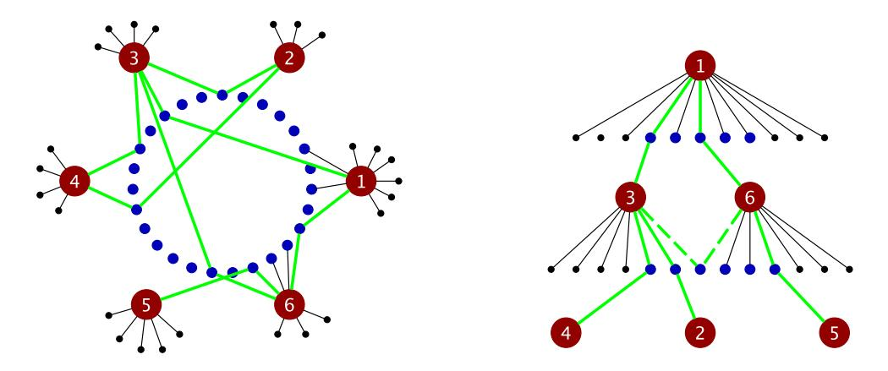

# MULTISCALE GENESIS OF A TINY GIANT FOR PERCOLATION ON SCALE-FREE RANDOM GRAPHS

By Shankar Bhamidi1,a, Souvik Dhara2,b and Remco van der Hofstad3,c

1Department of Statistics and Operations Research, University of North Carolina, abhamidi@email.unc.edu

2School of Industrial Engineering, Purdue University, bsdhara@purdue.edu

We study the critical behavior for percolation on inhomogeneous random networks on n vertices, where the weights of the vertices follow a power-law distribution with exponent  $\tau \in (2,3)$ . Such networks, often referred to as *scale-free networks*, exhibit critical behavior when the percolation probability tends to zero at an appropriate rate, as  $n \to \infty$ . We identify the critical window for several scale-free random graph models, such as the Norros–Reittu model, Chung–Lu model and generalized random graphs. Surprisingly, there exists a finite time inside the critical window, after which we see a sudden emergence of a "tiny" giant component. This is a novel behavior, which is in contrast with the critical behavior in other known universality classes with  $\tau \in (3,4)$  and  $\tau > 4$ .

Precisely, for edge-retention probabilities  $\pi_n = \lambda n^{-(3-\tau)/2}$ , there is an explicitly computable  $\lambda_c > 0$  such that the critical window is of the form  $\lambda \in (0, \lambda_c)$ , where the largest clusters have size of order  $n^\beta$  with  $\beta = (\tau^2 - 4\tau + 5)/[2(\tau - 1)] \in [\sqrt{2} - 1, \frac{1}{2})$  and have nondegenerate scaling limits, while in the supercritical regime  $\lambda > \lambda_c$ , a unique "tiny giant" component of size  $\Theta(\sqrt{n})$  emerges, and its size concentrates. For  $\lambda \in (0, \lambda_c)$ , the scaling limit of the maximum component sizes can be described in terms of components of a one-dimensional inhomogeneous percolation model on  $\mathbb{Z}_+$  studied in a seminal work by Durrett and Kesten (In *A Tribute to Paul Erdős* (1990) 161–176 Cambridge Univ. Press). For  $\lambda > \lambda_c$ , we use a relation to general inhomogeneous random graphs, as studied by Bollobás, Janson and Riordan (*Random Structures Algorithms* 31 (2007) 3–122), to prove that the sudden emergence of the tiny giant is caused by a phase transition inside a smaller core of vertices of weight of order at least  $\sqrt{n}$ .

## **CONTENTS**

| 1. | Introduction                                             | 332 |
|----|----------------------------------------------------------|-----|
|    | 1.1. Background                                          | 332 |
|    | 1.2. Overview of our contributions                       | 333 |
| 2. | Main results                                             | 334 |
|    | 2.1. Preliminaries: Notation, convergence and topologies | 334 |
|    | 2.2. Scale-free random graph models                      | 335 |
|    | 2.3. Results                                             | 335 |
|    | 2.3.1. Behavior in the barely subcritical regime         | 336 |
|    | 2.3.2. Behavior in the critical window                   | 336 |
|    | 2.3.3. Behavior in the supercritical regime              |     |
|    | 2.4. Discussion                                          | 338 |
|    | 2.5. Proof outline                                       |     |
|    | 2.6. Open problems                                       | 340 |
| 3. | Proofs for subcritical and critical regimes              | 341 |
|    |                                                          |     |

&lt;sup>3Department of Mathematics and Computer Science, Eindhoven University of Technology, cr.w.v.d.hofstad@tue.nl

Received August 2021; revised October 2024.

MSC2020 subject classifications. Primary 60K35, 82B43; secondary 05C80.

Key words and phrases. Critical percolation, giant component problem, inhomogeneous random graphs, scale-free networks.

|    | 3.1. | Finiteness of the limiting object for $\lambda \leq \lambda_c$ : Proof of Proposition 2.5 | 341 |
|----|------|-------------------------------------------------------------------------------------------|-----|
|    | 3.2. | Connectivity structure between hubs                                                       | 343 |
|    | 3.3. | Path-counting estimates                                                                   | 347 |
|    | 3.4. | Negligible contributions to the total weight                                              | 349 |
|    | 3.5. | Sizes of components containing hubs                                                       | 350 |
|    | 3.6. | Tightness of component sizes and weights: Proof of Theorem 2.3                            | 353 |
|    | 3.7. | Subcritical behavior: Proof of Theorem 2.2                                                | 354 |
| 4. | The  | giant in the embedded inhomogeneous random graph                                          | 355 |
|    |      | Size and weight of the giant core                                                         |     |
|    | 4.2. | Equality of the critical values                                                           | 357 |
|    | 4.3. | Survival probability of the multitype branching process                                   | 359 |
| 5. | Size | of the tiny giant                                                                         | 363 |
|    | 5.1. | Concentration of the spans: Lower bound                                                   | 364 |
|    | 5.2. | Concentration of the spans: Upper bound                                                   | 366 |
|    |      | Negligible contribution due to reentry paths                                              |     |
|    |      | No large components outside of $[N_n(a)]$                                                 |     |
|    |      | Completing the proof of Theorem 2.6                                                       |     |
| Αc |      | rledgments                                                                                |     |
|    |      | ;                                                                                         |     |
|    |      | ces                                                                                       |     |

#### 1. Introduction.

1.1. Background. Percolation phase transitions are one of the foundational tenets in the application of probabilistic combinatorics to areas ranging from statistical physics to social dynamics [30]. At the simplest level, one starts with a base (potentially random) graph. For a parameter  $\pi$ , each edge in the graph is retained with probability  $\pi$  and deleted with probability  $1-\pi$ , independently across edges. The first question of interest is to understand the emergence of a giant connected component, as one increases the value of  $\pi$ , by identifying critical values of this parameter where abrupt changes in the connectivity occurs. This question arises as the building block for more complex interacting particle systems, for example, in the study of epidemics, condensed matter theory and robustness of networks such as the Internet when the edges of the underlying network experience random failure [6, 27, 38].

Unlike phase transitions on infinite graphs, such as lattices, there is typically no unique critical value for phase transition in large, but finite, graphs. Instead, there is an interval of  $\pi$ -values (depending on the size of the graph), often referred to as the *critical window*, where this structural transition in the component sizes takes place. To fix ideas, let us recall classical results for percolation on complete graphs with n vertices and  $\pi = c/n$  or Erdős–Rényi random graphs  $\text{ER}_n(c/n)$ . It is well known that the critical window is given by  $c(\lambda) = 1 + \lambda n^{-1/3}$  for  $-\infty < \lambda < \infty$  [2, 33, 34], that is, if  $\mathscr{C}_{(i)}$  denotes the ith largest component, then:

(a) 
$$\frac{|\mathscr{C}_{(i)}|}{2\lambda_n^2 n^{2/3} \log |\lambda_n|} \stackrel{\mathbb{P}}{\to} 1$$
 for all  $i \ge 1$  for  $\lambda = \lambda_n \to -\infty$  with  $|\lambda_n| = o(n^{1/3})$ ;  
(b)  $\frac{|\mathscr{C}_{(1)}|}{2|\lambda_n|n^{2/3}} \stackrel{\mathbb{P}}{\to} 1$ , and  $\frac{|\mathscr{C}_{(i)}|}{2\lambda_n^2 n^{2/3} \log |\lambda_n|} \stackrel{\mathbb{P}}{\to} 1$  for all  $i \ge 2$  for  $\lambda = \lambda_n \to +\infty$  with  $\lambda_n = (n^{1/3})$ :

(c)  $n^{-2/3}|\mathcal{C}_{(i)}|$  converges in distribution to nondegenerate strictly positive random variables whose distribution depends on  $\lambda$  inside the critical window where  $\lambda$  is fixed.

Thus, the largest component sizes *concentrate* outside the critical window, whereas they yield nondegenerate scaling limits in the critical window which *sensitively* depends on the *precise* location in the scaling window given by  $\lambda$ . Starting with the pioneering work by Janson, Knuth, Łuczak, Pittel [33] and Aldous [2], the study of critical behavior has inspired an

enormous literature with several scaling-limit results showing qualitatively similar behavior, as in Erdos-Rényi random graph for largest component sizes [ ˝ [4](#page-49-0), [13,](#page-49-0) [24](#page-50-0), [35,](#page-50-0) [37](#page-50-0), [40\]](#page-50-0) and their metric structure [[1](#page-49-0), [7](#page-49-0), [9](#page-49-0), [17](#page-50-0)] when the base graphs have sufficiently homogeneous degree distribution as well as qualitatively different behavior for component sizes [\[3](#page-49-0), [14](#page-49-0), [25,](#page-50-0) [35](#page-50-0)] and their metric structure [\[11](#page-49-0), [12,](#page-49-0) [17,](#page-50-0) [20](#page-50-0)] when the base graphs have heavy-tailed degree distribution; see [\[21](#page-50-0)], Chapter 1, for a detailed literature overview.

1.2. *Overview of our contributions*. In this paper we prove a new type of phase transition phenomenon in the emergence of maximally connected components in certain random graphs and develop techniques in probabilistic combinatorics necessitated by such models. The starting point is random network models with power-law degree distributions with exponent *τ* ∈ *(*2*,* 3*)*. These models are enormously popular in applications owing to empirical observations that many real-world systems (World-Wide Web, social networks, protein interaction networks [\[6](#page-49-0)]) seem to exhibit qualitative properties similar to such models. Mathematically, these models turn out to be highly challenging (as will become further evident below), since they contain extremal degree vertices *at many different scales* that play crucial and central roles in the connectivity patterns at specific phases of the percolation process. In this context our main contributions include the following central aspects.

*A novel phase transition.* This paper considers a number of major families of scale-free random graph models with degree exponent *τ* ∈ *(*2*,* 3*)* related to Aldous's multiplicative coalescent [[2](#page-49-0)]; these include models such as the *Norros–Reittu model*, the *Chung–Lu model* and the *generalized random graph* (see Section [2.2](#page-4-0) for more details). This class of models, sometimes referred to as rank-1 models [[15\]](#page-49-0), has turned out to be central in understanding universality phenomena for critical random graphs in the sense that, once these models have been understood, a host of other canonical random graph models can all be proven to have the same asymptotic behavior in the critical regime; see, for example, [[9](#page-49-0)–[12\]](#page-49-0). We show that the critical window for percolation on scale-free random graphs is given by

(1.1) 
$$\pi_c(\lambda) = \lambda n^{-(3-\tau)/2}, \quad \lambda \in (0, \lambda_c)$$

for some explicitly-computable and model-dependent critical value *λc*. Thus, surprisingly, the critical window is given by a bounded interval *λ* ∈ *(*0*,λc)*. In other words, if we look at the coalescence of the critical components as the percolation parameter transitions through the critical window, the components evolve in a nontrivial manner only up to a finite time *λc*, after which all of the critical components suddenly coalesce with each other. This is in contrast with Aldous' multiplicative coalescent, where the coalescence happens over an infinite length window. The exponent for the critical window in (1.1) was previously conjectured in the statistical physics literature (see, e.g., [\[27](#page-50-0)], Section 4) using a tree ansatz argument which predicts the critical probability from the criticality of a branching process that approximates the local structure of these random graph models. However, the sudden phase transition at some finite *λc* was not predicted in the extensive numerical and nonrigorous investigations from statistical physics and condensed matter theory. Conceptually, in addition to the tree ansatz argument, the emergence of giants in networks with a heavy-tailed degree distribution depends crucially on how the connections between the extremal-degree vertices or *hubs* form. We will see that the intricate structure of the connectivity between hubs is responsible for the giant emergence at *λc*.

Overall, this work identifies a completely new phenomenon for percolation on scale-free random graphs; see Section [2.6](#page-9-0) for a discussion of many other random graphs models where similar behavior is conjectured.

*Multiscale emergence of connectivity and technical novelty.* Analyzing the critical regime of models in this class presents significant technical challenges, mainly since standard techniques based on exploration processes or differential equations cannot be implemented; rather one needs to carefully understand the contribution of extremal-degree vertices or *hubs* of different scales contributing to connectivity at each value of  $\pi_c(\cdot)$ . More precisely, we show the following:

- (a) Critical scaling window: For  $\lambda \in (0, \lambda_c)$ , the maximal component sizes scale, like  $n^\beta$  with  $\beta = \frac{1}{\tau-1} \frac{3-\tau}{2} \in [\sqrt{2}-1,\frac{1}{2})$ , and the rescaled vector of ordered component sizes converges to a nondegenerate random vector in the  $\ell^2$ -topology. The distributional asymptotics can be derived in terms of an inhomogeneous percolation model on  $\mathbb{Z}_+$ , which represents the core connectivity structure between the hubs. In this regime, connectivity emerges owing to interconnections between macro-hubs, namely, maximal-degree vertices (with maximal weight of order  $n^{1/(\tau-1)}$ ). However, note that with  $\pi_c(\lambda) \to 0$ , these macro-hubs cannot be directly connected; rather (with positive probability) they are connected via two-step paths through intermediate scale meso-hubs of weight of order  $n^{(\tau-2)/(\tau-1)}$ . This interconnected structure forms the core of the critical components, and we use path-counting techniques to show that the 1-neighborhood of the core spans the critical components (see Figure 1). The core can be coupled to a one-dimensional inhomogeneous percolation model on  $\mathbb{Z}_+$ , which was studied in a seminal work of Durrett and Kesten [28] and in follow-up work by Zhang [41].
- (b) Supercritical regime: For  $\lambda > \lambda_c$ , instead, we show that there is a unique giant component of size  $\Theta(\sqrt{n}) \gg n^\beta$ , and the size of the rescaled giant component concentrates. In this case we show that the graph restricted to a special set of vertices of mesoscopic weights of order at least  $\sqrt{n}$  can be approximated by a well-behaved inhomogeneous random graph in the spirit of Bollobás, Janson and Riordan [15]. A giant component appears inside this special high-weight set of vertices precisely when  $\lambda > \lambda_c$ . This forms the core of the giant component in the whole graph, and again the 1-neighborhood of the core spans the giant component of size  $\sqrt{n}$  (and, in fact, the core itself is, in size, negligible to this 1-neighborhood). Analyzing the resulting random structure requires several delicate estimates of multitype branching process as well as a careful topological analysis of paths exiting and returning to these special high-weight set of vertices.

## 2. Main results.

2.1. Preliminaries: Notation, convergence and topologies. To describe the main results of this paper, we need some definitions and notations. We use  $\stackrel{\mathbb{P}}{\to}$  and  $\stackrel{d}{\to}$  to denote convergence in probability and in distribution, respectively. The topology needed for convergence in distribution will be specified unless clear from the context. We use the Bachmann–Landau notation  $O(\cdot)$ ,  $o(\cdot)$ ,  $O(\cdot)$  for large n asymptotics of real numbers. For two real sequences  $(a_n)_{n\geq 1}$ ,  $(b_n)_{n\geq 1}$ , we write  $a_n \asymp b_n$  for  $a_n/b_n = 1 + o(1)$ . A sequence of events  $(\mathcal{E}_n)_{n\geq 1}$  is said to occur with high probability with respect to the associated sequence of probability measures  $(\mathbb{P}_n)_{n\geq 1}$  if  $\mathbb{P}_n(\mathcal{E}_n) \to 1$ . For two sequences of real-valued random variables  $(X_n)_{n\geq 1}$  and  $(Y_n)_{n\geq 1}$  on the same probability space, we write  $X_n = O_{\mathbb{P}}(Y_n)$  if  $(|X_n|/|Y_n|)_{n\geq 1}$  is a tight sequence;  $X_n = o_{\mathbb{P}}(Y_n)$  when  $X_n/Y_n \stackrel{\mathbb{P}}{\to} 0$ ;  $X_n = O_{\mathbb{P}}(Y_n)$  if both  $X_n = O_{\mathbb{P}}(Y_n)$  and  $Y_n = O_{\mathbb{P}}(X_n)$ . We use  $C, C', C_1, C_2$  etc. as generic notation for positive constants whose value can change from line to line.

Fix  $\tau \in (2, 3)$ . Throughout this paper we denote

(2.1) 
$$\alpha = 1/(\tau - 1), \qquad \rho = (\tau - 2)/(\tau - 1), \eta = (3 - \tau)/(\tau - 1), \qquad \eta_s = (3 - \tau)/2.$$

For p > 0, let  $\ell^p$  denote the collection of sequences  $\mathbf{x} = (x_1, x_2, x_3, ...)$  with  $\sum_{i=1}^{\infty} |x_i|^p < \infty$ . Equip this space with the p-norm metric  $d(\mathbf{x}, \mathbf{y}) = (\sum_{i=1}^{\infty} |x_i - y_i|^p)^{1/p}$ . Let  $\ell^p_{\downarrow} \subset \ell^p$  be

the collection of sequences x with  $x_i \ge 0$  for all i and the elements of the sequence arranged in nonincreasing order.

2.2. Scale-free random graph models. We now describe the main models studied in this paper. Given a set of weights  $\mathbf{w} = (w_i)_{i \in [n]}$  on the vertex set [n], the Poissonian random graph or Norros-Reittu model [39], denoted by  $NR_n(\mathbf{w})$ , is generated by creating an edge between vertices i and j independently with probability

(2.2) 
$$p_{ij} = p_{ij}^{NR} := 1 - e^{-w_i w_j / \ell_n},$$

where  $\ell_n = \sum_{i \in [n]} w_i$  denotes the total weight. Our results for the critical window hold more generally, for example, for the Chung–Lu Model [18, 19] (denoted by  $\mathrm{CL}_n(\boldsymbol{w})$ ) with

(2.3) 
$$p_{ij}^{\text{CL}} := \min\{w_i w_j / \ell_n, 1\},$$

and the generalized random graph model [16] (denoted by  $GRG_n(\mathbf{w})$ ) with

$$(2.4) p_{ij}^{\text{GRG}} := \frac{w_i w_j}{\ell_n + w_i w_i}.$$

The final model has the property that, conditionally on the degree sequence  $d = (d_i)_{i \in [n]}$ , the law of the obtained random graph is the same as that of a uniformly chosen graph from the space of all simple graphs with degree distribution d (cf. [32], Theorem 6.15).

The percolated graph  $NR_n(\boldsymbol{w}, \pi)$  is obtained by keeping each edge of the graph independently with probability  $\pi$ . This deletion process is also independent of the randomization of the graph. Naturally, the behavior of  $NR_n(\boldsymbol{w})$ , and thus of  $NR_n(\boldsymbol{w}, \pi)$ , depends sensitively on the choice of vertex weights. The following choice of vertex weights will give rise to scale-free random graphs.

ASSUMPTION 2.1 (Scale-free weight structure). For some  $\tau \in (2,3)$ , consider the distribution function F satisfying  $[1-F](w) = Cw^{-(\tau-1)}$  for some C>0 and all  $w>C^{1/(\tau-1)}$ . Let  $w_i=[1-F]^{-1}(i/n)$ .

In this setting, if  $W_n$  denotes the weight of a vertex chosen uniformly at random, then  $W_n$  will satisfy an asymptotic power law in the sense that, for any w > 0,  $\mathbb{P}(W_n > w) \to \mathbb{P}(W > w)$ , where W has distribution function F. As a result, the asymptotic weight distribution will have the same exponent  $\tau$  (see [31], Chapter 6) resulting in a scale-free random graph. Further,

(2.5) 
$$\mathbb{E}[W_n] = \frac{1}{n} \sum_{i \in [n]} w_i \to \mu = \mathbb{E}[W],$$

and for all  $i \in [n]$ ,

$$(2.6) n^{-\alpha} w_i = c_{\rm F} i^{-\alpha},$$

for some constant  $c_F > 0$ . Throughout,  $c_F$  will denote the special constant appearing in (2.6) above.

2.3. *Results*. We start by describing our results for the barely subcritical regime, then the critical window and end with the super-critical regime. To explicitly describe limit constants,

we will phrase the results with respect to the Norros–Reittu model deferring statements to other models to Theorem 2.7. The phase transition is described in terms of functionals of the relevant components. Let  $(|\mathscr{C}_{(i)}(\pi)|)_{i\geq 1}$  be the component sizes of  $NR_n(\boldsymbol{w},\pi)$ , arranged in nonincreasing order (breaking ties arbitrarily). Further, let  $(W_{(i)}(\pi))_{i\geq 1}$  denote the corresponding weight of these clusters, that is,

(2.7) 
$$W_{(i)}(\pi) = \sum_{j \in \mathscr{C}_{(i)}(\pi)} w_j.$$

The phase transitions will be described in terms of these two functionals.

2.3.1. Behavior in the barely subcritical regime. Recall the constants related to the degree exponent in (2.1).

THEOREM 2.2 (Subcritical regime for  $NR_n(\boldsymbol{w}, \pi_n)$ ). Suppose that  $\boldsymbol{w}$  satisfies Assumption 2.1, and consider  $NR_n(\boldsymbol{w}, \pi_n)$  with  $\pi_n = \lambda_n n^{-\eta_s}$  with  $\lambda_n = o(1)$ , and  $\pi_n \gg n^{-\alpha}$ . Then for any fixed  $i \geq 1$ , as  $n \to \infty$ ,

(2.8) 
$$\frac{|\mathscr{C}_{(i)}(\pi_n)|}{n^{\alpha}\pi_n} \stackrel{\mathbb{P}}{\to} c_{\mathrm{F}}i^{-\alpha} \quad and \quad \frac{W_{(i)}(\pi_n)}{n^{\alpha}} \stackrel{\mathbb{P}}{\to} c_{\mathrm{F}}i^{-\alpha}.$$

Theorem 2.2 implies that the largest percolation clusters with  $\pi_n \ll n^{-\eta_s}$  are the clusters of the hubs, that is, the vertices with the largest weights  $(w_i = \Theta(n^\alpha))$ . Further, the hubs with high probability lie in disjoint components. Since, after percolation, the number of neighbors of hub i is close to  $\pi_n w_i \approx n^\alpha \pi_n c_F i^{-\alpha}$ , these largest clusters consist mostly of the hubs with their immediate neighbors. In particular, since the largest cluster sizes *concentrate*, we are not in the critical window when  $\pi_n \ll n^{-\eta_s}$ .

2.3.2. Behavior in the critical window. As discussed in the Introduction, this critical window consists of  $\pi_n = \lambda n^{-\eta_s}$  for some explicit bounded interval of  $\lambda$ . In particular, such values of  $\pi_n$  are much larger than the values considered in the previous section. We will see that there is a surprising phase transition in  $\lambda$ , occurring at a finite positive value  $\lambda_c$ . Below  $\lambda_c$ , the scaling limits of the largest connected components have *nondegenerate* scaling limits, and any two hubs are in the same component with asymptotic probabilities strictly bounded between 0 and 1. Recall (2.1), and define

(2.9) 
$$\pi_c = \pi_c(\lambda) := \lambda n^{-\eta_s} \quad \text{for } \lambda \in (0, \lambda_c),$$

where  $\lambda_c$  is given by

(2.10) 
$$\lambda_c := \sqrt{\frac{\eta}{4B_{\alpha}}} = \frac{c_{\mathrm{F}}^{-1/\alpha}}{2} \sqrt{\frac{(3-\tau)\mu^{1/\alpha}}{A_{\alpha}}},$$

(2.11) 
$$A_{\alpha} := \int_0^{\infty} \frac{1 - e^{-z}}{z^{1/\alpha}} dz, \qquad B_{\alpha} := \frac{c_F^{2/\alpha} A_{\alpha}}{\alpha \mu^{1/\alpha}}.$$

THEOREM 2.3 (Critical regime for  $NR_n(\boldsymbol{w}, \pi_n)$ ). Suppose that  $\boldsymbol{w}$  satisfies Assumption 2.1, and consider  $NR_n(\boldsymbol{w}, \pi_n)$  with  $\pi_n = \pi_c(\lambda)$  for  $\lambda \in (0, \lambda_c)$  and  $\lambda_c$ , as in (2.10). Then, as  $n \to \infty$ ,

(2.12) 
$$(n^{\alpha}\pi_{c}(\lambda))^{-1}(|\mathscr{C}_{(i)}(\pi_{c}(\lambda))|)_{i\geq 1} \xrightarrow{d} (\mathscr{W}_{(i)}^{\infty}(\lambda))_{i\geq 1} \quad and$$

$$n^{-\alpha}(W_{(i)}(\pi_{c}(\lambda)))_{i\geq 1} \xrightarrow{d} (\mathscr{W}_{(i)}^{\infty}(\lambda))_{i\geq 1}$$

with respect to the  $\ell_{\downarrow}^2$ -topology and the  $\ell^2$ -topology, respectively. The limiting random variables  $(\mathscr{W}_{(i)}^{\infty}(\lambda))_{i\geq 1}$  are nondegenerate and described in Definition 2.4 below. Moreover, for each  $i \geq 1$ ,

$$(2.13) (n^{\alpha}\pi_{c}(\lambda))^{-1} |\mathscr{C}_{(i)}(\pi_{c}(\lambda))| - n^{-\alpha}(W_{(i)}(\pi_{c}(\lambda)) \stackrel{\mathbb{P}}{\to} 0,$$

so that the convergence in (2.12) holds jointly.

The nondegenerate scaling limit of the component sizes as well as their weights is the hallmark of critical behavior. To define the limiting variables in Theorem 2.3, we need the following infinite weighted random graph, which belongs to a general class of models studied by Durrett and Kesten in [28].

DEFINITION 2.4 (Limiting variables). Fix vertex set  $\mathbb{Z}_+$ , and let vertex  $i \in \mathbb{Z}_+$  have weight  $\theta_i := c_F i^{-\alpha} \mu^{-1}$ . Consider the random multigraph  $\mathscr{G}_{\infty}(\lambda)$  on  $\mathbb{Z}_+$  where vertices i and j are joined independently by Poisson( $\lambda_{ij}$ ) many edges with  $\lambda_{ij}$  given by

(2.14) 
$$\lambda_{ij} := \lambda^2 \int_0^\infty \Theta_i(x) \Theta_j(x) dx \quad \text{where} \quad \Theta_i(x) := 1 - e^{-c_F \theta_i x^{-\alpha}}.$$

For  $i \ge 1$ , let  $\mathcal{W}_{(i)}^{\infty}(\lambda)$  denote the *i*th largest element of the set

$$\bigg\{ \sum_{i \in \mathscr{C}} \theta_i : \mathscr{C} \text{ is a connected component} \bigg\},$$

which is well defined when  $(\mathcal{W}_{(i)}^{\infty}(\lambda))_{i\geq 1} \in \ell_{\perp}^{2}$  almost surely.

We will see that, asymptotically, there are  $Poisson(\lambda_{ij})$  many two-step paths between macro-hubs i and j via intermediate meso-scale hubs of weight  $\Theta(n^{\rho})$  in  $NR_n(\boldsymbol{w}, \pi_c(\lambda))$ , for i, j fixed as  $n \to \infty$ . The integral in (2.14) can be understood as the limit of the summation over the intermediate vertices in the two-step connection probabilities from i to j. These two-step paths between hubs form the backbone of the largest connected components. The connectivity structure of these two-step connections undergoes a phase transition, as we next explain. The following result implies that the limiting object is well defined for  $\lambda \in (0, \lambda_c]$ and undergoes a phase transition at  $\lambda = \lambda_c$ .

PROPOSITION 2.5 (Phase transition for the limiting model).

- (a) For  $\lambda \leq \lambda_c$ ,  $(\mathscr{W}^{\infty}_{(i)}(\lambda))_{i\geq 1}$  is in  $\ell^2_{\downarrow}$  almost surely. (b) For  $\lambda > \lambda_c$ ,  $\mathscr{G}_{\infty}(\lambda)$  is connected almost surely, in particular,  $\mathscr{W}^{\infty}_{(1)}(\lambda) = \infty$  and  $\mathcal{W}_{(2)}^{\infty}(\lambda) = 0$  almost surely.

2.3.3. Behavior in the supercritical regime. Let us now consider percolation with probability  $\pi_n = \lambda n^{-\eta_s}$  for  $\lambda > \lambda_c$ . Since  $\mathscr{G}_{\infty}(\lambda)$  represents the connectivity structure between the hubs, Proposition 2.5(b) suggests that: (1) the hubs are in the same component with high probability, and (2) the largest connected component after  $\lambda_c$  is much larger than the components before  $\lambda_c$ . Our result next result shows that in fact a "tiny" giant component of size  $\Theta(\sqrt{n})$  appears in the graph, and the size of this giant component concentrates. Moreover, the giant component is unique in the sense that the second largest component is of a smaller order. To describe the limiting size of the giant component, fix a > 0, and define

(2.15) 
$$\zeta_a^{\lambda} := \lambda \int_0^a c_{\rm F} u^{-\alpha} \rho_a^{\lambda}(u) \, \mathrm{d}u,$$

where  $\rho_a^{\lambda}:(0,a]\rightarrow[0,1]$  is the maximum solution to the fixed point equation

(2.16) 
$$\rho_a^{\lambda}(u) = 1 - e^{-\lambda \int_0^a \kappa(u,v) \rho_a^{\lambda}(v) \, dv} \quad \text{with} \quad \kappa(u,v) := 1 - e^{-c_F^2 (uv)^{-\alpha}/\mu}.$$

In Proposition 4.5 we will see that  $\zeta^{\lambda} = \lim_{a \to \infty} \zeta_a^{\lambda}$  exists and that  $\zeta^{\lambda} \in (0, \infty)$  whenever  $\lambda > \lambda_c$ . We now state our result for the emergence of the giant component for  $\lambda > \lambda_c$ :

THEOREM 2.6 ( $\sqrt{n}$ -asymptotics of size and uniqueness giant). Suppose that  $\boldsymbol{w}$  satisfies Assumption 2.1, and consider  $NR_n(\boldsymbol{w}, \pi_n)$  with  $\pi_n = \lambda n^{-\eta_s}$  for some  $\lambda > \lambda_c$ . Then as  $n \to \infty$ ,

$$(2.17) n^{-1/2} |\mathscr{C}_{(1)}(\pi_n)| \xrightarrow{\mathbb{P}} \zeta^{\lambda} \quad and \quad n^{-1/2} |\mathscr{C}_{(2)}(\pi_n)| \xrightarrow{\mathbb{P}} 0,$$

where  $\zeta^{\lambda} = \lim_{a \to \infty} \zeta_a^{\lambda}$  with  $\zeta_a^{\lambda}$  given by (2.15). Further,  $\{v : w_v \ge n^{1/2+\delta}\} \subseteq \mathscr{C}_{(1)}(\pi_n)$  with high probability for every  $\delta > 0$ .

For  $\lambda > \lambda_c$ , a "tiny giant" component will be shown to emerge inside the subset of vertices with weight  $\Omega(\sqrt{n})$ . The giant component in the whole graph consists primarily of the 1-neighborhood of this tiny giant, which gives rise to (2.15). The intuition is discussed in more detail in Section 2.5.

2.4. *Discussion*. In this section we discuss some insights to our results, extensions and open problems.

Critical window for other rank-1 models. Our results for the subcritical regime, and the critical window, hold more generally for the Chung–Lu model  $CL_n(\boldsymbol{w})$  and the generalized random graph model  $GRG_n(\boldsymbol{w})$  described in (2.3) and (2.4). To state this formally, define

(2.18) 
$$A_{\alpha}^{\text{CL}} = \int_{0}^{\infty} \min\{1, z\} z^{-1/\alpha} \, dz, \qquad A_{\alpha}^{\text{GRG}} = \int_{0}^{\infty} \frac{z^{1-1/\alpha}}{1+z} \, dz,$$

and define  $B_{\alpha}^{\rm CL}$ ,  $B_{\alpha}^{\rm GRG}$  and the critical values  $\lambda_c^{\rm CL}$  and  $\lambda_c^{\rm GRG}$  identically, as in (2.10) and (2.11) with the above choices of  $A_{\alpha}^{\rm CL}$  and  $A_{\alpha}^{\rm GRG}$ , respectively. To define the limiting object, let

$$(2.19) \qquad \Theta_i^{\text{CL}}(x) = \min\left\{\frac{c_{\text{F}}^2 i^{-\alpha} x^{-\alpha}}{\mu}, 1\right\}, \qquad \Theta_i^{\text{GRG}}(x) = \frac{c_{\text{F}}^2 i^{-\alpha} x^{-\alpha}}{\mu + c_{\text{F}}^2 i^{-\alpha} x^{-\alpha}}.$$

Let the graphs  $CL_n(\boldsymbol{w}, \pi)$ ,  $GRG_n(\boldsymbol{w}, \pi)$  be obtained by independently keeping each edge of the graph  $CL_n(\boldsymbol{w})$  and  $GRG_n(\boldsymbol{w})$ , respectively.

THEOREM 2.7 (Extensions to other rank-1 models). Under Assumption 2.1, Theorems 2.2, 2.3 hold for  $CL_n(\boldsymbol{w}, \pi_c(\lambda))$  and  $GRG_n(\boldsymbol{w}, \pi_c(\lambda))$  with  $\lambda_c$  replaced by  $\lambda_c^{CL}$  and  $\lambda_c^{GRG}$  defined below (2.18), respectively, and the scaling limits given by Definition 2.4 with  $\Theta_i(x)$  replaced by  $\Theta_i^{CL}(x)$  and  $\Theta_i^{GRG}(x)$ , defined in (2.19), respectively.

The proof of Theorem 2.7 only requires minor adaptations of the proofs of Theorems 2.2, 2.3. We point out the key modifications in Remarks 3.5, 3.9 and skip redoing the whole proof for Theorem 2.7. We also believe that a result analogous to Theorem 2.6 holds for the giant component in  $CL_n(\boldsymbol{w}, \pi_n)$  and  $GRG_n(\boldsymbol{w}, \pi_n)$ , with

(2.20) 
$$\kappa^{\text{CL}}(u,v) := \min \left\{ \frac{c_{\text{F}}^2(uv)^{-\alpha}}{\mu}, 1 \right\}, \qquad \kappa^{\text{GRG}}(u,v) := \frac{c_{\text{F}}^2(uv)^{-\alpha}}{\mu + c_{\text{F}}^2(uv)^{-\alpha}}.$$

However, since the proof of Theorem 2.6 is extremely delicate, we leave this as an open question.

When does the single-edge constraint matter? In concurrent works [22, 23], we study percolation on scale-free networks around criticality for models that allow for multi-edges such as the configuration model [23] and the Norros-Reittu model [22]. In the latter model, the number of edges between vertices i and j is  $\mathsf{Poisson}(w_i w_j / \ell_n)$ . It turns out that a giant emerges in these multi-edge models when

(2.21) 
$$\pi_n = \lambda_n n^{-(3-\tau)/(\tau-1)} \quad \text{where } \lambda_n \to \infty.$$

Thus, the emergence of a giant happens in multi-edge models for much smaller  $\pi_n$  values. Interestingly, when  $\pi_n = \lambda n^{-\eta_s}$  and  $\lambda > \lambda_c$ , both the single-edge and multi-edge version of the Norros-Reittu model contain a giant component of size  $\Theta(\sqrt{n})$ , but the description of their asymptotic sizes are vastly different. In fact, we believe that the asymptotic proportions are strictly different although we do not prove it in this article. On the other hand, if  $\pi_n = \lambda_n n^{-\eta_s}$  with  $\lambda_n \to \infty$ , then the giants in both the single and multi-edge Norros-Reittu model turn out to have the same asymptotic size [22]. Such differences in multi-edge vs. single-edge cases are absent in the  $\tau > 3$  settings.

Critical windows: Emergence of hub connectivity. The critical window changes due to the single-edge constraint, as noted in the previous paragraph. However, there are some common features. First, the component sizes are of the order  $n^{\alpha}\pi_{c}(\lambda)$  in both regimes. This is due to the fact that the main contribution to the component sizes comes from hubs and their direct neighbors. Second, in both cases the critical window is the regime in which hubs start getting connected. More precisely, the critical window is given by those values of  $\pi$  such that, for any fixed  $i, j \geq 1$ ,

(2.22) 
$$\liminf_{n\to\infty} \mathbb{P}(i, j \text{ are in the same component in the } \pi\text{-percolated graph}) \in (0, 1).$$

For multi-edge models, hubs are *directly* connected with strictly positive probability, while under the single-edge constraint, hubs are connected with positive probability via intermediate vertices of degree  $\Theta(n^{\rho})$ . In the barely subcritical regime, instead, all the hubs are in different components. Hubs start forming the critical components precisely when the connection probability  $\pi$  varies over the critical window. Finally, in the barely super-critical regime, the giant component is formed, and this giant contains all the hubs. This feature is also observed in the  $\tau \in (3,4)$  case [14]. However, the distinction between  $\tau \in (3,4)$  and  $\tau \in (2,3)$  is that, for  $\tau \in (3,4)$ , the paths between the hubs have lengths that grow with n, namely, as  $n^{(\tau-3)/(\tau-1)}$ .

2.5. Proof outline. The critical window (Section 3). The key idea is that the largest critical components correspond to connected components containing macro-hubs (maximalweight vertices). However, since  $\pi_n \to 0$  any two macro-hubs cannot be directly connected in the large network limit, rather these have nontrivial probability of being connected via a two-step path passing through meso-scale intermediate hubs of weight  $\Theta(n^{\rho})$ . In fact, we can couple the hubs and these two-step connections to the infinite graph  $\mathscr{G}_{\infty}(\lambda)$ , as in Definition 2.4, in total variation distance (see Proposition 3.6 below). Next, we show that the primary contribution to the component sizes comes from the 1-neighborhood of the subgraph consisting of hubs and their two-step connections. This is reflected in the fact that, when we explore the graph starting from hubs in a breadth-first manner, we see an alternating structure with the hubs of weight  $\Theta(n^{\alpha})$  appearing in the odd generations and the even generations consisting of vertices having weight  $\Theta(n^{\rho})$ ; see Figure 1 and Proposition 3.11 below. The main technique here is to use appropriate path-counting techniques (see Proposition 3.10 below). Finally, we conclude the proof of Theorem 2.3 by showing that the vector of component sizes is tight in  $\ell_{\perp}^2$  when  $\lambda < \lambda_c$  (see Proposition 3.16). The phase transition at  $\lambda = \lambda_c$  is exemplified in Proposition 2.5, as  $\mathscr{G}_{\infty}(\lambda)$  becomes connected for  $\lambda > \lambda_c$ .

FIG. 1. Visualization of the core structure of components and the exploration of the neighborhood. Red vertices indicate hubs with  $w_i = \Theta(n^{\alpha})$ , and blue vertices having  $w_i = \Theta(n^{\rho})$  are intermediate vertices that connect hubs via two-step paths (indicated by green edges).

Supercritical regime (Sections 4 and 5). The key observation is that the core of the giant component can be identified by looking at a special set of vertices V consisting of vertices with weight  $\Omega(\sqrt{n})$ . Note that these vertices are present only in the  $\tau \in (2,3)$  regime (for  $\tau > 3$ , the maximum weight is  $o(\sqrt{n})$ ). Now, the subgraph restricted to V is an inhomogeneous random graph with kernel approximately equal to  $\kappa$  given by (2.16). Using general results from inhomogeneous random graphs [15], this allows us to conclude that the graph restricted to V exhibits a phase transition, and a unique giant component of approximate size  $|V|\rho^{\lambda}$  appears for some  $\lambda > \lambda_c^1$ , where  $\lambda_c^1$  is given by the inverse of the norm of a suitable integral operator. Thus, a giant component appears inside V precisely after  $\lambda_c^1$ . This constitutes the core of vertices, and the 1-neighborhood of this tiny giant spans almost the entire giant component. The quantity  $\zeta^{\lambda}$  in (2.15) should be interpreted as the size of the 1-neighborhood of the small giant. Thus, we see two structural transitions occurring at  $\lambda = \lambda_c$  and at  $\lambda = \lambda_c^1$ . These values have rather different origins. Indeed,  $\lambda_c$  arises as the connectivity threshold for the inhomogeneous percolation on the integers in Proposition 2.5, while  $\lambda_c^1$  arises as the critical value of an appropriate inhomogeneous random graph, described in terms of an operator of some branching process. However, an explicit computation shows that, in fact,  $\lambda_c = \lambda_c^1$ ; see Lemma 4.4 below.

2.6. Open problems. We expect the results to hold for percolation problems on a variety of scale-free random graph models. For example, we believe that our results carry over to the setting of uniform random graphs with a given degree distribution  $(d_i)_{i \in [n]}$ , for which the probability that hubs i and j are connected is close to  $d_i d_j / (\ell_n + d_i d_j)$ , with  $\ell_n = \sum_{i \in [n]} d_i$  (see, e.g., [29], Lemma 3). In this case we expect the scaling limits and  $\lambda_c$  to be identical to that of the generalized random graph model. Similarly, for the erased configuration model (where multi-edges are collapsed to a single edge), the scaling limits and  $\lambda_c$  are expected to be identical to the Norros–Reittu model. The finite-time phase transition is expected for a wide class of general inhomogeneous random graph models (as defined in [15]), where the edge probability matrix is not approximately rank-1 as long as the asymptotic two-hop connection probabilities satisfy a condition similar to Corollary 3.3 below, with h satisfying the general conditions of [28], Theorem 1.

Investigation into scale-free settings beyond Assumption 2.1 is also of interest. We believe that similar behavior can be observed if the weights are sampled in an i.i.d. manner from F. The scaling limit is expected to be slightly different since the limit of  $(n^{-\alpha}w_i)_{i\geq 1}$  is now random. It is desirable to find general conditions similar to [23], Assumption 1, for the

critical window of configuration model multigraphs. The interested reader should note that additional control on intermediate weights is required to ensure the formation of suitable two-hop connections.

Figure 1 and the proof ideas suggest that the typical distances in large critical components are quite small, and it would be of interest to describe their distributions in more detail. Further, it would be of interest to derive the scaling limit of the *diameter* of the large critical components. Finally, we show that the critical window in the single-edge case is  $\pi_n = \lambda n^{-(3-\tau)/2}$  for  $\lambda \in (0, \lambda_c)$ , which does not include the critical value  $\lambda_c$ . However,  $\lambda_c$  is included in the critical case for the limiting graph in Proposition 2.5. This raises the question what happens for  $\pi_n = n^{-(3-\tau)/2}\lambda_c(1+\varepsilon_n)$  for  $\varepsilon_n = o(1)$ . Is barely supercritical behavior then observed, or does a second type of critical behavior emerge? We leave this as an interesting open question.

- **3. Proofs for subcritical and critical regimes.** We begin with the proof of the critical regime, starting in Section 3.1 by proving Proposition 2.5 and, in particular, showing that the asserted limiting object is finite. In Section 3.2 we set up technical ingredients to study the connectivity structure between macro-hubs. In Section 3.3 we derive path-counting estimates, which are used in Section 3.4 to show that if we start exploring a component from a hub, then the total number of vertices at *even* distances is negligible, and the total number of vertices at *large and odd distances is also* negligible (the same estimates will be useful in the subcritical regime, which explains why we start with the critical regime first). This allows us to compute the size of the components containing hubs in Section 3.5. We conclude the proof of Theorem 2.3 in Section 3.6 by showing that the vector of component sizes is tight in  $\ell_{\downarrow}^2$ . The subcritical regime is analyzed in Section 3.7, where we use path-counting techniques to show that the largest components are essentially stars with hubs as centers.
- 3.1. Finiteness of the limiting object for  $\lambda \leq \lambda_c$ : Proof of Proposition 2.5. Recall  $\lambda_c$  from (2.10), and the constants  $A_{\alpha}$ ,  $B_{\alpha}$  from (2.11). Define the symmetric function  $h:(0,\infty)^2 \to (0,\infty)$  by

(3.1) 
$$h(x, y) := B_{\alpha}(x \wedge y)^{-(1-\alpha)}(x \vee y)^{-\alpha}.$$

Note that h is perfectly homogeneous of exponent -1, that is,  $h(tx, ty) = t^{-1}h(x, y)$  for all x, y, t > 0. Analogous to  $\mathcal{G}_{\infty}(\lambda)$  in Definition 2.4, consider the following random graph which belongs to a general class of models studied by Durrett and Kesten [28].

DEFINITION 3.1 (Inhomogeneous percolation model). Consider the random graph  $\mathcal{G}_{DK}(\lambda)$  on  $\mathbb{Z}_+$  where vertices i and j are joined with probability  $\min\{\lambda^2 h(i,j), 1\}$ , independently across edges.

THEOREM 3.2 (Previous results for  $\mathcal{G}_{DK}(\lambda)$ , [28, 41]).

- (a) By [28] the random graph  $\mathcal{G}_{DK}(\lambda)$  is connected almost surely for  $\lambda > \lambda_c$ .
- (b) For  $i, j \in \mathbb{Z}_+$ , write  $\mathbb{P}_{\lambda, DK}(i \leftrightarrow j)$  for the probability that i, j are connected by some path in  $\mathcal{G}_{DK}(\lambda)$ . By [41] there exists  $c_1 < \infty$  such that, for  $\lambda = \lambda_c$  and for any  $1 \le i < j$ ,

$$\mathbb{P}_{\lambda_c, DK}(i \leftrightarrow j) \leq c_1 \log(i \vee 2) / \sqrt{ij}$$
.

To see that the  $\lambda_c$  in (2.10) gives the same critical value as [28], (1.5), we compute

$$(3.2) \qquad \left[ \int_0^\infty \frac{h(1,y)}{\sqrt{y}} \, \mathrm{d}y \right]^{-1} = \frac{1}{B_\alpha} \left[ \int_0^1 \frac{\mathrm{d}y}{y^{\frac{1}{2} + 1 - \alpha}} + \int_1^\infty \frac{\mathrm{d}y}{y^{\frac{1}{2} + \alpha}} \right]^{-1} = \frac{2\alpha - 1}{4B_\alpha} = \frac{\eta}{4B_\alpha},$$

where we have used that  $\alpha \in (\frac{1}{2}, 1)$ . The square root in (2.10) is due to the fact that we have used  $\lambda^2$  in Definition 3.1 instead of  $\lambda$ , as in [28]. The factor  $\lambda^2$  arises for us, since we deal with two-step paths. We next discuss an extension where the connection probabilities are asymptotically equal to h(i, j) also proven in [28], Extension (a).

COROLLARY 3.3 (Extension to asymptotic edge probabilities, [28]). Consider the graph  $\mathcal{G}'_{DK}(\lambda)$  constructed by keeping an edge between i and j independently with probability r(i, j), and let

(3.3) 
$$\lim_{i \to \infty} \lim_{j \to \infty} r(i, j) / \lambda^2 h(i, j) = 1.$$

Then,  $\mathcal{G}'_{DK}(\lambda)$  is connected almost surely if  $\lambda > \lambda_c$ .

We next state the following lemma which allows us to compare the connection probabilities in Definitions 2.4 and 3.1. Let  $p_{\infty}(i, j) := 1 - e^{-\lambda_{ij}}$ , with  $\lambda_{ij}$ , as in (2.14), be the probability that there is an edge between i, j in  $\mathscr{G}_{\infty}(\lambda)$  in Definition 2.4.

LEMMA 3.4 (Asymptotics of two-step probabilities). For all  $i, j \in \mathbb{Z}_+$ ,  $p_{\infty}(i, j) \le \lambda^2 h(i, j)$ . Further,

(3.4) 
$$\lim_{i \to \infty} \lim_{j \to \infty} p_{\infty}(i, j) / \lambda^2 h(i, j) = 1.$$

Consequently,  $\mathscr{G}_{\infty}(\lambda)$  is almost surely connected for  $\lambda > \lambda_c$ .

PROOF. Without loss of generality, let i < j. We first show the first assertion on domination. Using  $1 - e^{-x} \le x$  for all x > 0 twice, as well as (2.14), we note that

$$(3.5) \quad p_{\infty}(i,j) \le \lambda_{ij} = \lambda^2 \int_0^{\infty} \Theta_i(x) \Theta_j(x) \, \mathrm{d}x \le \frac{\lambda^2 c_{\mathrm{F}}^2 j^{-\alpha}}{\mu} \int_0^{\infty} \left(1 - \mathrm{e}^{-\frac{c_{\mathrm{F}}^2}{\mu} i^{-\alpha} x^{-\alpha}}\right) x^{-\alpha} \, \mathrm{d}x.$$

Substituting  $z = (i^{-\alpha}x^{-\alpha})c_{\rm F}^2/\mu$  with  $x = c_{\rm F}^{2/\alpha}\mu^{-1/\alpha}z^{-1/\alpha}i^{-1}$  and  $\mathrm{d}z = -\alpha c_{\rm F}^2\mu^{-1}i^{-\alpha} \times x^{-\alpha-1}\mathrm{d}x$ .

$$(3.6) p_{\infty}(i,j) \leq \frac{\lambda^2}{j^{\alpha}} \int_0^{\infty} (1 - e^{-z}) \frac{c_F^{2/\alpha}}{\mu^{1/\alpha}} \frac{dz}{\alpha i^{1-\alpha} z^{1/\alpha}} = \frac{\lambda^2 c_F^{2/\alpha}}{\alpha \mu^{1/\alpha}} \frac{1}{i^{1-\alpha} j^{\alpha}} \int_0^{\infty} \frac{1 - e^{-z}}{z^{1/\alpha}} dz,$$

and thus using (2.11), it follows that  $p_{\infty}(i, j) \leq \lambda^2 h(i, j)$ . For the second assertion, note that  $\lim_{i \to \infty} \lim_{j \to \infty} \lambda_{ij} = 0$ . Thus, we can use the same calculation as above, together with the fact that  $\lim_{x \to 0} [1 - e^{-x}]/x = 1$  to conclude (3.4). The last conclusion now follows from Corollary 3.3.  $\square$ 

REMARK 3.5 (Related rank-1 models). If we replace  $\Theta_i(x)$  by  $\Theta_i^{\text{CL}}(x)$  and  $\Theta_i^{\text{GRG}}(x)$  from (2.19), respectively, then Lemma 3.4 holds with h(i,j) replaced by  $h^{\text{CL}}(i,j) = (B_{\alpha}^{\text{CL}}/B_{\alpha})h(x,y)$  and  $h^{\text{GRG}}(i,j) = (B_{\alpha}^{\text{GRG}}/B_{\alpha})$ , respectively, from (2.19).

PROOF OF PROPOSITION 2.5. Recall that  $\theta_i = c_F i^{-\alpha} \mu^{-1}$ . Using Lemma 3.4, the graph  $\mathcal{G}_{\infty}(\lambda)$  is almost surely connected for  $\lambda > \lambda_c$ . Thus, Proposition 2.5(b) follows from the fact that  $\sum_{i=1}^{\infty} \theta_i = \infty$ . Next, by the upper bound in Lemma 3.4 and monotonicity in  $\lambda$  for the connection probabilities, it is enough to show Proposition 2.5(a) for  $\mathcal{G}_{DK}(\lambda_c)$ . To this end, let  $\mathcal{C}(j)$  denote the component of vertex j in  $\mathcal{G}_{DK}(\lambda_c)$ . Define

(3.7) 
$$C_{\leq}(j) = \begin{cases} C(j) & \text{if } j = \min\{i : i \in C(j)\}, \\ \varnothing & \text{otherwise.} \end{cases}$$

Then it is enough to show that

(3.8) 
$$L := \mathbb{E}\left(\sum_{j=1}^{\infty} \left(\sum_{i \in \mathcal{C}_{\leq}(j)} \theta_i\right)^2\right) < \infty.$$

Expanding the above, we obtain

$$(3.9) \quad L \leq \sum_{j=1}^{\infty} \theta_j^2 + 2 \sum_{i_1 > i_2 \geq j} \theta_{i_1} \theta_{i_2} \mathbb{P}_{\lambda_c, DK} (i_1 \leftrightarrow i_2 \text{ in } [j, \infty), i_1, i_2 \in \mathcal{C}(j)) := \|\boldsymbol{\theta}\|_2 + 2L_1.$$

Here the event  $\{i_1 \leftrightarrow i_2 \text{ in } [j, \infty)\}$  is the event that there exists a path in  $\mathcal{G}_{DK}(\lambda_c)$  from  $i_1$  and  $i_2$  with all intermediate vertices in  $[j, \infty)$ . Since  $\theta \in \ell^2_{\downarrow}$ , it is enough to show that  $L_1 < \infty$ . Splitting into cases depending on whether  $i_2 = j$  or  $i_2 > j$ , we get  $L_1 = L_2 + L_3$ , where

$$(3.10) L_2 := \sum_{j=1}^{\infty} \sum_{i_1 > j} \theta_{i_1} \theta_j \mathbb{P}_{\lambda_c, \mathrm{DK}} (i_1 \leftrightarrow j \text{ in } [j, \infty)) \le \sum_{j=1}^{\infty} \frac{1}{j^{\alpha}} \sum_{i > j} \frac{1}{i^{\alpha}} \frac{c_1 \log j}{\sqrt{ij}} < \infty,$$

where the second inequality follows from Theorem 3.2 (b) and the last inequality uses  $\alpha > \frac{1}{2}$ . The final term to bound is  $L_3$ . For any  $i_1, i_2 > j$ , write  $\{i_1 \leftrightarrow i_2\}_j$  for the event  $\{i_1 \leftrightarrow i_2\}$  in  $[j, \infty)$  in  $\mathcal{G}_{DK}(\lambda_c)$ . Next, note that

$$(3.11) \qquad \{i_1 \leftrightarrow i_2 \text{ in } [j, \infty), i_1, i_2 \in \mathcal{C}(j)\} \subseteq \bigcup_{z \ge j} [\{z \leftrightarrow j\}_j \circ \{i_1 \leftrightarrow z\}_j \circ \{i_2 \leftrightarrow z\}_j],$$

where  $\{z \leftrightarrow j\}_j \circ \{i_1 \leftrightarrow z\}_j \circ \{i_2 \leftrightarrow z\}_j$  denotes the event that the implied connections are realized using *disjoint* sets of edges. The union bound combined with the BK-inequality [8], Theorem 3.3, implies that, for fixed  $i_1 > i_2 > j$ ,

$$\mathbb{P}_{\lambda_{c},\mathrm{DK}}(i_{1} \leftrightarrow i_{2} \mathrm{in} [j, \infty), i_{1}, i_{2} \in \mathcal{C}(j)) \\
\leq \sum_{z \geq j} \mathbb{P}_{\lambda_{c},\mathrm{DK}}(\{j \leftrightarrow z\}_{j}) \mathbb{P}_{\lambda_{c},\mathrm{DK}}(\{z \leftrightarrow i_{1}\}_{j}) \mathbb{P}_{\lambda_{c},\mathrm{DK}}(\{z \leftrightarrow i_{2}\}_{j}) \\
\leq \sum_{z \geq j} c_{1}^{3} \frac{\log(j \vee 2) \log(i_{1} \vee 2) \log(i_{2} \vee 2)}{\sqrt{i_{1}i_{2}jz^{3}}} \leq C \frac{\log(j \vee 2) \log(i_{1} \vee 2) \log(i_{2} \vee 2)}{j\sqrt{i_{1}i_{2}}},$$

where we have once again used Theorem 3.2(b) for the penultimate step. Thus, using  $\theta_i = c_F i^{-\alpha} \mu^{-1}$  and  $\alpha > \frac{1}{2}$ ,

(3.13) 
$$L_{3} \leq C \sum_{j=1}^{\infty} \sum_{i_{1} > i_{2} > j} \theta_{i_{1}} \theta_{i_{2}} \frac{\log(j \vee 2) \log(i_{1} \vee 2) \log(i_{2} \vee 2)}{j \sqrt{i_{1} i_{2}}}$$

$$\leq C' \sum_{j=1}^{\infty} \frac{\log(j \vee 2)}{j} \left( \sum_{i_{1} > j} \frac{\log(i_{1} \vee 2)}{i_{1}^{\alpha + \frac{1}{2}}} \right) \left( \sum_{i_{2} > j} \frac{\log(i_{2} \vee 2)}{i_{2}^{\alpha + \frac{1}{2}}} \right) \leq C' \sum_{j=1}^{\infty} \frac{g(j)}{j^{2\alpha}},$$

where  $g(\cdot)$  is a slowly varying function. Thus, we obtain that  $L_3 < \infty$ . This completes the proof of (3.8) and hence Proposition 2.5(a).  $\square$ 

3.2. Connectivity structure between hubs. In this section we estimate the connection probabilities between macro-hubs. Recall  $p_{ij}$  from (2.2). Henceforth, in this section we simply write  $\pi_c$  for  $\pi_c(\lambda)$ . For any  $i \neq j$ , let  $X_{ij}$  denote the number of paths of length 2 from i to j. For  $v \notin \{i, j\}$ , let  $\xi_{ij}(v)$  denote the indicator that  $\{i, v\}$  and  $\{v, j\}$  create edges in  $NR_n(\boldsymbol{w}, \pi_c(\lambda))$ . Thus,

(3.14) 
$$X_{ij} = \sum_{v \neq i, j} \xi_{ij}(v) \quad \text{with } \xi_{ij}(v) \sim \text{Bernoulli}(\pi_c^2 p_{iv} p_{vj}), \text{ independently.}$$

PROPOSITION 3.6 (Hub connectivity). For each fixed  $i, j \ge 1$ ,

(3.15) 
$$\lim_{n \to \infty} d_{\text{TV}}(X_{ij}, P_{ij}) = 0 \quad \text{where } P_{ij} \sim \text{Poisson}(\lambda_{ij}),$$

 $\lambda_{ij}$  is given by (2.14) and  $d_{TV}(\cdot, \cdot)$  denotes the total variation distance. Moreover, for any fixed  $K \ge 1$ ,  $(X_{ij})_{1 \le i < j \le K}$  are asymptotically independent.

Before embarking on the proof of Proposition 3.6, we describe moment estimates on the weights  $\boldsymbol{w}$ . Recall that  $\ell_n = \sum_{i \in [n]} w_i$ , and  $a_n \times b_n$  denotes that  $a_n = b_n(1 + o(1))$ .

LEMMA 3.7 (Moment estimates). Under Assumption 2.1, for any fixed a > 0,

(3.16) 
$$\#\{k: w_k \ge a\ell_n/w_i\} \asymp n \left(\frac{c_F w_i}{a\ell_n}\right)^{\tau-1},$$

(3.17) 
$$\sum_{w_k > a\ell_n/w_i} w_k \approx \frac{c_F^{\tau-1} n}{1 - \alpha} \left(\frac{w_i}{a\ell_n}\right)^{\tau-2},$$

(3.18) 
$$\sum_{k:w_k \leq a\ell_n/w_i} w_k^2 \asymp \frac{c_F^{\tau-1} n}{2\alpha - 1} \left(\frac{a\ell_n}{w_i}\right)^{3-\tau},$$

where the approximations are uniform over  $i \in [n]$ .

PROOF. The first approximation follows from (2.6) by noting that

$$(3.19) w_k \ge \frac{a\ell_n}{w_i} \iff c_F \left(\frac{n}{k}\right)^{\alpha} \ge \frac{a\ell_n}{w_i} \iff k \le n \left(\frac{c_F w_i}{a\ell_n}\right)^{\tau-1}.$$

Moreover,

(3.20) 
$$\sum_{k:w_k>a\ell_n/w_i} w_k = c_F n^\alpha \sum_{k< n(c_F w_i/a\ell_n)^{\tau-1}} k^{-\alpha} \times \frac{c_F n^\alpha}{1-\alpha} \left(n\left(\frac{c_F w_i}{a\ell_n}\right)^{\tau-1}\right)^{1-\alpha} \asymp \frac{c_F^{\tau-1} n}{1-\alpha} \left(\frac{w_i}{a\ell_n}\right)^{\tau-2},$$

and

(3.21) 
$$\sum_{k:w_{k} \leq a\ell_{n}/w_{i}} w_{k}^{2} = c_{F}^{2} n^{2\alpha} \sum_{k \geq n(c_{F}w_{i}/a\ell_{n})^{\tau-1}} k^{-2\alpha}$$

$$\approx \frac{c_{F}^{2} n^{2\alpha}}{2\alpha - 1} \left(\frac{a\ell_{n}}{c_{F}w_{i}}\right)^{3-\tau} n^{1-2\alpha} \approx \frac{c_{F}^{\tau-1} n}{2\alpha - 1} \left(\frac{a\ell_{n}}{w_{i}}\right)^{3-\tau},$$

where the approximations are uniform over  $i \in [n]$ . Thus, the proof follows.  $\square$ 

PROOF OF POISSON APPROXIMATION IN PROPOSITION 3.6. Recall  $\pi_c = \pi_c(\lambda)$  from (2.9),  $p_{ij}$  from (2.2) and  $\lambda_{ij}$  from (2.14). We first prove the Poisson approximation in (3.15), followed by the asserted asymptotic independence. Fix  $\delta > 0$ . Recall  $\rho = 1 - \alpha$ . Throughout, we will use  $p_{ij} \leq \pi_c w_i w_j / \ell_n$ . We start by splitting the sum in (3.14) over three sets  $\{v : w_v < \delta n^\rho\}$ ,  $\{v : \delta n^\rho \leq w_v \leq \delta^{-1} n^\rho\}$  and  $\{v : w_v > \delta^{-1} n^\rho\}$ . Let us denote these three partial sums by  $X_{ij}^{(I)}(\delta)$ ,  $X_{ij}^{(II)}(\delta)$  and  $X_{ij}^{(III)}(\delta)$ , respectively. Now, using Lemma 3.7, (3.16), (3.18)

(3.22) 
$$\mathbb{E}[X_{ij}^{(I)}(\delta)] \leq \frac{w_i w_j \pi_c^2}{\ell_n^2} \sum_{v: w_v < \delta n^{\rho}} w_v^2 \leq C \delta^{3-\tau} n^{2\alpha - 2 + 1 + (3-\tau)\rho} \pi_c^2 \leq C \delta^{3-\tau},$$

$$\mathbb{E}[X_{ij}^{(III)}(\delta)] \leq \pi_c^2 \times \#\{v: w_v > \delta^{-1} n^{\rho}\} = C \delta^{\tau - 1}.$$

For nonnegative integer-valued random variables X, Y, Z, with X, Y being independent, by the triangle inequality,

$$d_{\text{TV}}(X+Y,Z) = \sum_{k=0}^{\infty} |\mathbb{P}(X+Y=k) - \mathbb{P}(Z=k)|$$

$$\leq \sum_{k=0}^{\infty} |\mathbb{P}(X=k) - \mathbb{P}(Z=k)| + \sum_{k=0}^{\infty} |\mathbb{P}(X=k) - \mathbb{P}(X=k,Y=0)|$$

$$+ \sum_{k=0}^{\infty} \mathbb{P}(X=k,Y\geq 1)$$

$$\leq d_{\text{TV}}(X,Z) + 2\mathbb{P}(Y\geq 1) \leq d_{\text{TV}}(X,Z) + 2\mathbb{E}[Y],$$

where the last step uses Markov's inequality. Using (3.22) and (3.23), in order to prove (3.15), it suffices to show that

(3.24) 
$$\lim_{\delta \to 0} \lim_{n \to \infty} d_{\text{TV}}(X_{ij}^{(\text{II})}(\delta), P_{ij}) = 0 \quad \text{where } P_{ij} \sim \text{Poisson}(\lambda_{ij}).$$

Define

$$(3.25) P_{ij}^{(n)}(\delta) \sim \text{Poisson}(\lambda_{ij}^{(n)}(\delta)) \text{where } \lambda_{ij}^{(n)}(\delta) = \sum_{v:w_v \in [\delta n^{\rho}, \delta^{-1} n^{\rho}]} \pi_c^2 p_{iv} p_{vj}.$$

Using standard inequalities from Stein's method [32], Theorem 2.10, it follows that, as  $n \to \infty$ ,

$$(3.26) d_{\text{TV}}(X_{ij}^{(\text{II})}(\delta), P_{ij}^{(n)}(\delta))) \leq \sum_{v:w_v \in [\delta n^{\rho}, \delta^{-1} n^{\rho}]} (\pi_c^2 p_{iv} p_{vj})^2 \\ \leq C n^{4\alpha - 4} \pi_c^4 \sum_{v:w_v \in [\delta n^{\rho}, \delta^{-1} n^{\rho}]} w_v^4 \\ \leq \frac{C}{\delta^2} n^{2\alpha - 2} \pi_c^4 \sum_{v:w_v \in [\delta n^{\rho}, \delta^{-1} n^{\rho}]} w_v^2 \\ = \frac{C}{\delta^2} n^{2\alpha - 2} n^{-2(3-\tau)} n^{1 + (3-\tau)\rho} = \frac{C n^{-(3-\tau)}}{\delta^2} \to 0,$$

where the third inequality uses  $\rho = -\alpha + 1$ . Further,

$$\lambda_{ij}^{(n)}(\delta) \approx \pi_c^2 \sum_{k=\delta^{\tau-1}n^{3-\tau}}^{\delta^{-(\tau-1)}n^{3-\tau}} \left(1 - e^{-\frac{c_F^2}{\mu}n^{\frac{3-\tau}{\tau-1}}i^{-\alpha}k^{-\alpha}}\right) \left(1 - e^{-\frac{c_F^2}{\mu}n^{\frac{3-\tau}{\tau-1}}j^{-\alpha}k^{-\alpha}}\right)$$

$$\approx \pi_c^2 \int_{\delta^{\tau-1}n^{3-\tau}}^{\delta^{-(\tau-1)}n^{3-\tau}} \left(1 - e^{-\frac{c_F^2}{\mu}n^{\frac{3-\tau}{\tau-1}}i^{-\alpha}y^{-\alpha}}\right) \left(1 - e^{-\frac{c_F^2}{\mu}n^{\frac{3-\tau}{\tau-1}}j^{-\alpha}y^{-\alpha}}\right) dy$$

$$\approx \lambda^2 \int_{\delta^{\tau-1}}^{\delta^{-(\tau-1)}} \left(1 - e^{-\frac{c_F^2}{\mu}i^{-\alpha}x^{-\alpha}}\right) \left(1 - e^{-\frac{c_F^2}{\mu}j^{-\alpha}x^{-\alpha}}\right) dx := \lambda_{ij}(\delta).$$

As  $\delta \to 0$ , we have  $\lambda_{ij}(\delta) \to \lambda_{ij}$ . Since the total variation distance between two Poisson distributions is at most the difference of their means, we conclude (3.24), and hence the proof of (3.15) also follows.  $\Box$ 

REMARK 3.8 (No hubs connected via two-step paths in subcritical regime). When  $\pi_n = \lambda_n n^{-\eta_s}$  with  $\lambda_n = o(1)$ , we can use identical argument as above to show that, for any  $K \ge 1$ ,

(3.28) 
$$\lim_{n \to \infty} \mathbb{P}(X_{ij} \ge 1 \text{ for some } 1 \le i < j \le K) = 0.$$

Indeed, the bounds in (3.22), (3.26) and (3.27) would all tend to zero as  $n \to \infty$ .

PROOF OF ASYMPTOTIC INDEPENDENCE IN PROPOSITION 3.6. Fix  $K \geq 1$ . Note that for pairs (i,j) and (k,l) with  $\{i,j\} \cap \{k,l\} = \varnothing$ ,  $X_{ij}$  and  $X_{kl}$  are independent due to the independence of the occupancy of edges in  $\operatorname{NR}_n(\boldsymbol{w},\pi_c(\lambda))$ . The only dependence between  $X_{ij}$  and  $X_{ik}$  arises due to potential connections (i,v), (v,j) and (v,k). To simplify notation, we give a full proof for the asymptotic independence of  $(X_{12},X_{13})$ , and a minor adaptation of this proof holds for any general  $K \geq 1$ . Fix  $\delta > 0$ , and let  $V_n(\delta) = \{v : \delta n^\rho \leq w_v \leq \delta^{-1} n^\rho\}$ . Let  $X_{12}^{(II)}(\delta)$ ,  $X_{13}^{(II)}(\delta)$  be the random variables as in (3.24). Recall the definition of the constant  $\lambda_{ij}(\delta)$  from (3.27). Arguing as in the convergence of the marginals, it is enough to prove that, as  $n \to \infty$ ,

(3.29) 
$$d_{\text{TV}}((X_{12}^{(\text{II})}(\delta), X_{13}^{(\text{II})}(\delta)), (P_{12}(\delta), P_{13}(\delta))) \to 0,$$

where  $P_{12}(\delta)$ ,  $P_{13}(\delta)$  are independent Poisson random variables with means  $\lambda_{12}(\delta)$ ,  $\lambda_{13}(\delta)$ , respectively. We will use a technique called the *Poisson Cramér–Wold device* from [5] that allows us to prove (3.29) by showing that the sum of any binomial thinnings of  $X_{12}^{(II)}(\delta)$  and  $X_{13}^{(II)}(\delta)$  converges to a Poisson distribution (see (3.31) below).

We need some additional notation to this end. For  $v \in V_n(\delta)$  and for  $i \in \{1, 2, 3\}$ , let  $I_{iv}$  be the indicator representing the presence of edge  $\{i, v\}$  in  $NR_n(\boldsymbol{w}, \pi_c(\lambda))$  so that the two-hop indicator equals  $\xi_{ij}(v) = I_{iv}I_{jv}$ . Fix two constants  $p, q \in [0, 1]$ , and for each  $v \in V_n(\delta)$ , let  $J_{2v}$ ,  $J_{3v}$  be Bernoulli p, q random variables, respectively, independent of each other and all the other indicator random variables. Write

(3.30) 
$$R_n := \sum_{v \in V_n(\delta)} [J_{2v} I_{1v} I_{2v} + J_{3v} I_{1v} I_{3v}] = \sum_{\beta \in \mathcal{I}} \mathbb{1}_{\beta},$$

where the index set  $\mathcal{I}$  is given by  $\mathcal{I} = \bigcup_{v \in V_n(\delta)} \{(v, 1, 2), (v, 1, 3)\}$  and  $\mathbb{1}_{\beta} = J_{kv}I_{1v}I_{kv}$  for  $\beta = (v, 1, k)$ . Our main tool is the Poisson Cramér–Wold device in [5], Corollary 2.2, which implies that, in order to prove (3.29), it is enough to show that, for every  $p, q \in [0, 1]$ , as  $n \to \infty$ ,

(3.31) 
$$d_{\text{TV}}(R_n, P) \to 0, \quad P \sim \text{Poisson}(p\lambda_{12}(\delta) + q\lambda_{13}(\delta)).$$

Although [5], Corollary 2.2, is stated in terms of convergence in distribution, note that for discrete random variables, this is equivalent to convergence in total variation distance. Therefore, it suffices to prove (3.31).

Letting  $P^{(n)}$  be a Poisson random variable with mean  $p\lambda_{12}^{(n)}(\delta) + q\lambda_{13}^{(n)}(\delta)$  with  $\lambda_{ij}^{(n)}(\delta)$ , as in (3.27), it is enough to show that  $d_{\text{TV}}(R_n, P^{(n)}) \to 0$ . We aim to apply Poisson approximation via Stein's method [34], Theorem 6.23. For any  $\beta_1 = (v_1, 1, k_1) \in \mathcal{I}$  and  $\beta_2 = (v_2, 1, k_2) \in \mathcal{I}$ ,  $I_{\beta_1}$  and  $I_{\beta_2}$  are not independent only if  $v_1 = v_2$ . Thus, [34], Theorem 6.23, implies

$$(3.32) d_{\text{TV}}(R_n, P^{(n)}) \leq \sum_{\beta_1 \in \mathcal{I}} (\mathbb{E}[\mathbb{1}_{\beta_1}])^2 + \sum_{\beta_1, \beta_2 \in \mathcal{I}: v_1 = v_2, \beta_1 \neq \beta_2} \mathbb{E}[\mathbb{1}_{\beta_1} \mathbb{1}_{\beta_2}] := 2(b_1 + b_2).$$

Thus, it is enough to show  $b_1, b_2 \to 0$  as  $n \to \infty$ . Indeed, using  $p_{ij} \le \pi_n w_i w_j / \ell_n$ ,

$$(3.33) b_1 \le C \sum_{v_1 \in V_n(\delta), k_1 = 2, 3} \left( \pi_c^2 \frac{w_1 w_{v_1}^2 w_{k_1}}{\ell_n^2} \right)^2 \le C n^{4\alpha - 4} \pi_c^4 \sum_{v_1 \in V_n(\delta)} w_{v_1}^4 \to 0,$$

where the last step uses (3.26). Similarly,

$$(3.34) b_{2} \leq C \sum_{v_{1} \in V_{n}(\delta), k_{1}, k_{2} = 2, 3} \pi_{c}^{3} \frac{w_{1} w_{v_{1}}^{3} w_{k_{1}} w_{k_{2}}}{\ell_{n}^{3}} \leq C \frac{\pi_{c}^{3} w_{1}^{3}}{\ell_{n}^{3}} \sum_{v_{1}: w_{v_{1}} \leq \delta^{-1} n^{\rho}} w_{v_{1}}^{3}$$

$$\leq C \frac{\pi_{c}^{3} w_{1}^{3} n^{\rho}}{\delta \ell_{n}^{3}} \sum_{v: w_{v} \leq \delta^{-1} n^{\rho}} w_{v}^{2} \leq C \pi_{c}^{3} n^{3\alpha - 3 + \rho + 1 + (3 - \tau)\rho} = O(\pi_{c}).$$

This completes the proof of (3.32), and thus we have proven the asymptotic independence stated in Proposition 3.6 for K=2. The proof of the asymptotic independence in Proposition 3.6 for general K follows the same line of argument, now using a K(K-1)/2-dimensional version of the Poisson Cramér–Wold device in [5], Corollary 2.2. We omit further details.  $\square$ 

REMARK 3.9 (Related rank-1 models). The proof of Proposition 3.6 extends verbatim to the Chung–Lu model and generalized random graph with  $\lambda_{ij}$  replaced by  $\lambda_{ij}^{\text{CL}}(x)$  and  $\lambda_{ij}^{\text{GRG}}(x)$ , respectively, where

(3.35) 
$$\lambda_{ij}^{\text{CL}}(x) = \lambda^2 \int_0^\infty \Theta_i^{\text{CL}}(x) \Theta_j^{\text{CL}}(x) \, \mathrm{d}x, \\ \lambda_{ij}^{\text{GRG}}(x) = \lambda^2 \int_0^\infty \Theta_i^{\text{GRG}}(x) \Theta_j^{\text{GRG}}(x) \, \mathrm{d}x,$$

with  $\Theta_i^{\text{CL}}(x)$  and  $\Theta_i^{\text{GRG}}(x)$  defined in (2.19). Indeed, all the asymptotic bounds only use the fact that  $p_{uv} \leq \min\{w_u w_v/\ell_n, 1\}$ . The mean of the Poisson approximation changes, depending on the model, due to the computations in (3.27).

3.3. Path-counting estimates. In this section we prove path-counting estimates for  $NR_n(\boldsymbol{w}, \pi_c(\lambda))$  for  $\lambda < \lambda_c$ . Such estimates will play a pivotal role in showing that, when we start exploring from a hub, most vertices are found within a finite distance (see Proposition 3.11 in the next section). Similar estimates arise also in the context of preferential attachment model, for example, [26], Lemma 2.4. For two distinct vertices  $i \neq j \in [n]$ , let  $f_{2k}(i, j)$  denote the probability that there exists a self-avoiding path of length 2k from i to j in  $NR_n(\boldsymbol{w}, \pi_c(\lambda))$ .

PROPOSITION 3.10 (Connection probabilities at even distance). Fix  $\varepsilon > 0$  and  $\lambda < \lambda_c$ . There exists  $n_0 = n_0(\varepsilon) \ge 1$  and  $b = b(\varepsilon) \in (\frac{1}{2}, \alpha)$  such that, for all  $n \ge n_0$ ,  $k \ge 1$  and  $i \ne j \in [n]$ ,

(3.36) 
$$f_{2k}(i,j) \le (1+\varepsilon)^{2k} \left(\frac{\lambda}{\lambda_c}\right)^{2k} \frac{1}{(i \wedge j)^{1-b} (i \vee j)^b},$$

where  $\lambda_c$  is defined in (2.10).

PROOF. Fix  $\varepsilon > 0$ . Without loss of generality, let i < j so that  $w_i > w_j$ . Recall h from (3.1). Let us first relate the expected number of two-step connections to h. We achieve this by showing that there exists  $n_0 = n_0(\varepsilon) \ge 1$  such that, for all  $n \ge n_0$  and  $i \ne j$ ,  $i, j \in [n]$ ,

(3.37) 
$$\mu_n(i,j) := \sum_{v \in [n] \setminus \{i,j\}} \pi_c^2 p_{iv} p_{vj} \le (1+\varepsilon)\lambda^2 h(i,j).$$

Using that  $1 - e^{-x} \le x$  for all x > 0 and  $\ell_n = (1 + o(1))n\mu$ , we can bound

(3.38) 
$$\mu_{n}(i,j) \leq (1+\varepsilon)\lambda^{2} n^{-(3-\tau)} \frac{c_{F}^{2} n^{2\alpha-1}}{\mu j^{\alpha}} \sum_{v \in [n]} \left(1 - e^{-\frac{c_{F}^{2}}{\mu} n^{\frac{3-\tau}{\tau-1}} i^{-\alpha} v^{-\alpha}}\right) v^{-\alpha} \\ \leq (1+\varepsilon)\lambda^{2} \frac{c_{F}^{2}}{\mu j^{\alpha}} \int_{0}^{\infty} \left(1 - e^{-\frac{c_{F}^{2}}{\mu} i^{-\alpha} z^{-\alpha}}\right) z^{-\alpha} dz.$$

The final term is identical to the right-hand side of (3.5), and using the exact same argument following (3.5), the proof of (3.37) follows.

We next investigate more general even-length paths. For any  $k \ge 1$ , define  $\mathcal{I}_k = \mathcal{I}_k(i, j) := \{ \mathbf{v} = (v_l)_{l=0}^k : v_0 = i, v_k = j, \text{ and } v_j \text{'s are distinct} \}$ . Using (3.37),

(3.39) 
$$f_{2k}(i,j) \le ((1+\varepsilon)\lambda^2)^k \sum_{v \in \mathcal{T}_k} \prod_{r=1}^k h(v_{r-1}, v_r).$$

Using  $\lambda_c = \sqrt{\eta/4B_{\alpha}}$  from (2.10), it is enough to show that, for any  $k \ge 1$ ,

(3.40) 
$$\gamma_{k}(i,j) := \sum_{\mathbf{v} \in \mathcal{I}_{k}} \prod_{r=1}^{k} \frac{1}{(v_{r-1} \wedge v_{r})^{1-\alpha} (v_{r-1} \vee v_{r})^{\alpha}}$$

$$\leq (1+\varepsilon)^{k} \left(\frac{4}{\eta}\right)^{k} \frac{1}{(i \vee j)^{1-b} (i \wedge j)^{b}}.$$

We use induction on k. For k = 1,

(3.41) 
$$\gamma_1(i,j) = \frac{1}{i^{1-\alpha}j^{\alpha}} = \frac{1}{i} \left(\frac{i}{j}\right)^{\alpha} < \frac{1}{i} \left(\frac{i}{j}\right)^{b} < (1+\varepsilon) \frac{4}{n} \frac{1}{(i\vee j)^{1-b}(i\wedge j)^{b}},$$

where the third step follows using i < j and  $b < \alpha$ , and the final step follows using  $\eta < 4$ .

Next, let us indicate the choice of b that works. For  $b \in (1 - \alpha, \alpha)$ , let

$$f(b) = \frac{1}{\alpha + b - 1} + \frac{1}{\alpha - b},$$

which has a unique minimum at  $b = \frac{1}{2}$  and  $f(\frac{1}{2}) = \frac{4}{\eta}$ . Since f is continuous, we can choose  $b = b(\varepsilon) > \frac{1}{2}$  such that  $f(b) < (1 + \varepsilon)\frac{4}{\eta}$ . This will be the b that we work with from now on. The induction step for proving (3.40) is given by

$$\gamma_{k+1}(i,j) \leq \sum_{v < i} \frac{1}{i^{\alpha} v^{1-\alpha}} \gamma_{k}(v,j) + \sum_{v > i} \frac{1}{i^{1-\alpha} v^{\alpha}} \gamma_{k}(v,j) \\
\leq (1+\varepsilon)^{k} \left(\frac{4}{\eta}\right)^{k} \left[\frac{1}{i^{\alpha} j^{b}} \sum_{v < i} \frac{1}{v^{2-\alpha-b}} + \frac{1}{i^{1-\alpha} j^{b}} \sum_{i < v < j} \frac{1}{v^{1-b+\alpha}} \right] \\
+ \frac{1}{i^{1-\alpha} j^{1-b}} \sum_{v > j} \frac{1}{v^{b+\alpha}} \right] \\
\leq (1+\varepsilon)^{k} \left(\frac{4}{\eta}\right)^{k} \left[\frac{1}{i^{\alpha} j^{b}} \int_{0}^{i} \frac{dv}{v^{2-\alpha-b}} + \frac{1}{i^{1-\alpha} j^{b}} \int_{i}^{j} \frac{dv}{v^{1-b+\alpha}} \right] \\
+ \frac{1}{i^{1-\alpha} j^{1-b}} \int_{j}^{\infty} \frac{dv}{v^{b+\alpha}} \right] \\
= (1+\varepsilon)^{k} \left(\frac{4}{\eta}\right)^{k} \left[\frac{1}{i^{\alpha} j^{b}} \frac{i^{\alpha+b-1}}{\alpha+b-1} + \frac{1}{i^{1-\alpha} j^{b}} \left(\frac{j^{b-\alpha}}{b-\alpha} - \frac{i^{b-\alpha}}{b-\alpha}\right) \right] \\
+ \frac{1}{i^{1-\alpha} j^{1-b}} \frac{j^{1-\alpha-b}}{\alpha+b-1} \right] \\
= (1+\varepsilon)^{k} \left(\frac{4}{\eta}\right)^{k} \left[\frac{1}{i^{1-b} j^{b}} \left(\frac{1}{\alpha+b-1} + \frac{1}{\alpha-b}\right) + \frac{1}{i^{1-\alpha} j^{\alpha}} \left(\frac{1}{\alpha+b-1} - \frac{1}{\alpha-b}\right)\right] \\
\leq (1+\varepsilon)^{k+1} \left(\frac{4}{\eta}\right)^{k+1} \frac{1}{i^{1-b} j^{b}},$$

where in the last step we have bounded the first term using our choice of b, and the second term is negative since  $\alpha + b - 1 > \alpha - b$  for  $b > \frac{1}{2}$ . Thus, the proof follows.  $\Box$ 

3.4. Negligible contributions to the total weight. Throughout the rest of the paper, let  $d_G(\cdot, \cdot)$  denote the graph distance on the graph G. We often write  $d(\cdot, \cdot)$  when the underlying graph is clear from the context.

Let  $\mathscr{C}(i)$  denote the component in  $\operatorname{NR}_n(\boldsymbol{w},\pi_c(\lambda))$  containing vertex i. Define  $W_k(i) = \sum_{v \in \mathscr{C}(i), \operatorname{d}(v,i) = k} w_v$ . We will later see that  $|\mathscr{C}(i)|$ , appropriately normalized, is close to  $W(i) = \sum_{k=1}^{\infty} W_k(i)$ . In this section we identify the terms that provide negligible contributions to W(i). The next proposition states that the contribution to the total weight arising from vertices in odd neighborhoods is small. Moreover, the total weight outside a large, but finite, neighborhood of i is also negligible. Intuitively, this is due to the hubs appearing only in finite even distances due to the two-hop connections. Also, due to the geometric decay in Proposition 3.10, hubs lie within O(1) distance of each other.

**PROPOSITION 3.11.** Suppose that  $\lambda \in (0, \lambda_c)$ . For any fixed  $i \geq 1$  and  $\varepsilon' > 0$ ,

(3.43) 
$$\lim_{K \to \infty} \limsup_{n \to \infty} \mathbb{P}\left(\sum_{k > K} W_{2k}(i) > \varepsilon' n^{\alpha}\right) = 0 \quad and$$

$$\lim_{n \to \infty} \mathbb{P}\left(\sum_{k = 0}^{\infty} W_{2k+1}(i) > \varepsilon' n^{\alpha}\right) = 0.$$

PROOF. We start by proving the result on even distances. Recall the definition of  $f_k(i, j)$  from Proposition 3.10. Since  $\lambda < \lambda_c$ , we can choose  $\varepsilon > 0$  sufficiently small such that  $\Lambda = (1 + \varepsilon)^2 (\lambda/\lambda_c)^2 < 1$ . Therefore, using Proposition 3.10,

(3.44) 
$$n^{-\alpha} \mathbb{E}[W_{2k}(i)] = n^{-\alpha} \sum_{j \in [n]} w_j f_{2k}(i, j)$$

$$\leq c_F \Lambda^k \left[ \sum_{j \leq i} \frac{1}{i^b j^{1-b+\alpha}} + \sum_{j > i} \frac{1}{i^{1-b} j^{\alpha+b}} \right] \leq \frac{C \Lambda^k}{i^b},$$

for some constant C > 0, where in the last step we have used that  $b \in (\frac{1}{2}, \alpha)$ . Since  $\Lambda < 1$ , an application of Markov's inequality proves the first part of (3.43). Next, we compute  $\mathbb{E}[W_{2k+1}(i)]$ . Therefore, using (3.44),

$$(3.45)$$

$$n^{-\alpha} \mathbb{E}[W_{2k+1}(i)] \leq n^{-\alpha} \sum_{v \in [n]} \mathbb{P}(\{i, v\} \text{ is an edge}) \mathbb{E}[W_{2k}(v)]$$

$$\leq n^{-\alpha} \sum_{v \in [n]} \pi_c p_{iv} \frac{C \Lambda^k n^{\alpha}}{v^b}.$$

Let us split the above sum in two terms by taking partial sums over  $\{v: w_i w_v \leq \ell_n\}$  and  $\{v: w_i w_v > \ell_n\}$ , respectively. Denote the two terms by (I) and (II), respectively. Then by (3.20),

(3.46) 
$$(I) \leq C\pi_{c} \frac{\Lambda^{k} n^{2\alpha-1}}{i^{\alpha}} \sum_{v > Cn(w_{i}/\ell_{n})^{\tau-1}} \frac{1}{v^{\alpha+b}}$$

$$\leq C\pi_{c} \frac{\Lambda^{k} n^{2\alpha-1}}{i^{\alpha}} \left( n \left( \frac{w_{i}}{\ell_{n}} \right)^{\tau-1} \right)^{1-\alpha-b} \leq \frac{C\Lambda^{k} n^{-\varepsilon_{0}}}{i^{1-b}},$$

where  $\varepsilon_0 = (3 - \tau)(b - \frac{1}{2}) > 0$ . Similarly, using the trivial bound  $p_{iv} \le 1$ ,

$$(3.47) \qquad (\mathrm{II}) \leq C\pi_c\Lambda^k \sum_{v \leq Cn(w_i/\ell_n)^{\tau-1}} v^{-b} \leq C\pi_c\Lambda^k \left(n\left(\frac{w_i}{\ell_n}\right)^{\tau-1}\right)^{1-b} \leq \frac{C\Lambda^k n^{-\varepsilon_0}}{i^{1-b}},$$

and thus we conclude that

$$(3.48) \mathbb{E}[W_{2k+1}(i)] \le \frac{C\Lambda^k n^{-\varepsilon_0}}{i^{1-b}}.$$

The second assertion of (3.43) again follows using Markov's inequality.  $\Box$ 

The next proposition states that for each fixed  $k \ge 1$ , the primary contribution to  $W_{2k}(i)$  arises only due to the hubs. In its statement we let  $W_k^{>R}(i) := \sum_{v \notin [R], d(v,i) = k} w_v$ .

PROPOSITION 3.12 (Weight of nonhubs at even distances). Suppose that  $\lambda \in (0, \lambda_c)$ . For any fixed  $i \ge 1$ , and  $\varepsilon' > 0$ ,

(3.49) 
$$\lim_{R \to \infty} \limsup_{n \to \infty} \mathbb{P}\left(\sum_{k=1}^{\infty} W_{2k}^{>R}(i) > \varepsilon' n^{\alpha}\right) = 0.$$

PROOF. As before, in Proposition 3.10, choose  $\varepsilon > 0$  sufficiently small such that  $\Lambda = (1 + \varepsilon)^2 (\lambda/\lambda_c)^2 < 1$ . Choose R large so that  $i \in [R]$ . Using Proposition 3.10,

$$(3.50) \mathbb{E}\big[W_{2k}^{>R}(i)\big] \le C \sum_{v>R} \frac{n^{\alpha}}{v^{\alpha}} \frac{\Lambda^k}{i^{1-b}v^b} \le \frac{Cn^{\alpha}\Lambda^k}{i^{1-b}} \sum_{v>R} \frac{1}{v^{\alpha+b}} \le \frac{C\Lambda^k n^{\alpha}}{i^{1-b}R^{\alpha+b-1}},$$

where we have used that  $\alpha + b > 1$ . Therefore,

(3.51) 
$$n^{-\alpha} \mathbb{E} \left[ \sum_{k=1}^{\infty} W_{2k}^{>R}(i) \right] \le \frac{C}{(1-\Lambda)i^{1-b}R^{\alpha+b-1}}.$$

Once again, an application of Markov's inequality completes the proof.  $\Box$ 

3.5. Sizes of components containing hubs. In this section we consider the asymptotic size of  $\mathscr{C}(i)$ , the component containing vertex i. Recall the asserted limit object  $\mathscr{G}_{\infty}(\lambda)$  from Section 2.3.2 and  $\theta_j := c_F j^{-\alpha} \mu^{-1}$ . In  $\mathscr{G}_{\infty}(\lambda)$ , let  $\mathscr{W}_k(i) = \sum_{j:d(i,j)=k} \theta_j$ . Thus, the total weight of the component containing i in  $\mathscr{G}_{\infty}(\lambda)$  is  $\mathscr{W}(i) = \sum_{k=0}^{\infty} \mathscr{W}_k(i)$ . We start by relating the asymptotics of the total weight  $W(i) = \sum_{k=0}^{\infty} W_k(i)$  in  $NR_n(\boldsymbol{w}, \pi_c(\lambda))$ , defined in the previous section to  $\mathscr{W}(i)$ :

THEOREM 3.13 (Weight of components with hubs). Suppose that  $\lambda \in (0, \lambda_c)$ . Then, as  $n \to \infty$ ,  $(n^{-\alpha}W(i))_{i\geq 1} \stackrel{d}{\to} (\mathcal{W}(i))_{i\geq 1}$  with respect to the product topology on  $\mathbb{R}^{\infty}$ .

PROOF. Fix any  $L \ge 1$ ,  $(i_l)_{l=1}^L \subset \mathbb{N}$ , and let  $R > \max_l i_l$ . Recall the notation  $X_{jj'}$  from Proposition 3.6, and consider the graph  $\mathcal{G}_n^{[R]}$  on vertex set [R] where an edge  $\{j, j'\}$  is present if and only if  $X_{jj'} = 1$ . This also gives a coupling between  $\mathcal{G}_n^{[R]}$  and  $\operatorname{NR}_n(\boldsymbol{w}, \pi_c(\lambda))$ . Recall  $\mathcal{G}_{\infty}(\lambda)$  from Definition 2.4, and let  $\mathcal{G}_{\infty}^{[R]}(\lambda)$  be its subgraph restricted to [R]. For any  $i \ge 1$ , let

$$(3.52) \begin{array}{c} \tilde{W}_{k}^{\leq R}(i) := \sum_{j \in [R]} w_{j} \mathbb{1}_{\{\mathrm{d}_{G_{n}^{[R]}}(i,j) = k\}}, \qquad W_{k}^{\leq R}(i) := \sum_{j \in [R]} w_{j} \mathbb{1}_{\{\mathrm{d}_{\mathrm{NR}_{n}(\mathbf{w},\pi_{c}(\lambda))}(i,j) = k\}}, \\ W_{k}^{\leq R}(i) := \sum_{j \in [R]} \theta_{j} \mathbb{1}_{\{\mathrm{d}_{\mathcal{G}_{\infty}^{[R]}(\lambda)}(i,j) = k\}}. \end{array}$$

Since  $\sum_{k=0}^K \tilde{W}_k^{\leq R}(i_l)$  is a function of  $(X_{jj'})_{j,j'\in[R]}$ , by Proposition 3.6,

(3.53) 
$$\left( n^{-\alpha} \sum_{k=0}^{K} \tilde{W}_{k}^{\leq R}(i_{l}) \right)_{1 \leq l \leq L} \xrightarrow{d} \left( \sum_{k=0}^{K} \mathcal{W}_{k}^{\leq R}(i_{l}) \right)_{1 \leq l \leq L}.$$

Also, by Proposition 3.12 for all  $1 \le l \le L$ ,

(3.54) 
$$n^{-\alpha} \sum_{k=0}^{K} W_{2k}^{\leq R}(i_l) - n^{-\alpha} \sum_{k=0}^{K} \tilde{W}_k^{\leq R}(i_l) \stackrel{\mathbb{P}}{\to} 0.$$

Thus, for any  $K \ge 1$ ,

$$(3.55) \qquad \left(n^{-\alpha} \sum_{k=0}^{K} W_{2k}^{\leq R}(i_l)\right)_{1 < l < L} \xrightarrow{d} \left(\sum_{k=0}^{K} \mathscr{W}_k^{\leq R}(i_l)\right)_{1 < l < L}.$$

Now,  $\sum_{k=0}^K \mathscr{W}_k^{\leq R}(i_l) \nearrow \sum_{k=0}^K \mathscr{W}_k(i_l)$  almost surely, as  $R \to \infty$ . Thus, an application of Proposition 3.12 yields

$$(3.56) \left(n^{-\alpha} \sum_{k=0}^{K} W_{2k}(i_l)\right)_{1 \le l \le L} \xrightarrow{d} \left(\sum_{k=0}^{K} \mathscr{W}_k(i_l)\right)_{1 \le l \le L}.$$

Finally,  $\sum_{k=0}^{K} \mathcal{W}_k(i) \nearrow \mathcal{W}(i)$  almost surely, as  $K \to \infty$ , and thus we conclude the proof using Proposition 3.11.  $\square$ 

THEOREM 3.14 (Component sizes of hubs). Suppose that  $\lambda \in (0, \lambda_c)$ . Then, as  $n \to \infty$ ,  $((n^{\alpha}\pi_c)^{-1}|\mathcal{C}(i)|)_{i\geq 1} \xrightarrow{d} (\mathcal{W}(i))_{i\geq 1}$  with respect to the product topology on  $\mathbb{R}^{\infty}$ .

We start by identifying the main contributions on the component sizes by proving analogues of Propositions 3.11–3.12 for cluster sizes instead of cluster weights. Define  $\mathcal{C}_k(i) := \{v \in \mathcal{C}(i) : d(v,i) = k\}$ . Thus,  $\mathcal{C}_k(i)$  denotes the set of vertices at distance exactly k from vertex i. Also, let  $\mathcal{C}_k^R(i) \subset \mathcal{C}_k(i)$  denote the vertices of  $\mathcal{C}_k(i)$  that are neighbors of some vertex in  $\mathcal{C}_{k-1}(i) \cap [R]$ .

LEMMA 3.15 (Main contributions to cluster sizes). Suppose that  $\lambda \in (0, \lambda_c)$ . For any fixed  $i \ge 1$  and  $\varepsilon > 0$ ,

(3.57) 
$$\lim_{n \to \infty} \mathbb{P}\left(\sum_{k=0}^{\infty} |\mathscr{C}_{2k}(i)| > \varepsilon n^{\alpha} \pi_{c}\right) = 0,$$

$$\lim_{K \to \infty} \limsup_{n \to \infty} \mathbb{P}\left(\sum_{k>K} |\mathscr{C}_{2k+1}(i)| > \varepsilon n^{\alpha} \pi_{c}\right) = 0,$$

and

(3.58) 
$$\lim_{R \to \infty} \limsup_{n \to \infty} \mathbb{P} \left( \sum_{k=0}^{\infty} |\mathscr{C}_{2k+1}(i) \setminus \mathscr{C}_{2k+1}^{R}(i)| > \varepsilon n^{\alpha} \pi_{c} \right) = 0.$$

PROOF. Note that

$$(3.59) \mathbb{E}\left[\left|\mathscr{C}_{k+1}(i)\right|\right| \bigcup_{r=1}^{k} \mathscr{C}_{r}(i)\right] \leq \sum_{v_{1} \in \mathscr{C}_{k}(i)} \sum_{v_{2} \in [n]} \pi_{c} p_{v_{1}v_{2}} \leq \pi_{c} W_{k}(i),$$

and, therefore,  $\mathbb{E}[|\mathcal{C}_{k+1}(i)|] \leq \pi_c \mathbb{E}[W_k(i)]$ . Now the estimates in Proposition 3.11 prove (3.57). Using an identical argument as in (3.59) yields

$$\mathbb{E}[|\mathscr{C}_{2k+1}(i) \setminus \mathscr{C}_{2k+1}^{R}(i)|] \leq \pi_c \mathbb{E}[W_{2k}^{>R}(i)],$$

and (3.58) follows from Proposition 3.12.  $\square$ 

PROOF OF THEOREM 3.14. Let us consider the breadth-first exploration of  $\mathscr{C}(i)$  starting from vertex i. Let  $F_k$  denote the sigma-algebra that contains information about the exploration when all vertices at depth k have been explored. Thus,  $\bigcup_{r=1}^k \mathscr{C}_r(i)$  is measurable with respect to  $F_k$ . Using Lemma 3.15, and (3.56), it is now enough to show that, for each fixed  $i \geq 1$  and  $k, R \geq 1$ ,  $|\mathscr{C}_{2k+1}^R(i)| = \pi_c W_{2k}^{\leq R}(i) + o_{\mathbb{P}}(n^\alpha \pi_c)$ . This follows from Chebyshev's inequality if we can show that, for any fixed  $k, R \geq 1$ ,

$$(3.60) \mathbb{E}[|\mathscr{C}_{2k+1}^{R}(i)||F_{2k}] = \pi_c W_{2k}^{\leq R}(i) + o_{\mathbb{P}}(n^{\alpha}\pi_c), Var(|\mathscr{C}_{2k+1}^{R}(i)||F_{2k}) \leq E_n,$$

where  $\mathbb{E}[E_n] = o(n^{2\alpha}\pi_c^2)$ . To this end, we first note that

$$(3.61) \qquad \mathbb{E}\big[\big|\mathscr{C}_{2k+1}^{R}(i)\big| \mid F_{2k}\big] = \mathbb{E}\bigg[\sum_{u \in \mathscr{C}_{2k}(i) \cap [R]} \sum_{v \notin \bigcup_{r \leq 2k} \mathscr{C}_{r}(i)} \mathbb{1}_{\{\{u,v\} \text{ is an edge of } NR_{n}(\boldsymbol{w}, \pi_{c}(\lambda))\}} \Big| F_{2k}\bigg]$$

$$= \sum_{u \in \mathscr{C}_{2k}(i) \cap [R]} \sum_{v \notin \bigcup_{r \leq 2k} \mathscr{C}_{r}(i)} \pi_{c} p_{uv}.$$

Further, we observe that

(3.62) 
$$\frac{1}{n^{\alpha}\pi_{c}} \sum_{u \in \mathscr{C}_{2k}(i) \cap [R]} \sum_{v \in \bigcup_{r \leq 2k} \mathscr{C}_{r}(i)} \pi_{c} (1 - e^{-w_{u}w_{v}/\ell_{n}})$$
$$\leq \frac{1}{n^{\alpha}\ell_{n}} \left(\sum_{r < 2k} W_{r}(i)\right)^{2} = O_{\mathbb{P}}(n^{\alpha - 1}) = o_{\mathbb{P}}(1),$$

where in the second step, we have used Theorem 3.13. It thus follows that

(3.63) 
$$\mathbb{E}[|\mathscr{C}_{2k+1}^{R}(i)||F_{2k}] = \sum_{u \in \mathscr{C}_{2k}(i) \cap [R]} \sum_{v \in [n]} \pi_c p_{uv} + o_{\mathbb{P}}(n^{\alpha} \pi_c).$$

We now simplify the right-hand side of (3.63). Fix  $\varepsilon \in (0, \rho^2)$ , and let us split the sum in two parts with  $\{v \colon w_v \le n^{\rho-\varepsilon}\}$ ,  $\{v \colon w_v > n^{\rho-\varepsilon}\}$  and denote them by (I) and (II), respectively. Using Lemma 3.7, (3.16) and the fact that  $-\rho(\tau-2) + \varepsilon(\tau-1) < 0$  since  $\varepsilon < \rho^2$ ,

$$(3.64) \qquad \frac{(II)}{n^{\alpha}\pi_{c}} \leq CR \frac{n^{1-(\tau-1)\rho+\varepsilon(\tau-1)}}{n^{\alpha}} \leq CRn^{-\rho(\tau-2)+\varepsilon(\tau-1)} = o(1) \quad \text{almost surely},$$

while

(3.65) 
$$\begin{aligned} (I) &= \pi_c \sum_{u \in \mathscr{C}_{2k}(i) \cap [R]} \sum_{v \colon w_v \le n^{\rho - \varepsilon}} \frac{w_u w_v}{\ell_n (1 + o(1))} \\ &= \pi_c \sum_{u \in \mathscr{C}_{2k}(i) \cap [R]} w_u \left( 1 - \frac{\sum_{v \colon w_v > n^{\rho - \varepsilon}} w_v}{\ell_n (1 + o(1))} \right) = \pi_c W_{2k}^{\le R}(i) \left( 1 + o(1) \right), \end{aligned}$$

almost surely. The estimate for the expectation term in (3.60) now follows.

For  $u \in \mathcal{C}_{2k}(i)$ , let  $N_u$  denote the number of neighbors of u in  $\mathcal{C}_{2k+1}(i)$ . For the variance term, it follows using the independence of edge occupancies that

(3.66) 
$$\operatorname{Var}(|\mathscr{C}_{2k+1}^{R}(i)||F_{2k}) = \sum_{u \in \mathscr{C}_{2k}(i) \cap [R]} \operatorname{Var}(N_{u}) \leq \sum_{u \in \mathscr{C}_{2k}(i) \cap [R]} \sum_{v \in [n]} \pi_{c} p_{uv}$$
$$\leq \pi_{c} W_{2k}^{\leq R}(i) =: E_{n}.$$

Using (3.55) and the fact that  $n^{-\alpha}W_{2k}^{\leq R}(i)$  is bounded with respect to n, we see that  $\mathbb{E}[E_n] = O(n^{\alpha}\pi_c) = o(n^{2\alpha}\pi_c^2)$ , which proves the required estimate in (3.60). Hence, the proof of Theorem 3.14 is complete.  $\square$ 

3.6. Tightness of component sizes and weights: Proof of Theorem 2.3. The goal of this section is to show that the vector of component sizes and their weights (appropriately normalized) is tight in  $\ell^2$ . The proof will also show that the largest connected components correspond to those containing hubs. Then the proof of Theorem 2.3 will follow using Theorems 3.13–3.14. To this end, define

(3.67) 
$$\mathscr{C}_{\leq}(j) = \begin{cases} \mathscr{C}(j) & \text{if } j = \min\{v \colon v \in \mathscr{C}(j)\}, \\ \varnothing & \text{otherwise,} \end{cases}$$

and let  $W_{\leq}(j) := \sum_{k \in \mathscr{C}_{\leq}(j)} w_k$ . The main ingredient is the following proposition.

PROPOSITION 3.16 (Tightness in  $\ell^2$ ). Suppose that  $\lambda \in (0, \lambda_c)$ . For any  $\varepsilon > 0$ ,

(3.68) 
$$\lim_{K \to \infty} \limsup_{n \to \infty} \mathbb{P}\left(\sum_{j>K} |\mathscr{C}_{\leq}(j)|^2 > \varepsilon \pi_c^2 n^{2\alpha}\right) = 0,$$

(3.69) 
$$\lim_{K \to \infty} \limsup_{n \to \infty} \mathbb{P}\left(\sum_{j > K} (\mathcal{W}_{\leq}(j))^2 > \varepsilon n^{2\alpha}\right) = 0.$$

PROOF. Recall that  $\mathscr{C}_{(i)}$  is the ith largest component of  $\operatorname{NR}_n(\boldsymbol{w},\pi_c(\lambda)),\ W_{(i)}=\sum_{v\in\mathscr{C}_{(i)}}w_v$  (we have suppressed the dependence of  $\pi_c=\pi_c(\lambda)$  in the notation). For a fixed  $K\geq 1$ , consider the graph  $\operatorname{NR}_n(\boldsymbol{w},\pi_c(\lambda))\setminus [K]$ . We augment a previously defined notation with a superscript >K to denote the corresponding quantity for  $\operatorname{NR}_n(\boldsymbol{w},\pi_c(\lambda))\setminus [K]$ . Since the components  $\{\mathscr{C}_{\leq}(j)\colon j>K\}$  do not contain any vertices in  $[K],\sum_{j>K}|\mathscr{C}_{\leq}(j)|^2\leq \sum_{i\geq 1}|\mathscr{C}_{(i)}^{>K}|^2$  and  $\sum_{j>K}(\mathscr{W}_{\leq}(j))^2\leq \sum_{i\geq 1}(W_{(i)}^{>K})^2$ . Therefore, it is enough to show that, for any  $\varepsilon>0$ ,

(3.70) 
$$\lim_{K \to \infty} \limsup_{n \to \infty} \mathbb{P}\left(\sum_{i \ge 1} |\mathcal{C}_{(i)}^{>K}|^2 > \varepsilon \pi_c^2 n^{2\alpha}\right) = 0,$$
$$\lim_{K \to \infty} \limsup_{n \to \infty} \mathbb{P}\left(\sum_{i \ge 1} (W_{(i)}^{>K})^2 > \varepsilon n^{2\alpha}\right) = 0.$$

Using the weight sequence  $(w_i)_{i>K}$ , let  $V_n^{*,>K}$  denote a vertex chosen in a size-biased manner from  $[n]\setminus [K]$  chosen independently from  $\operatorname{NR}_n(\boldsymbol{w},\pi_c(\lambda))$  (i.e., for any i>K,  $\mathbb{P}(V_n^{*,>K}=i)\propto w_i$ ). Let  $\ell_n^{>K}:=\sum_{i>K}w_i$ . Then  $\ell_n^{>K}\leq \ell_n$  for all  $K\geq 1$ . Note that (3.59) yields

$$\mathbb{E}\left[\sum_{i\geq 1}|\mathscr{C}_{(i)}^{>K}|^{2}\right] = \mathbb{E}\left[\sum_{v\in[n]\setminus[K]}|\mathscr{C}^{>K}(v)|\right] \leq \pi_{c}\mathbb{E}\left[\sum_{v\in[n]\setminus[K]}W^{>K}(v)\right] \\
= \pi_{c}\mathbb{E}\left[\sum_{i\geq 1}|\mathscr{C}_{(i)}^{>K}|\times W_{(i)}^{>K}\right] = \ell_{n}^{>K}\pi_{c}\mathbb{E}\left[|\mathscr{C}^{>K}(V_{n}^{*,>K})|\right] \\
\leq \ell_{n}^{>K}\pi_{c}^{2}\mathbb{E}\left[W^{>K}(V_{n}^{*,>K})\right].$$

Further,

(3.72) 
$$\mathbb{E}\left[\sum_{i>1} (W_{(i)}^{>K})^2\right] = \ell_n^{>K} \mathbb{E}[W^{>K}(V_n^{*,>K})].$$

Now, by (3.44) and (3.48), for any fixed  $v \in [n]$ ,  $\mathbb{E}[W^{>K}(v)] \le Cn^{\alpha}(v^{-b} + n^{-\epsilon_0}v^{-(1-b)})$ , where C > 0 is independent of K, and hence

(3.73) 
$$\ell_n^{>K} \mathbb{E}[W^{>K}(V_n^{*,>K})] \le C n^{2\alpha} \sum_{v>K} \frac{1}{v^{b+\alpha}} + n^{2\alpha - \varepsilon_0} \sum_{v>K} \frac{1}{v^{1-b+\alpha}}.$$

Since  $b \in (\frac{1}{2}, \alpha)$ , both  $\sum_{v>K} \frac{1}{v^{b+\alpha}}$  and  $\sum_{v>K} \frac{1}{v^{1-b+\alpha}}$  go to zero as  $K \to \infty$ . Therefore,

(3.74) 
$$\lim_{K \to \infty} \limsup_{n \to \infty} (n^{\alpha} \pi_{c})^{-2} \mathbb{E} \left[ \sum_{i \ge 1} |\mathscr{C}_{(i)}^{>K}|^{2} \right] = 0,$$

$$\lim_{K \to \infty} \limsup_{n \to \infty} n^{-2\alpha} \mathbb{E} \left[ \sum_{i \ge 1} (W_{(i)}^{>K})^{2} \right] = 0.$$

Thus, (3.70) follows using Markov's inequality, which completes the proof of Proposition 3.16.  $\Box$ 

PROOF OF THEOREM 2.3. We give the proof for the component sizes. The proof for their weights follows similarly. Let  $\mathscr{C}_{(i),K}$  be the *i*th largest component among  $\{\mathscr{C}_{\leq}(j)\colon j\leq K\}$ . For  $K=\infty,\,\mathscr{C}_{(i),K}=\mathscr{C}_{(i)}$ . We first show that, for each fixed  $i\geq 1,\,\mathscr{C}_{(i)}=\mathscr{C}_{(i),K}$  with sufficiently high probability if K is large. More precisely, for any fixed  $r\geq 1$ ,

(3.75) 
$$\lim_{K \to \infty} \limsup_{n \to \infty} \mathbb{P}(\exists i \le r : \mathscr{C}_{(i),K} = \mathscr{C}_{(i)}) = 0.$$

Indeed, if  $\mathscr{C}_{(1),K} \neq \mathscr{C}_{(1)}$ , then  $\mathscr{C}_{(1)} = \max\{|\mathscr{C}_{<(j)}|: j > K\}$ , and, therefore,

$$(3.76) ||\mathscr{C}_{(1),K}| - |\mathscr{C}_{(1)}|| \le \max\{|\mathscr{C}_{\le}(j)|: j > K\} \le \left(\sum_{j > K} |\mathscr{C}_{\le}(j)|^2\right)^{1/2}.$$

Next, on the event  $\{\mathscr{C}_{(1),K} = \mathscr{C}_{(1)}\}$ , we can similarly bound  $||\mathscr{C}_{(2),K}| - |\mathscr{C}_{(2)}|| \le (\sum_{j>K} |\mathscr{C}_{\le}(j)|^2)^{1/2}$ . In general, for any  $l \le r$ , on the event  $\{\bigcup_{i \in [l-1]} \mathscr{C}_{(i),K} = \bigcup_{i \in [l-1]} \mathscr{C}_{(i)}\}$ , we can bound  $||\mathscr{C}_{(i),K}| - |\mathscr{C}_{(i)}|| \le (\sum_{j>K} |\mathscr{C}_{\le}(j)|^2)^{1/2}$ . Thus, using Proposition 3.16,

(3.77) 
$$\lim_{K \to \infty} \limsup_{n \to \infty} \mathbb{P} \left( \forall l \le r : \bigcup_{i \in [l]} \mathscr{C}_{(i),K} = \bigcup_{i \in [l]} \mathscr{C}_{(i)} \right) = 0.$$

Consequently, (3.75) follows.

Next, note that  $(\mathscr{C}_{\leq}(j))_{j\in[K]}$  is the collection of components  $(\mathscr{C}(j))_{j\in[K]}$  with multiplicities removed and replaced by empty sets (recall (3.67)). Thus,  $|\mathscr{C}_{(1),K}| = \max_{j\in[K]} |\mathscr{C}(j)|$ , and similar identities hold for  $|\mathscr{C}_{(i),K}|$ . Thus, using (3.75) and Theorem 3.14, we conclude that  $((n^{\alpha}\pi_c)^{-1}|\mathscr{C}_{(i)}|)_{i\geq 1}$  converges to our desired limiting object in the finite-dimensional sense. The  $\ell^2_{\downarrow}$ -tightness follows by observing that  $\sum_{j>K} |\mathscr{C}_{(j)}|^2 \leq \sum_{j>K} |\mathscr{C}_{\leq}(j)|^2$ .  $\square$ 

3.7. Subcritical behavior: Proof of Theorem 2.2. The proof of Theorem 2.2 can be completed by modifying the arguments for the critical regime. In fact, if  $\pi_n = \lambda_n n^{-(3-\tau)/2}$  for some  $\lambda_n \to 0$ , then the hub-connection probabilities tend to zero, as shown in (3.28). Moreover, we can follow identical arguments as in Proposition 3.11 and Lemma 3.15 to show that  $W(i) = w_i(1 + o_{\mathbb{P}}(1))$  and  $|\mathscr{C}(i)| = \pi_n w_i(1 + o_{\mathbb{P}}(1))$ . To successfully apply Chebyshev's inequality to get these asymptotics, we need  $\pi_n w_i \to \infty$ , which is true since  $\pi_n \gg n^{-\alpha}$  by the assumptions of Theorem 2.2. Finally, we can use identical arguments as in Proposition 3.16 to deduce the  $\ell_{\downarrow}^2$ -tightness of the vector of component sizes and weights. Thus, the proof of Theorem 2.2 follows.

**4.** The giant in the embedded inhomogeneous random graph. Henceforth, we consider the supercritical case, that is,  $\pi_n = \lambda n^{-\eta_s} = \lambda n^{-(3-\tau)/2}$  for  $\lambda > \lambda_c$ . In this section we proceed to set up the main conceptual ingredients for the emergence of the giant for  $\lambda > \lambda_c$ . Fix a parameter a > 0, and define

$$(4.1) N_n(a) = \lfloor an^{(3-\tau)/2} \rfloor.$$

We also denote

$$(4.2) N_n = N_n(1).$$

Observe that  $\pi_n \simeq \lambda/N_n \simeq a\lambda/N_n(a)$ . By (2.6) we note that, for  $i \in [N_n u]$  and  $u \in (0, a]$ ,

$$(4.3) w_{\lceil N_n u \rceil} = c_F u^{-\alpha} \left( \frac{n}{N_n} \right)^{\alpha} = c_F u^{-\alpha} \left( n^{(\tau - 1)/2} \right)^{\alpha} \simeq \sqrt{n} c_F u^{-\alpha},$$

and thus  $[N_n(a)]$  consists of vertices with weight at least of order  $\sqrt{n}a^{-\alpha}$ .

The key conceptual step is that, for large enough a, a giant component emerges inside  $[N_n(a)]$  that forms the core connectivity structure of the giant component in the whole graph. In turn, this graph is an inhomogeneous random graph for which the critical value can be determined exactly, as we explain in more detail now.

To this end, consider the percolated graph  $NR_n(\boldsymbol{w}, \pi_n)$ , restricted to  $[N_n(a)]$ , and denote this subgraph by  $\mathcal{G}_{N_n(a)}$ . Then  $\mathcal{G}_{N_n(a)}$  is distributed as an inhomogeneous random graph that is *sparse* in that the number of edges grows linearly in the number of vertices in the graph. Thus, the emergence of the giant component within  $\mathcal{G}_{N_n(a)}$  can be studied using the general setting of inhomogeneous random graphs developed by Bollobás, Janson and Riordan in [15]. In particular, the results of [15] gives a critical value  $\lambda_c^1(a)$  such that, for  $\lambda > \lambda_c^1(a)$ , a unique giant with concentrated size exists inside  $[N_n(a)]$  that is *stable* to the addition of a small proportion of edges. The stability result is used later in Section 5 below to understand the perturbation on this giant after adding all the edges outside  $[N_n(a)]$ . In Section 4.1 we make the connection with the key results from [15] explicit and state the relevant results for our proof. The rest of the section is devoted to analysis of the limiting quantities as  $a \rightarrow$  $\infty$ . In Section 4.2 we first show that  $\lim_{a\to\infty} \lambda_c^1(a) = \lambda_c$ , where  $\lambda_c$  is given by (2.10). The connection between  $\lambda_c^1(a)$  and  $\lambda_c$  is quite remarkable, given the vastly different descriptions of these quantities. We prove this fact by an explicit computation. The convergence of  $\lambda_c^1(a)$  is also a key conceptual step, since it shows that, whenever  $\lambda > \lambda_c$ , one can choose a to be large enough to make a tiny giant appear inside  $[N_n(a)]$ . Finally, the asymptotics for particular functionals of the giant inside  $\mathcal{G}_{N_n(a)}$  are given by properties of certain multitype branching processes that depend sensitively on a. In Section 4.3 we analyze these survival probabilities as  $a \to \infty$ . This sets the stage for Section 5, where we identify the primary contributions to the size of the giant in the whole graph using the giant inside  $[N_n(a)]$ , for a large enough.

4.1. Size and weight of the giant core. We will first verify that  $\mathcal{G}_{N_n(a)}$  satisfies the conditions of [15]. Consider the measure space  $\mathcal{S}_a = ((0,a],\mathcal{B}((0,a]),\Lambda_a)$ , where  $\mathcal{B}((0,a])$  denotes the Borel sigma-algebra on (0,a] and  $\Lambda_a(\mathrm{d}x) = \frac{\mathrm{d}x}{a}$  is the normalized Lebesgue measure on (0,a]. Recall from (2.2) that the probability that there is an edge between i and j after percolation equals  $p_{ij} = \pi_n[1 - \mathrm{e}^{-w_i w_j/\ell_n}]$ . For  $u, v \in (0,a]$ , define the kernel

(4.4) 
$$\kappa_{N_n}^{(a)}(u,v) = N_n(a) p_{\lceil N_n u \rceil \lceil N_n v \rceil} / \lambda.$$

Then putting  $u_i^n = i/N_n$ , we have that, for all  $i \in [N_n(a)]$ ,  $p_{ij} = \lambda \kappa_{N_n}^{(a)}(u_i^n, u_j^n)/N_n(a)$ . Obviously, the empirical measure  $\Lambda_{n,a}$  of  $(u_i^n)_{i \in [N_n(a)]}$  converges in the weak topology, with limiting measure  $\Lambda_a$ . This verifies [15], (2.2), and thus  $(S_a, ((u_i^n)_{i \in [N_n(a)]})_{n \ge 1})$  is a vertex space according to the definition in [15], Section 2.

Next, we verify that  $(\kappa_{N_n}^{(a)})_{n\geq 1}$  is a sequence of graphical kernels on  $S_a$  according to [15], Definition 2.9. For any  $(u_n)_{n\geq 1}$ ,  $(v_n)_{n\geq 1}\subset (0,a]$  and  $u,v\in (0,a]$  with  $u_n\to u$  and  $v_n\to v$ , it follows using (4.3) that

(4.5) 
$$\kappa_{N_n}^{(a)}(u_n, v_n) \to \kappa^{(a)}(u, v) := a \left[1 - e^{-c_F^2(uv)^{-\alpha}/\mu}\right] \text{ for all } u, v \in (0, a].$$

Note that  $\kappa^{(a)}$  is bounded and continuous, and thus the first two conditions of [15], Definition 2.7, are satisfied. Next, note that

$$\frac{1}{N_n(a)} \sum_{\substack{i,j \in [N_n(a)]\\i < j}} \pi_n \left[ 1 - e^{-w_i w_j / \ell_n} \right] \to \frac{\lambda}{2a} \int_0^a \int_0^a \left[ 1 - e^{-c_F^2 (uv)^{-\alpha} / \mu} \right] du \, dv$$

$$= \frac{1}{2} \int_0^a \int_0^a \lambda \kappa^{(a)}(u, v) \Lambda_a(du) \Lambda_a(dv),$$

which verifies [15], (2.11), and thus all the conditions of [15], Definition 2.9, have now been verified. Finally,  $\kappa^{(a)} > 0$  so that it is irreducible according to [15], Definition 2.10. Hence, we have verified that  $\mathcal{G}_{N_n(a)}$  is an inhomogeneous random graph with kernels  $(\kappa^{(a)}_{N_n})_{n\geq 1}$  satisfying all the requisite good properties in [15].

To describe the phase transition, define the integral operator  $\mathbf{T}_{\kappa^{(a)}}: L^2(\mathcal{S}_a) \to L^2(\mathcal{S}_a)$  by

(4.7) 
$$(\mathbf{T}_{\kappa^{(a)}} f)(u) = \int_0^a \kappa^{(a)}(u, v) f(v) \Lambda_a(\mathrm{d}v) = \int_0^a \left[ 1 - \mathrm{e}^{-c_{\mathrm{F}}^2(uv)^{-\alpha}/\mu} \right] f(v) \, \mathrm{d}v.$$

Indeed, the image of this map is contained in  $L^2(S_a)$  since

$$\|\mathbf{T}_{\kappa^{(a)}} f\|_{L^{2}(\mathcal{S}_{a})} = \int_{0}^{a} \left( \int_{0}^{a} \left[ 1 - e^{-c_{F}^{2}(uv)^{-\alpha}/\mu} \right] f(v) \, dv \right)^{2} \frac{du}{a}$$

$$\leq \frac{1}{a} \int_{0}^{a} f^{2}(v) \, dv \int_{0}^{a} \left[ 1 - e^{-c_{F}^{2}(uv)^{-\alpha}/\mu} \right]^{2} dv \, du$$

$$\leq a \int_{0}^{a} f^{2}(v) \, dv < \infty,$$

where the second step uses the Cauchy–Schwarz inequality and the penultimate step uses  $1 - e^{-x} \le 1$ . Let  $\|\mathbf{T}_{\kappa^{(a)}}\|$  denote its operator norm. Let  $\mathcal{C}^a_{(i)}$  denote the size of *i*th largest component of the graph  $\mathcal{G}_{N_n(a)}$ . Also, let  $\mathcal{T}^a_{\ge k}$  denote the set of vertices that belong to some component of size at least k in  $\mathcal{G}_{N_n(a)}$ .

Throughout this section we suppress  $\pi_n$  in the notation. To describe the size of the giant component in  $[N_n(a)]$ , let  $\mathcal{X}_a^{\lambda}(u)$  be a multitype branching process with type space  $\mathcal{S}_a$ , where we start from one vertex with type  $u \in \mathcal{S}_a$ , and a particle of type  $v \in \mathcal{S}_a$  produces progeny in the next generation according to a Poisson process on  $\mathcal{S}_a$  with intensity  $\lambda \kappa^{(a)}(v,x) \Lambda_a(\mathrm{d} x)$ . Let  $\rho_a^{\lambda}(u)$  be the survival probability of  $\mathcal{X}_a^{\lambda}(u)$  and  $\rho_{a,\geq k}^{\lambda}$  denote the probability that  $\mathcal{X}_a^{\lambda}(u)$  has at least k individuals. Define

(4.9) 
$$\rho_a^{\lambda} = \int_0^a \rho_a^{\lambda}(u) \Lambda_a(\mathrm{d}u) = \frac{1}{a} \int_0^a \rho_a^{\lambda}(u) \,\mathrm{d}u,$$

$$\rho_{a,\geq k}^{\lambda} = \int_0^a \rho_{a,\geq k}^{\lambda}(u) \Lambda_a(\mathrm{d}u) = \frac{1}{a} \int_0^a \rho_{a,\geq k}^{\lambda}(u) \,\mathrm{d}u.$$

The following proposition describes the emergence of the giant component for  $\mathcal{G}_{N_n(a)}$ .

PROPOSITION 4.1 (Emergence of giant in  $\mathcal{G}_{N_n(a)}$ ). Under Assumption 2.1, the following hold for any a > 0:

(i) For  $\lambda > \|\mathbf{T}_{\kappa^{(a)}}\|^{-1}$ ,  $\|\mathscr{C}^a_{(1)}\| = N_n(a)\rho_a^{\lambda}(1+o_{\mathbb{P}}(1))$ , and  $\|\mathscr{C}^a_{(2)}\| = O_{\mathbb{P}}(\log(n))$ . Further, for each fixed  $k \geq 1$ ,  $|\mathcal{T}^a_{\geq k}| = N_n(a)\rho_{a,\geq k}^{\lambda}(1+o_{\mathbb{P}}(1))$ . Finally,  $\mathcal{T}^a_{\geq k}$  is stable, in the sense that, for every  $\varepsilon > 0$ , there exists a  $\delta > 0$  such that, with high probability, removing at most  $\delta n$  edges from  $\mathcal{G}_{N_n(a)}$  changes  $\mathcal{T}^a_{\geq k}$  by at most  $\varepsilon n$  vertices.

(ii) For 
$$\lambda < \|\mathbf{T}_{\kappa^{(a)}}\|^{-1}$$
,  $|\overline{\mathcal{C}}_{(1)}^a| = O_{\mathbb{P}}(\log(n))$ .

PROOF. The asymptotics of  $|\mathscr{C}^a_{(1)}|$  and  $|\mathscr{C}^a_{(2)}|$  follow directly by applying [15], Corollary 3.2, and [15], Theorem 3.12, and further noting that  $\sup_{n,x,y} \kappa_{N_n}^{(a)}(x,y) < \infty$ . The asymptotics of  $|\mathcal{T}^a_{\geq k}|$  follows using [15], Theorem 9.1. The stability of the giant in part (i) is proved in [15], Theorem 11.1.  $\square$ 

We conclude this section by providing the asymptotics of the total weight inside  $\mathscr{C}^a_{(1)}$ .

PROPOSITION 4.2 (Weight of the giant in  $\mathcal{G}_{N_n(a)}$ ). Under Assumption 2.1 for any fixed a > 0, as  $n \to \infty$ ,

$$(4.10) \sum_{i \in \mathscr{C}_{(1)}^a} \frac{\pi_n w_i}{\sqrt{n}} \stackrel{\mathbb{P}}{\to} \zeta_a^{\lambda},$$

where  $\zeta_a^{\lambda} := \lambda \int_0^a c_F u^{-\alpha} \rho_a^{\lambda}(u) du$ .

PROOF. We apply [15], Theorem 9.10. First, the contribution due to  $i \le N_n(\varepsilon)$  can be almost surely bounded by

$$(4.11) \frac{1}{N_n(a)} \sum_{i \in [N_n(\varepsilon)]} \frac{w_i}{\sqrt{n}} \le \frac{c_F n^{\alpha}}{N_n(a)\sqrt{n}} \sum_{i < \varepsilon N_n} i^{-\alpha} \le \frac{C\varepsilon^{1-\alpha}}{a}.$$

Further, for all  $i \in [N_n(a)] \setminus [N_n(\varepsilon)]$ , the function  $i \mapsto \frac{w_i}{\sqrt{n}}$  is bounded. Thus, [15], Theorem 9.10, is applicable, and we have

$$(4.12) \qquad \sum_{i \in \mathcal{C}_{(1)}^a} \frac{\pi_n w_i}{\sqrt{n}} = \frac{\lambda a}{N_n(a)} \sum_{i \in \mathcal{C}_{(1)}^a} \frac{w_i}{\sqrt{n}} \xrightarrow{\mathbb{P}} a\lambda \int_0^a c_F u^{-\alpha} \rho_a^{\lambda}(u) \Lambda_a(\mathrm{d}u) = \zeta_a^{\lambda},$$

and the proof follows.  $\square$ 

4.2. Equality of the critical values. In this section we relate the critical values in the inhomogeneous random graph  $\mathcal{G}_{N_n(a)}$ , for a large, to the critical value  $\lambda_c$  defined in (2.10). Let us denote  $\lambda_c^1(a) = \|\mathbf{T}_{\kappa^{(a)}}\|^{-1}$ . We start by observing a monotonicity of  $\lambda_c^1(a)$ .

LEMMA 4.3 (Monotonicity of  $a \mapsto \lambda_c^1(a)$ ). The function  $a \mapsto \lambda_c^1(a)$  is nonincreasing on  $[0, \infty)$ .

PROOF. Fix b > a, and let  $N_n(\cdot)$  be as in (4.1). Fix  $\lambda > \lambda_c^1(a)$ . We will prove that then also  $\lambda > \lambda_c^1(b)$ , which proves that  $\lambda_c^1(a) \ge \lambda_c^1(b)$ , as required.

Since  $\lambda > \lambda_c^1(a)$ , Proposition 4.1 implies that the graph  $\mathcal{G}_{N_n(a)}$  on vertex set  $[N_n(a)]$  has a giant component of size  $\rho_a^{\lambda} N_n(a) (1 + o_{\mathbb{P}}(1))$ , where  $\rho_a^{\lambda} > 0$  since  $\lambda > \lambda_c^1(a)$ . Denote this component by  $\mathcal{C}_{(1)}^a$ . Since  $[N_n(a)] \subseteq [N_n(b)]$  and since the edge probabilities in  $\mathcal{G}_{N_n(a)}$  and  $\mathcal{G}_{N_n(b)}$  are equal on  $[N_n(a)]$ , we can find a coupling under which  $\mathcal{G}_{N_n(a)}$  is a subgraph of  $\mathcal{G}_{N_n(b)}$  with probability one. Under this coupling there exists a component of  $\mathcal{C} \subset \mathcal{G}_{N_n(b)}$  such that  $\mathcal{C}_{(1)}^a \subseteq \mathcal{C}$ . For any q > 0, if  $|\mathcal{C}_{(1)}^a| \ge q N_n(a)$ , then  $|\mathcal{C}_{(1)}^b| \ge |\mathcal{C}| \ge q N_n(a) \ge q N_n(a)$ 

 $q(a/b)N_n(b)$ . Thus, for any  $\varepsilon > 0$ , as  $n \to \infty$ ,  $\mathbb{P}(|\mathscr{C}_{(1)}^b|/N_n(b) \ge (1-\varepsilon)\frac{a}{b}\rho_a^{\lambda}) \to 1$ , and, therefore,  $\lambda > \lambda_c^1(b)$  by Proposition 4.1, as required.  $\square$ 

Lemma 4.3 implies that  $\lim_{a\to\infty} \lambda_c^1(a)$  exists and is finite. Let

(4.13) 
$$\lambda_c^1 := \lim_{a \to \infty} \lambda_c^1(a) = \inf_{a > 0} \lambda_c^1(a).$$

We next show that  $\lambda_c^1 = \lambda_c$ :

LEMMA 4.4 (Equality of critical values).  $\lambda_c^1 = \lambda_c$ , with  $\lambda_c$ ,  $\lambda_c^1$  defined in (2.10), (4.13), respectively.

PROOF. Fix a > 0. For two functions  $f, g: [0, a]^2 \to [0, \infty)$ , we define the operation

$$(4.14) (f \star g)(x, y) = \int_0^a f(x, v)g(v, y)\Lambda_a(dv).$$

We also recursively define  $f^{\star (n+1)} = f \star f^{\star n}$ , with  $f^{\star 1} = f$ . We claim that

$$(4.15)$$

Indeed,  $\kappa^{(a)}$  is a bounded function so that the integral operator  $\mathbf{T}_{\kappa^{(a)}}$ , defined on  $L^2([0,a],\Lambda_a)$  given by (4.7), is Hilbert–Schmidt and thus compact [36], Theorem 4 in Chapter 22. Further, it is a positive and self-adjoint operator, since  $\kappa^{(a)}$  is positive and symmetric. Thus, the largest eigenvalue of  $\mathbf{T}_{\kappa^{(a)}}$  is positive and separated from the second largest in absolute value [36], Theorem 1 in Chapter 23. Finally, as a compact and self-adjoint operator, it has an othonormal basis of eigenfunctions [36], Theorem 3 in Chapter 28, so that the claim follows by an expansion in terms of the eigenfunctions. We can rewrite this with  $\kappa_2^{(a)}(u,v)=(\kappa^{(a)}\star\kappa^{(a)})(u,v)$  as

(4.16) 
$$\|\mathbf{T}_{\kappa^{(a)}}\| = \lim_{k \to \infty} \left( \int_0^a \int_0^a (\kappa_2^{(a)})^{\star k} (u, v) \Lambda_a(\mathrm{d}u) \Lambda_a(\mathrm{d}v) \right)^{1/(2k)},$$

and a similar expression holds for  $\|\mathbf{T}_{\kappa_{2}^{(a)}}\|$  as well. This yields

(4.17) 
$$\|\mathbf{T}_{\kappa^{(a)}}\| = \|\mathbf{T}_{\kappa_2^{(a)}}\|^{1/2}.$$

Next, note that, for any  $u, v \in (0, a]$ ,

$$\begin{aligned} \kappa_2^{(a)}(u,v) &= \int_0^a \kappa^{(a)}(u,x) \kappa^{(a)}(x,v) \Lambda_a(\mathrm{d}x) = a \int_0^a \left[ 1 - \mathrm{e}^{-c_{\mathrm{F}}^2(ux)^{-\alpha}/\mu} \right] \left[ 1 - \mathrm{e}^{-c_{\mathrm{F}}^2(vx)^{-\alpha}/\mu} \right] \mathrm{d}x \\ &= a \int_0^a \Theta_u(x) \Theta_v(x) \, \mathrm{d}x, \end{aligned}$$

where we recall (2.14). When the integral is evaluated on  $[0, \infty)$ ,  $\kappa_2^{(a)}(u, v)$  would be equal to  $a\lambda_{uv}/\lambda^2$ . Thus,

$$\|\mathbf{T}_{\kappa_{2}^{(a)}}\| = \|\mathbf{T}_{\bar{\lambda}^{(a)}}\|_{L^{2}(0,a)} = \|\mathbf{T}_{\bar{\lambda}^{(a)}}\|_{L^{2}(0,\infty)},$$

where, for  $u, v \in (0, a]$ , we let

(4.19) 
$$\bar{\lambda}^{(a)}(u,v) = \mathbb{1}_{\{u,v \in (0,a]\}} \int_0^a \Theta_u(x) \Theta_v(x) \, \mathrm{d}x.$$

Obviously,  $a \mapsto \bar{\lambda}^{(a)}(u, v)$  is increasing, and it converges pointwise to  $\lambda_{uv}/\lambda^2$ . As a result, also

$$\|\mathbf{T}_{\kappa^{(a)}}\| = \|\mathbf{T}_{\bar{\lambda}^{(a)}}\|_{L^{2}(0,\infty)} \nearrow \|\mathbf{T}_{\lambda}\|_{L^{2}(0,\infty)},$$

where  $\lambda(u, v) = \lambda_{uv}/\lambda^2$ . Next, recall  $h(\cdot, \cdot)$  from (3.1). An argument identical to (3.4) yields  $\lim_{u\to\infty} \lim_{v\to\infty} \lambda(u, v)/h(u, v) = 1$ . Thus, by [28], Lemma 1,

(4.21) 
$$\|\mathbf{T}_{\lambda}\|_{L^{2}(0,\infty)} = \int_{0}^{\infty} \frac{h(1,u)}{\sqrt{u}} du = 4B_{\alpha}/\eta,$$

where the last step follows using (3.2) and Corollary 3.3. Therefore,

(4.22) 
$$\lambda_c^1 = \lim_{a \to \infty} \|\mathbf{T}_{\kappa^{(a)}}\|^{-1} = \lim_{a \to \infty} \frac{1}{\|\mathbf{T}_{\kappa_2^{(a)}}\|^{1/2}} = \sqrt{\frac{\eta}{4B_{\alpha}}} = \lambda_c,$$

as required.  $\square$ 

4.3. Survival probability of the multitype branching process. In this section we analyze the asymptotics in Proposition 4.2 as  $a \to \infty$ . Recall the multitype Poisson branching process  $\mathcal{X}_a^{\lambda}(u)$  and its survival probability  $\rho_a^{\lambda}(u)$  from Section 4.1. Recall the definition of  $\zeta_a^{\lambda}$  from Proposition 4.2. The following is the main result of this section.

PROPOSITION 4.5 (Large a asymptotics of 1-neighborhood giant). For any  $\lambda > \lambda_c$ , as  $a \to \infty$ ,

(4.23) 
$$\zeta_a^{\lambda} := \lambda \int_0^a c_{\mathrm{F}} u^{-\alpha} \rho_a^{\lambda}(u) \, \mathrm{d}u \to \zeta^{\lambda} \in (0, \infty).$$

Before starting with the proof, we give some background on the object in (4.23).  $\rho_a^{\lambda}(u)$  is the survival probability of a vertex of type u, which in the prelimit corresponds to vertex  $\lceil uN_n \rceil$ . The factor  $c_F u^{-\alpha}$  then corresponds to the rescaled version of  $w_{\lceil uN_n \rceil}$ ; recall (4.3). Thus,  $\zeta_a^{\lambda}$  can be viewed as the rescaled total weight or the rescaled size of the 1-neighborhood of the giant in  $\lceil N_n(a) \rceil$ . Since, for a large, this 1-neighborhood is approximately the entire connected component of this giant in  $\lceil n \rceil$ , as shown in Section 5; this explains the relevance of Proposition 4.5.

We would like to stress some subtleties. First,  $u \mapsto c_F u^{-\alpha}$  is not integrable, so we cannot think of  $\zeta_{\lambda}$  as a survival probability of a branching process starting with a type chosen in a size-biased manner. Further,  $\kappa(u,v) = 1 - \mathrm{e}^{-c_F^2(uv)^{-\alpha}/\mu}$  is not integrable on  $((0,\infty),\mathrm{d} x\otimes \mathrm{d} y)$ . As a result, we cannot express the limit of survival probabilities  $(\rho_a^{\lambda}(u))_{u\geq 0}$  in terms of a maximum fixed point equation, which is how a survival probability is often expressed. This is reflected in the fact that the maximum solution of the fixed point equation  $f = 1 - \mathrm{e}^{-T_{\kappa}f}$  is always 1 for nonintegrable  $\kappa$ . However, the limit of  $\zeta_a^{\lambda}$  still exists, and we can prove this using alternative arguments.

The proof is organised as follows. We start by stating an upper bound on our random graph in terms of an unpercolated Norros–Reittu model. This upper bound is also useful in Section 5. Then we perform a limiting argument on the survival probabilities to prove Proposition 4.5.

Upper bound by an unpercolated Norros-Reittu model. We next discuss a Norros-Reittu model without percolation, which contains the graph  $\mathcal{G}_{N_n(a)}$  as a subgraph. The nice thing about unpercolated Norros-Reittu models is that the total progeny can be coupled to a branching process, as shown in [39], and it is possible to do direct computations on the limiting

branching process as we will see in Lemma 4.7 below. This will be useful in showing finiteness of limiting quantities such as  $\zeta^{\lambda}$  in (4.23). Note that

(4.24) 
$$\pi_n p_{ij} = \pi_n [1 - e^{-w_i w_j / \ell_n}] \le 1 - e^{-\pi_n w_i w_j / \ell_n}.$$

Indeed, the inequality in the second step of (4.24) is equivalent to the fact that, for every  $p \in [0, 1]$  and  $x \ge 0$ ,

$$(4.25) 1 - e^{-x} \le \frac{1}{p} [1 - e^{-px}].$$

For x = 0, both sides are equal. Differentiating with respect to x gives that  $e^{-x} \le e^{-px}$ , which is true since  $p \in [0, 1]$ ,  $x \ge 0$ . Now, recall the connection probabilities in the original model from (2.2). Then (4.24) shows that there exists a coupling such that  $NR_n(\boldsymbol{w}, \pi_n)$  is a subgraph of  $NR_n(\boldsymbol{\pi}_n \boldsymbol{w})$  with probability one. Henceforth, we will always work under this coupling.

For  $NR_n(\pi_n \boldsymbol{w})$ , it is known that, starting from any vertex j, the size of the connected component of j can be bounded from above by the total progeny of a branching process, where the root has offspring distribution that is  $Poisson(\pi_n w_j)$ , while for all other vertices, the offspring distribution is mixed Poisson with mixing distribution  $\pi_n W_n^*$ , where  $W_n^*$  has a size-biased distribution, that is,

(4.26) 
$$\mathbb{P}(W_n^{\star} \le x) = \frac{\sum_{i \in [n]} w_i \mathbb{1}_{\{w_i \le x\}}}{\sum_{i \in [n]} w_i}.$$

This is proved by Norros and Reittu in [39]. Similar results can be proven when we restrict connected components to fixed subsets of [n], as we will frequently rely on below. In particular, we can use this observation to the restricted set  $[N_n(a)]$  when considering the graph  $\mathcal{G}_{N_n(a)}$ . For this, we start by introducing some notation. For  $A \subseteq [n]$ , denote

$$(4.27) w(A) = \sum_{a \in A} w_a.$$

Then we note that, when restricting to  $[N_n(a)]$ , the parameter of the Poisson random variable of the root when starting from vertex  $j \in [N_n(a)]$  is replaced with  $\pi_n w_j w([N_n(a)])/\ell_n$ , and that, for other vertices, the offspring becomes Poisson with mixing distribution

(4.28) 
$$W_{[N_n(a)]}^{\lambda} := \pi_n W_{[N_n(a)]}^{\star} w([N_n(a)]) / \ell_n,$$

where now

(4.29) 
$$\mathbb{P}(W_{[N_n(a)]}^{\star} \leq x) = \frac{\sum_{i \in [N_n(a)]} w_i \mathbb{1}_{\{w_i \leq x\}}}{w([N_n(a)])}.$$

This is formalized in the following lemma, which we state more generally, as we will rely upon it in various parts of the proof as well.

LEMMA 4.6 (Branching process upper bound on components restricted to subsets). Let  $A \subseteq [n]$ , and consider the connected component of  $NR_n(\pi_n \mathbf{w})$  of a vertex  $j \in A$  restricted to A. The size of this connected component is stochastically upper bounded by the total progeny of a mixed-Poisson branching process, where the root has Poisson offspring with parameter  $\pi_n w_j w(A)/\ell_n$ , and all other vertices have mixed-Poisson offspring with mixing distribution  $\pi_n W_A^* w([N_n(a)])/\ell_n$  with

$$(4.30)$$

PROOF. Fix  $A \subseteq [n]$ . In NRn( $\pi_n w$ ), two vertices i and j with  $i, j \in A$  share an edge with probability  $1 - e^{-\pi_n w_i w_j / \ell_n}$ , and all edges are independent. We now present another way to generate such independent edges.

For  $j \in A$ , we draw a Poisson random variable with parameter  $\pi_n w_i w(A)/\ell_n$ . We consider these to be the *potential neighbors* of j. Then we assign a label to each of these potential neighbors, and this label equals i with probability

$$(4.31) q_A(i) = \frac{w_i}{w(A)}, \quad i \in A.$$

Retain an edge between i and j when there is at least one potential neighbor of j with label i. Then for fixed j, the numbers of neighbors with label i are *independent* Poisson random variables with parameters

$$(4.32) q_A(i) \frac{\pi_n w_j w(A)}{\ell_n} = \frac{\pi_n w_i w_j}{\ell_n}$$

so that the probability that there is at least one potential neighbor with label j equals  $1 - e^{-\pi_n w_i w_j / \ell_n}$ , as required.

The above shows how the neighbors of a vertex i can be chosen. In order to obtain the stochastic upper bound on the connected components in Lemma 4.6, we explore the connected component in a breadth-first way. Then it follows that the connected components with edge probabilities  $1 - e^{-\pi_n w_i w_j/\ell_n}$  are obtained through a *thinning* of the above construction, where vertices in the tree are ordered in the breadth-first manner and repetitions of the labels (as well as all their offspring) are removed.

Finally, we note that the above process of potential neighbors is a Poisson branching process with mixing distribution given by  $W_A^{\star}$  in (4.30). Indeed, we explore a single potential neighbors by *first* drawing its mark and, given that its mark equals i, drawing a Poisson random variable with parameter  $\pi_n w_i w(A)/\ell_n$  of potential neighbors. Then the collection of potential neighbors (which includes the percolation component, due to the thinning) is a mixed-Poisson branching process where the root (which corresponds to the vertex with label j) has a Poisson offspring with parameter  $\pi_n w_j w(A)/\ell_n$ , while all other vertices have offspring of a mixed-Poisson distribution with mixing parameter  $W_A^{\star}$  in (4.30). Thus, the proof of Lemma 4.6 is complete.  $\square$ 

Next, let us investigate the survival probabilities of the above branching process for  $A = [N_n(a)]$ . Let  $\bar{\rho}_{n,a}^{\star,\lambda}$  denote the survival probability of the above branching process with root also having the mixed Poisson offspring distribution with  $W_{[N_n(a)]}^{\lambda}$  in (4.28). Also, let  $\bar{\rho}_{n,a}^{\lambda}(u)$  denote the survival probability when we start with vertex  $j = \lceil uN_n \rceil$ . The following lemma investigates the asymptotics of these survival probabilities when  $n \to \infty$ .

LEMMA 4.7 (Survival probability for upper bounding branching process). For any  $\lambda > \lambda_c^1(a)$ , as  $n \to \infty$ ,  $\bar{\rho}_{n,a}^{\star,\lambda} \to \bar{\rho}_a^{\star,\lambda}$ , where  $\bar{\rho}_a^{\star,\lambda}$  is the maximum solution satisfying

$$(4.33)$$

with  $\bar{c}_F = \frac{c_F^2}{(1-\alpha)\mu}$ . Moreover, for all sufficiently large n,

$$(4.34) \bar{\rho}_{n,a}^{\lambda}(u) \le C \min\{1, u^{-\alpha}\},$$

for some constant  $C = C(\lambda, \alpha) > 0$  independent of a.

PROOF. We write

(4.35) 
$$\widetilde{w}_i = \frac{w_i \pi_n w([N_n(a)])}{\ell_n}.$$

Note that  $\mathbb{E}[(1-t)^X] = e^{-ct}$  for  $X \sim \text{Poisson}(c)$ . Now, conditioning on the type of the root, the branching process dies out precisely when all the progeny of generation one dies out. Equating these probabilities, we get

$$(4.36) \bar{\rho}_{n,a}^{\star,\lambda} = 1 - \sum_{i \in [N_n(a)]} \frac{w_i}{w([N_n(a)])} e^{-\tilde{w}_i \bar{\rho}_{n,a}^{\star,\lambda}} = \sum_{i \in [N_n(a)]} \frac{w_i}{w([N_n(a)])} [1 - e^{-\tilde{w}_i \bar{\rho}_{n,a}^{\star,\lambda}}].$$

Recalling  $N_n$  from (4.2), we rewrite the sum in an integral to obtain

$$\bar{\rho}_{n,a}^{\star,\lambda} = N_n \int_0^a \frac{w_{\lceil uN_n \rceil}}{w(\lceil N_n(a) \rceil)} \left[ 1 - e^{-\widetilde{w}_{\lceil uN_n \rceil} \bar{\rho}_{n,a}^{\star,\lambda}} \right] du.$$

We further simplify

(4.38) 
$$w([N_n(a)]) = c_F \sum_{j=1}^{N_n(a)} (n/j)^{\alpha} \times \frac{c_F}{1-\alpha} n^{\alpha} N_n(a)^{1-\alpha} = \frac{c_F}{1-\alpha} \sqrt{n} N_n a^{1-\alpha},$$

while  $w_{\lceil uN_n \rceil} \simeq c_{\Gamma} \sqrt{n} u^{-\alpha}$  by (4.3). We then conclude that

$$(4.39) \quad \tilde{w}_{\lceil uN_n \rceil} = w_{\lceil uN_n \rceil} \pi_n \frac{w(\lceil N_n(a) \rceil)}{\ell_n} \approx \frac{c_F \sqrt{n}}{u^{\alpha}} \left( \frac{c_F}{1-\alpha} \sqrt{n} N_n a^{1-\alpha} \right) \frac{\pi_n}{un} = \lambda \bar{c}_F u^{-\alpha} a^{1-\alpha}.$$

Thus, by (4.29) and using  $\tilde{w}_i$  defined in (4.39),

$$\mathbb{P}(W_{[N_n(a)]}^{\lambda} \leq x) = \frac{1}{w([N_n(a)])} \sum_{i \in N_n(a)} w_i \mathbb{1}_{\{\tilde{w}_i \leq x\}}$$

$$\approx \frac{N_n}{w([N_n(a)])} \int_0^a w_{\lceil u N_n \rceil} \mathbb{1}_{\{\tilde{w}_{\lceil u N_n \rceil} \leq x\}} du$$

$$\approx (1 - \alpha) a^{\alpha - 1} \int_0^a u^{-\alpha} \mathbb{1}_{\{\lambda \tilde{c}_F u^{-\alpha} a^{1 - \alpha} \leq x\}} du.$$

Let  $W_{\infty,a}^{\lambda}$  be a random variable with distribution function given by the right-hand side of (4.40). Then  $W_{[N_n(a)]}^{\lambda} \xrightarrow{d} W_{\infty,a}^{\lambda}$ . Thus, if  $\bar{\rho}_a^{\star,\lambda}$  denotes the survival probability of the branching process with starting distribution and progeny distribution given by a mixed-Poisson random variable with parameter  $W_{\infty,a}^{\lambda}$ , also

$$\bar{\rho}_{n,a}^{\star,\lambda} \to \bar{\rho}_{a}^{\star,\lambda}.$$

We conclude (4.33) by taking limit as  $n \to \infty$  in (4.37).

For (4.34), let us start with vertex  $j = \lceil u N_n \rceil$ . The limit of  $\bar{\rho}_{n,a}^{\lambda}(u)$  exists using (4.40). By the fact that the branching process is i.i.d. after the first generation, using a union bound, this survival probability is at most the expected offspring of  $j = \lceil u N_n \rceil$  times  $\bar{\rho}_{n,a}^{\star,\lambda}$ . The expected offspring is

(4.42) 
$$\pi_{n} w_{\lceil u N_{n} \rceil} \frac{w_{\lceil N_{n}(a) \rceil}}{\ell_{n}} = \frac{c_{\mathrm{F}}^{2}}{\mu} u^{-\alpha} \pi_{n} n^{-1/2} \sum_{j=1}^{N_{n}(a)} \left(\frac{n}{j}\right)^{\alpha}$$
$$= C u^{-\alpha} \pi_{n} N_{n}(a)^{1-\alpha} n^{\alpha-1/2} = C u^{-\alpha} a^{1-\alpha}$$

Thus, for all sufficiently large n,

$$\bar{\rho}_{n,a}^{\lambda}(u) \le C u^{-\alpha} a^{1-\alpha} \bar{\rho}_{a}^{\star,\lambda}.$$

The proof of (4.34) follows if we can show that  $\limsup_{a\to\infty}a^{1-\alpha}\bar{\rho}_a^{\star,\lambda}<\infty$ . Using (4.33) and writing  $z_a=a^{1-\alpha}\bar{\rho}_a^{\star,\lambda}$ ,

$$z_{a} = (1 - \alpha) \int_{0}^{a} u^{-\alpha} \left[ 1 - e^{-\lambda \bar{c}_{F} u^{-\alpha} z_{a}} \right] du \le (1 - \alpha) \int_{0}^{a} u^{-\alpha} \min \left\{ 1, \lambda \bar{c}_{F} u^{-\alpha} z_{a} \right\} du$$

$$(4.44)$$

$$\le C_{1} \left[ \int_{0}^{C_{2} z_{a}^{\frac{1}{\alpha}}} u^{-\alpha} du + z_{a} \int_{C_{2} z_{a}^{\frac{1}{\alpha}}}^{\infty} u^{-2\alpha} du \right] \le C z_{a}^{\frac{1-\alpha}{\alpha}}.$$

Since  $\frac{1-\alpha}{\alpha} < 1$ , it follows that  $\limsup_{a\to\infty} z_a = \limsup_{a\to\infty} a^{1-\alpha} \bar{\rho}_a^{\star,\lambda} < \infty$ . The proof of (4.34) is now completed using (4.43).  $\square$ 

PROOF OF PROPOSITION 4.5. First, note that  $\zeta_a^{\lambda}$  is nondecreasing in a. Indeed, for b > a, there exists a coupling under which  $\mathcal{G}_{N_n(a)} \subset \mathcal{G}_{N_n(b)}$ . Under this coupling by Proposition 4.1, the component of  $\mathcal{G}_{N_n(b)}$  containing  $\mathcal{C}_{(1)}^a$  has size  $\Theta_{\mathbb{P}}(N_n)$ , and since  $\mathcal{C}_{(2)}^b = O_{\mathbb{P}}(\log n)$ , it must be the case that  $\mathcal{C}_{(1)}^a \subset \mathcal{C}_{(1)}^b$  with high probability. By Proposition 4.2 it now follows that  $\zeta_a^{\lambda} \leq \zeta_b^{\lambda}$ . Thus,  $\lim_{a \to \infty} \zeta_a^{\lambda}$  exists and is positive.

Next, by (4.24), for any a > 0,  $\rho_a^{\lambda}(u) \le \limsup_{n \to \infty} \bar{\rho}_{n,a}^{\lambda}(u)$ . Therefore, an application of (4.34) yields that

(4.45) 
$$\lim_{a \to \infty} \zeta_a^{\lambda} \le C \int_0^{\infty} u^{-\alpha} \min\{1, u^{-\alpha}\} du < \infty,$$

since  $\alpha \in (\frac{1}{2}, 1)$ , and the proof of Proposition 4.5 follows.  $\square$ 

**5. Size of the tiny giant.** In this section we complete the proof of Theorem 2.6. To this end, fix  $\lambda > \lambda_c$ . By Lemmas 4.3 and 4.4,  $\lambda > \lambda_c^1(a)$  for all sufficiently large a. Therefore, by Proposition 4.1 the graph restricted to  $[N_n(a)]$  has a giant component  $\mathcal{C}_{(1)}^a$  of approximate size  $N_n(a)\rho_a^\lambda$ , where  $\rho_a^\lambda > 0$ . We denote the component of  $NR_n(\boldsymbol{w}, \pi_n)$  containing  $\mathcal{C}_{(i)}^a$  by  $\mathcal{C}_{(i)}^{a,\star}$ . The main idea is to show that the component  $\mathcal{C}_{(1)}^{a,\star}$  is the unique giant component  $\mathcal{C}_{(1)}$  of  $NR_n(\boldsymbol{w}, \pi_n)$  in the iterated limit as first  $n \to \infty$ , followed by  $a \to \infty$ .

Let us now explain in more detail how we aim to approach the proof. For  $j \in [N_n(a)]$ , define  $\operatorname{Span}_a(\{j\})$  to be the set of vertices  $v \in [N_n(a)]^c$  such that there exists a path between j and v that lies entirely in  $[N_n(a)]^c$ . For  $V \subseteq [N_n(a)]$ , we write  $\operatorname{Span}_a(V) = \bigcup_{j \in V} \operatorname{Span}_a(\{j\})$ . We have that  $\operatorname{Span}_a(\mathscr{C}^a_{(1)}) \subseteq \mathscr{C}^{a,\star}_{(1)}$ , but  $\mathscr{C}^{a,\star}_{(1)}$  may be larger since  $\operatorname{Span}_a(\mathscr{C}^a_{(1)})$  may intersect with  $\operatorname{Span}_a(\mathscr{C}^a_{(j)})$  for some  $j \geq 2$ , in which case  $\mathscr{C}^{a,\star}_{(1)}$  gets merged with  $\mathscr{C}^{a,\star}_{(j)}$ . To study the effect of such mergers, let us say that there is a *reentry path* between  $i, j \in [N_n(a)]$  if a path exists between i and j with at least one intermediate vertex in  $[N_n(a)]^c$ . In other words, for any two vertices  $i, j \in [N_n(a)]$  lying in different components of  $\mathcal{G}_{N_n(a)}$ , the existence of a re-entry path means that i, j become part of the same component only after adding the edges in  $[N_n(a)]^c$ .

Let  $\mathcal{R}^a_{(1)}$  denote the set of vertices  $v \in [N_n(a)]$  such that v is connected to some  $j \in \mathscr{C}^a_{(1)}$  only via a re-entry path. Then

$$(5.1) \mathscr{C}_{(1)}^{a,\star} = \mathscr{C}_{(1)}^a \cup \operatorname{Span}_a(\mathscr{C}_{(1)}^a) \cup \mathscr{R}_{(1)}^a \cup \operatorname{Span}_a(\mathscr{R}_{(1)}^a).$$

Our objective is to show that, for  $\lambda > \lambda_c^1(a)$  and large enough a, the main contribution in  $|\mathscr{C}_{(1)}^{a,\star}|$  comes from  $\operatorname{Span}_a(\mathscr{C}_{(1)}^a)$ . An important ingredient to such a proof is that  $|\operatorname{Span}_a(\mathscr{C}_{(1)}^a)|$  is asymptotically close to the size of the 1-neighborhood of  $\mathscr{C}_{(1)}^a$  (see also Proposition 4.5 and the intuition below it).

The remainder of this section is organised as follows: We start by proving a lower and an upper bound on the span of  $\mathcal{C}_{(1)}^a$  in Sections 5.1 and 5.2, respectively. In Section 5.3 we show

that the contributions to the spans due to reentry paths is asymptotically negligible. In fact, we will show that the span of small subsets of vertices is small uniformly over the choice of the vertex sets (see Lemma 5.9). In Section 5.4 we show that, with high probability, there is no large component outside of  $[N_n(a)]$ . We conclude with the proof of Theorem 2.6 in Section 5.5.

5.1. Concentration of the spans: Lower bound. Fix a > 0, and recall the definitions of  $\mathscr{C}^a_{(i)}$  from Section 4 and that of  $\operatorname{Span}_a(V)$  for  $V \subseteq [N_n(a)]$  above (5.1). In this section we obtain a lower bound on the asymptotic size of  $\operatorname{Span}_a(\mathscr{C}^a_{(1)})$  by proving a sharp approximation for the 1-neighborhood of  $\mathscr{C}^a_{(1)}$ :

PROPOSITION 5.1 (Lower bound for the span). Fix  $\lambda > \lambda_c$ . For any  $\varepsilon > 0$ , there exists  $a_1 = a_1(\varepsilon) > 0$  such that, for all  $a \ge a_1$ ,

(5.2) 
$$\lim_{n \to \infty} \mathbb{P}\left(\frac{|\operatorname{Span}_{a}(\mathscr{C}_{(1)}^{a})|}{\sqrt{n}} \ge \zeta^{\lambda} - \varepsilon\right) = 1,$$

where  $\zeta^{\lambda}$  is as in (4.23).

For  $V \subseteq [N_n(a)]$ , let  $\mathcal{N}_l(V)$  denote the vertices in  $\operatorname{Span}_a(V)$  that are at distance l from V, and let  $\mathcal{N}_{>l}(V) = \bigcup_{l'>l} \mathcal{N}_{l'}(V)$ . Thus,

(5.3) 
$$\operatorname{Span}_{\sigma}(V) = \mathcal{N}_{1}(V) \cup \mathcal{N}_{\geq 2}(V).$$

Lemma 5.2 below identifies the asymptotics of the first term in (5.3). In the next section, where we analyze the upper bound on  $|\operatorname{Span}_a(\mathscr{C}^a_{(1)})|$ , we show that the second term in (5.3) gives a negligible contribution (see Lemma 5.5 below), but this is not needed for the lower bound in Proposition 5.1.

LEMMA 5.2 (Direct neighbors of  $[N_n(a)]$ ). Let  $V \subseteq [N_n(a)]$  be a random subset of vertices that is measurable with respect to the minimum sigma-algebra generated by the events  $\{\{i,j\} \text{ is an edge}\}$  for  $i,j \in [N_n(a)]$ . Suppose that  $\sum_{i \in V} \pi_n w_i \ge c_0 \sqrt{n}$  with high probability for some constant  $c_0 > 0$ . Then for any fixed a > 0 and  $\varepsilon > 0$ , as  $n \to \infty$ ,

(5.4) 
$$\mathbb{P}\left(\left|\left|\mathcal{N}_1(V)\right| - \sum_{i \in V} \pi_n w_i\right| > \varepsilon \sqrt{n} |\mathcal{G}_{N_n(a)}\right) \xrightarrow{\mathbb{P}} 0.$$

PROOF. Let  $\mathbb{P}_a$  and  $\mathbb{E}_a$  denote the conditional probability and expectation, respectively, conditionally on  $\mathcal{G}_{N_n(a)}$ , and restricted to the event that  $\sum_{i \in V} \pi_n w_i \ge c_0 \sqrt{n}$ . Let us first show that

(5.5) 
$$\mathbb{E}_{a}[|\mathcal{N}_{1}(V)|] = (1 + o(1)) \sum_{i \in V} \pi_{n} w_{i} + o(\sqrt{n}).$$

Note that

$$|\mathcal{N}_1(V)| = \sum_{j \notin [N_n(a)]} \mathbb{1}_{\{\{i,j\} \text{ is an edge for some } i \in V\}}.$$

Thus, by a union bound,

(5.7) 
$$\mathbb{E}_a[|\mathcal{N}_1(V)|] \leq \sum_{i \in V} \sum_{j \in [n]} \pi_n (1 - e^{-w_i w_j/\ell_n}).$$

Moreover, using inclusion-exclusion, the expectation in (5.5) is at least

(5.8) 
$$\sum_{i \in V} \sum_{j \notin [N_n(a)]} \pi_n (1 - e^{-w_i w_j / \ell_n}) - \sum_{i_1, i_2 \in V} \sum_{j \notin [N_n(a)]} \pi_n^2 (1 - e^{-w_{i_1} w_j / \ell_n}) (1 - e^{-w_{i_2} w_j / \ell_n}).$$

Now, by (4.38),  $\sum_{i \in V} w_i \le \sum_{i \in [N_n(a)]} w_i \le Ca^{1-\alpha} \sqrt{n} N_n$ , and thus, using  $1 - e^{-x} \le x$ , the second term is at most

(5.9) 
$$\pi_n^2 \left( \sum_{i \in V} w_i \right)^2 \frac{1}{\ell_n^2} \sum_{j \notin [N_n(a)]} w_j^2 \le C a^{2-2\alpha} \pi_n^2 (\sqrt{n} N_n)^2 n^{-2+2\alpha} \sum_{j > N_n(a)} j^{-2\alpha}$$
$$\le C a^{3-4\alpha} n^{(3-\tau)/2} = o(\sqrt{n}).$$

Moreover,

(5.10) 
$$\sum_{i \in V} \sum_{j \in [N_n(a)]} \pi_n (1 - e^{-w_i w_j / \ell_n}) \le \pi_n N_n(a)^2 \le C a^2 n^{(3-\tau)/2} = o(\sqrt{n}).$$

Thus, (5.7) and (5.8) together imply that

(5.11) 
$$\mathbb{E}_a[|\mathcal{N}_1(V)|] = \sum_{i \in V} \sum_{j \in [n]} \pi_n (1 - e^{-w_i w_j/\ell_n}) + o(\sqrt{n}).$$

Let  $\varepsilon_n$  be such that  $\varepsilon_n \setminus 0$  sufficiently slowly (to be specified later). Let us split the first term of (5.11) in two parts by restricting the sum over  $j \in [n]$  to  $\{j : w_i w_j \leq \varepsilon_n \ell_n\}$  and  $\{j : w_i w_j > \varepsilon_n \ell_n\}$ , respectively. Denote the two terms by (I) and (II), respectively. Note that

(5.12) 
$$(II) \leq \pi_n \sum_{i \in [N_n(a)]} \#\{j : w_i w_j > \varepsilon_n \ell_n\} = C \pi_n \varepsilon_n^{-(\tau - 1)} n^{2 - \tau} \sum_{i \in [N_n(a)]} w_i^{\tau - 1}$$
$$= C n^{(3 - \tau)/2} \varepsilon_n^{-(\tau - 1)} \sum_{i \leq a n^{(3 - \tau)/2}} \frac{1}{i} = C n^{(3 - \tau)/2} \varepsilon_n^{-(\tau - 1)} \log(a n^{(3 - \tau)/2}) = o(\sqrt{n}),$$

where in the second step we have used Lemma 3.7, (3.16), and the choice of  $\varepsilon_n$  is such that the final step holds. Moreover, since  $1 - e^{-x} = x(1 + o(1))$  as  $x \to 0$ ,

(5.13) 
$$(I) \geq (1 + o(1)) \sum_{i \in V} \sum_{j : w_j \leq \varepsilon_n \ell_n / w_i} \pi_n \frac{w_i w_j}{\ell_n} \\ \geq (1 + o(1)) \sum_{i \in V} \sum_{j : w_j \leq C \varepsilon_n n^{\rho}} \pi_n \frac{w_i w_j}{\ell_n} = (1 + o(1)) \sum_{i \in V} \pi_n w_i.$$

Also, (I)  $\leq \sum_{i \in V} \pi_n w_i$ . We conclude that

(5.14) 
$$\sum_{i \in V} \sum_{i \in [n]} \pi_n (1 - e^{-w_i w_j / \ell_n}) = (1 + o(1)) \sum_{i \in V} \pi_n w_i + o(\sqrt{n}),$$

and thus (5.5) follows by combining (5.11) and (5.14).

To complete the proof of (5.4), we apply Chebyshev's inequality for which we need to bound the variance of  $|\mathcal{N}_1(V)|$ . Let  $\text{Var}_a$  denote the variance conditionally on  $\mathcal{G}_{N_n(a)}$ . Note that (5.6) is a sum of conditionally independent indicators, given  $\mathcal{G}_{N_n(a)}$ . Therefore,

(5.15) 
$$\operatorname{Var}_{a}(|\mathcal{N}_{1}(V)|) \leq \mathbb{E}_{a}[|\mathcal{N}_{1}(V)|],$$

and an application of Chebyshev's inequality completes the proof.  $\Box$ 

Now we are ready to complete the proof of Proposition 5.1.

PROOF OF PROPOSITION 5.1. Clearly,  $|\operatorname{Span}_a(V)| \ge |\mathcal{N}_1(V)|$  by (5.3). We apply Lemma 5.2 with  $V = \mathcal{C}^a_{(1)}$  and rely on Proposition 4.2 to estimate  $|\mathcal{N}_1(\mathcal{C}^a_{(1)})|$ . Finally, by Proposition 4.5 we can take a > 1 sufficiently large so that  $\zeta^{\lambda}_a \ge \zeta^{\lambda} - \varepsilon/2$ . Thus, Proposition 5.1 follows.  $\square$ 

5.2. Concentration of the spans: Upper bound. Fix a > 0, and recall the definition of  $\mathcal{T}^a_{\geq k}$  from Section 4 and that of  $\operatorname{Span}_a(V)$  for  $V \subseteq [N_n(a)]$  above (5.1). In this section we obtain an upper bound on  $\operatorname{Span}_a(\mathcal{T}^a_{\geq k})$ :

PROPOSITION 5.3 (Upper bound on the span of large clusters). Fix  $\lambda > \lambda_c$ . For any  $\varepsilon > 0$ , there exists  $a_1 = a_1(\varepsilon) > 0$  such that, for all  $a \ge a_1$ , there exists  $k_0 = k_0(\varepsilon, a)$  such that, for all  $k \ge k_0$ ,

(5.16) 
$$\lim_{n \to \infty} \mathbb{P}\left(\frac{|\operatorname{Span}_{a}(\mathcal{T}_{\geq k}^{a})|}{\sqrt{n}} \leq \zeta^{\lambda} + \varepsilon\right) = 1,$$

where  $\zeta^{\lambda}$  is as in (4.23).

Together with Proposition 5.1, Proposition 5.3 provides the following law of large numbers on  $\operatorname{Span}_a(\mathscr{C}_{(1)}^a)$ .

COROLLARY 5.4 (Law of large numbers for  $\operatorname{Span}_a(\mathscr{C}^a_{(1)})$ ). Under the conditions of Proposition 5.3, with high probability,  $\zeta^{\lambda} - \varepsilon \leq |\operatorname{Span}_a(\mathscr{C}^a_{(1)})|/\sqrt{n} \leq \zeta^{\lambda} + \varepsilon$ .

Our goal will be to first show that, given any arbitrary  $V \subseteq [N_n(a)]$ ,  $\operatorname{Span}_a(V)$  is predominantly carried by the 1-neighborhood of V, when a is large. Recall the notation  $\mathcal{N}_l(V)$ ,  $\mathcal{N}_{\geq 2}(V)$  before (5.3), and that  $\operatorname{Span}_a(V) = \mathcal{N}_1(V) \cup \mathcal{N}_{\geq 2}(V)$ . Lemma 5.2 has studied  $\mathcal{N}_1(V)$  in detail, and now we focus on studying  $\mathcal{N}_{>2}(V)$  for a > 1 large:

LEMMA 5.5 (Additional neighborhood of  $[N_n(a)]$ ). Let  $V \subseteq [N_n(a)]$  be a random subset of vertices that is measurable with respect to the minimum sigma-algebra generated by the events  $\{\{u,v\}\text{is an edge}\}$  for  $u,v\in [N_n(a)]$ . Suppose that  $\sum_{i\in V}\pi_nw_i\leq C_0\sqrt{n}$  with high probability, for some constant  $C_0>0$  (i.e.,  $C_0$  does not depend on a and n). Then, for any  $\varepsilon>0$ , there exists  $a_0=a_0(\varepsilon)>0$  such that, for any  $a>a_0$ , as  $n\to\infty$ ,

(5.17) 
$$\mathbb{P}(|\mathcal{N}_{\geq 2}(V)| > \varepsilon \sqrt{n} |\mathcal{G}_{N_n(a)}) \stackrel{\mathbb{P}}{\to} 0.$$

PROOF. Recall that  $\mathbb{P}_a$  and  $\mathbb{E}_a$  denote the conditional probability and expectation, respectively, given  $\mathcal{G}_{N_n(a)}$ , and restricted to the event that  $\sum_{i \in V} \pi_n w_i \leq C_0 \sqrt{n}$ . We first show that there exists  $a_0 = a_0(\varepsilon) > 0$  such that, for all  $a > a_0$ ,

(5.18) 
$$\frac{\mathbb{E}_a[|\mathcal{N}_{\geq 2}(V)|]}{\sqrt{n}} < \frac{\varepsilon}{2} \quad \text{with high probability.}$$

For any  $i, j \in [n]$ , let  $A_l(i, j)$  denote the event that there exists l-1 vertices  $i_1, \ldots, i_{l-1} \in [N_n(a)]^c$  such that  $(i, i_1, \ldots, i_{l-1}, j)$  is a path in  $NR_n(\boldsymbol{w}, \pi_n)$ . In words,  $A_l(i, j)$  is the event that there exists a path of length l between i and j in  $NR_n(\boldsymbol{w}, \pi_n)$  with all the intermediate

vertices in  $[N_n(a)]^c$ . Now, with  $i_0 = i$ ,  $i_l = j$ , note that

(5.19) 
$$\mathbb{P}_{a}(\mathcal{A}_{l}(i,j)) \leq \sum_{i_{1},...,i_{l-1}\notin[N_{n}(a)]} \prod_{s=1}^{l} \frac{\pi_{n}w_{i_{s-1}}w_{i_{s}}}{\ell_{n}} \\ \leq \pi_{n} \frac{w_{i}w_{j}}{\ell_{n}} \left(\sum_{v\notin[N_{n}(a)]} \frac{\pi_{n}w_{v}^{2}}{\ell_{n}}\right)^{l-1} = \pi_{n} \frac{w_{i}w_{j}}{\ell_{n}} \bar{\nu}_{n}(a)^{l-1},$$

where

(5.20) 
$$\bar{v}_n(a) = \frac{1}{\ell_n} \sum_{v \notin [N_n(a)]} \pi_n w_v^2 = \frac{Cn^{2\alpha} \pi_n}{n} \sum_{v > an^{(3-\tau)/2}} v^{-2\alpha}$$
$$= \frac{Cn^{2\alpha} \pi_n}{n} (an^{(3-\tau)/2})^{1-2\alpha} = Ca^{-(3-\tau)/(\tau-1)}.$$

Thus, using  $\sum_{i \in V} \pi_n w_i \leq C_0 \sqrt{n}$ ,

$$\mathbb{E}_{a}[|\mathcal{N}_{\geq 2}(V)|] \leq \sum_{l\geq 2} \sum_{i\in V} \sum_{j\notin[N_{n}(a)]} \mathbb{P}_{a}(\mathcal{A}_{l}(i,j))$$

$$\leq C\bar{\nu}_{n}(a) \frac{\pi_{n}}{\ell_{n}} \sum_{i\in V} w_{i} \sum_{j\notin[N_{n}(a)]} w_{j} \leq C\bar{\nu}_{n}(a)\sqrt{n},$$
(5.21)

and (5.18) follows using (5.20).

Next, we compute  $\operatorname{Var}_a(|\mathcal{N}_{\geq 2}(V)|)$ , where we recall that  $\operatorname{Var}_a$  denotes the conditional variance, given  $\mathcal{G}_{N_n(a)}$ . Let  $I_{ij}(a)$  be the indicator of the event  $\bigcup_{l\geq 2} \mathcal{A}_l(i,j)$ . For two vertices i,j, we will use the shorthand notation [i,j] to denote a path between i and j. Note that

$$\mathbb{E}_a[|\mathcal{N}_{\geq 2}(V)|^2] \leq \sum_{i_1, i_2 \in V} \sum_{j_1, j_2 \in [N_n(a)]^c} \mathbb{P}_a(I_{i_1 j_1}(a) = 1, I_{i_2 j_2}(a) = 1).$$

We split the sum over possible choices of  $i_1$ ,  $i_2$ ,  $j_1$ ,  $j_2$ . If  $i_1 = i_2$  and  $j_1 = j_2$ , then we get the same bound as in (5.21). Let  $i_1 = i_2 = i$  and  $j_1 \neq j_2$ . If  $I_{ij_1}(a) = 1$  and  $I_{ij_2}(a) = 1$ , then we have two cases:

- $\triangleright$  Case 1: There are two vertex-disjoint paths  $[i, j_1]$  and  $[i, j_2]$  with all intermediate vertices in  $[N_n(a)]^c$ .
- $\triangleright$  Case 2: There exists a vertex  $k \in [N_n(a)]^c$  such that there are three vertex-disjoint paths  $[i, k], [k, j_1]$  and  $[k, j_2]$  with all intermediate vertices in  $[N_n(a)]^c$ .

Since the paths described above are vertex-disjoint, we can apply the BK-inequality [8], Theorem 3.3. Let  $A(i, k) = \bigcup_{l>1} A_l(i, k)$ . By (5.19)

(5.23) 
$$\mathbb{P}_a(\mathcal{A}(i,k)) \leq \frac{C\pi_n w_i w_k}{\ell_n} \quad \forall i, k.$$

We will often use this upper bound throughout the rest of the proof. Thus, when Case 1 occurs, we can bound the term in (5.22) by

$$\sum_{i \in V} \sum_{j_1, j_2 \in [N_n(a)]^c} \mathbb{P}_a(I_{ij_1}(a) = I_{ij_2}(a) = 1, \text{ and Case 1 occurs})$$

$$(5.24) \leq \sum_{i \in V} \sum_{j_1, j_2 \in [N_n(a)]^c} \mathbb{P}_a(\mathcal{A}(i, j_1)) \mathbb{P}_a(\mathcal{A}(i, j_2)) \leq \frac{C\pi_n^2}{\ell_n^2} \sum_{i \in V} w_i^2 \left(\sum_{j \in [N_n(a)]^c} w_j\right)^2$$

$$\leq C\pi_n^2 \sum_{i \in [n]} w_i^2 \leq C(n^\alpha \pi_n)^2 = o(n).$$

Again, using a union bound over the choices of k and applying the BK-inequality, we obtain

$$\sum_{i \in V} \sum_{j_{1}, j_{2} \in [N_{n}(a)]^{c}} \mathbb{P}_{a}(I_{ij_{1}}(a) = I_{ij_{2}}(a) = 1, \text{ and Case 2 occurs})$$

$$\leq \sum_{i \in V} \sum_{j_{1}, j_{2} \in [N_{n}(a)]^{c}} \sum_{k \in [N_{n}(a)]^{c}} \mathbb{P}_{a}(\mathcal{A}(i, k)) \mathbb{P}_{a}(\mathcal{A}(j_{1}, k)) \mathbb{P}_{a}(\mathcal{A}(j_{2}, k))$$

$$\leq \frac{C\pi_{n}^{3}}{\ell_{n}^{3}} \sum_{i \in V} \sum_{j_{1}, j_{2} \in [N_{n}(a)]^{c}} \sum_{k \in [N_{n}(a)]^{c}} w_{i} w_{j_{1}} w_{j_{2}} w_{k}^{3}$$

$$\leq C\sqrt{n} \frac{\pi_{n}^{2}}{\ell_{n}} \sum_{k \in [N_{n}(a)]^{c}} w_{k}^{3} \leq Ca^{1-3\alpha} n\pi_{n},$$
(5.25)

where in the penultimate step we have used our assumption that  $\sum_{i \in V} \pi_n w_i \leq C_0 \sqrt{n}$ , and the final step follows by using

(5.26) 
$$\sum_{k \in [N_n(a)]^c} w_k^3 \le \sum_{k > N_n(a)} \frac{c_F^3 n^{3\alpha}}{k^{3\alpha}} = C n^{3\alpha} (aN_n)^{1-3\alpha} = C a^{1-3\alpha} N_n n^{3/2}.$$

We can similarly treat the case  $i_1 \neq i_2$  and  $j_1 = j_2$ . In that case we no longer have to split in two cases as above, since k may be equal to j. Thus, the same argument as (5.25) shows that

(5.27) 
$$\sum_{i_1, i_2 \in V} \sum_{j \in [N_n(a)]^c} \mathbb{P}_a (I_{i_1 j}(a) = I_{i_2 j}(a) = 1) \le C a^{1 - 3\alpha} \sqrt{n}.$$

Note also that  $|\mathcal{N}_{\geq 2}(V)| = \sum_{j \notin [N_n(a)]} \mathbb{1}_{\{\mathcal{A}(i,j) \text{ occurs for some } i \in V\}}$ , and thus (5.27) also implies that

(5.28) 
$$\mathbb{E}_{a}[|\mathcal{N}_{\geq 2}(V)|]$$

$$\geq \sum_{i \in V} \sum_{j \in [N_{n}(a)]^{c}} \mathbb{P}_{a}(I_{ij}(a) = 1) - \sum_{i_{1}, i_{2} \in V} \sum_{j \in [N_{n}(a)]^{c}} \mathbb{P}_{a}(I_{i_{1}j}(a) = I_{i_{2}j}(a) = 1)$$

$$= \sum_{i \in V} \sum_{j \in [N_{n}(a)]^{c}} \mathbb{P}_{a}(I_{ij}(a) = 1) - \operatorname{Err}(a, \sqrt{n}),$$

where  $\lim_{a\to\infty}\limsup_{n\to\infty}\operatorname{Err}(a,\sqrt{n})=0$ . Finally, consider the case where  $i_1,i_2,j_1,j_2$  are all distinct. Let  $\mathcal{B}(i_1,j_1,i_2,j_2)$  denote the event that there exist disjoint paths  $[i_1,j_1]$  and  $[i_2,j_2]$ . By the BK-inequality,

(5.29) 
$$\sum_{\substack{i_{1},i_{2}\in V, j_{1}, j_{2}\in [N_{n}(a)]^{c}\\i_{1}\neq i_{2}, j_{1}\neq j_{2}}} \mathbb{P}_{a}(\mathcal{B}(i_{1}, j_{1}, i_{2}, j_{2}))$$

$$\leq \sum_{\substack{i_{1},i_{2}\in V, j_{1}, j_{2}\in [N_{n}(a)]^{c}\\i_{1}\neq i_{2}, j_{1}\neq j_{2}}} \mathbb{P}_{a}(I_{i_{1}j_{1}}(a) = 1)\mathbb{P}_{a}(I_{i_{2}j_{2}}(a) = 1)$$

$$\leq (\mathbb{E}_{a}[|\mathcal{N}_{\geq 2}(V)|] + o(\sqrt{n})^{2},$$

where we have used (5.28) in the last step.

Let  $\mathcal{B}'(i_1, j_1, i_2, j_2)$  denote the event that  $[i_1, j_1]$  and  $[i_2, j_2]$  intersect. If  $\mathcal{B}'(i_1, j_1, i_2, j_2)$  occurs, then there are two vertices  $k_1, k_2 \in [N_n(a)]^c$  in  $[i_1, j_1]$  such that  $[i_1, k_1]$ ,  $[k_1, k_2]$ ,  $[k_2, j_1]$ ,  $[i_2, k_1]$  and  $[j_2, k_2]$  are edge-disjoint. There are two cases depending on whether  $k_1 = k_2$  (we denote this event by  $\mathcal{B}'_1(i_1, j_1, i_2, j_2)$ ) or  $k_1 \neq k_2$  (and we denote this event by

 $\mathcal{B}_2'(i_1, j_1, i_2, j_2)$ ). The BK-inequality implies that

$$\sum_{i_{1},i_{2}\in V} \sum_{j_{1},j_{2}\in[N_{n}(a)]^{c}} \mathbb{P}_{a}(\mathcal{B}'_{1}(i_{1},j_{1},i_{2},j_{2}))$$

$$\leq \sum_{i_{1},i_{2}\in V} \sum_{j_{1},j_{2}\in[N_{n}(a)]^{c}} \sum_{k\in[N_{n}(a)]^{c}} \mathbb{P}_{a}(\mathcal{A}(i_{1},k)) \mathbb{P}_{a}(\mathcal{A}(j_{1},k))$$

$$\times \mathbb{P}_{a}(\mathcal{A}(i_{2},k)) \mathbb{P}_{a}(\mathcal{A}(j_{2},k))$$

$$\leq \frac{C\pi_{n}^{4}}{\ell_{n}^{4}} \sum_{i_{1},i_{2}\in V} \sum_{j_{1},j_{2}\in[N_{n}(a)]^{c}} \sum_{k\in[N_{n}(a)]^{c}} w_{i_{1}}w_{i_{2}}w_{j_{1}}w_{j_{2}}w_{k}^{4}$$

$$\leq Cn\frac{\pi_{n}^{2}}{\ell_{n}^{2}} \sum_{k\in[N_{n}(a)]^{c}} w_{k}^{4} \leq Ca^{1-4\alpha}n\pi_{n},$$

where we have used that  $\sum_{k \in [N_n(a)]^c} w_k^4 \le Ca^{1-4\alpha}N_nn^2$ , as can be derived similarly as in (5.26).

To compute  $\mathbb{P}_a(\mathcal{B}_2'(i_1, j_1, i_2, j_2))$ , we again apply the BK-inequality, and (5.26) again implies that

$$\sum_{i_{1},i_{2}\in V} \sum_{j_{1},j_{2}\in[N_{n}(a)]^{c}} \mathbb{P}_{a}(\mathcal{B}'_{2}(i_{1},j_{1},i_{2},j_{2}))$$

$$\leq \sum_{i_{1},i_{2}\in V} \sum_{j_{1},j_{2}\in[N_{n}(a)]^{c}} \sum_{k_{1},k_{2}\in[N_{n}(a)]^{c}} \mathbb{P}_{a}(\mathcal{A}(i_{1},k_{1}))\mathbb{P}_{a}(\mathcal{A}(k_{1},k_{2}))$$

$$\times \mathbb{P}_{a}(\mathcal{A}(j_{1},k_{2}))\mathbb{P}_{a}(\mathcal{A}(i_{2},k_{1}))\mathbb{P}_{a}(\mathcal{A}(j_{2},k_{2}))$$

$$\leq \frac{C\pi_{n}^{5}}{\ell_{n}^{5}} \sum_{i_{1},i_{2}\in V} \sum_{j_{1},j_{2}\in[N_{n}(a)]^{c}} \sum_{k\in[N_{n}(a)]^{c}} w_{i_{1}}w_{i_{2}}w_{j_{1}}w_{j_{2}}w_{k_{1}}^{3}w_{k_{2}}^{3}$$

$$\leq Cn\frac{\pi_{n}^{3}}{\ell_{n}^{3}} \left(\sum_{k\in[N_{n}(a)]^{c}} w_{k}^{3}\right)^{2} \leq Ca^{2-6\alpha}n\pi_{n}.$$

To complete the proof, we conclude from (5.24), (5.25), (5.27), (5.29), (5.30) and (5.31) that  $\operatorname{Var}_a(|\mathcal{N}_{\geq 2}(V)|) = o(n)$  for each fixed a > 0, where we recall that  $\operatorname{Var}_a$  denotes the conditional variance given  $\mathcal{G}_{N_n(a)}$ . Thus, on the event that  $\mathbb{E}_a[|\mathcal{N}_{\geq 2}(V)|] \leq \varepsilon \sqrt{n}/2$ , which occurs with high probability, (5.18) and the Chebychev inequality imply that

(5.32) 
$$\mathbb{P}_{a}(|\mathcal{N}_{\geq 2}(V)| > \varepsilon \sqrt{n}) \leq \mathbb{P}_{a}(||\mathcal{N}_{\geq 2}(V)| - \mathbb{E}_{a}[|\mathcal{N}_{\geq 2}(V)|]| > \varepsilon \sqrt{n}/2) \\
\leq \frac{4\operatorname{Var}_{a}(|\mathcal{N}_{\geq 2}(V)|)}{\varepsilon^{2}n} \xrightarrow{\mathbb{P}} 0,$$

and thus the proof of Lemma 5.5 follows.  $\Box$ 

Next, we bound the total weight of small sets of vertices, which will be required in the proof of Proposition 5.3:

LEMMA 5.6 (Small sets have small weight). Fix any  $\delta > 0$  and  $V \subset [N_n(a)]$  such that  $|V| \leq \delta N_n$ . Then  $\frac{1}{\sqrt{n}} \sum_{k \in V} \pi_n w_k \leq \frac{c_F \delta^{1-\alpha}}{1-\alpha}$ .

PROOF. Note that  $\frac{1}{\sqrt{n}} \sum_{k \in V} \pi_n w_k \leq \frac{1}{\sqrt{n}} \sum_{k \leq \delta N_n} \pi_n w_k$ . Using (2.6), we conclude that

(5.33) 
$$\frac{1}{\sqrt{n}} \sum_{k < \delta N_n} \pi_n w_k \le c_F n^{-\frac{3-\tau}{2} - \frac{1}{2} + \alpha} \sum_{k < \delta N_n} k^{-\alpha} \le \frac{c_F}{1 - \alpha} \delta^{1 - \alpha}. \square$$

We are now ready to prove Proposition 5.3:

PROOF OF PROPOSITION 5.3. Let  $\lambda > \lambda_c$ , and fix  $\varepsilon > 0$ . We first show that there exists  $a_1 = a_1(\varepsilon) > 0$  such that, for all  $a \ge a_1$ , there exists  $k_0 = k_0(\varepsilon, a)$  such that, for all  $k \ge k_0$ ,

(5.34) 
$$\lim_{n \to \infty} \mathbb{P}\left(\frac{1}{\sqrt{n}} \sum_{i \in \mathcal{T}_{>k}^a} \pi_n w_i \le \zeta^{\lambda} + \frac{\varepsilon}{2}\right) = 1.$$

We take  $\delta = (\varepsilon/4C_0)^{1/(1-\alpha)}$ , where  $C_0 = c_F/(1-\alpha)$ , as in Lemma 5.6, that is,  $\sum_{k \in V} \pi_n w_k \le \varepsilon \sqrt{n}/4$ , whenever  $|V| \le \delta N_n$ . Recall the notation  $\rho_{a,\ge k}^{\lambda}$  from (4.9). Since  $\rho_{a,\ge k}^{\lambda} \searrow \rho_a^{\lambda}$  as  $k \to \infty$ , we can choose  $k_0 = k_0(\varepsilon, a)$  such that, for all  $k \ge k_0$ ,  $\rho_{a,\ge k}^{\lambda} \le \rho_a^{\lambda} + \delta/2a$ . Using Proposition 4.1, with high probability

$$|\mathcal{T}_{\geq k}^a| \leq |\mathscr{C}_{(1)}^a| + \delta N_n \quad \Longrightarrow \quad |\mathcal{T}_{\geq k}^a \setminus \mathscr{C}_{(1)}^a| \leq \delta N_n,$$

where the last implication uses that  $\mathscr{C}^a_{(1)} \subset \mathcal{T}^a_{\geq k}$  with high probability, since  $|\mathscr{C}^a_{(1)}| = \Theta_{\mathbb{P}}(N_n(a))$ . By our choice of  $\delta$  and Lemma 5.6, with high probability,

(5.36) 
$$\frac{1}{\sqrt{n}} \sum_{i \in \mathcal{T}_{>k}^a} \pi_n w_i \le \frac{1}{\sqrt{n}} \sum_{i \in \mathcal{C}_{(1)}^a} \pi_n w_i + \frac{\varepsilon}{4} \le \zeta^{\lambda} + \frac{\varepsilon}{2},$$

for all  $a > a_1$  ( $a_1$  is sufficiently large, not depending on k), where the final step follows using Propositions 4.2 and 4.5. This concludes the proof of (5.34). Also, we can take  $a_1$  to be large enough such that, for all  $a \ge a_1$ , there exists  $k_0 = k_0(\varepsilon, a)$  such that, for all  $k \ge k_0$ ,

(5.37) 
$$\lim_{n \to \infty} \mathbb{P}\left(\frac{1}{\sqrt{n}} \sum_{i \in \mathcal{T}_{a_{k}}^{a_{k}}} \pi_{n} w_{i} \geq \zeta^{\lambda} - \frac{\varepsilon}{2}\right) = 1,$$

which can be concluded using Propositions 4.2 and 4.5 and the fact that  $\mathscr{C}^a_{(1)} \subset \mathcal{T}^a_{\geq k}$  with high probability.

Using (5.34) and (5.37), we can now apply Lemmas 5.2 and 5.5 for  $\mathcal{T}^a_{\geq k}$ , to conclude that, for any  $a > \max\{a_0, a_1\}$ ,

$$(5.38) \qquad \frac{|\operatorname{Span}_{a}(\mathcal{T}^{a}_{\geq k})|}{\sqrt{n}} = (1 + o_{\mathbb{P}}(1)) \sum_{j \in \mathcal{T}^{a}_{> k}} \frac{\pi_{n} w_{j}}{\sqrt{n}},$$

where  $a_0$  is as in Lemma 5.5. This concludes the proof of Proposition 5.3.  $\square$ 

5.3. Negligible contribution due to reentry paths. Let us start by constructing the graph  $\bar{\mathcal{G}}_{N_n(a)}$  as follows:  $\{i, j\}$  is an edge of  $\bar{\mathcal{G}}_{N_n(a)}$  if and only if  $\{i, j\}$  is an edge of  $\mathcal{G}_{N_n(a)}$ , or there exists a path from i to j with all intermediate vertices in  $[N_n(a)]^c$ . We will term the additional edges in  $\bar{\mathcal{G}}_{N_n(a)}$  as reentry edges. Henceforth, we augment a previously used notation with a bar to denote the corresponding quantity for  $\bar{\mathcal{G}}_{N_n(a)}$ . For example,  $\bar{\mathcal{C}}_{(i)}^a$  and  $\bar{\mathcal{T}}_{\geq k}^a$ , respectively, denote the ith largest component and the set of vertices in components of size at least k in  $\bar{\mathcal{G}}_{N_n(a)}$ . Our candidate giant component in the whole graph  $NR_n(\boldsymbol{w}, \pi_n)$  is  $\bar{\mathcal{C}}_{(1)}^a \cup Span_a(\bar{\mathcal{C}}_{(1)}^a)$  for large a. Note that the vertices in  $\bar{\mathcal{C}}_{(1)}^a \setminus \mathcal{C}_{(1)}^a$ , added due to the reentry edges, are precisely the reentry vertices, as explained before (5.1). In particular,  $\bar{\mathcal{C}}_{(1)}^a = \mathcal{C}_{(1)}^a \cup \mathcal{R}_{(1)}^a$  so that also

$$(5.39) \qquad \qquad \bar{\mathcal{C}}_{(1)}^a \cup \operatorname{Span}_a(\bar{\mathcal{C}}_{(1)}^a) = \mathcal{C}_{(1)}^a \cup \operatorname{Span}_a(\mathcal{C}_{(1)}^a) \cup \mathcal{R}_{(1)}^a \cup \operatorname{Span}_a(\mathcal{R}_{(1)}^a) = \mathcal{C}_{(1)}^{a,\star}.$$

The goal of this section is to show that the addition of the reentry edges can only increase the asymptotics of the span by a negligible amount.

PROPOSITION 5.7 (Span with reentry vertices). There exists  $\varepsilon_0 > 0$  such that, for any  $\varepsilon \in (0, \varepsilon_0)$ , there exists  $a_2 = a_2(\varepsilon) > 0$  such that, for all  $a \ge a_2$ , there exists  $k_1 = k_1(\varepsilon, a)$  such that, for all  $k \ge k_1$ ,

(5.40) 
$$\lim_{n \to \infty} \mathbb{P}\left(\frac{|\operatorname{Span}_{a}(\bar{\mathcal{T}}_{\geq k}^{a})|}{\sqrt{n}} \leq \zeta^{\lambda} + \varepsilon\right) = 1,$$

where  $\zeta^{\lambda}$  is as in (4.23).

Let us explain the intuition behind the proof. The main idea is that  $\mathcal{T}^a_{\geq k}$  is *robust* in the sense that its size does not change too much by adding edges to the graph arbitrarily, as long as the number of added edges is small (see Lemma 5.8 below). For this reason the span of the added vertices is also small (see Lemma 5.9 below). In order to make use of this idea, we later show that there are not many reentry edges for large a (see Lemma 5.11 below). To make these ideas precise, we start with the following elementary fact from [15], Lemma 9.4.

LEMMA 5.8 ([15], Lemma 9.4). Let  $G_1$ ,  $G_2$  be two graphs on the same set of vertices, and the edge set of  $G_1$  is contained in that of  $G_2$ . Let  $k \ge 1$  and  $N_{\ge k}(G_i)$  be the set of vertices with component size at least k in  $G_i$  for i = 1, 2. Then  $N_{\ge k}(G_1) \le N_{\ge k}(G_2) \le N_{\ge k}(G_1) + k\Delta$ , where  $\Delta$  is the difference between the number of edges in  $G_1$ ,  $G_2$ .

The next lemma shows that spans of small subsets of  $[N_n(a)]$  are uniformly small.

LEMMA 5.9 (Span of small sets in  $[N_n(a)]$ ). Given any  $\varepsilon_1 > 0$ , there exists  $a_0 = a_0(\varepsilon_1) > 0$  such that, for all  $a \ge a_0$ ,

(5.41) 
$$\lim_{n \to \infty} \mathbb{P}\left(\max_{V \subset [N_n(a)]: |V| \le \varepsilon_1 N_n} |\operatorname{Span}_a(V)| \le C_0 \varepsilon_1^{1-\alpha} \sqrt{n}\right) = 1,$$

for some absolute constant  $C_0 > 0$ .

PROOF. Recall that  $\bar{\nu}_n(a) = \frac{1}{\ell_n} \sum_{j \in [N_n(a)]^c} \pi_n w_j^2$ , and  $\mathcal{A}_l(i, j)$  is the event that there exists a path of length l between i and j in  $NR_n(\boldsymbol{w}, \pi_n)$  with all the intermediate vertices in  $[N_n(a)]^c$ . Let

(5.42) 
$$Z_L := \sum_{i \in [N_n(a)], j \in [N_n(a)]^c} \sum_{l > L} \mathbb{1}_{A_l(i,j)}.$$

Fix any  $\delta > 0$ . Recall that  $\sum_{i \in [N_n(a)]} \pi_n w_i = C a^{1-\alpha} \sqrt{n}$ . By Markov's inequality and similar calculations as in (5.19),

$$\mathbb{P}\left(Z_{L} > \frac{C_{0}}{2} \varepsilon_{1}^{1-\alpha} \sqrt{n}\right) \leq \frac{2}{C_{0} \varepsilon_{1}^{1-\alpha} \sqrt{n}} \sum_{i \in [N_{n}(a)], j \in [n]} \sum_{l > L} \pi_{n} \frac{w_{i} w_{j}}{\ell_{n}} (\bar{\nu}_{n}(a))^{l-1} \\
= \frac{(\bar{\nu}_{n}(a))^{L}}{1 - \bar{\nu}_{n}(a)} \frac{C}{\varepsilon_{1}^{1-\alpha} \sqrt{n}} \sum_{i \in [N_{n}(a)]} \pi_{n} w_{i} \\
\leq C_{1} e^{-C_{2} L \log a + C_{3} \log a + C_{4} \log \frac{1}{\varepsilon_{1}}} \leq \delta,$$

for some  $L = L_0 = L_0(\delta)$  (the choice of  $L_0$  does not depend on  $\varepsilon_1$ , a as long as  $a \ge \min\{2, 1/\varepsilon_1\}$ ).

Next, fix any  $V \subset [N_n(a)]$  such that  $|V| \le \varepsilon_1 N_n$ . We claim that, for any  $1 \le l \le L_0$ , and any choice of V above,

$$(5.44) \mathbb{P}\left(\left|\mathcal{N}_{l}(V)\right| > \frac{C_{0}}{2} \varepsilon_{1}^{1-\alpha} \sqrt{n}\right) \leq 2l e^{-CN_{n}a^{\frac{1-\alpha}{2}}},$$

where C may depend only on  $\varepsilon$ , and the inequality holds for all sufficiently large n. We first check that (5.44) implies Lemma 5.9 and then prove (5.44). Indeed, by (5.43)

$$\mathbb{P}\left(\max_{V\subset[N_{n}(a)]:|V|\leq\varepsilon_{1}N_{n}}|\operatorname{Span}_{a}(V)|>C_{0}\varepsilon_{1}^{1-\alpha}\sqrt{n}\right) \\
\leq \delta + \binom{N_{n}(a)}{\lfloor\varepsilon_{1}N_{n}\rfloor} \\
\times \max_{V\subset[N_{n}(a)]:|V|\leq\varepsilon_{1}N_{n}} \mathbb{P}\left(|\operatorname{Span}_{a}(V)|>C_{0}\varepsilon_{1}^{1-\alpha}\sqrt{n}, Z_{L}\leq\frac{C_{0}}{2}\varepsilon_{1}^{1-\alpha}\sqrt{n}\right) \\
\leq \delta + L_{0}e^{\varepsilon_{1}N_{n}\log\frac{a}{\varepsilon_{1}e}} \max_{V\subset[N_{n}(a)]:|V|\leq\varepsilon_{1}N_{n}} \max_{l\leq L_{0}} \mathbb{P}\left(|\mathcal{N}_{l}(V)|>\frac{C_{0}}{2}\varepsilon_{1}^{1-\alpha}\sqrt{n}\right) \\
\leq \delta + ne^{\varepsilon_{1}N_{n}\log\frac{a}{\varepsilon_{1}e}-CN_{n}a^{\frac{1-\alpha}{2}}} = \delta + o(1),$$

for all large enough a, where in the third step we have used Stirling's approximation

$$(5.46) \qquad {N_n(a) \choose \varepsilon_1 N_n} \le \frac{(N_n(a))^{\varepsilon_1 N_n}}{(|\varepsilon_1 N_n|)!} \sim \left(\frac{N_n(a)}{|\varepsilon_1 N_n|/e}\right)^{\varepsilon_1 N_n} \sim e^{\varepsilon_1 N_n \log(a/\varepsilon_1 e)}.$$

Since  $\delta > 0$  is arbitrary, this completes the proof of Lemma 5.9.

It remains to prove (5.44). We will prove (5.44) inductively, along also with the companion estimate

$$\mathbb{P}\left(\sum_{j\in\mathcal{N}_{l}(V)}\pi_{n}w_{j} > \frac{C_{0}}{14}\varepsilon_{1}^{1-\alpha}\sqrt{n}\right) \leq e^{-CN_{n}a^{\frac{1-\alpha}{2}}}$$

for all sufficiently large n. For l = 0, (5.44) holds trivially and (5.47) holds by Lemma 5.6. At step  $l \ge 1$ , let  $\mathcal{E}_l$  denote the good event that the events in (5.44) and (5.47) do not occur. Then

$$(5.48) \quad \mathbb{E}[|\mathcal{N}_{l+1}(V)||\mathcal{N}_{l}(V), \mathcal{E}_{l}] \leq \sum_{i \in \mathcal{N}_{l}(V)} \sum_{i \in [n]} \pi_{n} \frac{w_{i} w_{j}}{\ell_{n}} = \sum_{i \in \mathcal{N}_{l}(V)} \pi_{n} w_{i} \leq \frac{C_{0}}{14} \varepsilon_{1}^{1-\alpha} \sqrt{n},$$

where the last step uses (5.47). Note that  $|\mathcal{N}_{l+1}(V)|$  is, conditionally on  $\bigcup_{r\leq l} \mathcal{N}_r(V)$ , a sum of independent indicators. Thus, standard concentration inequalities [34], Corollary 2.4, Theorem 2.8, imply

$$(5.49) \mathbb{P}\left(\left|\mathcal{N}_{l+1}(V)\right| > \frac{C_0}{2}\varepsilon_1^{1-\alpha}\sqrt{n}\right) \le \mathbb{P}(\mathcal{E}_l^c) + e^{-C'\sqrt{n}}.$$

Thus, (5.44) follows. To inductively verify (5.47), note that

$$\mathbb{E}\left[\sum_{j\in\mathcal{N}_{l+1}(V)} \pi_n w_j | \mathcal{N}_l(V), \mathcal{E}_l\right] \\
\leq \sum_{j\in[N_n(a)]^c} \sum_{i\in\mathcal{N}_l(V)} \pi_n w_j \frac{\pi_n w_i w_j}{\ell_n} \leq \frac{C_0}{14} \varepsilon_1^{1-\alpha} \sqrt{n} \times \sum_{j\in[N_n(a)]^c} \frac{\pi_n w_j^2}{\ell_n} \\
\leq \frac{C_0}{14} \frac{\lambda^2 c_F^2}{\mu} a^{1-2\alpha} \varepsilon_1^{1-\alpha} \sqrt{n} \leq \frac{C_0}{14} a^{-\alpha+\frac{1-\alpha}{2}} \varepsilon_1^{1-\alpha} \sqrt{n}$$

for all large enough a, where the third inequality uses (3.18). For the concentration we will use the following elementary fact.

FACT 5.10. Fix  $k \ge 1$ , let  $X_i \sim \text{Bernoulli}(p_i)$  independently for  $i \in [k]$  and let  $a_i$  be such that  $\max_i a_i > 0$  and  $\mathbb{E}[\sum_i a_i X_i] = \sum_i a_i p_i \le x$ . Then

$$\mathbb{P}\left(\sum_{i} a_{i} X_{i} > 3x\right) \leq e^{-\frac{x}{\max_{i} a_{i}}}.$$

PROOF. For any  $t \le 1/\max_i a_i$ , Markov's inequality and the independence of  $(X_i)_{i \ge 1}$  imply that

(5.52) 
$$\mathbb{P}\left(\sum_{i \in [k]} a_i X_i > 3x\right) \le e^{-3tx} \prod_{i \in [k]} \mathbb{E}\left[e^{ta_i X_i}\right] = e^{-3tx} \prod_{i \in [r]} \left(1 - p_i + p_i e^{ta_i}\right)$$
$$\le e^{-3tx} e^{\sum_{i \in [k]} p_i (e^{ta_i} - 1)} \le e^{-tx},$$

where in the third step we have used that  $1 + x \le e^x$  for any  $x \in \mathbb{R}$ , and in the final step we have used that  $e^x - 1 \le 2x$  for all  $x \in [0, 1]$  and  $t \le 1/\max_i a_i$ . The proof follows by taking  $t = 1/\max_i a_i$ .  $\square$ 

Finally, to complete the proof of (5.47), we apply Fact 5.10 with  $X_j = \mathbb{1}_{\{j \text{ has an edge with } \mathcal{N}_l(V)\}}$  and  $a_j = w_j \pi_n$  for  $j \notin \bigcup_{l' \leq l} \mathcal{N}_{l'}(V)$ , along with the bound on the expectation from (5.50) and the fact that  $w_j \leq c_F a^{-\alpha} \sqrt{n}$  for  $j \in [N_n(a)]^c$ . This completes the proof of Lemma 5.9.  $\square$ 

In addition to Lemmas 5.8 and 5.9, we need one final ingredient. Fix b > a. We say that i and j have a reentry path passing through  $[N_n(b)]^c$ , when there is a path between i to j with all intermediate vertices in  $[N_n(a)]^c$ , and at least one of the intermediate vertices in  $[N_n(b)]^c$ . Let  $r_n(a, b)$  be the total number pairs of vertices i,  $j \in [N_n(a)]$  such that i and j have a reentry path passing through  $[N_n(b)]^c$ . The following lemma shows that, given a, we can choose b so large that the number of reentry paths passing through  $[N_n(b)]$  can be made arbitrarily small by choosing b sufficiently large.

LEMMA 5.11 (Reentry path passing through  $[N_n(b)]^c$ ). There exists  $a_1 > 0$  such that, for any  $\delta > 0$  and  $a > a_1$ ,

(5.53) 
$$\lim_{b \to \infty} \lim_{n \to \infty} \mathbb{P}(r_n(a, b) \le \delta N_n) = 1.$$

PROOF. By the Markov inequality, it is enough to show that, for every a > 0 fixed,

(5.54) 
$$\lim_{b \to \infty} \limsup_{n \to \infty} \frac{\mathbb{E}[r_n(a,b)]}{N_n} = 0.$$

For  $i, j \in [N_n(a)]$ , let  $I_{ij}(a, b)$  denote the indicator that there is a reentry path from i to j passing through  $[N_n(b)]^c$ . We write  $\mathcal{A}'_l(i, j)$  to denote the event that there exists l-1 vertices  $i_1, \ldots i_{l-1}$ , with  $i_k \notin [N_n(a)]$  for all  $k \le l-1$  and  $i_j \notin [N_n(b)]$  for at least one j, such that  $(i, i_1, \ldots i_{l-1}, j)$  is a path in  $NR_n(\boldsymbol{w}, \pi_n)$ . In words,  $\mathcal{A}'_l(i, j)$  is the event that there exists a path of length l between i and j in  $NR_n(\boldsymbol{w}, \pi_n)$  with all the intermediate vertices in  $[N_n(a)]^c$  and at least one intermediate vertex in  $[N_n(b)]^c$ .

A reentry path has minimum length two so that  $l \ge 2$ . Thus,

(5.55) 
$$\mathbb{E}[r_n(a,b)] = \sum_{i,j \in [N_n(a)], i < j} \mathbb{P}(I_{ij}(a,b) = 1) \le \sum_{l \ge 2} \sum_{i,j \in [N_n(a)]} \mathbb{P}(\mathcal{A}'_l(i,j)).$$

We first consider the sum with l=2. Recall the notation from (4.5) that  $\kappa(u,v)=1-e^{-c_F^2(uv)^{-\alpha}/\mu}$ . Let  $i=\lceil uN_n\rceil$  and  $j=\lceil vN_n\rceil$ , where  $u,v\in(0,a]$ . Consider another vertex

 $\lceil x N_n \rceil$  with x > b, which corresponds to the vertex outside  $[N_n(b)]$  on the reentry path from i to j passing through  $[N_n(b)]^c$ . Note that

(5.56) 
$$\mathbb{P}(\mathcal{A}'_{2}(i,j)) = \sum_{k \in [N_{n}(b)]^{c}} \pi_{n}^{2} (1 - e^{-w_{i}w_{k}/\ell_{n}}) (1 - e^{-w_{j}w_{k}/\ell_{n}})$$
$$\leq \frac{\lambda^{2}}{N_{n}} \int_{b}^{\infty} \kappa(u,x)\kappa(v,x) \, \mathrm{d}x,$$

and thus

$$(5.57) \qquad \frac{1}{N_n} \sum_{i,j \in [N_n(a)]} \mathbb{P}(\mathcal{A}'_2(i,j)) \le \lambda^2 \int_0^a \int_0^a \int_b^\infty \kappa(u,x) \kappa(v,x) \, \mathrm{d}x \, \mathrm{d}u \, \mathrm{d}v,$$

which tends to zero in the iterated limit  $\lim_{b\to\infty} \limsup_{n\to\infty}$  since the above integral over  $x \in [0, \infty)$  is finite for all a fixed.

For  $l \ge 3$ , the path is of the form  $(i_0, i_1, \dots, i_{l-1}, i_l)$  with  $i_0 = i$ ,  $i_l = j$ . We split these sums in three cases. We say that  $\mathcal{A}'_l(i, j, 1)$  happens if  $i_1 \in [N_n(b)]^c$ ,  $\mathcal{A}'_l(i, j, 2)$  happens if  $i_{l-1} \in [N_n(b)]^c$ , and  $\mathcal{A}'_l(i, j, 3)$  happens if  $i_j \in [N_n(b)]^c$  for some 1 < j < l-1. We compute

$$\mathbb{P}(\mathcal{A}'_l(i,j,1))$$

$$\leq \sum_{i_{2},...,i_{l-1}\in[N_{n}(a)]^{c},i_{1}\in[N_{n}(b)]^{c}} \prod_{s=0}^{l-1} \pi_{n} \left(1 - e^{-w_{i_{s}}w_{i_{s+1}}/\ell_{n}}\right) 
\leq \frac{\pi_{n}}{\ell_{n}} \left(\sum_{k\in[N_{n}(a)]^{c}} \frac{\pi_{n}w_{k}^{2}}{\ell_{n}}\right)^{l-3} 
\times \sum_{i_{1}\in[N_{n}(b)]^{c}} \pi_{n}w_{i_{1}} \left(1 - e^{-w_{i}w_{i_{1}}/\ell_{n}}\right) \sum_{i_{l-1}\in[N_{n}(a)]^{c}} \pi_{n}w_{i_{l-1}} \left(1 - e^{-w_{j}w_{i_{l-1}}/\ell_{n}}\right) 
\leq \left(\bar{\nu}_{n}(a)\right)^{l-3} \frac{\lambda^{2}c_{F}^{2}}{\mu} \pi_{n} \int_{b}^{\infty} x^{-\alpha}\kappa(u, x) \, \mathrm{d}x \int_{a}^{\infty} y^{-\alpha}\kappa(v, y) \, \mathrm{d}y.$$

Similarly,

$$(5.59) \qquad \mathbb{P}(\mathcal{A}'_{l}(i,j,2)) \leq (\bar{\nu}_{n}(a))^{l-3} \frac{\lambda^{2} c_{\mathrm{F}}^{2}}{\mu} \pi_{n} \int_{a}^{\infty} x^{-\alpha} \kappa(u,x) \, \mathrm{d}x \int_{b}^{\infty} y^{-\alpha} \kappa(v,y) \, \mathrm{d}y,$$

and

$$(5.60) \quad \mathbb{P}\big(\mathcal{A}'_l(i,j,3)\big) \leq \bar{\nu}_n(b)\big(\bar{\nu}_n(a)\big)^{l-4} \frac{\lambda^2 c_{\mathsf{F}}^2}{\mu} \pi_n \int_a^\infty x^{-\alpha} \kappa(u,x) \,\mathrm{d}x \int_a^\infty y^{-\alpha} \kappa(v,y) \,\mathrm{d}y.$$

Taking a large enough so that  $\bar{\nu}_n(a) < 1$ , it follows that

$$\frac{1}{N_n} \sum_{l \geq 3} \sum_{i,j \in [N_n(a)]} \mathbb{P}(\mathcal{A}'_l(i,j))$$

$$\leq C \left[ 2 \left( \int_0^a \int_b^\infty x^{-\alpha} \kappa(u,x) \, \mathrm{d}x \, \mathrm{d}u \right) \left( \int_0^a \int_a^\infty x^{-\alpha} \kappa(u,x) \, \mathrm{d}x \, \mathrm{d}u \right) + \bar{\nu}_n(b) \left( \int_0^a \int_a^\infty x^{-\alpha} \kappa(u,x) \, \mathrm{d}x \, \mathrm{d}u \right)^2 \right].$$

Since  $\int_0^a \int_b^\infty x^{-\alpha} \kappa(u, x) \, dx \, du < \infty$  for every fixed a > 0, the expression in (5.61) tends to zero in the iterated limit  $\lim_{b\to\infty} \limsup_{n\to\infty}$ . Thus, the proof of (5.54) follows by combining (5.55), (5.57) and (5.61), and the proof of Lemma 5.11 is thus complete.  $\square$ 

We need one final fact before completing the proof of Proposition 5.7. Fix b > a, and define  $V_0(b) \subset [N_n(b)]^c$  to be the collection of  $j \in [N_n(b)]^c$  such that there is a path from j to some vertex  $i \in [N_n(a)]$  with all intermediate vertices in  $[N_n(a)]^c$  and at least one intermediate vertex in  $[N_n(b)]^c$ . The following lemma proves an upper bound on the size of  $V_0(b)$ .

LEMMA 5.12 (Span passing through  $[N_n(b)]^c$ ). There exists  $a_1$  such that, for any  $\varepsilon > 0$  and  $a > a_1$ ,

(5.62) 
$$\lim_{b \to \infty} \limsup_{n \to \infty} \mathbb{P}(|V_0(b)| > \varepsilon \sqrt{n}) = 0.$$

PROOF. Fix any  $i \in [N_n(a)]$  and  $j \in [N_n(b)]^c$ . Let  $\mathcal{A}'_l(i, j)$  be the event that there is a path from j to i of length l with all intermediate vertices in  $[N_n(a)]^c$  and at least one intermediate vertex in  $[N_n(b)]^c$ . Using identical computations as in (5.19), for any  $l \ge 2$ ,

$$(5.63) \mathbb{P}\big(\mathcal{A}'_l(i,j)\big) \le (l-1)\pi_n \frac{w_i w_j}{\ell_n} \big(\bar{\nu}_n(a)\big)^{l-2} \bar{\nu}_n(b).$$

The  $\bar{\nu}_n(b)$  term is due to the intermediate vertex in  $[N_n(b)]^c$  and the factor (l-1) is due to a union bound over possible positions of this vertex in the path of length l. Take  $a_1$  to be large enough such that  $\bar{\nu}_n(a) < 1$  for all  $a > a_1$ . Then

$$(5.64) \mathbb{E}\big[V_0(b)\big] \le \sum_{i \in [N_n(a)], j \in [N_n(b)]^c} \sum_{l \ge 2} \mathbb{P}\big(\mathcal{A}'_l(i,j)\big) \le \frac{\bar{\nu}_n(b)}{1 - \nu_n(a)} \sum_{i \in [N_n(a)]} \pi_n w_i,$$

where in the last step we have used that  $\sum_{j\in[N_n(b)]^c} w_j \leq \ell_n$ . Using (4.38),  $\sum_{i\in[N_n(a)]} \pi_n w_i \leq Ca^{1-\alpha}\sqrt{n}$  and  $\bar{\nu}_n(b) \leq Cb^{-(3-\tau)/(\tau-1)}$  by (5.20). Therefore,  $\lim_{b\to\infty} \lim_{n\to\infty} \mathbb{E}[V_0(b)] = 0$ , and the proof follows using Markov's inequality.  $\square$ 

Let us close this section by completing the proof of Proposition 5.7.

PROOF OF PROPOSITION 5.7. Fix  $\varepsilon > 0$  small enough. Take  $\varepsilon_1 = [\varepsilon/C_0]^{1/(1-\alpha)}$  so that the bound on the span from Lemma 5.9 is  $\varepsilon \sqrt{n}$ . Next, choose  $a_2$  such that Lemmas 5.9, 5.11, 5.12 and Propositions 5.1, 5.3 hold. Fix  $a \ge a_2$ , and let  $k_0 = k_0(\varepsilon, a)$  be such that the above results work. Also, the perturbation  $k\Delta$  in Lemma 5.8 will be taken to be at most  $\varepsilon_1 N_n$ . Fix any  $\delta > 0$  (sufficiently small) such that Lemma 5.11 holds. This sets the stage for our proof and fixes the necessary parameters.

Fix b > a large. We add the additional edges due to reentry paths leaving  $[N_n(a)]$  in two stages, by first adding the edges due to reentry paths not passing through  $[N_n(b)]^c$  (i.e., with all intermediate vertices in  $[N_n(b)] \setminus [N_n(a)]$ ) and then adding edges due to reentry paths passing through  $[N_n(b)]^c$ :

Stage 1. Suppose that we first add the edges due to reentry paths not passing through  $[N_n(b)]^c$  to  $\mathcal{G}_{N_n(a)}$ . Let  $\mathcal{G}_{N_n(a)}^+$  be the graph obtained by starting with  $\mathcal{G}_{N_n(a)}$  and, additionally, creating an edge between two vertices if such a reentry path exists between them. Define  $\mathcal{T}_{\geq k}^{a,+}$  for the set of vertices with components size at least k in  $\mathcal{G}_{N_n(a)}^+$ . We seek to upper bound  $\operatorname{Span}_a(\mathcal{T}_{>k}^{a,+})$ .

Let  $v \in \operatorname{Span}_a(\mathcal{T}_{\geq k}^{a,+})$ . By definition, there exists a path  $(v,i_1,\ldots,i_l,u)$  such that  $i_{l'} \in [N_n(a)]^c$  for all  $l' \in [l]$ , and  $u \in \mathcal{T}_{\geq k}^{a,+}$ . We write P as a shorthand for  $(i_1,\ldots,i_l)$ . Consider the following set of exhaustive cases (where in fact several cases can occur at the same time, due to the fact that P is not necessarily unique):

- (1)  $v \in [N_n(b)].$
- (2)  $v \in [N_n(b)]^c$  and  $P = \emptyset$ . In that case,  $v \in \operatorname{Span}_b(\mathcal{T}^b_{>k})$  (in fact, v lies in the 1neighborhood of  $\mathcal{T}^b_{\geq k}$ ). (3)  $v \in [N_n(b)]^c$  and  $P \neq \varnothing$ . Then, we have the following subcases:
- - (a) If  $P \subset [N_n(b)]^c$ , then  $v \in \operatorname{Span}_b(\mathcal{T}^b_{\geq k})$ , using that  $\mathcal{T}^{a,+}_{\geq k} \subset \mathcal{T}^b_{\geq k}$ . (b) If  $P \subset [N_n(b)] \setminus [N_n(a)]$ , then  $v \in \operatorname{Span}_b(\mathcal{T}^b_{\geq k})$  (since v lies in the 1-neighborhood of  $\mathcal{T}^b_{>k}$ ).
  - (c) If P intersects both  $[N_n(b)]^c$  and  $[N_n(b)] \setminus [N_n(a)]$ , then  $v \in V_0(b)$ , where  $V_0(b)$ is defined in Lemma 5.12.

The above shows that

$$|\operatorname{Span}_{a}(\mathcal{T}_{>k}^{a,+})| \le N_{n}(b) + |\operatorname{Span}_{b}(\mathcal{T}_{>k}^{b})| + |V_{0}(b)|.$$

Using Proposition 5.3 and Lemma 5.12, for all  $a > a_2$ ,

(5.66) 
$$\lim_{b \to \infty} \lim_{n \to \infty} \mathbb{P}\left(\frac{|\operatorname{Span}_{a}(\mathcal{T}^{a,+}_{\geq k})|}{\sqrt{n}} \le \zeta^{\lambda} + \varepsilon\right) = 1.$$

Stage 2. Next, we add the reentry paths passing through  $[N_n(b)]^c$  to  $\mathcal{G}_{N_n(a)}^+$ . On top of  $\mathcal{G}_{N_n(a)}^+$ , if we additionally create an edge between two vertices if a reentry path passing through  $[N_n(b)]^c$  exists between them, then the resulting graph will be  $\bar{\mathcal{G}}_{N_n(a)}$  defined above Proposition 5.7. By Lemma 5.8,  $|\bar{\mathcal{T}}_{\geq k}^a \setminus \mathcal{T}_{\geq k}^{a,+}| \leq \varepsilon_1 N_n$  on the event that  $\{r_n(a,b) \leq \delta N_n\}$ . Thus, Lemmas 5.9 and 5.11 show that, for all  $a \geq a_2$  and  $k \geq k_0$ ,

(5.67) 
$$\lim_{h \to \infty} \lim_{n \to \infty} \mathbb{P}(|\operatorname{Span}_a(\bar{\mathcal{T}}_{\geq k}^a \setminus \mathcal{T}_{\geq k}^{a,+})| \le \varepsilon \sqrt{n}) = 1.$$

The proof of Proposition 5.7 now follows by combining (5.66) and (5.67).  $\square$ 

5.4. No large components outside of  $[N_n(a)]$ . So far, we have studied the maximal component involving vertices from  $[N_n(a)]$ . We are left to study the maximal size of components that are completely outside of  $[N_n(a)]$ . Recall from (3.67) that  $\mathcal{C}_{<}(j)$  is empty when  $j \neq \min\{i : i \in \mathcal{C}(j)\}\$  and equals  $\mathcal{C}(j)$  otherwise. The main estimate on the cluster size outside of  $[N_n(a)]$  is the following lemma.

LEMMA 5.13 (No large components outside  $[N_n(a)]$ ). For each fixed a > 0, as  $n \to \infty$ ,

$$(5.68) \qquad (\pi_n n^{\alpha})^{-1} \max_{j \in [n] \setminus [N_n(a)]} |\mathscr{C}_{\leq}(j)| \xrightarrow{\mathbb{P}} 0.$$

PROOF. It suffices to prove the statement for  $|\mathscr{C}_{<}(j)\setminus\{j\}|$ . Let  $D_j$  denote the degree of *j* . Fix  $\varepsilon > 0$ . We bound

(5.69) 
$$\mathbb{P}\left(\max_{j\in[n]\setminus[N_n(a)]} |\mathscr{C}_{\leq}(j)\setminus\{j\}| \geq 2\varepsilon\pi_n n^{\alpha}\right) \\
\leq \sum_{j>N_n(a)} \left[\mathbb{P}\left(D_j \geq \varepsilon\pi_n n^{\alpha}\right) + \mathbb{P}\left(\left|\mathcal{N}_{\geq 2}'(j)\right| \geq \varepsilon\pi_n n^{\alpha}\right)\right],$$

where  $\mathcal{N}'_{>2}(j)$  is the part of the component of  $\mathscr{C}_{\leq}(j)$  at distance at least 2 away from j. Now,  $D_i$  is a sum of independent Bernoulli $(\pi_n(1 - e^{-w_j w_k/\ell_n}))$  random variables, and  $\mathbb{E}[D_i] \leq \pi_n w_i$ . Since  $\pi_n w_i = o(\pi_n n^{\alpha})$ , standard concentration arguments [34], Corollary 2.4, Theorem 2.8, show that, for all sufficiently large n,

$$(5.70) \mathbb{P}(D_i \ge \varepsilon \pi_n n^{\alpha}) \le e^{-\pi_n n^{\alpha}}.$$

For the second summand in (5.69), we use the Markov inequality to bound

(5.71) 
$$\mathbb{P}(|\mathcal{N}'_{\geq 2}(j)| \geq \varepsilon \pi_n n^{\alpha}) \leq (\varepsilon \pi_n n^{\alpha})^{-2} \mathbb{E}[|\mathcal{N}'_{\geq 2}(j)|^2].$$

The expectation can be computed using path counting again similar to (5.22). Since j is the minimum index of  $\mathscr{C}_{\leq}(j)$ , we will need the paths to have vertices with indices higher than j only. Let  $J_{ij}$  denote the indicator that i and j are connected via a path of length at least 2 with all intermediate vertices having index at least j.

Thus,

(5.72) 
$$\mathbb{E}[|\mathcal{N}'_{\geq 2}(j)|^2] = \sum_{i_1, i_2 \geq j} \mathbb{P}(I_{i_1 j} = 1, I_{i_2 j} = 1),$$

where  $I_{ij}$  is the indicator that there is a path from i to j with all intermediate vertices having index at least j. We can decompose the above in two cases, depending on whether the paths  $[i_1, j]$  and  $[i_2, j]$  are disjoint or not. Denote the two cases by (I) and (II), respectively. Using the BK-inequality [8], Theorem 3.3, again yields

(5.73) 
$$(I) \leq \left(\sum_{i_1 \geq j} \mathbb{P}(I_{i_1 j} = 1)\right)^2 \leq \left(\sum_{i_1 > j} \sum_{l \geq 2} \sum_{\substack{k_1, \dots, k_{l-1} \geq j \\ k_0 = i_1, k_l = j}} \prod_{s=1}^{l} \frac{\pi_n w_{k_{s-1}} w_{k_s}}{\ell_n}\right)^2$$
$$\leq (\pi_n w_j)^2 \left(\sum_{l \geq 2} \nu_n(j)^{l-1}\right)^2,$$

where now

(5.74) 
$$\nu_n(j) = \pi_n \sum_{k \ge j} \frac{w_k^2}{\ell_n} \le C \pi_n n^{2\alpha - 1} j^{1 - 2\alpha}.$$

If the paths  $[i_1, j]$  and  $[i_2, j]$  are not disjoint, then there exist three disjoint paths  $[i_1, k]$ ,  $[i_2, k]$  and [k, j] for some k > j. Therefore, applying the BK-inequality [8], Theorem 3.3, once again,

(5.75) 
$$(II) \leq \sum_{i_{1},i_{2},k>j} \prod_{k_{0} \in \{i_{1},i_{2},j\}} \sum_{l \geq 2} \sum_{k_{1},\dots,k_{l-1} \geq j,k_{l}=k} \prod_{s=1}^{l} \frac{\pi_{n} w_{k_{s-1}} w_{k_{s}}}{\ell_{n}}$$

$$\leq (\pi_{n} w_{j}) \frac{\pi_{n}^{2} \sum_{k \geq j} w_{k}^{3}}{\ell_{n}} \left( \sum_{l \geq 2} \nu_{n}(j)^{l-1} \right)^{3} \leq (\pi_{n} w_{j}) \frac{\pi_{n}^{2} \sum_{k \geq j} w_{k}^{3}}{\ell_{n}},$$

since  $v_n(j) \le C\pi_c n(n/j)^{2\alpha-1} \le \frac{1}{2}$  for  $j > N_n(a)$ . Using  $\sum_{k>j} w_k^3/\ell_n = O(n^{3\alpha-1}j^{1-3\alpha})$ , we conclude that

(5.76) 
$$\mathbb{P}(|\mathcal{N}'_{\geq 2}(j)| \geq \varepsilon \pi_n n^{\alpha}) \leq O(1)(\varepsilon \pi_n n^{\alpha})^{-2} \left[\pi_n^4 n^{6\alpha - 2} j^{2 - 6\alpha} + \pi_n^3 n^{4\alpha - 1} j^{1 - 4\alpha}\right]$$

$$= O(1) \left[\pi_n^2 n^{4\alpha - 2} j^{2 - 6\alpha} + \pi_n n^{2\alpha - 1} j^{1 - 4\alpha}\right]$$

so that

$$\sum_{j>N_n(a)} \mathbb{P}(|\mathcal{N}'_{\geq 2}(j)| \geq \varepsilon \pi_n n^{\alpha})$$

$$\leq O(1) \sum_{j>N_n(a)} \left[ \pi_n^2 n^{4\alpha - 2} j^{2-6\alpha} + \pi_n n^{2\alpha - 1} j^{1-4\alpha} \right]$$

$$= O(1) \left[ \pi_n^2 n^{4\alpha - 2} N_n^{3-6\alpha} + \pi_n n^{2\alpha - 1} N_n^{2-4\alpha} \right] = O(1) N_n^{1-2\alpha} = o(1),$$

since  $\alpha > \frac{1}{2}$ . This proves Lemma 5.13.  $\square$ 

5.5. Completing the proof of Theorem 2.6. We now have all the ingredients to complete the proof of Theorem 2.6. First, by Lemma 5.13 the giant component  $\mathcal{C}_{(1)}$  for the whole graph is one of the components of vertices in  $[N_n(a)]$  with high probability. Recall from the beginning of Section 5 that  $\mathscr{C}_{(i)}^{a,\star}$  denotes the component of  $NR_n(\boldsymbol{w},\pi_n)$  containing  $\mathscr{C}_{(i)}^a$ . Also, recall the definition of  $\bar{\mathcal{G}}_{N_n(a)}$  and its functionals from Section 5.3. Fix  $\varepsilon > 0$ . Since  $\mathscr{C}^a_{(1)} \subset \bar{\mathscr{C}}^a_{(1)} \subset \bar{\mathcal{T}}^a_{\geq k}$  with high probability, Propositions 5.1 and 5.7 show that we can choose  $a_0 > 0$  so large that, for  $a > a_0$ ,

(5.78) 
$$\lim_{n \to \infty} \mathbb{P}(\sqrt{n}(\zeta^{\lambda} - \varepsilon) \le |\mathscr{C}_{(1)}^{a,\star}| \le \sqrt{n}(\zeta^{\lambda} + \varepsilon)) = 1.$$

Moreover, Proposition 5.7 and (5.78) also show that there exists a large enough  $k_0 = k_0(\varepsilon, a)$ such that, for all  $a > a_0$  and  $k \ge k_0$ ,

(5.79) 
$$\lim_{n \to \infty} \mathbb{P}\left(\max_{\mathscr{C} \subset \bar{\mathcal{T}}_{>k}^{a} \setminus \bar{\mathscr{C}}_{(1)}^{a}} |\mathscr{C} \cup \operatorname{Span}_{a}(\mathscr{C})| \leq \varepsilon \sqrt{n}\right) = 1.$$

Further, since all components outside  $\bar{\mathcal{T}}^a_{\geq k}$  have size at most  $k_0$ , an application of Lemma 5.9 shows that

(5.80) 
$$\lim_{n \to \infty} \mathbb{P}\left(\max_{\mathscr{C} \subset (\tilde{\mathcal{T}}_{>b}^{a})^{c}} | \mathscr{C} \cup \operatorname{Span}_{a}(\mathscr{C}) | \leq \varepsilon \sqrt{n}\right) = 1,$$

where the maximum runs over all connected components  $\mathscr{C} \subset (\bar{\mathcal{T}}^a_{\geq k})^c$ . Finally, in Lemma 5.13 we have shown that the components not involving vertices in  $[N_n(a)]$  have size at most  $o(\sqrt{n})$ . Thus, with high probability,  $\mathcal{C}_{(1)}^{a,\star}$  is the unique giant component of  $NR_n(\boldsymbol{w}, \pi_n)$  with size given by (5.78), and the second largest component has size at most  $\varepsilon \sqrt{n}$ . This proves the statements in Theorem 2.6 about the uniqueness of the giant component.

We complete the proof by showing that hubs are very likely to be in the newly-born giant. Fix  $\delta > 0$ , and consider the set of hubs given by  $H = \{h : w_h \ge n^{1/2+\delta}\}$ . We will show that  $H \subseteq \mathscr{C}_{(1)}(\pi_n)$  with high probability. Remove the set of hubs H from the graph. The giant  $\mathscr{C}_{(1)}^{a,H}$  in  $[N_n(a)] \setminus H$  has all the same characteristics as the original giant in  $[N_n(a)]$  in the sense that Proposition 4.1 and 4.2 holds for  $\mathscr{C}_{(1)}^{a,H}$  with identical limits. This is due to the fact that removal of H has no effect in the asymptotics in Section 4.1. Fix  $h \in H$ . We will condition on  $\mathscr{C}_{(1)}^{a,H}$  and consider the two-hop paths between h and  $\mathscr{C}_{(1)}^{a,H}$  consisting of paths  $h \longrightarrow j \longrightarrow \mathscr{C}_{(1)}^{a,H}$  for  $j \in [n] \setminus [N_n(a)]$ . Write

$$M_{n,h} = \sum_{j \in [n] \setminus [N_n(a)]} \mathbb{1}_{\{h \longrightarrow j \longrightarrow \mathscr{C}_{(1)}^{a,H}\}}$$

for the number of j that are forming the two-hop paths. For fixed h and conditionally on  $\mathscr{C}_{(1)}^{a,H}$ , the indicators are *independent*. We next consider their success probabilities.

Denote the conditional probability given  $\mathscr{C}_{(1)}^{a,H}$  by  $\mathbb{P}_{1,H}$ . Note that, for  $v \in \mathscr{C}_{(1)}^{a,H}$ , the probability that there is no edge between v and j after percolation equals  $1 - \pi_n + \pi_n e^{-w_v w_j/\ell_n}$ . Thus, the conditional probability given  $\mathscr{C}^{a,H}_{(1)}$  that j is connected to some  $v \in \mathscr{C}^{a,H}_{(1)}$  equals

$$\mathbb{P}_{1,H}(j \longrightarrow \mathscr{C}_{(1)}^{a,H}) = 1 - \prod_{v \in \mathscr{C}_{(1)}^{a,H}} (1 - \pi_n + \pi_n e^{-w_v w_j/\ell_n}).$$

Since, for  $v \notin \mathscr{C}^{a,H}_{(1)}$ , the event  $\{v \longleftrightarrow j\}$  is independent of the event  $\{j \longrightarrow \mathscr{C}^{a,H}_{(1)}\}$ , this leads to

(5.83) 
$$\mathbb{P}_{1,H}(h \longrightarrow j \longrightarrow \mathscr{C}_{(1)}^{a,H})$$

$$= \pi_n \left[ 1 - e^{-w_h w_j/\ell_n} \right] \left[ 1 - \prod_{v \in \mathscr{C}_{(1)}^{a,H}} (1 - \pi_n + \pi_n e^{-w_v w_j/\ell_n}) \right].$$

Restrict the product over v to  $v \in \mathcal{C}_{(1)}^{a,H} \setminus [N_n(1)]$ . Then  $w_v w_j / \ell_n \leq \frac{1}{2}$  for a large, since  $j > N_n(a)$ , and, in turn,  $e^{-x} \leq 1 - x/2$  when  $x \leq \frac{1}{2}$ . This leads to the upper bound

(5.84) 
$$1 - \pi_n + \pi_n e^{-w_v w_j / \ell_n} \le 1 - \frac{w_v w_j \pi_n}{2\ell_n} \le e^{-\frac{\pi_n w_v w_j}{2\ell_n}},$$

which in turn implies the lower bound

$$\mathbb{P}_{1,H}(h \longrightarrow j \longrightarrow \mathscr{C}_{(1)}^{a,H})$$

$$\geq \pi_n \left[1 - e^{-w_h w_j/\ell_n}\right] \left[1 - \prod_{v \in \mathscr{C}_{(1)}^{a,H} \setminus [N_n(1)]} e^{-\frac{\pi_n w_v w_j}{2\ell_n}}\right]$$

$$= \pi_n \left[1 - e^{-w_h w_j/\ell_n}\right] \left[1 - \exp\left(-\pi_n w_j \sum_{v \in \mathscr{C}_{(1)}^{a,H} \setminus [N_n(1)]} \frac{w_v}{2\ell_n}\right)\right].$$

Using an analogous argument to Proposition 4.2, an application of [15], Theorem 9.10, also yields that

$$(5.86) \quad \sum_{v \in \mathcal{C}_{(1)}^{a,H} \setminus [N_n(1)]} \frac{\pi_n w_i}{\sqrt{n}} = \frac{\lambda a}{N_n(a)} \sum_{v \in \mathcal{C}_{(1)}^{a,H}} \frac{w_v \mathbb{1}_{\{v \notin [N_n(1)]\}}}{\sqrt{n}} \stackrel{\mathbb{P}}{\to} a\lambda \int_1^a c_F u^{-\alpha} \rho_a^{\lambda}(u) \Lambda_a(\mathrm{d}u),$$

which implies that  $\pi_n \sum_{v \in \mathscr{C}_{(1)}^{d,H} \setminus [N_n(1)]} w_v \ge \varepsilon \ell_n / \sqrt{n}$  with high probability for  $\varepsilon > 0$  sufficiently small. Thus, we obtain, with high probability and for some  $\varepsilon' > 0$  small,

(5.87) 
$$\mathbb{P}_{1,H}(h \longrightarrow j \longrightarrow \mathscr{C}_{(1)}^{a,H}) \ge \pi_n \left[1 - e^{-w_h w_j/\ell_n}\right] \left[1 - e^{-\varepsilon w_j/\sqrt{n}}\right] \\ \ge \varepsilon' \frac{w_j}{\sqrt{n}} \pi_n \left[1 - e^{-w_h w_j/\ell_n}\right].$$

This is true for all  $j > N_n(a)$ . By independence we conclude that

(5.88) 
$$\mathbb{P}_{1,H}(M_{n,h} = 0) \le \prod_{j > N_n(a)} \left( 1 - \varepsilon' \frac{w_j}{\sqrt{n}} \pi_n \left[ 1 - e^{-w_h w_j / \ell_n} \right] \right).$$

We compute

(5.89) 
$$\sum_{j>N_n(a)} \frac{w_j}{\sqrt{n}} \pi_n \left[ 1 - e^{-w_h w_j/\ell_n} \right] \ge \sum_{j>N_n(a)} \frac{w_j}{\sqrt{n}} \pi_n \left[ 1 - e^{-w_j n^{1/2+\delta}/\ell_n} \right] \\ \ge \left[ 1 - e^{-n/\ell_n} \right] \sum_{j>N_n(a): w_j \le n^{1/2-\delta}} \frac{w_j \pi_n}{\sqrt{n}},$$

and

(5.90) 
$$\sum_{j>N_n(a): \ w_j < n^{1/2-\delta}} \frac{w_j \pi_n}{\sqrt{n}} = (1 + o(1)) \frac{\ell_n \pi_n}{\sqrt{n}} \to \infty$$

faster than any power of  $\log n$ . Therefore,  $\mathbb{P}_{1,H}(M_{n,h}=0)=o(1/n)$ , and thus

(5.91) 
$$\mathbb{P}_{1,H}(\exists h \in H : M_{n,h} = 0) \to 0,$$

which completes the proof of the fact that all the hubs are in the giant component. Hence, the proof of Theorem 2.6 is also complete.

**Acknowledgments.** SD's work was done during the end of his Ph.D. and through multiple postdocs. SD would like to thank Eindhoven University of Technology, Microsoft Research New England, MIT, Simons Institute for the Theory of Computing and Brown University for supporting his research during this period.

**Funding.** SB was partially supported by NSF Grants DMS-1613072, DMS-1606839, DMS-2113662, DMS-2413928, DMS-2434559, NSF RTG Grant DMS-2134107 and ARO Grant W911NF-17-1-0010.

SD was partially supported by Vannevar Bush Faculty Fellowships ONR-N00014-20-1- 2826 and ONR-N0014-21-1-2887 and a Simons-Berkeley Research Fellowship.

The work of RvdH is supported in part by the Netherlands Organisation for Scientific Research (NWO) through the Gravitation NETWORKS Grant no. 024.002.003.

# REFERENCES

- [1] ADDARIO-BERRY, L., BROUTIN, N. and GOLDSCHMIDT, C. (2012). The continuum limit of critical random graphs. *Probab*. *Theory Related Fields* **152** 367–406. [MR2892951](https://mathscinet.ams.org/mathscinet-getitem?mr=2892951) [https://doi.org/10.1007/s00440-](https://doi.org/10.1007/s00440-010-0325-4) [010-0325-4](https://doi.org/10.1007/s00440-010-0325-4)
- [2] ALDOUS, D. (1997). Brownian excursions, critical random graphs and the multiplicative coalescent. *Ann*. *Probab*. **25** 812–854. [MR1434128](https://mathscinet.ams.org/mathscinet-getitem?mr=1434128)<https://doi.org/10.1214/aop/1024404421>
- [3] ALDOUS, D. and LIMIC, V. (1998). The entrance boundary of the multiplicative coalescent. *Electron*. *J*. *Probab*. **3** no. 3, 59. [MR1491528](https://mathscinet.ams.org/mathscinet-getitem?mr=1491528)<https://doi.org/10.1214/EJP.v3-25>
- [4] ALDOUS, D. J. and PITTEL, B. (2000). On a random graph with immigrating vertices: Emergence of the giant component. *Random Structures Algorithms* **17** 79–102. [MR1774745](https://mathscinet.ams.org/mathscinet-getitem?mr=1774745) [https://doi.org/10.1002/1098-](https://doi.org/10.1002/1098-2418(200009)17:2<79::aid-rsa1>3.0.co;2-w) [2418\(200009\)17:2<79::aid-rsa1>3.0.co;2-w](https://doi.org/10.1002/1098-2418(200009)17:2<79::aid-rsa1>3.0.co;2-w)
- [5] ANGEL, O., VAN DER HOFSTAD, R. and HOLMGREN, C. (2019). Limit laws for self-loops and multiple edges in the configuration model. *Ann*. *Inst*. *Henri Poincaré Probab*. *Stat*. **55** 1509–1530. [MR4010943](https://mathscinet.ams.org/mathscinet-getitem?mr=4010943) <https://doi.org/10.1214/18-aihp926>
- [6] BARABÁSI, A.-L. (2016). *Network Science*, 1st ed. Cambridge Univ. Press.
- [7] BASLINGKER, J., BHAMIDI, S., BROUTIN, N., SEN, S. and WANG, X. (2023). Scaling limits and universality: Critical percolation on weighted graphs converging to an *L*3 graphon. *Trans*. *Amer*. *Math*. *Soc*. To appear.
- [8] VAN DEN BERG, J. and KESTEN, H. (1985). Inequalities with applications to percolation and reliability. *J*. *Appl*. *Probab*. **22** 556–569. [MR0799280](https://mathscinet.ams.org/mathscinet-getitem?mr=0799280)<https://doi.org/10.1017/s0021900200029326>
- [9] BHAMIDI, S., BROUTIN, N., SEN, S. and WANG, X. (2014). Scaling limits of random graph models at criticality: Universality and the basin of attraction of the Erdos–Rényi random graph. ˝ [arXiv:1411.](https://arxiv.org/abs/1411.3417) [3417.](https://arxiv.org/abs/1411.3417)
- [10] BHAMIDI, S., BUDHIRAJA, A. and WANG, X. (2014). The augmented multiplicative coalescent, bounded size rules and critical dynamics of random graphs. *Probab*. *Theory Related Fields* **160** 733–796. [MR3278920](https://mathscinet.ams.org/mathscinet-getitem?mr=3278920)<https://doi.org/10.1007/s00440-013-0540-x>
- [11] BHAMIDI, S., DHARA, S., VAN DER HOFSTAD, R. and SEN, S. (2020). Universality for critical heavy-tailed network models: Metric structure of maximal components. *Electron*. *J*. *Probab*. **25** Paper No. 47, 57. [MR4092766](https://mathscinet.ams.org/mathscinet-getitem?mr=4092766)<https://doi.org/10.1214/19-ejp408>
- [12] BHAMIDI, S., VAN DER HOFSTAD, R. and SEN, S. (2018). The multiplicative coalescent, inhomogeneous continuum random trees, and new universality classes for critical random graphs. *Probab*. *Theory Related Fields* **170** 387–474. [MR3748328](https://mathscinet.ams.org/mathscinet-getitem?mr=3748328)<https://doi.org/10.1007/s00440-017-0760-6>
- [13] BHAMIDI, S., VAN DER HOFSTAD, R. and VAN LEEUWAARDEN, J. S. H. (2010). Scaling limits for critical inhomogeneous random graphs with finite third moments. *Electron*. *J*. *Probab*. **15** 1682–1703. [MR2735378](https://mathscinet.ams.org/mathscinet-getitem?mr=2735378)<https://doi.org/10.1214/EJP.v15-817>
- [14] BHAMIDI, S., VAN DER HOFSTAD, R. and VAN LEEUWAARDEN, J. S. H. (2012). Novel scaling limits for critical inhomogeneous random graphs. *Ann*. *Probab*. **40** 2299–2361. [MR3050505](https://mathscinet.ams.org/mathscinet-getitem?mr=3050505) [https://doi.org/10.](https://doi.org/10.1214/11-AOP680) [1214/11-AOP680](https://doi.org/10.1214/11-AOP680)
- [15] BOLLOBÁS, B., JANSON, S. and RIORDAN, O. (2007). The phase transition in inhomogeneous random graphs. *Random Structures Algorithms* **31** 3–122. [MR2337396](https://mathscinet.ams.org/mathscinet-getitem?mr=2337396)<https://doi.org/10.1002/rsa.20168>
- [16] BRITTON, T., DEIJFEN, M. and MARTIN-LÖF, A. (2006). Generating simple random graphs with prescribed degree distribution. *J*. *Stat*. *Phys*. **124** 1377–1397. [MR2266448](https://mathscinet.ams.org/mathscinet-getitem?mr=2266448) [https://doi.org/10.1007/s10955-006-](https://doi.org/10.1007/s10955-006-9168-x) [9168-x](https://doi.org/10.1007/s10955-006-9168-x)

- [17] BROUTIN, N., DUQUESNE, T. and WANG, M. (2021). Limits of multiplicative inhomogeneous random graphs and Lévy trees: Limit theorems. *Probab*. *Theory Related Fields* **181** 865–973. [MR4344135](https://mathscinet.ams.org/mathscinet-getitem?mr=4344135) <https://doi.org/10.1007/s00440-021-01075-z>
- [18] CHUNG, F. and LU, L. (2002). The average distances in random graphs with given expected degrees. *Proc*. *Natl*. *Acad*. *Sci*. *USA* **99** 15879–15882. [MR1944974](https://mathscinet.ams.org/mathscinet-getitem?mr=1944974)<https://doi.org/10.1073/pnas.252631999>
- [19] CHUNG, F. and LU, L. (2002). Connected components in random graphs with given expected degree sequences. *Ann*. *Comb*. **6** 125–145. [MR1955514](https://mathscinet.ams.org/mathscinet-getitem?mr=1955514)<https://doi.org/10.1007/PL00012580>
- [20] CONCHON-KERJAN, G. and GOLDSCHMIDT, C. (2023). The stable graph: The metric space scaling limit of a critical random graph with i.i.d. power-law degrees. *Ann*. *Probab*. **51** 1–69. [MR4515689](https://mathscinet.ams.org/mathscinet-getitem?mr=4515689) [https://doi.](https://doi.org/10.1214/22-aop1587) [org/10.1214/22-aop1587](https://doi.org/10.1214/22-aop1587)
- [21] DHARA, S. (2018). Critical percolation on random networks with prescribed degrees. Ph.D. Thesis, Technische Univ. Eindhoven, [arXiv:1809.03634.](https://arxiv.org/abs/1809.03634)
- [22] DHARA, S. and VAN DER HOFSTAD, R. (2024). Barely supercritical percolation on Poissonian scale-free networks. *Markov Process*. *Related Fields* **30** 27–55. [MR4741747](https://mathscinet.ams.org/mathscinet-getitem?mr=4741747)
- [23] DHARA, S., VAN DER HOFSTAD, R. and VAN LEEUWAARDEN, J. S. H. (2021). Critical percolation on scale-free random graphs: New universality class for the configuration model. *Comm*. *Math*. *Phys*. **382** 123–171. [MR4223472](https://mathscinet.ams.org/mathscinet-getitem?mr=4223472)<https://doi.org/10.1007/s00220-021-03957-8>
- [24] DHARA, S., VAN DER HOFSTAD, R., VAN LEEUWAARDEN, J. S. H. and SEN, S. (2017). Critical window for the configuration model: Finite third moment degrees. *Electron*. *J*. *Probab*. **22** Paper No. 16, 33. [MR3622886](https://mathscinet.ams.org/mathscinet-getitem?mr=3622886)<https://doi.org/10.1214/17-EJP29>
- [25] DHARA, S., VAN DER HOFSTAD, R., VAN LEEUWAARDEN, J. S. H. and SEN, S. (2020). Heavy-tailed configuration models at criticality. *Ann*. *Inst*. *Henri Poincaré Probab*. *Stat*. **56** 1515–1558. [MR4116701](https://mathscinet.ams.org/mathscinet-getitem?mr=4116701) <https://doi.org/10.1214/19-AIHP980>
- [26] DOMMERS, S., VAN DER HOFSTAD, R. and HOOGHIEMSTRA, G. (2010). Diameters in preferential attachment models. *J*. *Stat*. *Phys*. **139** 72–107. [MR2602984](https://mathscinet.ams.org/mathscinet-getitem?mr=2602984)<https://doi.org/10.1007/s10955-010-9921-z>
- [27] DOROGOVTSEV, S. N., GOLTSEV, A. V. and MENDES, J. F. F. (2008). Critical phenomena in complex networks. *Rev*. *Modern Phys*. **80** 1275–1335. <https://doi.org/10.1103/RevModPhys.80.1275>
- [28] DURRETT, R. and KESTEN, H. (1990). The critical parameter for connectedness of some random graphs. In *A Tribute to Paul Erd˝os* 161–176. Cambridge Univ. Press, Cambridge. [MR1117011](https://mathscinet.ams.org/mathscinet-getitem?mr=1117011)
- [29] GAO, P., VAN DER HOFSTAD, R., SOUTHWELL, A. and STEGEHUIS, C. (2020). Counting triangles in powerlaw uniform random graphs. *Electron*. *J*. *Combin*. **27** Paper No. 3.19, 28. [MR4245132](https://mathscinet.ams.org/mathscinet-getitem?mr=4245132) [https://doi.org/](https://doi.org/10.37236/9239) [10.37236/9239](https://doi.org/10.37236/9239)
- [30] GRIMMETT, G. (1999). *Percolation*, 2nd ed. *Grundlehren der Mathematischen Wissenschaften* [*Fundamental Principles of Mathematical Sciences*] **321**. Springer, Berlin. [MR1707339](https://mathscinet.ams.org/mathscinet-getitem?mr=1707339) [https://doi.org/10.1007/](https://doi.org/10.1007/978-3-662-03981-6) [978-3-662-03981-6](https://doi.org/10.1007/978-3-662-03981-6)
- [31] VAN DER HOFSTAD, R. (2017). Stochastic processes on random graphs. Lecture notes for the 47th Summer School in Probability Saint-Flour 2017.
- [32] VAN DER HOFSTAD, R. (2017). *Random Graphs and Complex Networks*. *Vol*. 1. *Cambridge Series in Statistical and Probabilistic Mathematics* **43**. Cambridge Univ. Press, Cambridge. [MR3617364](https://mathscinet.ams.org/mathscinet-getitem?mr=3617364) [https://doi.](https://doi.org/10.1017/9781316779422) [org/10.1017/9781316779422](https://doi.org/10.1017/9781316779422)
- [33] JANSON, S., KNUTH, D. E., ŁUCZAK, T. and PITTEL, B. (1993). The birth of the giant component. *Random Structures Algorithms* **4** 231–358. With an introduction by the editors. [MR1220220](https://mathscinet.ams.org/mathscinet-getitem?mr=1220220) [https://doi.org/10.](https://doi.org/10.1002/rsa.3240040302) [1002/rsa.3240040302](https://doi.org/10.1002/rsa.3240040302)
- [34] JANSON, S., ŁUCZAK, T. and RUCINSKI, A. (2000). *Random Graphs*. *Wiley-Interscience Series in Discrete Mathematics and Optimization*. Wiley Interscience, New York. [MR1782847](https://mathscinet.ams.org/mathscinet-getitem?mr=1782847) [https://doi.org/10.1002/](https://doi.org/10.1002/9781118032718) [9781118032718](https://doi.org/10.1002/9781118032718)
- [35] JOSEPH, A. (2014). The component sizes of a critical random graph with given degree sequence. *Ann*. *Appl*. *Probab*. **24** 2560–2594. [MR3262511](https://mathscinet.ams.org/mathscinet-getitem?mr=3262511)<https://doi.org/10.1214/13-AAP985>
- [36] LAX, P. D. (2002). *Functional Analysis*. *Pure and Applied Mathematics* (*New York*). Wiley Interscience, New York. [MR1892228](https://mathscinet.ams.org/mathscinet-getitem?mr=1892228)
- [37] NACHMIAS, A. and PERES, Y. (2010). The critical random graph, with martingales. *Israel J*. *Math*. **176** 29–41. [MR2653185](https://mathscinet.ams.org/mathscinet-getitem?mr=2653185)<https://doi.org/10.1007/s11856-010-0019-8>
- [38] NEWMAN, M. E. J. (2010). *Networks*: *An Introduction*. Oxford Univ. Press, Oxford. [MR2676073](https://mathscinet.ams.org/mathscinet-getitem?mr=2676073) [https://](https://doi.org/10.1093/acprof:oso/9780199206650.001.0001) [doi.org/10.1093/acprof:oso/9780199206650.001.0001](https://doi.org/10.1093/acprof:oso/9780199206650.001.0001)
- [39] NORROS, I. and REITTU, H. (2006). On a conditionally Poissonian graph process. *Adv*. *in Appl*. *Probab*. **38** 59–75. [MR2213964](https://mathscinet.ams.org/mathscinet-getitem?mr=2213964)<https://doi.org/10.1239/aap/1143936140>
- [40] RIORDAN, O. (2012). The phase transition in the configuration model. *Combin*. *Probab*. *Comput*. **21** 265–299. [MR2900063](https://mathscinet.ams.org/mathscinet-getitem?mr=2900063)<https://doi.org/10.1017/S0963548311000666>
- [41] ZHANG, Y. (1991). A power law for connectedness of some random graphs at the critical point. *Random Structures Algorithms* **2** 101–119. [MR1099582](https://mathscinet.ams.org/mathscinet-getitem?mr=1099582)<https://doi.org/10.1002/rsa.3240020108>