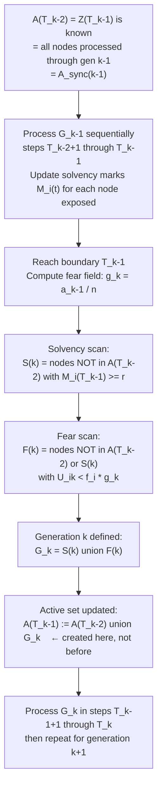
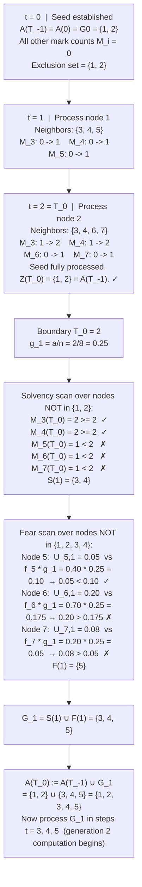

# Computation Ordering: S(k) and F(k)

> **Note:** `index.html` now defines $\mathcal{S}(k)$ and $\mathcal{F}(k)$ using the background set
> $B_k := \bigcup_{j < k} \mathcal{G}_j$, which makes the exclusion set self-evident. The index-lag
> question this document was written to answer no longer arises in the primary notation. The
> $T_k$-indexed walkthrough below remains valid as the sequential bridge: $B_k = Z(T_{k-1}) =
> \mathcal{A}(T_{k-2})$.

**Question:** Why does the exclusion in $\mathcal{S}(k)$ and $\mathcal{F}(k)$ use $\mathcal{A}(T_{k-2})$ rather than $\mathcal{A}(T_{k-1})$?

**Short answer:** $\mathcal{A}(T_{k-1})$ does not exist yet. It is the *output* of computing $\mathcal{S}(k)$ and $\mathcal{F}(k)$:

$$\mathcal{A}(T_{k-1}) := \mathcal{A}(T_{k-2}) \cup \mathcal{S}(k) \cup \mathcal{F}(k)$$

Using $\mathcal{A}(T_{k-1})$ as the exclusion set would be circular.

---

## General Computation Ordering

The exclusion set for both scans is $\mathcal{A}(T_{k-2})$, which equals $Z(T_{k-1})$ — nodes already consumed by the process. The nodes the user was worried about, $\mathcal{G}_k = \mathcal{A}(T_{k-1}) \setminus \mathcal{A}(T_{k-2})$, are not pre-existing; box **G** is where they first appear.

---

## First Generation (k = 1): Concrete Walk-through

For $k = 1$ the indices collapse to:

| General | k = 1 | Meaning |
|---|---|---|
| $\mathcal{A}(T_{k-2})$ | $\mathcal{A}(T_{-1}) = \mathcal{A}(0) = \mathcal{G}_0$ | the seed set |
| $T_{k-1}$ | $T_0 = a$ | last step of processing the seed |
| $g_k$ | $g_1 = a/n$ | fear field from the seed |
| Exclusion | $i \notin \mathcal{G}_0$ | not already in the seed |

**Setup:** $n = 8$, seed $\mathcal{G}_0 = \{1, 2\}$ so $a = 2$, threshold $r = 2$.

Edges touching seed nodes: $3\text{-}1,\ 3\text{-}2,\ 4\text{-}1,\ 4\text{-}2,\ 5\text{-}1,\ 6\text{-}2,\ 7\text{-}2$.

Pre-drawn fear susceptibilities: $f_5 = 0.40,\ f_6 = 0.70,\ f_7 = 0.20,\ f_3 = f_4 = f_8 = 0$.

Pre-drawn fear uniforms: $U_{5,1} = 0.05,\ U_{6,1} = 0.20,\ U_{7,1} = 0.08$.

---

## Why A(T_{k-1}) Cannot Be the Exclusion Set

After the walk-through above, $\mathcal{A}(T_0) = \{1,2,3,4,5\}$. This is $\mathcal{A}(T_{k-1})$ for $k=1$.

If we had written the definition as $\mathcal{S}(1) := \{i \notin \mathcal{A}(T_0) : \ldots\}$, we would need to know that $\{3,4,5\} \subset \mathcal{A}(T_0)$ *before* computing $\mathcal{S}(1)$ — but $\{3,4,5\} = \mathcal{G}_1$ is produced *by* computing $\mathcal{S}(1)$ and $\mathcal{F}(1)$. The definition would depend on its own output.

The correct exclusion is $\mathcal{A}(T_{k-2})$ because it is the set of already-processed nodes at the moment the boundary scan runs — a fully determined object with no dependency on the current generation's output.
